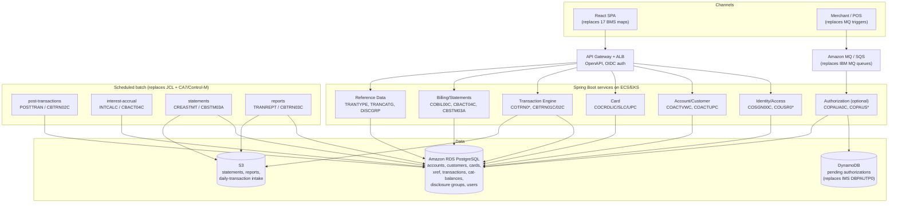

# CardDemo Modernization Plan

Every inventory item, file name, program name and data layout in this document was read from this
repository at the commit on which this file was added. Where a claim is an architectural proposal
rather than an observation of the code, it is marked as a proposal.

---

## 1. Executive summary and modernization goals

CardDemo is a credit-card servicing application written for z/OS: 31 COBOL programs in `app/cbl`,
17 BMS 3270 maps in `app/bms`, 38 JCL members in `app/jcl` plus 2 procs in `app/proc`, 30 copybooks
in `app/cpy`, 2 Assembler modules in `app/asm`, and EBCDIC sample data in `app/data/EBCDIC`. The
online side runs under CICS (transaction/program/map mapping is defined in `app/csd/CARDDEMO.CSD`
and documented in `README.md`); the batch side is a nightly cycle driven by JCL against VSAM KSDS
files. Three optional modules extend the base application with IMS DB, DB2 and IBM MQ
(`app/app-authorization-ims-db2-mq`, `app/app-transaction-type-db2`, `app/app-vsam-mq`).

Modernization goals:

1. Remove the dependency on z/OS-licensed subsystems (CICS, VSAM, IMS DB, DB2 for z/OS, IBM MQ)
   and on Assembler (`MVSWAIT`, `COBDATFT`) that binds the application to the platform.
2. Preserve functional behaviour exactly for money-moving logic — transaction posting
   (`CBTRN02C`), interest accrual (`CBACT04C`) and statement generation (`CBSTM03A`/`CBSTM03B`) —
   and prove parity with record-level comparison against the current outputs.
3. Replace the 3270 presentation layer (17 BMS maps and their `app/cpy-bms` symbolic copybooks)
   with a browser UI, and expose the business functions as APIs so they can be consumed by
   channels other than a terminal.
4. Convert the data layer from VSAM KSDS (with alternate indexes on `CARDXREF` and `TRANSACT`) and
   IMS/DB2 into a single managed relational store, with the EBCDIC and packed/zoned numeric
   conversions handled once, in a repeatable and auditable pipeline.
5. Keep the batch window: `POSTTRAN`, `INTCALC`, `TRANBKP`, `COMBTRAN`, `CREASTMT` and `TRANREPT`
   must complete in the same or shorter elapsed time after migration.

---

## 2. Current-state architecture inventory

### 2.1 Online programs (CICS) — `app/cbl/CO*`

Transaction IDs and map names are as listed in `README.md` and defined in `app/csd/CARDDEMO.CSD`.

| Program | Tran | BMS map | Responsibility |
|:--|:--|:--|:--|
| `COSGN00C` | CC00 | `COSGN00` | Signon screen; validates user id/password against the `USRSEC` VSAM file and routes to the user or admin menu. |
| `COMEN01C` | CM00 | `COMEN01` | Main menu for regular users; menu options in copybook `COMEN02Y`. |
| `COADM01C` | CA00 | `COADM01` | Admin menu; menu options in copybook `COADM02Y`. |
| `COACTVWC` | CAVW | `COACTVW` | Account view — reads `ACCTDATA`, `CUSTDATA` and `CARDXREF`. |
| `COACTUPC` | CAUP | `COACTUP` | Account update; the largest online program, with field-level edit logic using `TEST-NUMVAL-C`/`NUMVAL-C`. |
| `COCRDLIC` | CCLI | `COCRDLI` | Credit card list with paging over `CARDDATA`. |
| `COCRDSLC` | CCDL | `COCRDSL` | Credit card detail view. |
| `COCRDUPC` | CCUP | `COCRDUP` | Credit card detail update. |
| `COTRN00C` | CT00 | `COTRN00` | Transaction list from `TRANSACT`. |
| `COTRN01C` | CT01 | `COTRN01` | Transaction view. |
| `COTRN02C` | CT02 | `COTRN02` | Transaction add; calls `CSUTLDTC` for date validation. |
| `COBIL00C` | CB00 | `COBIL00` | Bill payment — pays the account balance in full and writes a transaction. |
| `CORPT00C` | CR00 | `CORPT00` | Transaction reports; submits the `TRANREPT` batch job from CICS and calls `CSUTLDTC`. |
| `COUSR00C` | CU00 | `COUSR00` | List users from `USRSEC`. |
| `COUSR01C` | CU01 | `COUSR01` | Add user. |
| `COUSR02C` | CU02 | `COUSR02` | Update user. |
| `COUSR03C` | CU03 | `COUSR03` | Delete user. |

Shared online utilities: `CSUTLDTC` (date validation, calls the LE service `CEEDAYS`) and
`COBSWAIT` (calls the Assembler module `MVSWAIT`; used by the `WAITSTEP` job).

### 2.2 Batch programs — `app/cbl/CB*`

| Program | Responsibility (from the program header and `FILE-CONTROL`) |
|:--|:--|
| `CBACT01C` | Reads the account master and writes three output formats (`OUTFILE`, `ARRYFILE`, `VBRCFILE`); calls the Assembler date routine `COBDATFT`. |
| `CBACT02C` | Reads and prints the card data file. |
| `CBACT03C` | Reads and prints the card cross-reference file. |
| `CBACT04C` | Interest calculator: reads `TCATBALF`, `XREFFILE`, `ACCTDATA` and `DISCGRP`, writes interest transactions to `TRANSACT`. |
| `CBCUS01C` | Reads and prints the customer data file. |
| `CBTRN01C` | Reads the daily transaction file and validates it against `CUSTFILE`, `XREFFILE`, `CARDFILE`, `ACCTFILE`, `TRANFILE`. |
| `CBTRN02C` | Posts daily transactions: input `DALYTRAN`, updates `TRANSACT`, `ACCTDATA` and `TCATBALF` via `XREFFILE`, rejects to `DALYREJS`. |
| `CBTRN03C` | Prints the transaction detail report from `TRANFILE`, `CARDXREF`, `TRANTYPE`, `TRANCATG` and a `DATEPARM` control file. |
| `CBSTM03A` | Produces account statements in plain text (`STMTFILE`) and HTML (`HTMLFILE`); the header states it deliberately exercises mainframe control-block addressing for modernization tooling. |
| `CBSTM03B` | File-handling subroutine called by `CBSTM03A` (13 call sites). |
| `CBEXPORT` | Branch-migration export: reads the normalized VSAM files and writes one 500-byte multi-record export file (`CVEXPORT` layout). |
| `CBIMPORT` | Branch-migration import: splits the export file back into customer, account, card-xref and transaction files with validation. |

### 2.3 Batch jobs — `app/jcl` and `app/proc`

Jobs that drive a COBOL program:

| Job | Program | Function |
|:--|:--|:--|
| `POSTTRAN.jcl` | `CBTRN02C` | Core transaction posting. |
| `INTCALC.jcl` | `CBACT04C` (`PARM='2022071800'`) | Interest calculation. |
| `TRANREPT.jcl` / `proc/TRANREPT.prc` | `SORT` then `CBTRN03C` | Transaction report; the proc first invokes `REPROC` to back up `TRANSACT`. |
| `CREASTMT.JCL` | `SORT`, `IDCAMS`, then `CBSTM03A` | Statement creation. |
| `READACCT.jcl` | `CBACT01C` | Account extract in three formats. |
| `READCARD.jcl` | `CBACT02C` | Card file print. |
| `READCUST.jcl` | `CBCUS01C` | Customer file print. |
| `READXREF.jcl` | `CBACT03C` | Cross-reference print. |
| `CBEXPORT.jcl` | `CBEXPORT` | Branch export. |
| `CBIMPORT.jcl` | `CBIMPORT` | Branch import. |
| `WAITSTEP.jcl` | `COBSWAIT` → `MVSWAIT` | Timed wait step. |
| `CBPAUP0J.jcl` (optional module) | `CBPAUP0C` | Purge expired authorizations. |

Utility and file-management jobs (all `IDCAMS`, `IEBGENER`, `IEFBR14`, `SORT`, `SDSF` or
`DFHCSDUP`): `ACCTFILE`, `CARDFILE`, `CUSTFILE`, `XREFFILE`, `TRANFILE`, `TRANIDX`, `TRANCATG`,
`TRANTYPE`, `DISCGRP`, `TCATBALF`, `DUSRSECJ`, `DEFCUST`, `DEFGDGB`, `DEFGDGD`, `DALYREJS`,
`REPTFILE`, `ESDSRRDS`, `TRANBKP`, `COMBTRAN`, `PRTCATBL`, `OPENFIL`, `CLOSEFIL`, `CBADMCDJ`
(CSD update via `DFHCSDUP`), `INTRDRJ1`/`INTRDRJ2` (internal reader submission), `FTPJCL`,
`TXT2PDF1`. Procs: `proc/REPROC.prc` (generic `IDCAMS REPRO`) and `proc/TRANREPT.prc`.

`OPENFIL`/`CLOSEFIL` run `SDSF` to open and close the CICS files around the batch window — the
quiesce pattern that a modernized design must replace. GDG generations
(`AWS.M2.CARDDEMO.TRANSACT.BKUP(+1)`, `DALYREJS(+1)`, `SYSTRAN(+1)`, …) carry state between jobs.
Scheduler definitions exist for both CA7 and Control-M in `app/scheduler`.

### 2.4 Data layer — VSAM files and copybooks

| Dataset (HLQ `AWS.M2.CARDDEMO`) | Type | Copybook | Record |
|:--|:--|:--|:--|
| `ACCTDATA.VSAM.KSDS` | KSDS | `CVACT01Y` | `ACCOUNT-RECORD`, 300 bytes, key `ACCT-ID PIC 9(11)`; balances `PIC S9(10)V99`. |
| `CARDDATA.VSAM.KSDS` | KSDS (+AIX) | `CVACT02Y` | `CARD-RECORD`, 150 bytes, key `CARD-NUM PIC X(16)`. |
| `CUSTDATA.VSAM.KSDS` | KSDS | `CVCUS01Y` | `CUSTOMER-RECORD`, 500 bytes, key `CUST-ID PIC 9(09)`. |
| `CARDXREF.VSAM.KSDS` (+`.AIX.PATH`) | KSDS + AIX | `CVACT03Y` | `CARD-XREF-RECORD`, 50 bytes: card → customer → account. |
| `TRANSACT.VSAM.KSDS` (+AIX, `TRANIDX`) | KSDS + AIX | `CVTRA05Y` | `TRAN-RECORD`, 350 bytes, key `TRAN-ID PIC X(16)`, `TRAN-AMT PIC S9(09)V99`. |
| `DALYTRAN.PS` | sequential | `CVTRA06Y` | `DALYTRAN-RECORD`, 350 bytes — the posting input. |
| `TCATBALF.VSAM.KSDS` | KSDS | `CVTRA01Y` | `TRAN-CAT-BAL-RECORD`, 50 bytes, composite key account + type + category. |
| `DISCGRP.VSAM.KSDS` | KSDS | `CVTRA02Y` | `DIS-GROUP-RECORD`, 50 bytes — interest rates by group/type/category. |
| `TRANTYPE.VSAM.KSDS` | KSDS | `CVTRA03Y` | `TRAN-TYPE-RECORD`, 60 bytes. |
| `TRANCATG.VSAM.KSDS` | KSDS | `CVTRA04Y` | `TRAN-CAT-RECORD`, 60 bytes. |
| `USRSEC.VSAM.KSDS` (also ESDS/RRDS via `ESDSRRDS`) | KSDS | `CSUSR01Y` | `SEC-USER-DATA`, 80 bytes, plaintext `SEC-USR-PWD PIC X(08)`. |
| `EXPORT.DATA` | sequential | `CVEXPORT` | 500-byte multi-record export layout with `REDEFINES` and COMP/COMP-3 fields. |

Supporting copybooks: `CVTRA07Y` (report headers), `CSDAT01Y`/`CODATECN`/`CSUTLDPY`/`CSUTLDWY`
(date handling), `CSLKPCDY` (1,318-line lookup table of phone area codes, US state codes and
state+ZIP prefixes), `CSMSG01Y`/`CSMSG02Y` (messages), `COCOM01Y` (CICS commarea), `CVCRD01Y`
(AID-key and card work areas), `COSTM01` (statement layout), `CUSTREC`, `COTTL01Y`, `CSSETATY`,
`CSSTRPFY`, `UNUSED1Y`.

Sample data: `app/data/EBCDIC` holds 13 unloaded datasets (account, card, xref, customer, daily
transaction, disclosure group, transaction category/type, category balance, user security, export)
in EBCDIC; `app/data/ASCII` holds 9 ASCII equivalents. `app/catlg/LISTCAT.txt` records the VSAM
catalog attributes.

### 2.5 Presentation layer — `app/bms` and `app/cpy-bms`

17 BMS mapsets, each with a matching symbolic copybook in `app/cpy-bms`: `COSGN00`, `COMEN01`,
`COADM01`, `COACTVW`, `COACTUP`, `COCRDLI`, `COCRDSL`, `COCRDUP`, `COTRN00`, `COTRN01`, `COTRN02`,
`CORPT00`, `COBIL00`, `COUSR00`, `COUSR01`, `COUSR02`, `COUSR03`. These are 24×80 3270 maps; the
symbolic copybooks are the field-level contract between map and program (`...I`/`...O` structures
referenced throughout the `CO*` programs).

### 2.6 Assembler utilities — `app/asm`

| Module | Responsibility |
|:--|:--|
| `MVSWAIT.asm` | Issues the `ASMWAIT` macro (`app/maclib/ASMWAIT.mac`) for an interval in centiseconds; called only from `COBSWAIT`. |
| `COBDATFT.asm` | Date-formatting CSECT called from `CBACT01C` with the `CODATECN` copybook area; macro in `app/maclib/COCDATFT.mac`. |

Both are small and self-contained — they can be reimplemented directly rather than converted.

### 2.7 Optional extension modules

| Module | Contents | Technologies |
|:--|:--|:--|
| `app/app-authorization-ims-db2-mq` | Programs `COPAUA0C` (MQ-triggered authorization processing, transaction CP00), `COPAUS0C`/`COPAUS1C`/`COPAUS2C` (pending authorization summary/detail, CPVS/CPVD), `CBPAUP0C` (batch purge), `PAUDBLOD`/`PAUDBUNL`/`DBUNLDGS` (IMS load/unload); DBDs `DBPAUTP0`, `DBPAUTX0`, `PADFLDBD`, `PASFLDBD`; PSBs `PSBPAUTB`, `PSBPAUTL`, `PAUTBUNL`, `DLIGSAMP`; DDL `AUTHFRDS.ddl`, `XAUTHFRD.ddl`; maps `COPAU00`, `COPAU01`; IMS data in `data/EBCDIC`. | IMS DB (HIDAM), DB2 (fraud table), MQ request/response, two-phase commit across IMS and DB2. |
| `app/app-transaction-type-db2` | `COTRTUPC` (CTTU, add/update), `COTRTLIC` (CTLI, list with forward/backward cursors and delete), `COBTUPDT` (batch maintenance); DCLGEN `DCLTRTYP`, `DCLTRCAT`; DDL/CTL members under `ctl/`; maps `COTRTLI`, `COTRTUP`. | DB2 static embedded SQL, cursors, SQLCA error handling, DB2 precompile under CICS. |
| `app/app-vsam-mq` | `CODATE01` (CDRD, system date via MQ), `COACCT01` (CDRA, account inquiry via MQ); CSD `CRDDEMOM.csd`. | IBM MQ request/response over VSAM-backed data. |

### 2.8 COBOL data patterns that affect conversion

Observed in the source, not assumed:

- **`REDEFINES`** — in 16 of the `app/cbl` programs and in copybooks `CVEXPORT`, `CSUTLDWY`,
  `CSDAT01Y`, `CODATECN`, `COMEN02Y`, `CVCRD01Y`, `COADM02Y`. `CVEXPORT` uses `REDEFINES` to carry
  several record types in one 500-byte record, so the record type must be resolved before any
  field can be typed.
- **`OCCURS … DEPENDING ON`** — every conversational online program declares
  `OCCURS 1 TO 32767 TIMES DEPENDING ON EIBCALEN` over the CICS commarea (`COBIL00C`, `COADM01C`,
  `COCRDSLC`, `CORPT00C`, `COUSR02C`, `COTRN02C`, `COTRN00C`, `COACTUPC`, `COCRDLIC`, `COTRN01C`
  and the remaining `CO*` programs). This is pseudo-conversational state, not business data, and
  becomes HTTP session/state in the target.
- **`COMP-3` (packed decimal)** — `COBIL00C`, `COACTUPC`, `COCRDLIC`, `CBACT01C`, `CBTRN03C`,
  `CBSTM03A`, and the `CVEXPORT` layout.
- **Zoned decimal / implied decimal** — the core records use display numerics with implied
  decimals: `ACCT-CURR-BAL PIC S9(10)V99`, `TRAN-AMT PIC S9(09)V99`, `ACCT-ID PIC 9(11)`. Sign is
  carried in the zone of the last byte, which is where naive EBCDIC→ASCII conversion corrupts
  data.
- **`COMP` binary** — in 26 of the 31 programs (mostly lengths and response codes).
- **Dates as text** — `ACCT-OPEN-DATE`, `ACCT-EXPIRAION-DATE` (the field is misspelled in
  `CVACT01Y`), `ACCT-REISSUE-DATE` are `PIC X(10)`; timestamps `TRAN-ORIG-TS`/`TRAN-PROC-TS` are
  `PIC X(26)`. Date validation is centralized in `CSUTLDTC` via `CEEDAYS`.
- **Platform services** — LE `CEE3ABD` abend calls in 11 batch programs, `CEEDAYS` in `CSUTLDTC`,
  static Assembler calls in `CBACT01C` and `COBSWAIT`, and `CBSTM03A`'s deliberate control-block
  addressing.

---

## 3. Modernization approach comparison

### (a) Replatform / automated refactor on AWS Mainframe Modernization

Two runtimes are offered under AWS Mainframe Modernization
(https://docs.aws.amazon.com/m2/latest/userguide/what-is-m2.html): the **AWS Blu Age** automated
refactor, which transforms COBOL/JCL/BMS into Java (with an Angular front end generated from the
maps), and the **Rocket Software (Micro Focus)** managed runtime, which recompiles the COBOL and
runs it largely unchanged.

Pros:
- The 31 programs, 38 jobs and 17 maps move as a unit; behaviour is preserved by construction, so
  parity testing is comparison rather than re-specification.
- Existing knowledge of the application stays valid; the JCL-shaped batch cycle and the
  `POSTTRAN` → `TRANBKP` → `COMBTRAN` → `CREASTMT` sequencing survive.
- `REDEFINES`, `OCCURS DEPENDING ON`, COMP-3 and zoned decimal are handled by the toolchain's data
  layer rather than by hand.

Cons:
- The output preserves the shape of the input. Screen-driven flow control (the commarea state
  machine in every `CO*` program) and the file-at-a-time batch design persist, so the long-term
  change cost is only partly reduced.
- The Assembler modules (`MVSWAIT`, `COBDATFT`) and the LE services (`CEE3ABD`, `CEEDAYS`) are
  outside the COBOL conversion path and need replacement either way.
- The optional IMS/DB2/MQ modules are the hardest part for any automated path: IMS DL/I calls
  (`app-authorization-ims-db2-mq/cpy/IMSFUNCS.cpy`, PCB copybooks) and the two-phase commit across
  IMS and DB2 have no direct equivalent.
- Refactored Java is machine-generated; teams that expect idiomatic code are usually disappointed.

### (b) Full rewrite to cloud-native services

Pros:
- Produces a system whose structure matches the business domains rather than the 3270 flow; the
  domain boundaries are already visible in the code (users, customer/account, card, transaction,
  billing/statement).
- Removes VSAM, IMS, DB2 and MQ in one step and lets each domain choose the right storage.
- No generated-code tax; the estate is maintainable by any Java/JavaScript team.

Cons:
- Every rule has to be re-derived from COBOL that has no test suite in the repository. The
  interest calculation in `CBACT04C` and the posting logic in `CBTRN02C` are the two highest-risk
  reimplementations.
- Longest time before any workload leaves the mainframe, so the licence cost continues throughout.
- Parity work is larger: without a reference implementation running side by side, differences
  surface in production.

### Recommendation (proposal)

Use a **hybrid, two-stage approach**: automated refactor first, targeted rewrite second.

1. Move the core VSAM/CICS/batch application with the automated refactor path. This gets the
   workload off z/OS with behaviour preserved, and it produces a running reference implementation
   that can be diffed against the mainframe output record by record.
2. Once off-platform, rewrite domain by domain behind stable APIs, starting with the domains that
   change most (Account/Customer and Card servicing) and leaving the statement/report path — which
   is stable, batch-shaped and already produces text and HTML output in `CBSTM03A` — on the
   refactored runtime until last.

The optional modules are handled differently: because they are separable and small
(2–8 programs each), they are better rewritten than refactored — in particular
`app-vsam-mq` (2 programs) and `app-transaction-type-db2` (3 programs, straightforward relational
CRUD over two tables).

---

## 4. Target architecture (proposal)

Stack proposal: Java 21 + Spring Boot services per functional domain; REST APIs with OpenAPI
contracts; a React single-page application replacing the 17 BMS maps; Amazon RDS for PostgreSQL
replacing the VSAM KSDS files and the DB2 transaction-type tables; Amazon DynamoDB for the
authorization store that IMS holds today (hierarchical parent/child access by card number, no
joins needed); Amazon MQ or SQS replacing the IBM MQ request/response queues; AWS Batch or Spring
Batch on ECS replacing JCL, with EventBridge Scheduler or Step Functions replacing the CA7 and
Control-M definitions in `app/scheduler`.

Service decomposition maps directly onto the current programs:

| Target service | Replaces |
|:--|:--|
| Identity/Access | `COSGN00C`, `COUSR00C`–`COUSR03C`, `USRSEC` file (`CSUSR01Y`) |
| Account/Customer | `COACTVWC`, `COACTUPC`, `CBACT01C`, `CBCUS01C`, `ACCTDATA`, `CUSTDATA` |
| Card | `COCRDLIC`, `COCRDSLC`, `COCRDUPC`, `CBACT02C`, `CBACT03C`, `CARDDATA`, `CARDXREF` |
| Transaction Engine | `COTRN00C`–`COTRN02C`, `CBTRN01C`, `CBTRN02C`, `TRANSACT`, `DALYTRAN`, `TCATBALF` |
| Billing/Statements | `COBIL00C`, `CORPT00C`, `CBTRN03C`, `CBSTM03A`/`CBSTM03B`, `CBACT04C`, `DISCGRP` |
| Reference Data | `TRANTYPE`, `TRANCATG`, `CSLKPCDY` lookups, `app-transaction-type-db2` |
| Authorization (optional) | `app-authorization-ims-db2-mq` |

Notes on the mapping:

- The pseudo-conversational commarea (`OCCURS … DEPENDING ON EIBCALEN` in every online program)
  disappears: screen state lives in the SPA, and the services are stateless.
- `CORPT00C` submits a batch job from CICS today; in the target it enqueues a report request and
  the batch service picks it up, so the CICS-to-JES coupling is removed.
- `OPENFIL`/`CLOSEFIL` (the CICS file quiesce) have no target equivalent — online and batch share
  one transactional database.
- `MVSWAIT`/`COBSWAIT` (the `WAITSTEP` job) become a scheduler dependency; `COBDATFT` and
  `CSUTLDTC`/`CEEDAYS` become `java.time`.

---

## 5. Data migration strategy

### 5.1 VSAM → relational mapping, per copybook

| Copybook / file | Target table | Key and notable columns |
|:--|:--|:--|
| `CVCUS01Y` / `CUSTDATA` | `customer` | PK `cust_id` from `CUST-ID PIC 9(09)`; 500-byte record, name/address/phone fields as `varchar`. |
| `CVACT01Y` / `ACCTDATA` | `account` | PK `acct_id` from `ACCT-ID PIC 9(11)`; `numeric(12,2)` for `ACCT-CURR-BAL`, `ACCT-CREDIT-LIMIT`, `ACCT-CASH-CREDIT-LIMIT`, `ACCT-CURR-CYC-CREDIT`, `ACCT-CURR-CYC-DEBIT`; `date` for the three `PIC X(10)` date fields; `acct_group_id` FK to disclosure group. The 178-byte `FILLER` is dropped. |
| `CVACT02Y` / `CARDDATA` | `card` | PK `card_num CHAR(16)`; FK `card_acct_id`; `card_cvv_cd` must be treated as sensitive at load time. |
| `CVACT03Y` / `CARDXREF` | `card_xref` | PK `xref_card_num`; FKs to `customer` and `account`. The VSAM AIX (`CARDXREF.VSAM.AIX.PATH`, used by `CBACT04C` and `CBTRN02C`) becomes a secondary index on `xref_acct_id`. |
| `CVTRA05Y` / `TRANSACT` | `transaction` | PK `tran_id CHAR(16)`; `tran_amt numeric(11,2)`; `tran_orig_ts`/`tran_proc_ts` (`PIC X(26)`) parsed to `timestamp`; the `TRANIDX` AIX becomes an index on `tran_card_num`. |
| `CVTRA06Y` / `DALYTRAN` | staging `daily_transaction` | Same 350-byte layout as `TRAN-RECORD`; loaded per cycle from S3, truncated after posting. |
| `CVTRA01Y` / `TCATBALF` | `tran_category_balance` | Composite PK (`acct_id`, `type_cd`, `cat_cd`) from `TRAN-CAT-KEY`. |
| `CVTRA02Y` / `DISCGRP` | `disclosure_group` | Composite PK (`group_id`, `tran_type_cd`, `tran_cat_cd`); interest rate column. |
| `CVTRA03Y` / `TRANTYPE` | `tran_type` | PK `tran_type CHAR(2)`; converges with the DB2 table from `app-transaction-type-db2` (`DCLTRTYP`). |
| `CVTRA04Y` / `TRANCATG` | `tran_category` | Composite PK (`tran_type_cd`, `tran_cat_cd`); converges with `DCLTRCAT`. |
| `CSUSR01Y` / `USRSEC` | `app_user` | PK `usr_id CHAR(8)`. `SEC-USR-PWD PIC X(08)` is a plaintext password today — migration must not carry it over; issue password resets or federate to an identity provider. |
| `CVEXPORT` / `EXPORT.DATA` | no table | The `CBEXPORT`/`CBIMPORT` multi-record file is a transport format; in the target it is replaced by the API/ETL path and does not need a schema. |
| IMS `DBPAUTP0` (optional) | `pending_authorization` (DynamoDB) | Partition key card number, sort key authorization timestamp — matching the parent/child access pattern of the HIDAM database. |
| DB2 `AUTHFRDS` (optional) | `fraud_authorization` | Migrated with the DDL in `app-authorization-ims-db2-mq/ddl`. |

### 5.2 Encoding and numeric conversion

The datasets in `app/data/EBCDIC` are unloaded in EBCDIC with mainframe numeric encodings, so a
byte-level codepage conversion of a whole file is wrong. The pipeline must be copybook-driven:

1. Parse the copybook to get each field's offset, length and `PIC`/`USAGE`.
2. Convert only `PIC X` and `PIC 9 DISPLAY` character positions using the correct single-byte
   codepage (IBM-1140 for US EBCDIC with euro, IBM-037 otherwise) — never convert the bytes of
   `COMP`/`COMP-3` fields.
3. Decode `COMP-3` fields as packed decimal: two digits per byte, sign nibble `C`/`F` positive,
   `D` negative; apply the implied decimal from the `V` in the picture.
4. Decode zoned decimal signs before codepage conversion: in a signed `PIC S9(n)` DISPLAY field
   the sign is in the high nibble of the last byte, so the trailing byte of
   `ACCT-CURR-BAL PIC S9(10)V99` and `TRAN-AMT PIC S9(09)V99` must be read as an overpunch, not as
   a character.
5. Resolve `REDEFINES` by record type before typing fields — mandatory for the `CVEXPORT` layout
   and for the redefined areas in `CSDAT01Y`, `CODATECN` and `CVCRD01Y`.
6. Parse `PIC X(10)` dates and `PIC X(26)` timestamps into real date/timestamp columns, and record
   rows that fail parsing rather than defaulting them — `CSUTLDTC` shows that invalid dates do
   reach these files.
7. Drop `FILLER` (for example the 178 bytes at the end of `ACCOUNT-RECORD`) but keep the raw
   record image for the reconciliation window.

Validation: for every file, compare row count, control totals on each amount column, and a
per-record hash of the re-encoded record against the source. The `app/data/ASCII` files provide a
convenient first-pass fixture for the converter, and `app/catlg/LISTCAT.txt` gives the expected
record lengths and key positions.

### 5.3 Cutover

1. **Bulk load** — historical extract of all 11 VSAM files into the target schema during a quiet
   period; reconcile counts and totals.
2. **Parallel run** — keep the mainframe authoritative while both systems consume the same
   `DALYTRAN` input; compare `TRANSACT`, `ACCTDATA` and `TCATBALF` after each nightly cycle, and
   compare `CBSTM03A` statement output byte for byte after normalizing timestamps.
3. **Read cutover** — point the new UI and APIs at the new store for inquiry (`COACTVWC`,
   `COCRDLIC`, `COTRN00C` equivalents) while updates still flow through the mainframe.
4. **Write cutover** — move the online update transactions (`CAUP`, `CCUP`, `CT02`, `CB00`) and
   then the batch cycle, one job at a time in the order `POSTTRAN` → `INTCALC` → `CREASTMT` →
   `TRANREPT`.
5. **Decommission** — retire the CICS region, the VSAM files and the GDG bases defined by
   `DEFGDGB`/`DEFGDGD` only after a full statement cycle has run clean on the target.

Rollback at every stage is "the mainframe is still authoritative"; only stage 4 needs a
change-data-capture path back to VSAM, which is the argument for keeping stage 4 short.

---

## 6. Phased migration roadmap

Organized by functional domain, core before optional. No time estimates.

**Phase 0 — Foundations.** Stand up the AWS Mainframe Modernization environment, the target
PostgreSQL schema, the copybook-driven conversion pipeline (section 5.2), CI, and the parity
harness that diffs mainframe output against target output. Reimplement `MVSWAIT`/`COBDATFT` and
the LE dependencies (`CEE3ABD`, `CEEDAYS`) so nothing in the core path still needs Assembler or LE.

**Phase 1 — Reference data and identity.** `TRANTYPE`, `TRANCATG`, `DISCGRP` and the `CSLKPCDY`
lookups; then Identity/Access (`COSGN00C`, `COUSR00C`–`COUSR03C`) with real password hashing or
federation replacing `SEC-USR-PWD`. Smallest blast radius, and it unblocks the UI shell.

**Phase 2 — Account and Customer.** `ACCTDATA` and `CUSTDATA` migration; `COACTVWC`/`COACTUPC`
behind the Account/Customer service; the `CBACT01C`/`CBCUS01C` extracts become API-driven or S3
exports.

**Phase 3 — Card.** `CARDDATA` and `CARDXREF` (including the AIX path); `COCRDLIC`, `COCRDSLC`,
`COCRDUPC`; `CBACT02C`/`CBACT03C` extracts.

**Phase 4 — Transaction engine.** The highest-value and highest-risk phase: `TRANSACT`,
`DALYTRAN`, `TCATBALF`; online `COTRN00C`–`COTRN02C`; batch `CBTRN01C` validation and `CBTRN02C`
posting including the `DALYREJS` reject path. Run in parallel with the mainframe for a full cycle
before cutting writes over.

**Phase 5 — Billing, interest and statements.** `CBACT04C` interest accrual against
`DISCGRP`/`TCATBALF`; `COBIL00C` bill payment; `CBSTM03A`/`CBSTM03B` statements (text and HTML) and
`CBTRN03C` reporting, with `CORPT00C`'s job-submission behaviour replaced by an asynchronous report
request.

**Phase 6 — Batch orchestration and decommission of the JCL estate.** Replace the remaining jobs:
`TRANBKP` and `COMBTRAN` (GDG-based backup and merge) become database snapshots and a merge step;
`OPENFIL`/`CLOSEFIL` are deleted outright; `PRTCATBL`, `READ*`, `FTPJCL`, `TXT2PDF1`, `INTRDRJ*`
are re-evaluated individually — several exist only to demonstrate mainframe utilities and need no
target equivalent. Translate the CA7 and Control-M definitions in `app/scheduler` into the target
scheduler.

**Phase 7 — Optional module: Transaction Type Management (DB2).** `app-transaction-type-db2`
(`COTRTLIC`, `COTRTUPC`, `COBTUPDT`) is a straightforward rewrite onto the `tran_type` and
`tran_category` tables already created in Phase 1; the `TRANEXTR` extract into VSAM disappears
because both consumers read the same table.

**Phase 8 — Optional module: Account Extraction via MQ.** `app-vsam-mq` (`CODATE01`, `COACCT01`)
becomes two endpoints on the Account service plus an SQS-backed async facade for callers that
still need messaging.

**Phase 9 — Optional module: Authorizations (IMS/DB2/MQ).** Last and most complex:
`app-authorization-ims-db2-mq`. The IMS HIDAM database (`DBPAUTP0`) becomes the DynamoDB
pending-authorization store, the fraud DB2 table migrates with its DDL, the MQ trigger for
`COPAUA0C` becomes a queue consumer, `COPAUS0C`/`COPAUS1C` become UI screens, `CBPAUP0C` becomes a
scheduled purge, and the two-phase commit across IMS and DB2 must be redesigned — most likely as a
single transactional write plus an outbox, since no distributed transaction manager spans DynamoDB
and RDS.

---

## 7. Risks, mitigations, and testing strategy

| Risk | Why it is real here | Mitigation |
|:--|:--|:--|
| Silent numeric corruption during data conversion | Signed zoned decimal (`ACCT-CURR-BAL`, `TRAN-AMT`) and `COMP-3` fields in `CVEXPORT`, `CBACT01C`, `CBTRN03C`, `CBSTM03A` are destroyed by naive EBCDIC→ASCII conversion, and the damage looks like ordinary data. | Copybook-driven converter (5.2); control totals per amount column; round-trip re-encode and byte-compare against the source; use `app/data/ASCII` as a known-good fixture. |
| `REDEFINES` mis-typing | `CVEXPORT` carries several record types in one 500-byte record; seven copybooks and 16 programs use `REDEFINES`. | Resolve record type before field typing; reject unknown record types rather than defaulting. |
| Interest and posting logic drift | `CBACT04C` (interest) and `CBTRN02C` (posting) have no tests in the repository and are the money-moving paths. | Parallel run over a full cycle with record-level diffs on `TRANSACT`, `ACCTDATA` and `TCATBALF`; freeze these programs during migration. |
| Batch window regression | The cycle is a chain (`POSTTRAN` → `TRANBKP` → `COMBTRAN` → `CREASTMT`/`TRANREPT`) with GDG generations passing state between jobs. | Measure each job's elapsed time on the mainframe first; hold the target to that budget per job, not just end to end; replace GDG chaining with explicit run identifiers. |
| No existing test coverage | The repository contains no test suite for the COBOL programs. | Build the parity harness before any rewrite; treat mainframe output as the oracle; add unit tests only where behaviour is re-derived. |
| Assembler and LE dependencies | `MVSWAIT`, `COBDATFT`, `CEE3ABD`, `CEEDAYS`, and `CBSTM03A`'s control-block addressing are outside any COBOL conversion path. | Reimplement in Phase 0, before the programs that call them move. |
| Plaintext credentials | `SEC-USR-PWD PIC X(08)` in `CSUSR01Y`. | Do not migrate the column; reset or federate at cutover. |
| Optional-module complexity | Two-phase commit across IMS and DB2 in the authorization module has no cloud equivalent. | Keep it last (Phase 9); redesign as single-store write plus outbox rather than emulating XA. |

### Testing and validation strategy

1. **Golden-file parity.** Run both systems against the same `DALYTRAN` input and compare
   `TRANSACT`, `ACCTDATA` and `TCATBALF` record by record, plus the `DALYREJS` reject file. For
   `CBSTM03A`, compare the text and HTML statements byte for byte after normalizing run
   timestamps; for `CBTRN03C`, compare the report file.
2. **Data-conversion tests.** Per copybook: field-boundary tests derived from the `PIC` clauses,
   sign tests on every signed field (positive, negative, zero), packed-decimal boundary values,
   and the full `app/data/EBCDIC` corpus round-tripped and re-encoded.
3. **Screen-behaviour tests.** Each of the 17 maps has a documented transaction id; drive the
   replacement UI through the same paths (signon → menu → function → PF-key navigation, whose key
   handling is defined in `CVCRD01Y` and `CSSTRPFY`) and compare validation messages against the
   COBOL edit logic in `COACTUPC` and `COCRDUPC`.
4. **Batch chain tests.** Run the full scheduled chain from the CA7/Control-M definitions in
   `app/scheduler` end to end in a lower environment, including the failure paths (non-zero
   condition codes, which several jobs test with `COND=(0,NE)`).
5. **Non-functional.** Elapsed-time budget per batch job; online response-time budget per
   transaction; a soak run of the posting cycle at production transaction volume.
6. **Reconciliation in production.** For the parallel-run window, a daily automated reconciliation
   report on balances and category balances, with any non-zero difference treated as a release
   blocker.
