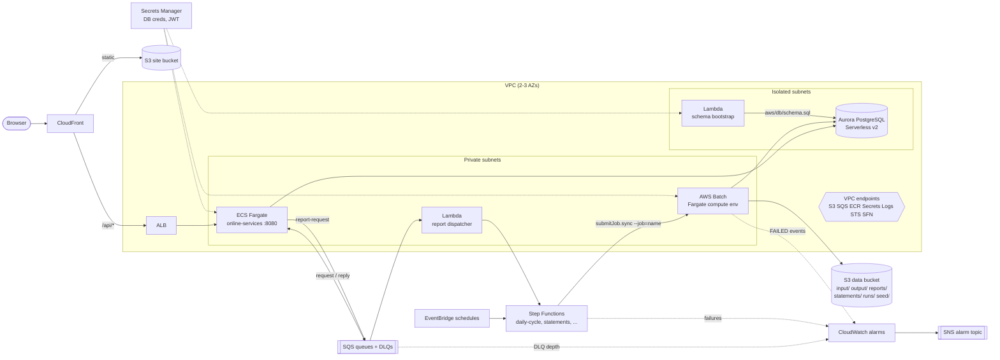

# CardDemo on AWS

Refactored target of the CardDemo mainframe application (`app/`). The mainframe source is untouched; everything
for the AWS target lives under `aws/`.

| Mainframe | AWS target | Directory |
|---|---|---|
| CICS online COBOL (`CO*.cbl`) | Java 21 / Spring Boot 3 REST service on ECS Fargate | `aws/services/` (contracts call it `aws/online-services/`) |
| BMS / 3270 maps | React SPA on S3 + CloudFront | `aws/frontend/` |
| Batch COBOL (`CB*.cbl`) + JCL | One Java batch image on AWS Batch (Fargate), orchestrated by Step Functions | `aws/batch/` |
| CA7 / Control-M schedule | EventBridge schedules + Step Functions | `aws/infra/` |
| VSAM KSDS/AIX, DB2 | Aurora PostgreSQL Serverless v2 (schema `carddemo`) | `aws/db/schema.sql`, `aws/etl/` |
| IBM MQ (`COPAUA0C`, `COACCT01`, `CODATE01`), TD queue `JOBS` | Amazon SQS queues + DLQs | `aws/infra/` |
| Sequential datasets / GDGs | S3 prefixes with lifecycle rules | `aws/infra/` |

Shared contracts: [`contracts/`](contracts/) (naming, API, batch, messaging, data model). Inventory and replatform
decisions: [`migration-inventory.md`](migration-inventory.md).

## Architecture



## Local end-to-end (docker compose)

[`docker-compose.yml`](docker-compose.yml) runs the whole stack without an AWS account:

| Service | Image / build context | Port | Notes |
|---|---|---|---|
| `postgres` | `postgres:16-alpine` | 5432 | DB/schema `carddemo`, user/password `carddemo`; applies `aws/db/schema.sql` on first start |
| `localstack` | `localstack/localstack:4.4` | 4566 | S3 bucket `carddemo-local` (seeded with `app/data/ASCII` and `app/data/EBCDIC` under `seed/`), the 8 contract queues + DLQs with prefix `carddemo-` |
| `services` | `${SERVICES_CONTEXT:-./services}` | 8080 | Env per `contracts/conventions.md` + `AWS_ENDPOINT_URL=http://localstack:4566`; network aliases `online-services`, `backend`, `api` |
| `frontend` | `${FRONTEND_CONTEXT:-./frontend}` | 3000 | nginx; `API_UPSTREAM=http://services:8080` |
| `batch` (profile `batch`) | `${BATCH_CONTEXT:-./batch}` | - | `docker compose --profile batch run --rm batch --job=<name> ...` |
| `etl` (profile `etl`) | `${ETL_CONTEXT:-./etl}` | - | `app/data` mounted read-only at `/data` |
| `awscli` (profile `tools`) | `amazon/aws-cli:2.27.0` | - | Pre-pointed at LocalStack |

```bash
cd aws
docker compose config -q                                   # validate
docker compose up -d --wait postgres localstack            # infrastructure only
docker compose --profile etl run --rm etl                  # load seed data (aws/etl)
docker compose up -d --build services frontend             # http://localhost:3000, API on :8080
docker compose --profile batch run --rm batch --job=post-daily-transactions --runId=local-1 --businessDate=2022-06-10
docker compose --profile tools run --rm awscli s3 ls s3://carddemo-local/runs/local-1/
docker compose --profile tools run --rm awscli sqs list-queues
docker compose down -v                                     # teardown (drops the DB volume)
```

If the services project lives in `aws/online-services/` (contract name), use
`SERVICES_CONTEXT=./online-services docker compose up -d --build`. Postgres runs the schema script only when
its volume is empty; `docker compose down -v` resets it.

## AWS deployment

See [`infra/README.md`](infra/README.md) for the CDK app: prerequisites, bootstrap/deploy, image build/push,
schema/ETL load, triggering the daily cycle, teardown and cost notes.
