<!-- Generated by docs/discovery/build_discovery.py. Do not edit by hand; run `python3 docs/discovery/build_discovery.py` to regenerate. -->

# 02 - Dependency map

**548 distinct dependency edges resolved, 125 unresolved** across the five headline categories (program→copybook, program→dataset, JCL step→program, transaction→program, program→program). An edge is *distinct* per (category, from, to); the same `COPY` in two places counts once.

| Edge category | Resolved | Unresolved |
| --- | --- | --- |
| program->copybook | 253 | 64 |
| program->dataset | 77 | 7 |
| jclstep->program | 126 | 0 |
| transaction->program | 26 | 7 |
| program->program | 66 | 47 |
| **Total** | **548** | **125** |

Supporting edge categories (not in the headline count):

| Edge category | Resolved | Unresolved | Ambiguous |
| --- | --- | --- | --- |
| program->bmsmap | 21 | 0 | 0 |
| assembler->macro | 2 | 0 | 0 |
| jclstep->proc | 4 | 0 | 0 |
| scheduler->job | 32 | 0 | 0 |
| csdfile->dataset | 8 | 0 | 0 |
| csdlibrary->dataset | 2 | 0 | 0 |
| copybook->copybook | 0 | 0 | 0 |

## Focused graph (52 nodes)

Batch chain for the three jobs that carry the money lineage (`POSTTRAN`, `INTCALC`, `TRANREPT`) and the online programs that touch the same datasets. Copybooks are collapsed to one node per program; GDG generation suffixes are stripped. The full estate is in the tables that follow.

```mermaid
graph LR
    n_job_INTCALC(["INTCALC"])
    n_pgm_CBACT04C["CBACT04C"]
    n_job_POSTTRAN(["POSTTRAN"])
    n_pgm_CBTRN02C["CBTRN02C"]
    n_job_TRANREPT(["TRANREPT"])
    n_pgm_CBTRN03C["CBTRN03C"]
    n_cpy_CBACT04C[/"5 copybooks"/]
    n_dsn_AWS_M2_CARDDEMO_ACCTDATA_VSAM_KSDS[("AWS.M2.CARDDEMO.ACCTDATA.VSAM.KSDS")]
    n_dsn_AWS_M2_CARDDEMO_CARDXREF_VSAM_KSDS[("AWS.M2.CARDDEMO.CARDXREF.VSAM.KSDS")]
    n_dsn_AWS_M2_CARDDEMO_DISCGRP_VSAM_KSDS[("AWS.M2.CARDDEMO.DISCGRP.VSAM.KSDS")]
    n_dsn_AWS_M2_CARDDEMO_SYSTRAN[("AWS.M2.CARDDEMO.SYSTRAN")]
    n_dsn_AWS_M2_CARDDEMO_TCATBALF_VSAM_KSDS[("AWS.M2.CARDDEMO.TCATBALF.VSAM.KSDS")]
    n_cpy_CBTRN02C[/"5 copybooks"/]
    n_dsn_AWS_M2_CARDDEMO_DALYREJS[("AWS.M2.CARDDEMO.DALYREJS")]
    n_dsn_AWS_M2_CARDDEMO_DALYTRAN_PS[("AWS.M2.CARDDEMO.DALYTRAN.PS")]
    n_dsn_AWS_M2_CARDDEMO_TRANSACT_VSAM_KSDS[("AWS.M2.CARDDEMO.TRANSACT.VSAM.KSDS")]
    n_cpy_CBTRN03C[/"5 copybooks"/]
    n_dsn_AWS_M2_CARDDEMO_DATEPARM[("AWS.M2.CARDDEMO.DATEPARM")]
    n_dsn_AWS_M2_CARDDEMO_TRANCATG_VSAM_KSDS[("AWS.M2.CARDDEMO.TRANCATG.VSAM.KSDS")]
    n_dsn_AWS_M2_CARDDEMO_TRANREPT[("AWS.M2.CARDDEMO.TRANREPT")]
    n_dsn_AWS_M2_CARDDEMO_TRANSACT_DALY[("AWS.M2.CARDDEMO.TRANSACT.DALY")]
    n_dsn_AWS_M2_CARDDEMO_TRANTYPE_VSAM_KSDS[("AWS.M2.CARDDEMO.TRANTYPE.VSAM.KSDS")]
    n_tran_CDRA{{"CDRA"}}
    n_pgm_COACCT01["COACCT01"]
    n_cpy_COACCT01[/"1 copybook"/]
    n_tran_CAUP{{"CAUP"}}
    n_pgm_COACTUPC["COACTUPC"]
    n_bms_COACTUP>"BMS COACTUP"]
    n_cpy_COACTUPC[/"16 copybooks"/]
    n_tran_CAVW{{"CAVW"}}
    n_pgm_COACTVWC["COACTVWC"]
    n_bms_COACTVW>"BMS COACTVW"]
    n_cpy_COACTVWC[/"13 copybooks"/]
    n_tran_CB00{{"CB00"}}
    n_pgm_COBIL00C["COBIL00C"]
    n_bms_COBIL00>"BMS COBIL00"]
    n_cpy_COBIL00C[/"8 copybooks"/]
    n_tran_CP00{{"CP00"}}
    n_pgm_COPAUA0C["COPAUA0C"]
    n_cpy_COPAUA0C[/"8 copybooks"/]
    n_tran_CPVS{{"CPVS"}}
    n_pgm_COPAUS0C["COPAUS0C"]
    n_bms_COPAU00>"BMS COPAU00"]
    n_cpy_COPAUS0C[/"12 copybooks"/]
    n_tran_CT00{{"CT00"}}
    n_pgm_COTRN00C["COTRN00C"]
    n_bms_COTRN00>"BMS COTRN00"]
    n_cpy_COTRN00C[/"6 copybooks"/]
    n_tran_CT01{{"CT01"}}
    n_pgm_COTRN01C["COTRN01C"]
    n_bms_COTRN01>"BMS COTRN01"]
    n_cpy_COTRN01C[/"6 copybooks"/]
    n_job_INTCALC -->|STEP15| n_pgm_CBACT04C
    n_job_POSTTRAN -->|STEP15| n_pgm_CBTRN02C
    n_job_TRANREPT -->|STEP10R| n_pgm_CBTRN03C
    n_pgm_CBACT04C -->|COPY| n_cpy_CBACT04C
    n_pgm_CBACT04C -->|read/rewrite| n_dsn_AWS_M2_CARDDEMO_ACCTDATA_VSAM_KSDS
    n_pgm_CBACT04C -->|read| n_dsn_AWS_M2_CARDDEMO_CARDXREF_VSAM_KSDS
    n_pgm_CBACT04C -->|read| n_dsn_AWS_M2_CARDDEMO_DISCGRP_VSAM_KSDS
    n_pgm_CBACT04C -->|write| n_dsn_AWS_M2_CARDDEMO_SYSTRAN
    n_pgm_CBACT04C -->|read| n_dsn_AWS_M2_CARDDEMO_TCATBALF_VSAM_KSDS
    n_pgm_CBTRN02C -->|COPY| n_cpy_CBTRN02C
    n_pgm_CBTRN02C -->|read/rewrite| n_dsn_AWS_M2_CARDDEMO_ACCTDATA_VSAM_KSDS
    n_pgm_CBTRN02C -->|read| n_dsn_AWS_M2_CARDDEMO_CARDXREF_VSAM_KSDS
    n_pgm_CBTRN02C -->|write| n_dsn_AWS_M2_CARDDEMO_DALYREJS
    n_pgm_CBTRN02C -->|read| n_dsn_AWS_M2_CARDDEMO_DALYTRAN_PS
    n_pgm_CBTRN02C -->|read/rewrite/write| n_dsn_AWS_M2_CARDDEMO_TCATBALF_VSAM_KSDS
    n_pgm_CBTRN02C -->|write| n_dsn_AWS_M2_CARDDEMO_TRANSACT_VSAM_KSDS
    n_pgm_CBTRN03C -->|COPY| n_cpy_CBTRN03C
    n_pgm_CBTRN03C -->|read| n_dsn_AWS_M2_CARDDEMO_CARDXREF_VSAM_KSDS
    n_pgm_CBTRN03C -->|read| n_dsn_AWS_M2_CARDDEMO_DATEPARM
    n_pgm_CBTRN03C -->|read| n_dsn_AWS_M2_CARDDEMO_TRANCATG_VSAM_KSDS
    n_pgm_CBTRN03C -->|write| n_dsn_AWS_M2_CARDDEMO_TRANREPT
    n_pgm_CBTRN03C -->|read| n_dsn_AWS_M2_CARDDEMO_TRANSACT_DALY
    n_pgm_CBTRN03C -->|read| n_dsn_AWS_M2_CARDDEMO_TRANTYPE_VSAM_KSDS
    n_tran_CDRA -->|CSD| n_pgm_COACCT01
    n_pgm_COACCT01 -->|COPY| n_cpy_COACCT01
    n_pgm_COACCT01 -->|read| n_dsn_AWS_M2_CARDDEMO_ACCTDATA_VSAM_KSDS
    n_tran_CAUP -->|CSD| n_pgm_COACTUPC
    n_pgm_COACTUPC -->|SEND/RECEIVE MAP| n_bms_COACTUP
    n_pgm_COACTUPC -->|COPY| n_cpy_COACTUPC
    n_pgm_COACTUPC -->|read/rewrite| n_dsn_AWS_M2_CARDDEMO_ACCTDATA_VSAM_KSDS
    n_tran_CAVW -->|CSD| n_pgm_COACTVWC
    n_pgm_COACTVWC -->|SEND/RECEIVE MAP| n_bms_COACTVW
    n_pgm_COACTVWC -->|COPY| n_cpy_COACTVWC
    n_pgm_COACTVWC -->|read| n_dsn_AWS_M2_CARDDEMO_ACCTDATA_VSAM_KSDS
    n_tran_CB00 -->|CSD| n_pgm_COBIL00C
    n_pgm_COBIL00C -->|SEND/RECEIVE MAP| n_bms_COBIL00
    n_pgm_COBIL00C -->|COPY| n_cpy_COBIL00C
    n_pgm_COBIL00C -->|read/rewrite| n_dsn_AWS_M2_CARDDEMO_ACCTDATA_VSAM_KSDS
    n_pgm_COBIL00C -->|read/write| n_dsn_AWS_M2_CARDDEMO_TRANSACT_VSAM_KSDS
    n_tran_CP00 -->|CSD| n_pgm_COPAUA0C
    n_pgm_COPAUA0C -->|COPY| n_cpy_COPAUA0C
    n_pgm_COPAUA0C -->|read| n_dsn_AWS_M2_CARDDEMO_ACCTDATA_VSAM_KSDS
    n_pgm_COPAUA0C -->|read| n_dsn_AWS_M2_CARDDEMO_CARDXREF_VSAM_KSDS
    n_tran_CPVS -->|CSD| n_pgm_COPAUS0C
    n_pgm_COPAUS0C -->|SEND/RECEIVE MAP| n_bms_COPAU00
    n_pgm_COPAUS0C -->|COPY| n_cpy_COPAUS0C
    n_pgm_COPAUS0C -->|read| n_dsn_AWS_M2_CARDDEMO_ACCTDATA_VSAM_KSDS
    n_tran_CT00 -->|CSD| n_pgm_COTRN00C
    n_pgm_COTRN00C -->|SEND/RECEIVE MAP| n_bms_COTRN00
    n_pgm_COTRN00C -->|COPY| n_cpy_COTRN00C
    n_pgm_COTRN00C -->|read| n_dsn_AWS_M2_CARDDEMO_TRANSACT_VSAM_KSDS
    n_tran_CT01 -->|CSD| n_pgm_COTRN01C
    n_pgm_COTRN01C -->|SEND/RECEIVE MAP| n_bms_COTRN01
    n_pgm_COTRN01C -->|COPY| n_cpy_COTRN01C
    n_pgm_COTRN01C -->|read| n_dsn_AWS_M2_CARDDEMO_TRANSACT_VSAM_KSDS
```

## Batch: JCL job → step → program → copybooks → datasets

Every step of every JCL member. Utility steps (IDCAMS, SORT, IEBGENER, …) show the datasets named on their `DD`s with mode `unknown` because utility control statements are not interpreted. Application steps list the program's resolved copybooks and the datasets its `SELECT ... ASSIGN` names bind to through the step's `DD` statements. `EXEC PROC` steps show every dataset the expanded procedure steps bind after the invocation's `DD` overrides and symbolic substitution, labelled `procstep.DDNAME`.

| Job | Step | Source | Program | Hosted program(s) | PARM | Copybooks | Datasets (mode) |
| --- | --- | --- | --- | --- | --- | --- | --- |
| CBPAUP0J | STEP01 | `app/app-authorization-ims-db2-mq/jcl/CBPAUP0J.jcl:24` | DFSRRC00 [utility] | CBPAUP0C (application) | 'BMP,CBPAUP0C,PSBPAUTB' | CBPAUP0C: CIPAUDTY, CIPAUSMY |  |
| DBPAUTP0 | STEPDEL | `app/app-authorization-ims-db2-mq/jcl/DBPAUTP0.jcl:7` | IEFBR14 [utility] |  |  |  | AWS.M2.CARDDEMO.IMSDATA.DBPAUTP0 (unknown) |
| DBPAUTP0 | UNLOAD | `app/app-authorization-ims-db2-mq/jcl/DBPAUTP0.jcl:15` | DFSRRC00 [utility] | DFSURGU0 (utility) | (ULU,DFSURGU0,DBPAUTP0) |  | AWS.M2.CARDDEMO.IMSDATA.DBPAUTP0 (unknown) AWS.M2.CARDDEMO.LOADLIB (unknown) OEM.IMS.IMSP.DBDLIB (unknown) OEM.IMS.IMSP.PAUTHDB (unknown) OEM.IMS.IMSP.PAUTHDBX (unknown) OEM.IMS.IMSP.PSBLIB (unknown) OEM.IMS.IMSP.RECON1 (unknown) OEM.IMS.IMSP.RECON2 (unknown) OEM.IMS.IMSP.RECON3 (unknown) OEMA.IMS.IMSP.SDFSRESL (unknown) OEMPP.IMS.V15R01MB.PROCLIB(DFSVSMDB) (unknown) |
| LOADPADB | STEP01 | `app/app-authorization-ims-db2-mq/jcl/LOADPADB.JCL:26` | DFSRRC00 [utility] | PAUDBLOD (application) | 'BMP,PAUDBLOD,PSBPAUTB' | PAUDBLOD: CIPAUDTY, CIPAUSMY, IMSFUNCS, PAUTBPCB | AWS.M2.CARDDEMO.PAUTDB.ROOT.FILEO (read) AWS.M2.CARDDEMO.PAUTDB.CHILD.FILEO (read) |
| UNLDGSAM | STEP01 | `app/app-authorization-ims-db2-mq/jcl/UNLDGSAM.JCL:26` | DFSRRC00 [utility] | DBUNLDGS (application) | 'DLI,DBUNLDGS,DLIGSAMP,,,,,,,,,,,N' | DBUNLDGS: CIPAUDTY, CIPAUSMY, IMSFUNCS, PADFLPCB, PASFLPCB, PAUTBPCB |  |
| UNLDPADB | STEP0 | `app/app-authorization-ims-db2-mq/jcl/UNLDPADB.JCL:25` | IEFBR14 [utility] |  |  |  | AWS.M2.CARDDEMO.PAUTDB.CHILD.FILEO (unknown) AWS.M2.CARDDEMO.PAUTDB.ROOT.FILEO (unknown) |
| UNLDPADB | STEP01 | `app/app-authorization-ims-db2-mq/jcl/UNLDPADB.JCL:38` | DFSRRC00 [utility] | PAUDBUNL (application) | 'DLI,PAUDBUNL,PAUTBUNL,,,,,,,,,,,N' | PAUDBUNL: CIPAUDTY, CIPAUSMY, IMSFUNCS, PAUTBPCB | AWS.M2.CARDDEMO.PAUTDB.ROOT.FILEO (write) AWS.M2.CARDDEMO.PAUTDB.CHILD.FILEO (write) |
| CREADB2 | FREEPLN | `app/app-transaction-type-db2/jcl/CREADB21.jcl:40` | IKJEFT01 [utility] |  |  |  | AWS.M2.CARDDEMO.CNTL(DB2FREE) (unknown) OEM.DB2.DAZ1.SDSNEXIT (unknown) OEMA.DB2.VERSIONA.SDSNLOAD (unknown) |
| CREADB2 | CRCRDDB | `app/app-transaction-type-db2/jcl/CREADB21.jcl:52` | IKJEFT01 [utility] |  |  |  | AWS.M2.CARDDEMO.CNTL(DB2CREAT) (unknown) AWS.M2.CARDDEMO.CNTL(DB2TIAD1) (unknown) OEM.DB2.DAZ1.RUNLIB.LOAD (unknown) OEMA.DB2.VERSIONA.SDSNLOAD (unknown) |
| CREADB2 | LDTTYPE | `app/app-transaction-type-db2/jcl/CREADB21.jcl:64` | IEFBR14 [utility] |  |  |  |  |
| CREADB2 | RUNTEP2 | `app/app-transaction-type-db2/jcl/CREADB21.jcl:65` | IKJEFT01 [utility] |  |  |  | AWS.M2.CARDDEMO.CNTL(DB2LTTYP) (unknown) AWS.M2.CARDDEMO.CNTL(DB2TEP41) (unknown) OEM.DB2.DAZ1.RUNLIB.LOAD (unknown) OEMA.DB2.VERSIONA.SDSNLOAD (unknown) |
| CREADB2 | LDTCCAT | `app/app-transaction-type-db2/jcl/CREADB21.jcl:77` | IKJEFT01 [utility] |  |  |  | AWS.M2.CARDDEMO.CNTL(DB2LTCAT) (unknown) AWS.M2.CARDDEMO.CNTL(DB2TEP41) (unknown) OEM.DB2.DAZ1.RUNLIB.LOAD (unknown) OEMA.DB2.VERSIONA.SDSNLOAD (unknown) |
| MNTTRDB2 | STEP1 | `app/app-transaction-type-db2/jcl/MNTTRDB2.jcl:21` | IKJEFT01 [utility] | COBTUPDT (application) |  | COBTUPDT: DCLTRTYP | INPFILE (read) |
| TRANEXTR | STEP10 | `app/app-transaction-type-db2/jcl/TRANEXTR.jcl:31` | IEBGENER [utility] |  |  |  | AWS.M2.CARDDEMO.TRANTYPE.BKUP (unknown) AWS.M2.CARDDEMO.TRANTYPE.PS (unknown) |
| TRANEXTR | STEP20 | `app/app-transaction-type-db2/jcl/TRANEXTR.jcl:42` | IEBGENER [utility] |  |  |  | AWS.M2.CARDDEMO.TRANCATG.PS (unknown) AWS.M2.CARDDEMO.TRANCATG.PS.BKUP (unknown) |
| TRANEXTR | STEP30 | `app/app-transaction-type-db2/jcl/TRANEXTR.jcl:53` | IEFBR14 [utility] |  |  |  | AWS.M2.CARDDEMO.TRANCATG.PS (unknown) AWS.M2.CARDDEMO.TRANTYPE.PS (unknown) |
| TRANEXTR | STEP40 | `app/app-transaction-type-db2/jcl/TRANEXTR.jcl:65` | IKJEFT01 [utility] | DSNTIAUL (utility) |  |  | AWS.M2.CARDDEMO.TRANTYPE.PS (unknown) OEM.DB2.DAZ1.RUNLIB.LOAD (unknown) OEMA.DB2.VERSIONA.SDSNLOAD (unknown) |
| TRANEXTR | STEP50 | `app/app-transaction-type-db2/jcl/TRANEXTR.jcl:95` | IKJEFT01 [utility] | DSNTIAUL (utility) |  |  | AWS.M2.CARDDEMO.TRANCATG.PS (unknown) OEM.DB2.DAZ1.RUNLIB.LOAD (unknown) OEMA.DB2.VERSIONA.SDSNLOAD (unknown) |
| ACCTFILE | STEP05 | `app/jcl/ACCTFILE.jcl:22` | IDCAMS [utility] |  |  |  | AWS.M2.CARDDEMO.ACCTDATA.VSAM.KSDS (unknown) |
| ACCTFILE | STEP10 | `app/jcl/ACCTFILE.jcl:33` | IDCAMS [utility] |  |  |  | AWS.M2.CARDDEMO.ACCTDATA.VSAM.KSDS (unknown) AWS.M2.CARDDEMO.ACCTDATA.VSAM.KSDS.DATA (unknown) AWS.M2.CARDDEMO.ACCTDATA.VSAM.KSDS.INDEX (unknown) |
| ACCTFILE | STEP15 | `app/jcl/ACCTFILE.jcl:54` | IDCAMS [utility] |  |  |  | AWS.M2.CARDDEMO.ACCTDATA.PS (unknown) AWS.M2.CARDDEMO.ACCTDATA.VSAM.KSDS (unknown) |
| CARDFILE | CLCIFIL | `app/jcl/CARDFILE.jcl:22` | SDSF [utility] |  |  |  |  |
| CARDFILE | STEP05 | `app/jcl/CARDFILE.jcl:33` | IDCAMS [utility] |  |  |  | AWS.M2.CARDDEMO.CARDDATA.VSAM.AIX (unknown) AWS.M2.CARDDEMO.CARDDATA.VSAM.KSDS (unknown) |
| CARDFILE | STEP10 | `app/jcl/CARDFILE.jcl:47` | IDCAMS [utility] |  |  |  | AWS.M2.CARDDEMO.CARDDATA.VSAM.KSDS (unknown) AWS.M2.CARDDEMO.CARDDATA.VSAM.KSDS.DATA (unknown) AWS.M2.CARDDEMO.CARDDATA.VSAM.KSDS.INDEX (unknown) |
| CARDFILE | STEP15 | `app/jcl/CARDFILE.jcl:68` | IDCAMS [utility] |  |  |  | AWS.M2.CARDDEMO.CARDDATA.PS (unknown) AWS.M2.CARDDEMO.CARDDATA.VSAM.KSDS (unknown) |
| CARDFILE | STEP40 | `app/jcl/CARDFILE.jcl:80` | IDCAMS [utility] |  |  |  | AWS.M2.CARDDEMO.CARDDATA.VSAM.AIX (unknown) AWS.M2.CARDDEMO.CARDDATA.VSAM.AIX.DATA (unknown) AWS.M2.CARDDEMO.CARDDATA.VSAM.AIX.INDEX (unknown) |
| CARDFILE | STEP50 | `app/jcl/CARDFILE.jcl:97` | IDCAMS [utility] |  |  |  | AWS.M2.CARDDEMO.CARDDATA.VSAM.AIX.PATH (unknown) |
| CARDFILE | STEP60 | `app/jcl/CARDFILE.jcl:107` | IDCAMS [utility] |  |  |  | AWS.M2.CARDDEMO.CARDDATA.VSAM.AIX (unknown) AWS.M2.CARDDEMO.CARDDATA.VSAM.KSDS (unknown) |
| CARDFILE | OPCIFIL | `app/jcl/CARDFILE.jcl:118` | SDSF [utility] |  |  |  |  |
| CBADMCDJ | STEP1 | `app/jcl/CBADMCDJ.jcl:27` | DFHCSDUP [utility] |  | 'CSD(READWRITE),PAGESIZE(60),NOCOMPAT' |  | OEM.CICSTS.DFHCSD (unknown) OEM.CICSTS.V05R06M0.CICS.SDFHLOAD (unknown) |
| CBEXPORT | STEP01 | `app/jcl/CBEXPORT.jcl:24` | IDCAMS [utility] |  |  |  | AWS.M2.CARDDEMO.EXPORT.DATA (unknown) AWS.M2.CARDDEMO.EXPORT.DATA.DATA (unknown) AWS.M2.CARDDEMO.EXPORT.DATA.INDEX (unknown) |
| CBEXPORT | STEP02 | `app/jcl/CBEXPORT.jcl:43` | CBEXPORT [application] |  |  | CVACT01Y, CVACT02Y, CVACT03Y, CVCUS01Y, CVEXPORT, CVTRA05Y | AWS.M2.CARDDEMO.CUSTDATA.VSAM.KSDS (read) AWS.M2.CARDDEMO.ACCTDATA.VSAM.KSDS (read) AWS.M2.CARDDEMO.CARDXREF.VSAM.KSDS (read) AWS.M2.CARDDEMO.TRANSACT.VSAM.KSDS (read) AWS.M2.CARDDEMO.CARDDATA.VSAM.KSDS (read) AWS.M2.CARDDEMO.EXPORT.DATA (write) |
| CBIMPORT | STEP01 | `app/jcl/CBIMPORT.jcl:22` | CBIMPORT [application] |  |  | CVACT01Y, CVACT02Y, CVACT03Y, CVCUS01Y, CVEXPORT, CVTRA05Y | AWS.M2.CARDDEMO.EXPORT.DATA (read) AWS.M2.CARDDEMO.CUSTDATA.IMPORT (unknown) AWS.M2.CARDDEMO.ACCTDATA.IMPORT (unknown) AWS.M2.CARDDEMO.CARDXREF.IMPORT (unknown) AWS.M2.CARDDEMO.TRANSACT.IMPORT (unknown) AWS.M2.CARDDEMO.IMPORT.ERRORS (write) |
| CLOSEFIL | CLCIFIL | `app/jcl/CLOSEFIL.jcl:22` | SDSF [utility] |  |  |  |  |
| COMBTRAN | STEP05R | `app/jcl/COMBTRAN.jcl:22` | SORT [utility] |  |  |  | AWS.M2.CARDDEMO.SYSTRAN (unknown) AWS.M2.CARDDEMO.TRANSACT.BKUP (unknown) AWS.M2.CARDDEMO.TRANSACT.COMBINED (unknown) |
| COMBTRAN | STEP10 | `app/jcl/COMBTRAN.jcl:41` | IDCAMS [utility] |  |  |  | AWS.M2.CARDDEMO.TRANSACT.COMBINED (unknown) AWS.M2.CARDDEMO.TRANSACT.VSAM.KSDS (unknown) |
| CREASTMT | DELDEF01 | `app/jcl/CREASTMT.JCL:22` | IDCAMS [utility] |  |  |  | AWS.M2.CARDDEMO.TRXFL.DATA (unknown) AWS.M2.CARDDEMO.TRXFL.INDEX (unknown) AWS.M2.CARDDEMO.TRXFL.SEQ (unknown) AWS.M2.CARDDEMO.TRXFL.VSAM.KSDS (unknown) |
| CREASTMT | STEP010 | `app/jcl/CREASTMT.JCL:44` | SORT [utility] |  |  |  | AWS.M2.CARDDEMO.TRANSACT.VSAM.KSDS (unknown) AWS.M2.CARDDEMO.TRXFL.SEQ (unknown) |
| CREASTMT | STEP020 | `app/jcl/CREASTMT.JCL:56` | IDCAMS [utility] |  |  |  | AWS.M2.CARDDEMO.TRXFL.SEQ (unknown) AWS.M2.CARDDEMO.TRXFL.VSAM.KSDS (unknown) |
| CREASTMT | STEP030 | `app/jcl/CREASTMT.JCL:66` | IEFBR14 [utility] |  |  |  | AWS.M2.CARDDEMO.STATEMNT.HTML (unknown) AWS.M2.CARDDEMO.STATEMNT.PS (unknown) |
| CREASTMT | STEP040 | `app/jcl/CREASTMT.JCL:79` | CBSTM03A [application] |  |  | COSTM01, CUSTREC, CVACT01Y, CVACT03Y | AWS.M2.CARDDEMO.STATEMNT.PS (write) AWS.M2.CARDDEMO.STATEMNT.HTML (write) |
| CUSTFILE | CLCIFIL | `app/jcl/CUSTFILE.jcl:22` | SDSF [utility] |  |  |  |  |
| CUSTFILE | STEP05 | `app/jcl/CUSTFILE.jcl:32` | IDCAMS [utility] |  |  |  | AWS.M2.CARDDEMO.CUSTDATA.VSAM.KSDS (unknown) |
| CUSTFILE | STEP10 | `app/jcl/CUSTFILE.jcl:43` | IDCAMS [utility] |  |  |  | AWS.M2.CARDDEMO.CUSTDATA.VSAM.KSDS (unknown) AWS.M2.CARDDEMO.CUSTDATA.VSAM.KSDS.DATA (unknown) AWS.M2.CARDDEMO.CUSTDATA.VSAM.KSDS.INDEX (unknown) |
| CUSTFILE | STEP15 | `app/jcl/CUSTFILE.jcl:64` | IDCAMS [utility] |  |  |  | AWS.M2.CARDDEMO.CUSTDATA.PS (unknown) AWS.M2.CARDDEMO.CUSTDATA.VSAM.KSDS (unknown) |
| CUSTFILE | OPCIFIL | `app/jcl/CUSTFILE.jcl:76` | SDSF [utility] |  |  |  |  |
| DALYREJS | STEP05 | `app/jcl/DALYREJS.jcl:21` | IDCAMS [utility] |  |  |  | AWS.M2.CARDDEMO.DALYREJS (unknown) |
| DEFCUST | STEP05 | `app/jcl/DEFCUST.jcl:22` | IDCAMS [utility] |  |  |  | AWS.CCDA.CUSTDATA.CLUSTER (unknown) |
| DEFCUST | STEP05 | `app/jcl/DEFCUST.jcl:32` | IDCAMS [utility] |  |  |  | AWS.CUSTDATA.CLUSTER (unknown) AWS.CUSTDATA.CLUSTER.DATA (unknown) AWS.CUSTDATA.CLUSTER.INDEX (unknown) |
| DEFGDGB | STEP05 | `app/jcl/DEFGDGB.jcl:21` | IDCAMS [utility] |  |  |  | AWS.M2.CARDDEMO.SYSTRAN (unknown) AWS.M2.CARDDEMO.TCATBALF.BKUP (unknown) AWS.M2.CARDDEMO.TRANREPT (unknown) AWS.M2.CARDDEMO.TRANSACT.BKUP (unknown) AWS.M2.CARDDEMO.TRANSACT.COMBINED (unknown) AWS.M2.CARDDEMO.TRANSACT.DALY (unknown) |
| DEFGDGD | STEP10 | `app/jcl/DEFGDGD.jcl:24` | IDCAMS [utility] |  |  |  | AWS.M2.CARDDEMO.TRANTYPE.BKUP (unknown) |
| DEFGDGD | STEP20 | `app/jcl/DEFGDGD.jcl:36` | IEBGENER [utility] |  |  |  | AWS.M2.CARDDEMO.TRANTYPE.BKUP (unknown) AWS.M2.CARDDEMO.TRANTYPE.PS (unknown) |
| DEFGDGD | STEP30 | `app/jcl/DEFGDGD.jcl:47` | IDCAMS [utility] |  |  |  | AWS.M2.CARDDEMO.TRANCATG.PS.BKUP (unknown) |
| DEFGDGD | STEP40 | `app/jcl/DEFGDGD.jcl:59` | IEBGENER [utility] |  |  |  | AWS.M2.CARDDEMO.TRANCATG.PS (unknown) AWS.M2.CARDDEMO.TRANCATG.PS.BKUP (unknown) |
| DEFGDGD | STEP50 | `app/jcl/DEFGDGD.jcl:70` | IDCAMS [utility] |  |  |  | AWS.M2.CARDDEMO.DISCGRP.BKUP (unknown) |
| DEFGDGD | STEP60 | `app/jcl/DEFGDGD.jcl:82` | IEBGENER [utility] |  |  |  | AWS.M2.CARDDEMO.DISCGRP.BKUP (unknown) AWS.M2.CARDDEMO.DISCGRP.PS (unknown) |
| DISCGRP | STEP05 | `app/jcl/DISCGRP.jcl:22` | IDCAMS [utility] |  |  |  | AWS.M2.CARDDEMO.DISCGRP.VSAM.KSDS (unknown) |
| DISCGRP | STEP10 | `app/jcl/DISCGRP.jcl:33` | IDCAMS [utility] |  |  |  | AWS.M2.CARDDEMO.DISCGRP.VSAM.KSDS (unknown) AWS.M2.CARDDEMO.DISCGRP.VSAM.KSDS.DATA (unknown) AWS.M2.CARDDEMO.DISCGRP.VSAM.KSDS.INDEX (unknown) |
| DISCGRP | STEP15 | `app/jcl/DISCGRP.jcl:54` | IDCAMS [utility] |  |  |  | AWS.M2.CARDDEMO.DISCGRP.PS (unknown) AWS.M2.CARDDEMO.DISCGRP.VSAM.KSDS (unknown) |
| DUSRSECJ | PREDEL | `app/jcl/DUSRSECJ.jcl:23` | IEFBR14 [utility] |  |  |  | AWS.M2.CARDDEMO.USRSEC.PS (unknown) |
| DUSRSECJ | STEP01 | `app/jcl/DUSRSECJ.jcl:32` | IEBGENER [utility] |  |  |  | AWS.M2.CARDDEMO.USRSEC.PS (unknown) |
| DUSRSECJ | STEP02 | `app/jcl/DUSRSECJ.jcl:58` | IDCAMS [utility] |  |  |  | AWS.M2.CARDDEMO.USRSEC.VSAM.KSDS (unknown) AWS.M2.CARDDEMO.USRSEC.VSAM.KSDS.DAT (unknown) AWS.M2.CARDDEMO.USRSEC.VSAM.KSDS.IDX (unknown) |
| DUSRSECJ | STEP03 | `app/jcl/DUSRSECJ.jcl:80` | IDCAMS [utility] |  |  |  | AWS.M2.CARDDEMO.USRSEC.PS (unknown) AWS.M2.CARDDEMO.USRSEC.VSAM.KSDS (unknown) |
| ESDSRRDS | PREDEL | `app/jcl/ESDSRRDS.jcl:24` | IEFBR14 [utility] |  |  |  | AWS.M2.CARDDEMO.ESDSRRDS.PS (unknown) |
| ESDSRRDS | STEP01 | `app/jcl/ESDSRRDS.jcl:33` | IEBGENER [utility] |  |  |  | AWS.M2.CARDDEMO.ESDSRRDS.PS (unknown) |
| ESDSRRDS | STEP02 | `app/jcl/ESDSRRDS.jcl:59` | IDCAMS [utility] |  |  |  | AWS.M2.CARDDEMO.USRSEC.VSAM.ESDS (unknown) AWS.M2.CARDDEMO.USRSEC.VSAM.ESDS.DAT (unknown) |
| ESDSRRDS | STEP03 | `app/jcl/ESDSRRDS.jcl:79` | IDCAMS [utility] |  |  |  | AWS.M2.CARDDEMO.ESDSRRDS.PS (unknown) AWS.M2.CARDDEMO.USRSEC.VSAM.ESDS (unknown) |
| ESDSRRDS | STEP04 | `app/jcl/ESDSRRDS.jcl:93` | IDCAMS [utility] |  |  |  | AWS.M2.CARDDEMO.USRSEC.VSAM.RRDS (unknown) AWS.M2.CARDDEMO.USRSEC.VSAM.RRDS.DAT (unknown) |
| ESDSRRDS | STEP05 | `app/jcl/ESDSRRDS.jcl:113` | IDCAMS [utility] |  |  |  | AWS.M2.CARDDEMO.ESDSRRDS.PS (unknown) AWS.M2.CARDDEMO.USRSEC.VSAM.RRDS (unknown) |
| FTPJCLS | STEP1 | `app/jcl/FTPJCL.JCL:30` | FTP [utility] |  |  |  |  |
| INTCALC | STEP15 | `app/jcl/INTCALC.jcl:22` | CBACT04C [application] |  | '2022071800' | CVACT01Y, CVACT03Y, CVTRA01Y, CVTRA02Y, CVTRA05Y | AWS.M2.CARDDEMO.TCATBALF.VSAM.KSDS (read) AWS.M2.CARDDEMO.CARDXREF.VSAM.KSDS (read) AWS.M2.CARDDEMO.ACCTDATA.VSAM.KSDS (read/rewrite) AWS.M2.CARDDEMO.DISCGRP.VSAM.KSDS (read) AWS.M2.CARDDEMO.SYSTRAN (write) |
| INTRDRJ1 | IDCAMS | `app/jcl/INTRDRJ1.JCL:6` | IDCAMS [utility] |  |  |  | AWS.M2.CARDEMO.FTP.TEST (unknown) AWS.M2.CARDEMO.FTP.TEST.BKUP (unknown) |
| INTRDRJ1 | STEP01 | `app/jcl/INTRDRJ1.JCL:14` | IEBGENER [utility] |  |  |  | AWS.M2.CARDDEMO.JCL(INTRDRJ2) (unknown) |
| INTRDRJ2 | IDCAMS | `app/jcl/INTRDRJ2.JCL:7` | IDCAMS [utility] |  |  |  | AWS.M2.CARDEMO.FTP.TEST.BKUP (unknown) AWS.M2.CARDEMO.FTP.TEST.BKUP.INTRDR (unknown) |
| OPENFIL | OPCIFIL | `app/jcl/OPENFIL.jcl:22` | SDSF [utility] |  |  |  |  |
| POSTTRAN | STEP15 | `app/jcl/POSTTRAN.jcl:23` | CBTRN02C [application] |  |  | CVACT01Y, CVACT03Y, CVTRA01Y, CVTRA05Y, CVTRA06Y | AWS.M2.CARDDEMO.DALYTRAN.PS (read) AWS.M2.CARDDEMO.TRANSACT.VSAM.KSDS (write) AWS.M2.CARDDEMO.CARDXREF.VSAM.KSDS (read) AWS.M2.CARDDEMO.DALYREJS (write) AWS.M2.CARDDEMO.ACCTDATA.VSAM.KSDS (read/rewrite) AWS.M2.CARDDEMO.TCATBALF.VSAM.KSDS (read/rewrite/write) |
| PRTCATBL | DELDEF | `app/jcl/PRTCATBL.jcl:21` | IEFBR14 [utility] |  |  |  | AWS.M2.CARDDEMO.TCATBALF.REPT (unknown) |
| PRTCATBL | STEP05R | `app/jcl/PRTCATBL.jcl:29` | PROC REPROC [procedure] |  |  |  | AWS.M2.CARDDEMO.TCATBALF.VSAM.KSDS (unknown; PRC001.FILEIN) AWS.M2.CARDDEMO.TCATBALF.BKUP (unknown; PRC001.FILEOUT) AWS.M2.CARDDEMO.CNTL(REPROCT) (unknown; PRC001.SYSIN) |
| PRTCATBL | STEP10R | `app/jcl/PRTCATBL.jcl:43` | SORT [utility] |  |  |  | AWS.M2.CARDDEMO.TCATBALF.BKUP (unknown) AWS.M2.CARDDEMO.TCATBALF.REPT (unknown) |
| READACCT | PREDEL | `app/jcl/READACCT.jcl:22` | IEFBR14 [utility] |  |  |  | AWS.M2.CARDDEMO.ACCTDATA.ARRYPS (unknown) AWS.M2.CARDDEMO.ACCTDATA.PSCOMP (unknown) AWS.M2.CARDDEMO.ACCTDATA.VBPS (unknown) |
| READACCT | STEP05 | `app/jcl/READACCT.jcl:32` | CBACT01C [application] |  |  | CODATECN, CVACT01Y | AWS.M2.CARDDEMO.ACCTDATA.VSAM.KSDS (read) AWS.M2.CARDDEMO.ACCTDATA.PSCOMP (write) AWS.M2.CARDDEMO.ACCTDATA.ARRYPS (write) AWS.M2.CARDDEMO.ACCTDATA.VBPS (write) |
| READCARD | STEP05 | `app/jcl/READCARD.jcl:22` | CBACT02C [application] |  |  | CVACT02Y | AWS.M2.CARDDEMO.CARDDATA.VSAM.KSDS (read) |
| READCUST | STEP05 | `app/jcl/READCUST.jcl:21` | CBCUS01C [application] |  |  | CVCUS01Y | AWS.M2.CARDDEMO.CUSTDATA.VSAM.KSDS (read) |
| READXREF | STEP05 | `app/jcl/READXREF.jcl:22` | CBACT03C [application] |  |  | CVACT03Y | AWS.M2.CARDDEMO.CARDXREF.VSAM.KSDS (read) |
| REPTFILE | STEP05 | `app/jcl/REPTFILE.jcl:22` | IDCAMS [utility] |  |  |  | AWS.M2.CARDDEMO.TRANREPT (unknown) |
| TCATBALF | STEP05 | `app/jcl/TCATBALF.jcl:22` | IDCAMS [utility] |  |  |  | AWS.M2.CARDDEMO.TCATBALF.VSAM.KSDS (unknown) |
| TCATBALF | STEP10 | `app/jcl/TCATBALF.jcl:33` | IDCAMS [utility] |  |  |  | AWS.M2.CARDDEMO.TCATBALF.VSAM.KSDS (unknown) AWS.M2.CARDDEMO.TCATBALF.VSAM.KSDS.DATA (unknown) AWS.M2.CARDDEMO.TCATBALF.VSAM.KSDS.INDEX (unknown) |
| TCATBALF | STEP15 | `app/jcl/TCATBALF.jcl:54` | IDCAMS [utility] |  |  |  | AWS.M2.CARDDEMO.TCATBALF.PS (unknown) AWS.M2.CARDDEMO.TCATBALF.VSAM.KSDS (unknown) |
| TRANBKP | STEP05R | `app/jcl/TRANBKP.jcl:23` | PROC REPROC [procedure] |  |  |  | AWS.M2.CARDDEMO.TRANSACT.VSAM.KSDS (unknown; PRC001.FILEIN) AWS.M2.CARDDEMO.TRANSACT.BKUP (unknown; PRC001.FILEOUT) AWS.M2.CARDDEMO.CNTL(REPROCT) (unknown; PRC001.SYSIN) |
| TRANBKP | STEP05 | `app/jcl/TRANBKP.jcl:37` | IDCAMS [utility] |  |  |  | AWS.M2.CARDDEMO.TRANSACT.VSAM.AIX (unknown) AWS.M2.CARDDEMO.TRANSACT.VSAM.KSDS (unknown) |
| TRANBKP | STEP10 | `app/jcl/TRANBKP.jcl:51` | IDCAMS [utility] |  |  |  | AWS.M2.CARDDEMO.TRANSACT.VSAM.KSDS (unknown) AWS.M2.CARDDEMO.TRANSACT.VSAM.KSDS.DATA (unknown) AWS.M2.CARDDEMO.TRANSACT.VSAM.KSDS.INDEX (unknown) |
| TRANCATG | STEP05 | `app/jcl/TRANCATG.jcl:22` | IDCAMS [utility] |  |  |  | AWS.M2.CARDDEMO.TRANCATG.VSAM.KSDS (unknown) |
| TRANCATG | STEP10 | `app/jcl/TRANCATG.jcl:33` | IDCAMS [utility] |  |  |  | AWS.M2.CARDDEMO.TRANCATG.VSAM.KSDS (unknown) AWS.M2.CARDDEMO.TRANCATG.VSAM.KSDS.DATA (unknown) AWS.M2.CARDDEMO.TRANCATG.VSAM.KSDS.INDEX (unknown) |
| TRANCATG | STEP15 | `app/jcl/TRANCATG.jcl:54` | IDCAMS [utility] |  |  |  | AWS.M2.CARDDEMO.TRANCATG.PS (unknown) AWS.M2.CARDDEMO.TRANCATG.VSAM.KSDS (unknown) |
| TRANFILE | CLCIFIL | `app/jcl/TRANFILE.jcl:22` | SDSF [utility] |  |  |  |  |
| TRANFILE | STEP05 | `app/jcl/TRANFILE.jcl:32` | IDCAMS [utility] |  |  |  | AWS.M2.CARDDEMO.TRANSACT.VSAM.AIX (unknown) AWS.M2.CARDDEMO.TRANSACT.VSAM.KSDS (unknown) |
| TRANFILE | STEP10 | `app/jcl/TRANFILE.jcl:46` | IDCAMS [utility] |  |  |  | AWS.M2.CARDDEMO.TRANSACT.VSAM.KSDS (unknown) AWS.M2.CARDDEMO.TRANSACT.VSAM.KSDS.DATA (unknown) AWS.M2.CARDDEMO.TRANSACT.VSAM.KSDS.INDEX (unknown) |
| TRANFILE | STEP15 | `app/jcl/TRANFILE.jcl:67` | IDCAMS [utility] |  |  |  | AWS.M2.CARDDEMO.DALYTRAN.PS.INIT (unknown) AWS.M2.CARDDEMO.TRANSACT.VSAM.KSDS (unknown) |
| TRANFILE | STEP20 | `app/jcl/TRANFILE.jcl:79` | IDCAMS [utility] |  |  |  | AWS.M2.CARDDEMO.TRANSACT.VSAM.AIX (unknown) AWS.M2.CARDDEMO.TRANSACT.VSAM.AIX.DATA (unknown) AWS.M2.CARDDEMO.TRANSACT.VSAM.AIX.INDEX (unknown) |
| TRANFILE | STEP25 | `app/jcl/TRANFILE.jcl:96` | IDCAMS [utility] |  |  |  | AWS.M2.CARDDEMO.TRANSACT.VSAM.AIX.PATH (unknown) |
| TRANFILE | STEP30 | `app/jcl/TRANFILE.jcl:106` | IDCAMS [utility] |  |  |  | AWS.M2.CARDDEMO.TRANSACT.VSAM.AIX (unknown) AWS.M2.CARDDEMO.TRANSACT.VSAM.KSDS (unknown) |
| TRANFILE | OPCIFIL | `app/jcl/TRANFILE.jcl:116` | SDSF [utility] |  |  |  |  |
| TRANIDX | STEP20 | `app/jcl/TRANIDX.jcl:22` | IDCAMS [utility] |  |  |  | AWS.M2.CARDDEMO.TRANSACT.VSAM.AIX (unknown) AWS.M2.CARDDEMO.TRANSACT.VSAM.AIX.DATA (unknown) AWS.M2.CARDDEMO.TRANSACT.VSAM.AIX.INDEX (unknown) |
| TRANIDX | STEP25 | `app/jcl/TRANIDX.jcl:39` | IDCAMS [utility] |  |  |  | AWS.M2.CARDDEMO.TRANSACT.VSAM.AIX.PATH (unknown) |
| TRANIDX | STEP30 | `app/jcl/TRANIDX.jcl:49` | IDCAMS [utility] |  |  |  | AWS.M2.CARDDEMO.TRANSACT.VSAM.AIX (unknown) AWS.M2.CARDDEMO.TRANSACT.VSAM.KSDS (unknown) |
| TRANREPT | STEP05R | `app/jcl/TRANREPT.jcl:23` | PROC REPROC [procedure] |  |  |  | AWS.M2.CARDDEMO.TRANSACT.VSAM.KSDS (unknown; PRC001.FILEIN) AWS.M2.CARDDEMO.TRANSACT.BKUP (unknown; PRC001.FILEOUT) AWS.M2.CARDDEMO.CNTL(REPROCT) (unknown; PRC001.SYSIN) |
| TRANREPT | STEP05R | `app/jcl/TRANREPT.jcl:37` | SORT [utility] |  |  |  | AWS.M2.CARDDEMO.TRANSACT.BKUP (unknown) AWS.M2.CARDDEMO.TRANSACT.DALY (unknown) |
| TRANREPT | STEP10R | `app/jcl/TRANREPT.jcl:59` | CBTRN03C [application] |  |  | CVACT03Y, CVTRA03Y, CVTRA04Y, CVTRA05Y, CVTRA07Y | AWS.M2.CARDDEMO.TRANSACT.DALY (read) AWS.M2.CARDDEMO.CARDXREF.VSAM.KSDS (read) AWS.M2.CARDDEMO.TRANTYPE.VSAM.KSDS (read) AWS.M2.CARDDEMO.TRANCATG.VSAM.KSDS (read) AWS.M2.CARDDEMO.TRANREPT (write) AWS.M2.CARDDEMO.DATEPARM (read) |
| TRANTYPE | STEP05 | `app/jcl/TRANTYPE.jcl:22` | IDCAMS [utility] |  |  |  | AWS.M2.CARDDEMO.TRANTYPE.VSAM.KSDS (unknown) |
| TRANTYPE | STEP10 | `app/jcl/TRANTYPE.jcl:33` | IDCAMS [utility] |  |  |  | AWS.M2.CARDDEMO.TRANTYPE.VSAM.KSDS (unknown) AWS.M2.CARDDEMO.TRANTYPE.VSAM.KSDS.DATA (unknown) AWS.M2.CARDDEMO.TRANTYPE.VSAM.KSDS.INDEX (unknown) |
| TRANTYPE | STEP15 | `app/jcl/TRANTYPE.jcl:54` | IDCAMS [utility] |  |  |  | AWS.M2.CARDDEMO.TRANTYPE.PS (unknown) AWS.M2.CARDDEMO.TRANTYPE.VSAM.KSDS (unknown) |
| TXT2PDF1 | TXT2PDF | `app/jcl/TXT2PDF1.JCL:24` | IKJEFT1B [utility] |  | ('') |  | AWS.M2.CARDDEMO.STATEMNT.PS (unknown) AWS.M2.LBD.TXT2PDF.EXEC (unknown) AWS.M2.LBD.TXT2PDF.LOAD (unknown) |
| WAITSTEP | WAIT | `app/jcl/WAITSTEP.jcl:22` | COBSWAIT [application] |  |  |  |  |
| XREFFILE | STEP05 | `app/jcl/XREFFILE.jcl:22` | IDCAMS [utility] |  |  |  | AWS.M2.CARDDEMO.CARDXREF.VSAM.AIX (unknown) AWS.M2.CARDDEMO.CARDXREF.VSAM.KSDS (unknown) |
| XREFFILE | STEP10 | `app/jcl/XREFFILE.jcl:36` | IDCAMS [utility] |  |  |  | AWS.M2.CARDDEMO.CARDXREF.VSAM.KSDS (unknown) AWS.M2.CARDDEMO.CARDXREF.VSAM.KSDS.DATA (unknown) AWS.M2.CARDDEMO.CARDXREF.VSAM.KSDS.INDEX (unknown) |
| XREFFILE | STEP15 | `app/jcl/XREFFILE.jcl:57` | IDCAMS [utility] |  |  |  | AWS.M2.CARDDEMO.CARDXREF.PS (unknown) AWS.M2.CARDDEMO.CARDXREF.VSAM.KSDS (unknown) |
| XREFFILE | STEP20 | `app/jcl/XREFFILE.jcl:69` | IDCAMS [utility] |  |  |  | AWS.M2.CARDDEMO.CARDXREF.VSAM.AIX (unknown) AWS.M2.CARDDEMO.CARDXREF.VSAM.AIX.DATA (unknown) AWS.M2.CARDDEMO.CARDXREF.VSAM.AIX.INDEX (unknown) |
| XREFFILE | STEP25 | `app/jcl/XREFFILE.jcl:87` | IDCAMS [utility] |  |  |  | AWS.M2.CARDDEMO.CARDXREF.VSAM.AIX.PATH (unknown) |
| XREFFILE | STEP30 | `app/jcl/XREFFILE.jcl:97` | IDCAMS [utility] |  |  |  | AWS.M2.CARDDEMO.CARDXREF.VSAM.AIX (unknown) AWS.M2.CARDDEMO.CARDXREF.VSAM.KSDS (unknown) |
| REPROC (PROC) | PRC001 | `app/proc/REPROC.prc:21` | IDCAMS [utility] |  |  |  | &CNTLLIB(REPROCT) (unknown) |
| TRANREPT (PROC) | STEP01R | `app/proc/TRANREPT.prc:21` | PROC REPROC [procedure] |  |  |  |  |
| TRANREPT (PROC) | STEP05R | `app/proc/TRANREPT.prc:35` | SORT [utility] |  |  |  | AWS.M2.CARDDEMO.TRANSACT.BKUP (unknown) AWS.M2.CARDDEMO.TRANSACT.DALY (unknown) |
| TRANREPT (PROC) | STEP10R | `app/proc/TRANREPT.prc:57` | CBTRN03C [application] |  |  | CVACT03Y, CVTRA03Y, CVTRA04Y, CVTRA05Y, CVTRA07Y | (procedure step: no job in the repository invokes this procedure) |

## Online: transaction → program → BMS map → copybooks → datasets

Transactions come from `DEFINE TRANSACTION ... PROGRAM(...)` in the CSD sources; maps from `EXEC CICS SEND/RECEIVE MAP ... MAPSET(...)`; datasets from `EXEC CICS READ/WRITE/REWRITE/DELETE/STARTBR ... FILE(...)` joined to `DEFINE FILE ... DSNAME(...)`. Programs reached only by `XCTL`/`LINK` (no transaction of their own) are listed with an empty transaction cell.

| Transaction (CSD source) | Program | Path | BMS mapset(s) | Copybooks | CICS files → dataset (mode) | SQL | Reached from |
| --- | --- | --- | --- | --- | --- | --- | --- |
| CDRA `app/app-vsam-mq/csd/CRDDEMOM.csd:17`, CDRA `app/app-vsam-mq/csd/CRDDEMOM.csd:1` | COACCT01 | `app/app-vsam-mq/cbl/COACCT01.cbl` |  | CVACT01Y | ACCTDAT → AWS.M2.CARDDEMO.ACCTDATA.VSAM.KSDS (read) |  |  |
| CAUP `app/csd/CARDDEMO.CSD:306` | COACTUPC | `app/cbl/COACTUPC.cbl` | COACTUP | COACTUP, COCOM01Y, COTTL01Y, CSDAT01Y, CSLKPCDY, CSMSG01Y, CSMSG02Y, CSSETATY, CSSTRPFY, CSUSR01Y, CSUTLDPY, CSUTLDWY, CVACT01Y, CVACT03Y, CVCRD01Y, CVCUS01Y | CXACAIX → AWS.M2.CARDDEMO.CARDXREF.VSAM.AIX.PATH (read) ACCTDAT → AWS.M2.CARDDEMO.ACCTDATA.VSAM.KSDS (read/rewrite) CUSTDAT → AWS.M2.CARDDEMO.CUSTDATA.VSAM.KSDS (read/rewrite) |  | COMEN01C |
| CAVW `app/csd/CARDDEMO.CSD:181`, CAVW `app/csd/CARDDEMO.CSD:317` | COACTVWC | `app/cbl/COACTVWC.cbl` | COACTVW | COACTVW, COCOM01Y, COTTL01Y, CSDAT01Y, CSMSG01Y, CSMSG02Y, CSSTRPFY, CSUSR01Y, CVACT01Y, CVACT02Y, CVACT03Y, CVCRD01Y, CVCUS01Y | CXACAIX → AWS.M2.CARDDEMO.CARDXREF.VSAM.AIX.PATH (read) ACCTDAT → AWS.M2.CARDDEMO.ACCTDATA.VSAM.KSDS (read) CUSTDAT → AWS.M2.CARDDEMO.CUSTDATA.VSAM.KSDS (read) |  | COMEN01C |
| CA00 `app/csd/CARDDEMO.CSD:327` | COADM01C | `app/cbl/COADM01C.cbl` | COADM01 | COADM01, COADM02Y, COCOM01Y, COTTL01Y, CSDAT01Y, CSMSG01Y, CSUSR01Y |  |  | COSGN00C, COTRTLIC, COTRTUPC, COUSR00C, COUSR01C, COUSR02C, COUSR03C |
| CB00 `app/csd/CARDDEMO.CSD:337` | COBIL00C | `app/cbl/COBIL00C.cbl` | COBIL00 | COBIL00, COCOM01Y, COTTL01Y, CSDAT01Y, CSMSG01Y, CVACT01Y, CVACT03Y, CVTRA05Y | ACCTDAT → AWS.M2.CARDDEMO.ACCTDATA.VSAM.KSDS (read/rewrite) CXACAIX → AWS.M2.CARDDEMO.CARDXREF.VSAM.AIX.PATH (read) TRANSACT → AWS.M2.CARDDEMO.TRANSACT.VSAM.KSDS (read/write) |  | COMEN01C |
| CC00 `app/csd/CARDDEMO.CSD:203`, CCLI `app/csd/CARDDEMO.CSD:357` | COCRDLIC | `app/cbl/COCRDLIC.cbl` | COCRDLI | COCOM01Y, COCRDLI, COTTL01Y, CSDAT01Y, CSMSG01Y, CSSTRPFY, CSUSR01Y, CVACT02Y, CVCRD01Y | CARDDAT → AWS.M2.CARDDEMO.CARDDATA.VSAM.KSDS (read) |  | COMEN01C |
| CCDL `app/csd/CARDDEMO.CSD:219`, CCDL `app/csd/CARDDEMO.CSD:347` | COCRDSLC | `app/cbl/COCRDSLC.cbl` | COCRDSL | COCOM01Y, COCRDSL, COTTL01Y, CSDAT01Y, CSMSG01Y, CSMSG02Y, CSSTRPFY, CSUSR01Y, CVACT02Y, CVCRD01Y, CVCUS01Y | CARDDAT → AWS.M2.CARDDEMO.CARDDATA.VSAM.KSDS (read) CARDAIX → AWS.M2.CARDDEMO.CARDDATA.VSAM.AIX.PATH (read) |  | COCRDLIC, COMEN01C |
| CCUP `app/csd/CARDDEMO.CSD:367` | COCRDUPC | `app/cbl/COCRDUPC.cbl` | COCRDUP | COCOM01Y, COCRDUP, COTTL01Y, CSDAT01Y, CSMSG01Y, CSMSG02Y, CSSTRPFY, CSUSR01Y, CVACT02Y, CVCRD01Y, CVCUS01Y | CARDDAT → AWS.M2.CARDDEMO.CARDDATA.VSAM.KSDS (read/rewrite) |  | COCRDLIC, COMEN01C |
| CDRD `app/app-vsam-mq/csd/CRDDEMOM.csd:27`, CDRD `app/app-vsam-mq/csd/CRDDEMOM.csd:9` | CODATE01 | `app/app-vsam-mq/cbl/CODATE01.cbl` |  |  |  |  |  |
| CM00 `app/csd/CARDDEMO.CSD:399` | COMEN01C | `app/cbl/COMEN01C.cbl` | COMEN01 | COCOM01Y, COMEN01, COMEN02Y, COTTL01Y, CSDAT01Y, CSMSG01Y, CSUSR01Y |  |  | COACTUPC, COACTVWC, COBIL00C, COCRDLIC, COCRDSLC, COCRDUPC, COPAUS0C, CORPT00C, COSGN00C, COTRN00C, COTRN01C, COTRN02C |
| CP00 `app/app-authorization-ims-db2-mq/csd/CRDDEMO2.csd:11`, CP00 `app/app-authorization-ims-db2-mq/csd/CRDDEMO2.csd:59` | COPAUA0C | `app/app-authorization-ims-db2-mq/cbl/COPAUA0C.cbl` |  | CCPAUERY, CCPAURLY, CCPAURQY, CIPAUDTY, CIPAUSMY, CVACT01Y, CVACT03Y, CVCUS01Y | CCXREF → AWS.M2.CARDDEMO.CARDXREF.VSAM.KSDS (read) ACCTDAT → AWS.M2.CARDDEMO.ACCTDATA.VSAM.KSDS (read) CUSTDAT → AWS.M2.CARDDEMO.CUSTDATA.VSAM.KSDS (read) |  |  |
| CPVS `app/app-authorization-ims-db2-mq/csd/CRDDEMO2.csd:18`, CPVS `app/app-authorization-ims-db2-mq/csd/CRDDEMO2.csd:49` | COPAUS0C | `app/app-authorization-ims-db2-mq/cbl/COPAUS0C.cbl` | COPAU00 | CIPAUDTY, CIPAUSMY, COCOM01Y, COPAU00, COTTL01Y, CSDAT01Y, CSMSG01Y, CSMSG02Y, CVACT01Y, CVACT02Y, CVACT03Y, CVCUS01Y | CXACAIX → AWS.M2.CARDDEMO.CARDXREF.VSAM.AIX.PATH (read) ACCTDAT → AWS.M2.CARDDEMO.ACCTDATA.VSAM.KSDS (read) CUSTDAT → AWS.M2.CARDDEMO.CUSTDATA.VSAM.KSDS (read) |  | COMEN01C, COPAUS0C, COPAUS1C |
| CPVD `app/app-authorization-ims-db2-mq/csd/CRDDEMO2.csd:25`, CPVD `app/app-authorization-ims-db2-mq/csd/CRDDEMO2.csd:39` | COPAUS1C | `app/app-authorization-ims-db2-mq/cbl/COPAUS1C.cbl` | COPAU01 | CIPAUDTY, CIPAUSMY, COCOM01Y, COPAU01, COTTL01Y, CSDAT01Y, CSMSG01Y, CSMSG02Y |  |  | COPAUS0C |
| CPVD `app/app-authorization-ims-db2-mq/csd/CRDDEMO2.csd:32` | COPAUS2C | `app/app-authorization-ims-db2-mq/cbl/COPAUS2C.cbl` |  | AUTHFRDS, CIPAUDTY |  | yes | COPAUS1C |
| CR00 `app/csd/CARDDEMO.CSD:409` | CORPT00C | `app/cbl/CORPT00C.cbl` | CORPT00 | COCOM01Y, CORPT00, COTTL01Y, CSDAT01Y, CSMSG01Y, CVTRA05Y |  |  | COMEN01C |
| CC00 `app/csd/CARDDEMO.CSD:249`, CC00 `app/csd/CARDDEMO.CSD:378`, CC00 `app/jcl/CBADMCDJ.jcl:98` | COSGN00C | `app/cbl/COSGN00C.cbl` | COSGN00 | COCOM01Y, COSGN00, COTTL01Y, CSDAT01Y, CSMSG01Y, CSUSR01Y | USRSEC → AWS.M2.CARDDEMO.USRSEC.VSAM.KSDS (read) |  | COADM01C, COBIL00C, COMEN01C, COPAUS0C, CORPT00C, COTRN00C, COTRN01C, COTRN02C, COUSR00C, COUSR01C, COUSR02C, COUSR03C |
| CT00 `app/csd/CARDDEMO.CSD:419` | COTRN00C | `app/cbl/COTRN00C.cbl` | COTRN00 | COCOM01Y, COTRN00, COTTL01Y, CSDAT01Y, CSMSG01Y, CVTRA05Y | TRANSACT → AWS.M2.CARDDEMO.TRANSACT.VSAM.KSDS (read) |  | COMEN01C, COTRN01C |
| CT01 `app/csd/CARDDEMO.CSD:429` | COTRN01C | `app/cbl/COTRN01C.cbl` | COTRN01 | COCOM01Y, COTRN01, COTTL01Y, CSDAT01Y, CSMSG01Y, CVTRA05Y | TRANSACT → AWS.M2.CARDDEMO.TRANSACT.VSAM.KSDS (read) |  | COMEN01C, COTRN00C |
| CT02 `app/csd/CARDDEMO.CSD:439` | COTRN02C | `app/cbl/COTRN02C.cbl` | COTRN02 | COCOM01Y, COTRN02, COTTL01Y, CSDAT01Y, CSMSG01Y, CVACT01Y, CVACT03Y, CVTRA05Y | CXACAIX → AWS.M2.CARDDEMO.CARDXREF.VSAM.AIX.PATH (read) CCXREF → AWS.M2.CARDDEMO.CARDXREF.VSAM.KSDS (read) TRANSACT → AWS.M2.CARDDEMO.TRANSACT.VSAM.KSDS (read/write) |  | COMEN01C |
| CTLI `app/app-transaction-type-db2/csd/CRDDEMOD.csd:11`, CTLI `app/app-transaction-type-db2/csd/CRDDEMOD.csd:25` | COTRTLIC | `app/app-transaction-type-db2/cbl/COTRTLIC.cbl` | COTRTLI | COCOM01Y, COTRTLI, COTTL01Y, CSDAT01Y, CSDB2RPY, CSDB2RWY, CSMSG01Y, CSSTRPFY, CSUSR01Y, CVACT02Y, CVCRD01Y, DCLTRTYP |  | yes | COADM01C, COTRTLIC |
| CTTU `app/app-transaction-type-db2/csd/CRDDEMOD.csd:18`, CTTU `app/app-transaction-type-db2/csd/CRDDEMOD.csd:35` | COTRTUPC | `app/app-transaction-type-db2/cbl/COTRTUPC.cbl` | COTRTUP | COCOM01Y, COTRTUP, COTTL01Y, CSDAT01Y, CSMSG01Y, CSMSG02Y, CSSETATY, CSSTRPFY, CSUSR01Y, CSUTLDWY, CVCRD01Y, DCLTRCAT, DCLTRTYP |  | yes | COADM01C, COTRTLIC |
| CU00 `app/csd/CARDDEMO.CSD:449` | COUSR00C | `app/cbl/COUSR00C.cbl` | COUSR00 | COCOM01Y, COTTL01Y, COUSR00, CSDAT01Y, CSMSG01Y, CSUSR01Y | USRSEC → AWS.M2.CARDDEMO.USRSEC.VSAM.KSDS (read) |  | COADM01C |
| CU01 `app/csd/CARDDEMO.CSD:459` | COUSR01C | `app/cbl/COUSR01C.cbl` | COUSR01 | COCOM01Y, COTTL01Y, COUSR01, CSDAT01Y, CSMSG01Y, CSUSR01Y | USRSEC → AWS.M2.CARDDEMO.USRSEC.VSAM.KSDS (write) |  | COADM01C |
| CU02 `app/csd/CARDDEMO.CSD:469` | COUSR02C | `app/cbl/COUSR02C.cbl` | COUSR02 | COCOM01Y, COTTL01Y, COUSR02, CSDAT01Y, CSMSG01Y, CSUSR01Y | USRSEC → AWS.M2.CARDDEMO.USRSEC.VSAM.KSDS (read/rewrite) |  | COADM01C, COUSR00C |
| CU03 `app/csd/CARDDEMO.CSD:479` | COUSR03C | `app/cbl/COUSR03C.cbl` | COUSR03 | COCOM01Y, COTTL01Y, COUSR03, CSDAT01Y, CSMSG01Y, CSUSR01Y | USRSEC → AWS.M2.CARDDEMO.USRSEC.VSAM.KSDS (delete/read) |  | COADM01C, COUSR00C |

## Program → program calls

| From | To | Kind | Status | Source | Detail |
| --- | --- | --- | --- | --- | --- |
| COPAUS0C | COPAUS1C | dynamic | resolved | `app/app-authorization-ims-db2-mq/cbl/COPAUS0C.cbl:322` | EXEC CICS XCTL dynamic (resolved through VALUE/MOVE of CDEMO-TO-PROGRAM reaching this statement) |
| COPAUS0C | COMEN01C | dynamic | resolved | `app/app-authorization-ims-db2-mq/cbl/COPAUS0C.cbl:674` | EXEC CICS XCTL dynamic (resolved through VALUE/MOVE of CDEMO-TO-PROGRAM reaching this statement; on another path the value is not set in this program) |
| COPAUS0C | COPAUS0C | dynamic | resolved | `app/app-authorization-ims-db2-mq/cbl/COPAUS0C.cbl:674` | EXEC CICS XCTL dynamic (resolved through VALUE/MOVE of CDEMO-TO-PROGRAM reaching this statement; on another path the value is not set in this program) |
| COPAUS0C | COSGN00C | dynamic | resolved | `app/app-authorization-ims-db2-mq/cbl/COPAUS0C.cbl:674` | EXEC CICS XCTL dynamic (resolved through VALUE/MOVE of CDEMO-TO-PROGRAM reaching this statement; on another path the value is not set in this program) |
| COPAUS1C | COPAUS2C | dynamic | resolved | `app/app-authorization-ims-db2-mq/cbl/COPAUS1C.cbl:248` | EXEC CICS LINK dynamic (resolved through VALUE/MOVE of WS-PGM-AUTH-FRAUD reaching this statement) |
| COPAUS1C | COPAUS0C | dynamic | resolved | `app/app-authorization-ims-db2-mq/cbl/COPAUS1C.cbl:367` | EXEC CICS XCTL dynamic (resolved through VALUE/MOVE of CDEMO-TO-PROGRAM reaching this statement; on another path the value is not set in this program) |
| COTRTLIC | COADM01C | dynamic | resolved | `app/app-transaction-type-db2/cbl/COTRTLIC.cbl:620` | EXEC CICS XCTL dynamic (resolved through VALUE/MOVE of CDEMO-TO-PROGRAM reaching this statement; on another path the value is not set in this program) |
| COTRTLIC | COTRTLIC | dynamic | resolved | `app/app-transaction-type-db2/cbl/COTRTLIC.cbl:620` | EXEC CICS XCTL dynamic (resolved through VALUE/MOVE of CDEMO-TO-PROGRAM reaching this statement; on another path the value is not set in this program) |
| COTRTLIC | COTRTUPC | dynamic | resolved | `app/app-transaction-type-db2/cbl/COTRTLIC.cbl:648` | EXEC CICS XCTL dynamic (resolved through VALUE/MOVE of LIT-ADDTPGM reaching this statement) |
| COTRTUPC | COADM01C | dynamic | resolved | `app/app-transaction-type-db2/cbl/COTRTUPC.cbl:457` | EXEC CICS XCTL dynamic (resolved through VALUE/MOVE of CDEMO-TO-PROGRAM reaching this statement; on another path the value is not set in this program) |
| CBACT01C | COBDATFT | static | resolved | `app/cbl/CBACT01C.cbl:231` | CALL static (literal); target type assembler |
| CBSTM03A | CBSTM03B | static | resolved | `app/cbl/CBSTM03A.CBL:351` | CALL static (literal); target type cobol_program |
| COACTUPC | COMEN01C | dynamic | resolved | `app/cbl/COACTUPC.cbl:956` | EXEC CICS XCTL dynamic (resolved through VALUE/MOVE of CDEMO-TO-PROGRAM reaching this statement; on another path the value is not set in this program) |
| COACTUPC | CSUTLDTC | static | resolved | `app/cpy/CSUTLDPY.cpy:293` | CALL static (literal); target type cobol_program |
| COACTVWC | COMEN01C | dynamic | resolved | `app/cbl/COACTVWC.cbl:349` | EXEC CICS XCTL dynamic (resolved through VALUE/MOVE of CDEMO-TO-PROGRAM reaching this statement; on another path the value is not set in this program) |
| COADM01C | COTRTLIC | dynamic | resolved | `app/cbl/COADM01C.cbl:145` | EXEC CICS XCTL dynamic (table-driven: CDEMO-ADMIN-OPT-PGMNAME is an element of CDEMO-ADMIN-OPT OCCURS 9 (app/cpy/COADM02Y.cpy:56); 6 entries initialised by VALUE literals in CDEMO-ADMIN-OPTIONS-DATA; populated-entry count held in CDEMO-ADMIN-OPT-COUNT VALUE 6) |
| COADM01C | COTRTUPC | dynamic | resolved | `app/cbl/COADM01C.cbl:145` | EXEC CICS XCTL dynamic (table-driven: CDEMO-ADMIN-OPT-PGMNAME is an element of CDEMO-ADMIN-OPT OCCURS 9 (app/cpy/COADM02Y.cpy:56); 6 entries initialised by VALUE literals in CDEMO-ADMIN-OPTIONS-DATA; populated-entry count held in CDEMO-ADMIN-OPT-COUNT VALUE 6) |
| COADM01C | COUSR00C | dynamic | resolved | `app/cbl/COADM01C.cbl:145` | EXEC CICS XCTL dynamic (table-driven: CDEMO-ADMIN-OPT-PGMNAME is an element of CDEMO-ADMIN-OPT OCCURS 9 (app/cpy/COADM02Y.cpy:56); 6 entries initialised by VALUE literals in CDEMO-ADMIN-OPTIONS-DATA; populated-entry count held in CDEMO-ADMIN-OPT-COUNT VALUE 6) |
| COADM01C | COUSR01C | dynamic | resolved | `app/cbl/COADM01C.cbl:145` | EXEC CICS XCTL dynamic (table-driven: CDEMO-ADMIN-OPT-PGMNAME is an element of CDEMO-ADMIN-OPT OCCURS 9 (app/cpy/COADM02Y.cpy:56); 6 entries initialised by VALUE literals in CDEMO-ADMIN-OPTIONS-DATA; populated-entry count held in CDEMO-ADMIN-OPT-COUNT VALUE 6) |
| COADM01C | COUSR02C | dynamic | resolved | `app/cbl/COADM01C.cbl:145` | EXEC CICS XCTL dynamic (table-driven: CDEMO-ADMIN-OPT-PGMNAME is an element of CDEMO-ADMIN-OPT OCCURS 9 (app/cpy/COADM02Y.cpy:56); 6 entries initialised by VALUE literals in CDEMO-ADMIN-OPTIONS-DATA; populated-entry count held in CDEMO-ADMIN-OPT-COUNT VALUE 6) |
| COADM01C | COUSR03C | dynamic | resolved | `app/cbl/COADM01C.cbl:145` | EXEC CICS XCTL dynamic (table-driven: CDEMO-ADMIN-OPT-PGMNAME is an element of CDEMO-ADMIN-OPT OCCURS 9 (app/cpy/COADM02Y.cpy:56); 6 entries initialised by VALUE literals in CDEMO-ADMIN-OPTIONS-DATA; populated-entry count held in CDEMO-ADMIN-OPT-COUNT VALUE 6) |
| COADM01C | COSGN00C | dynamic | resolved | `app/cbl/COADM01C.cbl:168` | EXEC CICS XCTL dynamic (resolved through VALUE/MOVE of CDEMO-TO-PROGRAM reaching this statement; on another path the value is not set in this program) |
| COBIL00C | COMEN01C | dynamic | resolved | `app/cbl/COBIL00C.cbl:281` | EXEC CICS XCTL dynamic (resolved through VALUE/MOVE of CDEMO-TO-PROGRAM reaching this statement; on another path the value is not set in this program) |
| COBIL00C | COSGN00C | dynamic | resolved | `app/cbl/COBIL00C.cbl:281` | EXEC CICS XCTL dynamic (resolved through VALUE/MOVE of CDEMO-TO-PROGRAM reaching this statement; on another path the value is not set in this program) |
| COBSWAIT | MVSWAIT | static | resolved | `app/cbl/COBSWAIT.cbl:38` | CALL static (literal); target type assembler |
| COCRDLIC | COMEN01C | dynamic | resolved | `app/cbl/COCRDLIC.cbl:402` | EXEC CICS XCTL dynamic (resolved through VALUE/MOVE of LIT-MENUPGM reaching this statement) |
| COCRDLIC | COCRDSLC | dynamic | resolved | `app/cbl/COCRDLIC.cbl:538` | EXEC CICS XCTL dynamic (resolved through VALUE/MOVE of CCARD-NEXT-PROG reaching this statement) |
| COCRDLIC | COCRDUPC | dynamic | resolved | `app/cbl/COCRDLIC.cbl:566` | EXEC CICS XCTL dynamic (resolved through VALUE/MOVE of CCARD-NEXT-PROG reaching this statement) |
| COCRDSLC | COMEN01C | dynamic | resolved | `app/cbl/COCRDSLC.cbl:331` | EXEC CICS XCTL dynamic (resolved through VALUE/MOVE of CDEMO-TO-PROGRAM reaching this statement; on another path the value is not set in this program) |
| COCRDUPC | COMEN01C | dynamic | resolved | `app/cbl/COCRDUPC.cbl:473` | EXEC CICS XCTL dynamic (resolved through VALUE/MOVE of CDEMO-TO-PROGRAM reaching this statement; on another path the value is not set in this program) |
| COMEN01C | COACTUPC | dynamic | resolved | `app/cbl/COMEN01C.cbl:156` | EXEC CICS XCTL dynamic (table-driven: CDEMO-MENU-OPT-PGMNAME is an element of CDEMO-MENU-OPT OCCURS 12 (app/cpy/COMEN02Y.cpy:94); 11 entries initialised by VALUE literals in CDEMO-MENU-OPTIONS-DATA; populated-entry count held in CDEMO-MENU-OPT-COUNT VALUE 11) |
| COMEN01C | COACTVWC | dynamic | resolved | `app/cbl/COMEN01C.cbl:156` | EXEC CICS XCTL dynamic (table-driven: CDEMO-MENU-OPT-PGMNAME is an element of CDEMO-MENU-OPT OCCURS 12 (app/cpy/COMEN02Y.cpy:94); 11 entries initialised by VALUE literals in CDEMO-MENU-OPTIONS-DATA; populated-entry count held in CDEMO-MENU-OPT-COUNT VALUE 11) |
| COMEN01C | COBIL00C | dynamic | resolved | `app/cbl/COMEN01C.cbl:156` | EXEC CICS XCTL dynamic (table-driven: CDEMO-MENU-OPT-PGMNAME is an element of CDEMO-MENU-OPT OCCURS 12 (app/cpy/COMEN02Y.cpy:94); 11 entries initialised by VALUE literals in CDEMO-MENU-OPTIONS-DATA; populated-entry count held in CDEMO-MENU-OPT-COUNT VALUE 11) |
| COMEN01C | COCRDLIC | dynamic | resolved | `app/cbl/COMEN01C.cbl:156` | EXEC CICS XCTL dynamic (table-driven: CDEMO-MENU-OPT-PGMNAME is an element of CDEMO-MENU-OPT OCCURS 12 (app/cpy/COMEN02Y.cpy:94); 11 entries initialised by VALUE literals in CDEMO-MENU-OPTIONS-DATA; populated-entry count held in CDEMO-MENU-OPT-COUNT VALUE 11) |
| COMEN01C | COCRDSLC | dynamic | resolved | `app/cbl/COMEN01C.cbl:156` | EXEC CICS XCTL dynamic (table-driven: CDEMO-MENU-OPT-PGMNAME is an element of CDEMO-MENU-OPT OCCURS 12 (app/cpy/COMEN02Y.cpy:94); 11 entries initialised by VALUE literals in CDEMO-MENU-OPTIONS-DATA; populated-entry count held in CDEMO-MENU-OPT-COUNT VALUE 11) |
| COMEN01C | COCRDUPC | dynamic | resolved | `app/cbl/COMEN01C.cbl:156` | EXEC CICS XCTL dynamic (table-driven: CDEMO-MENU-OPT-PGMNAME is an element of CDEMO-MENU-OPT OCCURS 12 (app/cpy/COMEN02Y.cpy:94); 11 entries initialised by VALUE literals in CDEMO-MENU-OPTIONS-DATA; populated-entry count held in CDEMO-MENU-OPT-COUNT VALUE 11) |
| COMEN01C | COPAUS0C | dynamic | resolved | `app/cbl/COMEN01C.cbl:156` | EXEC CICS XCTL dynamic (table-driven: CDEMO-MENU-OPT-PGMNAME is an element of CDEMO-MENU-OPT OCCURS 12 (app/cpy/COMEN02Y.cpy:94); 11 entries initialised by VALUE literals in CDEMO-MENU-OPTIONS-DATA; populated-entry count held in CDEMO-MENU-OPT-COUNT VALUE 11) |
| COMEN01C | CORPT00C | dynamic | resolved | `app/cbl/COMEN01C.cbl:156` | EXEC CICS XCTL dynamic (table-driven: CDEMO-MENU-OPT-PGMNAME is an element of CDEMO-MENU-OPT OCCURS 12 (app/cpy/COMEN02Y.cpy:94); 11 entries initialised by VALUE literals in CDEMO-MENU-OPTIONS-DATA; populated-entry count held in CDEMO-MENU-OPT-COUNT VALUE 11) |
| COMEN01C | COTRN00C | dynamic | resolved | `app/cbl/COMEN01C.cbl:156` | EXEC CICS XCTL dynamic (table-driven: CDEMO-MENU-OPT-PGMNAME is an element of CDEMO-MENU-OPT OCCURS 12 (app/cpy/COMEN02Y.cpy:94); 11 entries initialised by VALUE literals in CDEMO-MENU-OPTIONS-DATA; populated-entry count held in CDEMO-MENU-OPT-COUNT VALUE 11) |
| COMEN01C | COTRN01C | dynamic | resolved | `app/cbl/COMEN01C.cbl:156` | EXEC CICS XCTL dynamic (table-driven: CDEMO-MENU-OPT-PGMNAME is an element of CDEMO-MENU-OPT OCCURS 12 (app/cpy/COMEN02Y.cpy:94); 11 entries initialised by VALUE literals in CDEMO-MENU-OPTIONS-DATA; populated-entry count held in CDEMO-MENU-OPT-COUNT VALUE 11) |
| COMEN01C | COTRN02C | dynamic | resolved | `app/cbl/COMEN01C.cbl:156` | EXEC CICS XCTL dynamic (table-driven: CDEMO-MENU-OPT-PGMNAME is an element of CDEMO-MENU-OPT OCCURS 12 (app/cpy/COMEN02Y.cpy:94); 11 entries initialised by VALUE literals in CDEMO-MENU-OPTIONS-DATA; populated-entry count held in CDEMO-MENU-OPT-COUNT VALUE 11) |
| COMEN01C | COSGN00C | dynamic | resolved | `app/cbl/COMEN01C.cbl:201` | EXEC CICS XCTL dynamic (resolved through VALUE/MOVE of CDEMO-TO-PROGRAM reaching this statement; on another path the value is not set in this program) |
| CORPT00C | CSUTLDTC | static | resolved | `app/cbl/CORPT00C.cbl:392` | CALL static (literal); target type cobol_program |
| CORPT00C | COMEN01C | dynamic | resolved | `app/cbl/CORPT00C.cbl:548` | EXEC CICS XCTL dynamic (resolved through VALUE/MOVE of CDEMO-TO-PROGRAM reaching this statement; on another path the value is not set in this program) |
| CORPT00C | COSGN00C | dynamic | resolved | `app/cbl/CORPT00C.cbl:548` | EXEC CICS XCTL dynamic (resolved through VALUE/MOVE of CDEMO-TO-PROGRAM reaching this statement; on another path the value is not set in this program) |
| COSGN00C | COADM01C | static | resolved | `app/cbl/COSGN00C.cbl:231` | EXEC CICS XCTL static (literal) |
| COSGN00C | COMEN01C | static | resolved | `app/cbl/COSGN00C.cbl:236` | EXEC CICS XCTL static (literal) |
| COTRN00C | COTRN01C | dynamic | resolved | `app/cbl/COTRN00C.cbl:192` | EXEC CICS XCTL dynamic (resolved through VALUE/MOVE of CDEMO-TO-PROGRAM reaching this statement) |
| COTRN00C | COMEN01C | dynamic | resolved | `app/cbl/COTRN00C.cbl:518` | EXEC CICS XCTL dynamic (resolved through VALUE/MOVE of CDEMO-TO-PROGRAM reaching this statement; on another path the value is not set in this program) |
| COTRN00C | COSGN00C | dynamic | resolved | `app/cbl/COTRN00C.cbl:518` | EXEC CICS XCTL dynamic (resolved through VALUE/MOVE of CDEMO-TO-PROGRAM reaching this statement; on another path the value is not set in this program) |
| COTRN01C | COMEN01C | dynamic | resolved | `app/cbl/COTRN01C.cbl:205` | EXEC CICS XCTL dynamic (resolved through VALUE/MOVE of CDEMO-TO-PROGRAM reaching this statement; on another path the value is not set in this program) |
| COTRN01C | COSGN00C | dynamic | resolved | `app/cbl/COTRN01C.cbl:205` | EXEC CICS XCTL dynamic (resolved through VALUE/MOVE of CDEMO-TO-PROGRAM reaching this statement; on another path the value is not set in this program) |
| COTRN01C | COTRN00C | dynamic | resolved | `app/cbl/COTRN01C.cbl:205` | EXEC CICS XCTL dynamic (resolved through VALUE/MOVE of CDEMO-TO-PROGRAM reaching this statement; on another path the value is not set in this program) |
| COTRN02C | CSUTLDTC | static | resolved | `app/cbl/COTRN02C.cbl:393` | CALL static (literal); target type cobol_program |
| COTRN02C | COMEN01C | dynamic | resolved | `app/cbl/COTRN02C.cbl:508` | EXEC CICS XCTL dynamic (resolved through VALUE/MOVE of CDEMO-TO-PROGRAM reaching this statement; on another path the value is not set in this program) |
| COTRN02C | COSGN00C | dynamic | resolved | `app/cbl/COTRN02C.cbl:508` | EXEC CICS XCTL dynamic (resolved through VALUE/MOVE of CDEMO-TO-PROGRAM reaching this statement; on another path the value is not set in this program) |
| COUSR00C | COUSR02C | dynamic | resolved | `app/cbl/COUSR00C.cbl:196` | EXEC CICS XCTL dynamic (resolved through VALUE/MOVE of CDEMO-TO-PROGRAM reaching this statement) |
| COUSR00C | COUSR03C | dynamic | resolved | `app/cbl/COUSR00C.cbl:206` | EXEC CICS XCTL dynamic (resolved through VALUE/MOVE of CDEMO-TO-PROGRAM reaching this statement) |
| COUSR00C | COADM01C | dynamic | resolved | `app/cbl/COUSR00C.cbl:514` | EXEC CICS XCTL dynamic (resolved through VALUE/MOVE of CDEMO-TO-PROGRAM reaching this statement; on another path the value is not set in this program) |
| COUSR00C | COSGN00C | dynamic | resolved | `app/cbl/COUSR00C.cbl:514` | EXEC CICS XCTL dynamic (resolved through VALUE/MOVE of CDEMO-TO-PROGRAM reaching this statement; on another path the value is not set in this program) |
| COUSR01C | COADM01C | dynamic | resolved | `app/cbl/COUSR01C.cbl:175` | EXEC CICS XCTL dynamic (resolved through VALUE/MOVE of CDEMO-TO-PROGRAM reaching this statement; on another path the value is not set in this program) |
| COUSR01C | COSGN00C | dynamic | resolved | `app/cbl/COUSR01C.cbl:175` | EXEC CICS XCTL dynamic (resolved through VALUE/MOVE of CDEMO-TO-PROGRAM reaching this statement; on another path the value is not set in this program) |
| COUSR02C | COADM01C | dynamic | resolved | `app/cbl/COUSR02C.cbl:258` | EXEC CICS XCTL dynamic (resolved through VALUE/MOVE of CDEMO-TO-PROGRAM reaching this statement; on another path the value is not set in this program) |
| COUSR02C | COSGN00C | dynamic | resolved | `app/cbl/COUSR02C.cbl:258` | EXEC CICS XCTL dynamic (resolved through VALUE/MOVE of CDEMO-TO-PROGRAM reaching this statement; on another path the value is not set in this program) |
| COUSR03C | COADM01C | dynamic | resolved | `app/cbl/COUSR03C.cbl:205` | EXEC CICS XCTL dynamic (resolved through VALUE/MOVE of CDEMO-TO-PROGRAM reaching this statement; on another path the value is not set in this program) |
| COUSR03C | COSGN00C | dynamic | resolved | `app/cbl/COUSR03C.cbl:205` | EXEC CICS XCTL dynamic (resolved through VALUE/MOVE of CDEMO-TO-PROGRAM reaching this statement; on another path the value is not set in this program) |
| COPAUA0C | MQOPEN | static | unresolved | `app/app-authorization-ims-db2-mq/cbl/COPAUA0C.cbl:262` | CALL static: Message queuing API |
| COPAUA0C | MQGET | static | unresolved | `app/app-authorization-ims-db2-mq/cbl/COPAUA0C.cbl:400` | CALL static: Message queuing API |
| COPAUA0C | MQPUT1 | static | unresolved | `app/app-authorization-ims-db2-mq/cbl/COPAUA0C.cbl:758` | CALL static: Message queuing API |
| COPAUA0C | MQCLOSE | static | unresolved | `app/app-authorization-ims-db2-mq/cbl/COPAUA0C.cbl:956` | CALL static: Message queuing API |
| COPAUS0C | EXEC CICS XCTL via CDEMO-TO-PROGRAM (value from outside this program) | dynamic | unresolved | `app/app-authorization-ims-db2-mq/cbl/COPAUS0C.cbl:674` | EXEC CICS XCTL through CDEMO-TO-PROGRAM: on at least one path the value comes from data this program does not set (caller commarea, terminal input or a record); the resolved targets at this line are the literals visible on the other paths |
| COPAUS1C | EXEC CICS XCTL via CDEMO-TO-PROGRAM (value from outside this program) | dynamic | unresolved | `app/app-authorization-ims-db2-mq/cbl/COPAUS1C.cbl:367` | EXEC CICS XCTL through CDEMO-TO-PROGRAM: on at least one path the value comes from data this program does not set (caller commarea, terminal input or a record); the resolved targets at this line are the literals visible on the other paths |
| DBUNLDGS | CBLTDLI | static | unresolved | `app/app-authorization-ims-db2-mq/cbl/DBUNLDGS.CBL:222` | CALL static: IMS DL/I interface |
| PAUDBLOD | CBLTDLI | static | unresolved | `app/app-authorization-ims-db2-mq/cbl/PAUDBLOD.CBL:244` | CALL static: IMS DL/I interface |
| PAUDBUNL | CBLTDLI | static | unresolved | `app/app-authorization-ims-db2-mq/cbl/PAUDBUNL.CBL:213` | CALL static: IMS DL/I interface |
| COTRTLIC | EXEC CICS XCTL via CDEMO-TO-PROGRAM (value from outside this program) | dynamic | unresolved | `app/app-transaction-type-db2/cbl/COTRTLIC.cbl:620` | EXEC CICS XCTL through CDEMO-TO-PROGRAM: on at least one path the value comes from data this program does not set (caller commarea, terminal input or a record); the resolved targets at this line are the literals visible on the other paths |
| COTRTLIC | DSNTIAC | dynamic | unresolved | `app/app-transaction-type-db2/cpy/CSDB2RPY.cpy:57` | CALL dynamic: Relational database sample interface |
| COTRTUPC | EXEC CICS XCTL via CDEMO-TO-PROGRAM (value from outside this program) | dynamic | unresolved | `app/app-transaction-type-db2/cbl/COTRTUPC.cbl:457` | EXEC CICS XCTL through CDEMO-TO-PROGRAM: on at least one path the value comes from data this program does not set (caller commarea, terminal input or a record); the resolved targets at this line are the literals visible on the other paths |
| COACCT01 | MQOPEN | static | unresolved | `app/app-vsam-mq/cbl/COACCT01.cbl:233` | CALL static: Message queuing API |
| COACCT01 | MQGET | static | unresolved | `app/app-vsam-mq/cbl/COACCT01.cbl:352` | CALL static: Message queuing API |
| COACCT01 | MQPUT | static | unresolved | `app/app-vsam-mq/cbl/COACCT01.cbl:479` | CALL static: Message queuing API |
| COACCT01 | MQCLOSE | static | unresolved | `app/app-vsam-mq/cbl/COACCT01.cbl:557` | CALL static: Message queuing API |
| CODATE01 | MQOPEN | static | unresolved | `app/app-vsam-mq/cbl/CODATE01.cbl:182` | CALL static: Message queuing API |
| CODATE01 | MQGET | static | unresolved | `app/app-vsam-mq/cbl/CODATE01.cbl:301` | CALL static: Message queuing API |
| CODATE01 | MQPUT | static | unresolved | `app/app-vsam-mq/cbl/CODATE01.cbl:383` | CALL static: Message queuing API |
| CODATE01 | MQCLOSE | static | unresolved | `app/app-vsam-mq/cbl/CODATE01.cbl:461` | CALL static: Message queuing API |
| CBACT01C | CEE3ABD | static | unresolved | `app/cbl/CBACT01C.cbl:410` | CALL static: Language Environment |
| CBACT02C | CEE3ABD | static | unresolved | `app/cbl/CBACT02C.cbl:158` | CALL static: Language Environment |
| CBACT03C | CEE3ABD | static | unresolved | `app/cbl/CBACT03C.cbl:158` | CALL static: Language Environment |
| CBACT04C | CEE3ABD | static | unresolved | `app/cbl/CBACT04C.cbl:632` | CALL static: Language Environment |
| CBCUS01C | CEE3ABD | static | unresolved | `app/cbl/CBCUS01C.cbl:158` | CALL static: Language Environment |
| CBEXPORT | CEE3ABD | static | unresolved | `app/cbl/CBEXPORT.cbl:579` | CALL static: Language Environment |
| CBIMPORT | CEE3ABD | static | unresolved | `app/cbl/CBIMPORT.cbl:484` | CALL static: Language Environment |
| CBSTM03A | CEE3ABD | static | unresolved | `app/cbl/CBSTM03A.CBL:923` | CALL static: Language Environment |
| CBTRN01C | CEE3ABD | static | unresolved | `app/cbl/CBTRN01C.cbl:473` | CALL static: Language Environment |
| CBTRN02C | CEE3ABD | static | unresolved | `app/cbl/CBTRN02C.cbl:711` | CALL static: Language Environment |
| CBTRN03C | CEE3ABD | static | unresolved | `app/cbl/CBTRN03C.cbl:630` | CALL static: Language Environment |
| COACTUPC | EXEC CICS XCTL via CDEMO-TO-PROGRAM (value from outside this program) | dynamic | unresolved | `app/cbl/COACTUPC.cbl:956` | EXEC CICS XCTL through CDEMO-TO-PROGRAM: on at least one path the value comes from data this program does not set (caller commarea, terminal input or a record); the resolved targets at this line are the literals visible on the other paths |
| COACTVWC | EXEC CICS XCTL via CDEMO-TO-PROGRAM (value from outside this program) | dynamic | unresolved | `app/cbl/COACTVWC.cbl:349` | EXEC CICS XCTL through CDEMO-TO-PROGRAM: on at least one path the value comes from data this program does not set (caller commarea, terminal input or a record); the resolved targets at this line are the literals visible on the other paths |
| COADM01C | EXEC CICS XCTL via CDEMO-TO-PROGRAM (value from outside this program) | dynamic | unresolved | `app/cbl/COADM01C.cbl:168` | EXEC CICS XCTL through CDEMO-TO-PROGRAM: on at least one path the value comes from data this program does not set (caller commarea, terminal input or a record); the resolved targets at this line are the literals visible on the other paths |
| COBIL00C | EXEC CICS XCTL via CDEMO-TO-PROGRAM (value from outside this program) | dynamic | unresolved | `app/cbl/COBIL00C.cbl:281` | EXEC CICS XCTL through CDEMO-TO-PROGRAM: on at least one path the value comes from data this program does not set (caller commarea, terminal input or a record); the resolved targets at this line are the literals visible on the other paths |
| COCRDSLC | EXEC CICS XCTL via CDEMO-TO-PROGRAM (value from outside this program) | dynamic | unresolved | `app/cbl/COCRDSLC.cbl:331` | EXEC CICS XCTL through CDEMO-TO-PROGRAM: on at least one path the value comes from data this program does not set (caller commarea, terminal input or a record); the resolved targets at this line are the literals visible on the other paths |
| COCRDUPC | EXEC CICS XCTL via CDEMO-TO-PROGRAM (value from outside this program) | dynamic | unresolved | `app/cbl/COCRDUPC.cbl:473` | EXEC CICS XCTL through CDEMO-TO-PROGRAM: on at least one path the value comes from data this program does not set (caller commarea, terminal input or a record); the resolved targets at this line are the literals visible on the other paths |
| COMEN01C | EXEC CICS XCTL via CDEMO-TO-PROGRAM (value from outside this program) | dynamic | unresolved | `app/cbl/COMEN01C.cbl:201` | EXEC CICS XCTL through CDEMO-TO-PROGRAM: on at least one path the value comes from data this program does not set (caller commarea, terminal input or a record); the resolved targets at this line are the literals visible on the other paths |
| CORPT00C | EXEC CICS XCTL via CDEMO-TO-PROGRAM (value from outside this program) | dynamic | unresolved | `app/cbl/CORPT00C.cbl:548` | EXEC CICS XCTL through CDEMO-TO-PROGRAM: on at least one path the value comes from data this program does not set (caller commarea, terminal input or a record); the resolved targets at this line are the literals visible on the other paths |
| COTRN00C | EXEC CICS XCTL via CDEMO-TO-PROGRAM (value from outside this program) | dynamic | unresolved | `app/cbl/COTRN00C.cbl:518` | EXEC CICS XCTL through CDEMO-TO-PROGRAM: on at least one path the value comes from data this program does not set (caller commarea, terminal input or a record); the resolved targets at this line are the literals visible on the other paths |
| COTRN01C | EXEC CICS XCTL via CDEMO-TO-PROGRAM (value from outside this program) | dynamic | unresolved | `app/cbl/COTRN01C.cbl:205` | EXEC CICS XCTL through CDEMO-TO-PROGRAM: on at least one path the value comes from data this program does not set (caller commarea, terminal input or a record); the resolved targets at this line are the literals visible on the other paths |
| COTRN02C | EXEC CICS XCTL via CDEMO-TO-PROGRAM (value from outside this program) | dynamic | unresolved | `app/cbl/COTRN02C.cbl:508` | EXEC CICS XCTL through CDEMO-TO-PROGRAM: on at least one path the value comes from data this program does not set (caller commarea, terminal input or a record); the resolved targets at this line are the literals visible on the other paths |
| COUSR00C | EXEC CICS XCTL via CDEMO-TO-PROGRAM (value from outside this program) | dynamic | unresolved | `app/cbl/COUSR00C.cbl:514` | EXEC CICS XCTL through CDEMO-TO-PROGRAM: on at least one path the value comes from data this program does not set (caller commarea, terminal input or a record); the resolved targets at this line are the literals visible on the other paths |
| COUSR01C | EXEC CICS XCTL via CDEMO-TO-PROGRAM (value from outside this program) | dynamic | unresolved | `app/cbl/COUSR01C.cbl:175` | EXEC CICS XCTL through CDEMO-TO-PROGRAM: on at least one path the value comes from data this program does not set (caller commarea, terminal input or a record); the resolved targets at this line are the literals visible on the other paths |
| COUSR02C | EXEC CICS XCTL via CDEMO-TO-PROGRAM (value from outside this program) | dynamic | unresolved | `app/cbl/COUSR02C.cbl:258` | EXEC CICS XCTL through CDEMO-TO-PROGRAM: on at least one path the value comes from data this program does not set (caller commarea, terminal input or a record); the resolved targets at this line are the literals visible on the other paths |
| COUSR03C | EXEC CICS XCTL via CDEMO-TO-PROGRAM (value from outside this program) | dynamic | unresolved | `app/cbl/COUSR03C.cbl:205` | EXEC CICS XCTL through CDEMO-TO-PROGRAM: on at least one path the value comes from data this program does not set (caller commarea, terminal input or a record); the resolved targets at this line are the literals visible on the other paths |
| CSUTLDTC | CEEDAYS | static | unresolved | `app/cbl/CSUTLDTC.cbl:116` | CALL static: Language Environment |

## Reverse view: dataset → programs (with access mode)

Mode is taken from the COBOL verbs (`READ`, `WRITE`, `REWRITE`, `DELETE`, `START`, or the `EXEC CICS` equivalent) applied to the file bound to that dataset; `unknown` where the dataset is only named on a utility step's `DD`, an IDCAMS control statement, the CSD, the catalog listing, or a sample data file. Library datasets (load, source, control, procedure) are listed separately.

| Dataset | Kind | Catalog entry | Program: mode (first citation) | Referenced from |
| --- | --- | --- | --- | --- |
| AWS.CCDA.CUSTDATA.CLUSTER | unknown |  | — (no program opens it) | JCL DD/control statement |
| AWS.CUSTDATA.CLUSTER | unknown |  | — (no program opens it) | JCL DD/control statement |
| AWS.M2.CARDDEMO.ACCDATA.PS | sequential |  | — (no program opens it) | sample data file |
| AWS.M2.CARDDEMO.ACCTDATA.ARRYPS | unknown |  | IEFBR14: unknown `app/jcl/READACCT.jcl:25` CBACT01C: write `app/cbl/CBACT01C.cbl:40` | application program, JCL DD/control statement |
| AWS.M2.CARDDEMO.ACCTDATA.IMPORT | sequential |  | CBIMPORT: unknown `app/cbl/CBIMPORT.cbl:48` | application program, JCL DD/control statement |
| AWS.M2.CARDDEMO.ACCTDATA.PS | sequential | NONVSAM | IDCAMS: unknown `app/jcl/ACCTFILE.jcl:56` | utility step only, JCL DD/control statement, catalog listing, sample data file |
| AWS.M2.CARDDEMO.ACCTDATA.PSCOMP | unknown |  | IEFBR14: unknown `app/jcl/READACCT.jcl:23` CBACT01C: write `app/cbl/CBACT01C.cbl:35` | application program, JCL DD/control statement |
| AWS.M2.CARDDEMO.ACCTDATA.VBPS | unknown |  | IEFBR14: unknown `app/jcl/READACCT.jcl:27` CBACT01C: write `app/cbl/CBACT01C.cbl:45` | application program, JCL DD/control statement |
| AWS.M2.CARDDEMO.ACCTDATA.VSAM.KSDS | VSAM | CLUSTER | IDCAMS: unknown `app/jcl/ACCTFILE.jcl:58` CBACT01C: read `app/cbl/CBACT01C.cbl:29` CBACT04C: read/rewrite `app/cbl/CBACT04C.cbl:41` CBEXPORT: read `app/cbl/CBEXPORT.cbl:41` CBSTM03B: read `app/cbl/CBSTM03B.CBL:49` CBTRN02C: read/rewrite `app/cbl/CBTRN02C.cbl:51` COPAUA0C: read `app/app-authorization-ims-db2-mq/cbl/COPAUA0C.cbl:525` COPAUS0C: read `app/app-authorization-ims-db2-mq/cbl/COPAUS0C.cbl:869` COACCT01: read `app/app-vsam-mq/cbl/COACCT01.cbl:396` COACTUPC: read/rewrite `app/cbl/COACTUPC.cbl:3703` COACTVWC: read `app/cbl/COACTVWC.cbl:776` COBIL00C: read/rewrite `app/cbl/COBIL00C.cbl:345` | application program, JCL DD/control statement, CSD FILE, catalog listing |
| AWS.M2.CARDDEMO.CARDDATA.PS | sequential | NONVSAM | IDCAMS: unknown `app/jcl/CARDFILE.jcl:70` | utility step only, JCL DD/control statement, catalog listing, sample data file |
| AWS.M2.CARDDEMO.CARDDATA.VSAM.AIX | VSAM | AIX | — (no program opens it) | JCL DD/control statement, catalog listing |
| AWS.M2.CARDDEMO.CARDDATA.VSAM.AIX.PATH | VSAM | PATH | COCRDSLC: read `app/cbl/COCRDSLC.cbl:783` | application program, JCL DD/control statement, CSD FILE, catalog listing |
| AWS.M2.CARDDEMO.CARDDATA.VSAM.KSDS | VSAM | CLUSTER | IDCAMS: unknown `app/jcl/CARDFILE.jcl:72` CBACT02C: read `app/cbl/CBACT02C.cbl:29` CBEXPORT: read `app/cbl/CBEXPORT.cbl:59` COCRDLIC: read `app/cbl/COCRDLIC.cbl:1129` COCRDSLC: read `app/cbl/COCRDSLC.cbl:742` COCRDUPC: read/rewrite `app/cbl/COCRDUPC.cbl:1382` | application program, JCL DD/control statement, CSD FILE, catalog listing |
| AWS.M2.CARDDEMO.CARDXREF.IMPORT | sequential |  | CBIMPORT: unknown `app/cbl/CBIMPORT.cbl:53` | application program, JCL DD/control statement |
| AWS.M2.CARDDEMO.CARDXREF.PS | sequential | NONVSAM | IDCAMS: unknown `app/jcl/XREFFILE.jcl:59` | utility step only, JCL DD/control statement, catalog listing, sample data file |
| AWS.M2.CARDDEMO.CARDXREF.VSAM.AIX | VSAM | AIX | — (no program opens it) | JCL DD/control statement, catalog listing |
| AWS.M2.CARDDEMO.CARDXREF.VSAM.AIX.PATH | VSAM | PATH | COPAUS0C: read `app/app-authorization-ims-db2-mq/cbl/COPAUS0C.cbl:818` COACTUPC: read `app/cbl/COACTUPC.cbl:3654` COACTVWC: read `app/cbl/COACTVWC.cbl:727` COBIL00C: read `app/cbl/COBIL00C.cbl:410` COTRN02C: read `app/cbl/COTRN02C.cbl:578` | application program, JCL DD/control statement, CSD FILE, catalog listing |
| AWS.M2.CARDDEMO.CARDXREF.VSAM.KSDS | VSAM | CLUSTER | IDCAMS: unknown `app/jcl/XREFFILE.jcl:61` CBACT03C: read `app/cbl/CBACT03C.cbl:29` CBACT04C: read `app/cbl/CBACT04C.cbl:34` CBEXPORT: read `app/cbl/CBEXPORT.cbl:47` CBSTM03B: read `app/cbl/CBSTM03B.CBL:37` CBTRN02C: read `app/cbl/CBTRN02C.cbl:40` CBTRN03C: read `app/cbl/CBTRN03C.cbl:33` COPAUA0C: read `app/app-authorization-ims-db2-mq/cbl/COPAUA0C.cbl:477` COTRN02C: read `app/cbl/COTRN02C.cbl:611` | application program, JCL DD/control statement, CSD FILE, catalog listing |
| AWS.M2.CARDDEMO.CBL | unknown | NONVSAM | — (no program opens it) | catalog listing |
| AWS.M2.CARDDEMO.CUSTDATA.IMPORT | sequential |  | CBIMPORT: unknown `app/cbl/CBIMPORT.cbl:43` | application program, JCL DD/control statement |
| AWS.M2.CARDDEMO.CUSTDATA.PS | sequential | NONVSAM | IDCAMS: unknown `app/jcl/CUSTFILE.jcl:66` | utility step only, JCL DD/control statement, catalog listing, sample data file |
| AWS.M2.CARDDEMO.CUSTDATA.VSAM.KSDS | VSAM | CLUSTER | IDCAMS: unknown `app/jcl/CUSTFILE.jcl:68` CBCUS01C: read `app/cbl/CBCUS01C.cbl:29` CBEXPORT: read `app/cbl/CBEXPORT.cbl:35` CBSTM03B: read `app/cbl/CBSTM03B.CBL:43` COPAUA0C: read `app/app-authorization-ims-db2-mq/cbl/COPAUA0C.cbl:573` COPAUS0C: read `app/app-authorization-ims-db2-mq/cbl/COPAUS0C.cbl:920` COACTUPC: read/rewrite `app/cbl/COACTUPC.cbl:3753` COACTVWC: read `app/cbl/COACTVWC.cbl:826` | application program, JCL DD/control statement, CSD FILE, catalog listing |
| AWS.M2.CARDDEMO.DALYREJS | GDG / sequential | GDG BASE | CBTRN02C: write `app/cbl/CBTRN02C.cbl:46` | application program, JCL DD/control statement, catalog listing |
| AWS.M2.CARDDEMO.DALYREJS.G0022V00 | GDG / sequential | NONVSAM | — (no program opens it) | catalog listing |
| AWS.M2.CARDDEMO.DALYREJS.G0023V00 | GDG / sequential | NONVSAM | — (no program opens it) | catalog listing |
| AWS.M2.CARDDEMO.DALYREJS.G0024V00 | GDG / sequential | NONVSAM | — (no program opens it) | catalog listing |
| AWS.M2.CARDDEMO.DALYREJS.G0025V00 | GDG / sequential | NONVSAM | — (no program opens it) | catalog listing |
| AWS.M2.CARDDEMO.DALYREJS.G0026V00 | GDG / sequential | NONVSAM | — (no program opens it) | catalog listing |
| AWS.M2.CARDDEMO.DALYTRAN.PS | sequential | NONVSAM | CBTRN02C: read `app/cbl/CBTRN02C.cbl:29` | application program, JCL DD/control statement, catalog listing, sample data file |
| AWS.M2.CARDDEMO.DALYTRAN.PS.INIT | sequential | NONVSAM | IDCAMS: unknown `app/jcl/TRANFILE.jcl:69` | utility step only, JCL DD/control statement, catalog listing, sample data file |
| AWS.M2.CARDDEMO.DATEPARM | sequential | NONVSAM | CBTRN03C: read `app/cbl/CBTRN03C.cbl:55` | application program, JCL DD/control statement, catalog listing |
| AWS.M2.CARDDEMO.DCL | unknown | NONVSAM | — (no program opens it) | catalog listing |
| AWS.M2.CARDDEMO.DISCGRP.BKUP | GDG / sequential |  | IEBGENER: unknown `app/jcl/DEFGDGD.jcl:86` | utility step only, JCL DD/control statement |
| AWS.M2.CARDDEMO.DISCGRP.PS | sequential | NONVSAM | IEBGENER: unknown `app/jcl/DEFGDGD.jcl:85` IDCAMS: unknown `app/jcl/DISCGRP.jcl:56` | utility step only, JCL DD/control statement, catalog listing, sample data file |
| AWS.M2.CARDDEMO.DISCGRP.VSAM.KSDS | VSAM | CLUSTER | IDCAMS: unknown `app/jcl/DISCGRP.jcl:58` CBACT04C: read `app/cbl/CBACT04C.cbl:47` | application program, JCL DD/control statement, catalog listing |
| AWS.M2.CARDDEMO.ESDSRRDS.PS | VSAM |  | IEFBR14: unknown `app/jcl/ESDSRRDS.jcl:26` IEBGENER: unknown `app/jcl/ESDSRRDS.jcl:47` IDCAMS: unknown `app/jcl/ESDSRRDS.jcl:81` | utility step only, JCL DD/control statement |
| AWS.M2.CARDDEMO.EXPORT.DATA.PS | sequential |  | — (no program opens it) | sample data file |
| AWS.M2.CARDDEMO.IMPORT.ERRORS | sequential |  | CBIMPORT: write `app/cbl/CBIMPORT.cbl:68` | application program, JCL DD/control statement |
| AWS.M2.CARDDEMO.IMSDATA.DBPAUTP0 | unknown |  | IEFBR14: unknown `app/app-authorization-ims-db2-mq/jcl/DBPAUTP0.jcl:9` DFSRRC00: unknown `app/app-authorization-ims-db2-mq/jcl/DBPAUTP0.jcl:25` DFSURGU0: unknown `app/app-authorization-ims-db2-mq/jcl/DBPAUTP0.jcl:25` | utility step only, JCL DD/control statement, sample data file |
| AWS.M2.CARDDEMO.JCL.UTIL | unknown | NONVSAM | — (no program opens it) | catalog listing |
| AWS.M2.CARDDEMO.LISTCAT | unknown | NONVSAM | — (no program opens it) | catalog listing |
| AWS.M2.CARDDEMO.LST | unknown | NONVSAM | — (no program opens it) | catalog listing |
| AWS.M2.CARDDEMO.PAUTDB.CHILD.FILEO | unknown |  | DFSRRC00: unknown `app/app-authorization-ims-db2-mq/jcl/LOADPADB.JCL:38` IEFBR14: unknown `app/app-authorization-ims-db2-mq/jcl/UNLDPADB.JCL:35` PAUDBLOD: read `app/app-authorization-ims-db2-mq/cbl/PAUDBLOD.CBL:32` PAUDBUNL: write `app/app-authorization-ims-db2-mq/cbl/PAUDBUNL.CBL:32` | application program, JCL DD/control statement |
| AWS.M2.CARDDEMO.PAUTDB.CHILD.GSAM | unknown |  | DFSRRC00: unknown `app/app-authorization-ims-db2-mq/jcl/UNLDGSAM.JCL:39` | utility step only, JCL DD/control statement |
| AWS.M2.CARDDEMO.PAUTDB.ROOT.FILEO | unknown |  | DFSRRC00: unknown `app/app-authorization-ims-db2-mq/jcl/LOADPADB.JCL:36` IEFBR14: unknown `app/app-authorization-ims-db2-mq/jcl/UNLDPADB.JCL:33` PAUDBLOD: read `app/app-authorization-ims-db2-mq/cbl/PAUDBLOD.CBL:26` PAUDBUNL: write `app/app-authorization-ims-db2-mq/cbl/PAUDBUNL.CBL:26` | application program, JCL DD/control statement |
| AWS.M2.CARDDEMO.PAUTDB.ROOT.GSAM | unknown |  | DFSRRC00: unknown `app/app-authorization-ims-db2-mq/jcl/UNLDGSAM.JCL:36` | utility step only, JCL DD/control statement |
| AWS.M2.CARDDEMO.PRC.UTIL | unknown | NONVSAM | — (no program opens it) | catalog listing |
| AWS.M2.CARDDEMO.REXX.UTIL | unknown | NONVSAM | — (no program opens it) | catalog listing |
| AWS.M2.CARDDEMO.SECURITY.PS | sequential | NONVSAM | — (no program opens it) | catalog listing |
| AWS.M2.CARDDEMO.STATEMNT.HTML | unknown |  | IEFBR14: unknown `app/jcl/CREASTMT.JCL:67` CBSTM03A: write `app/cbl/CBSTM03A.CBL:40` | application program, JCL DD/control statement |
| AWS.M2.CARDDEMO.STATEMNT.PS | sequential |  | IEFBR14: unknown `app/jcl/CREASTMT.JCL:72` IKJEFT1B: unknown `app/jcl/TXT2PDF1.JCL:33` CBSTM03A: write `app/cbl/CBSTM03A.CBL:39` | application program, JCL DD/control statement |
| AWS.M2.CARDDEMO.SYSTRAN | GDG / sequential | GDG BASE | CBACT04C: write `app/cbl/CBACT04C.cbl:53` | application program, JCL DD/control statement, catalog listing |
| AWS.M2.CARDDEMO.SYSTRAN.G0018V00 | GDG / sequential | NONVSAM | — (no program opens it) | catalog listing |
| AWS.M2.CARDDEMO.SYSTRAN.G0019V00 | GDG / sequential | NONVSAM | — (no program opens it) | catalog listing |
| AWS.M2.CARDDEMO.SYSTRAN.G0020V00 | GDG / sequential | NONVSAM | — (no program opens it) | catalog listing |
| AWS.M2.CARDDEMO.SYSTRAN.G0021V00 | GDG / sequential | NONVSAM | — (no program opens it) | catalog listing |
| AWS.M2.CARDDEMO.SYSTRAN.G0022V00 | GDG / sequential | NONVSAM | — (no program opens it) | catalog listing |
| AWS.M2.CARDDEMO.TCATBALF.BKUP | GDG / sequential | GDG BASE | IDCAMS: unknown `app/jcl/PRTCATBL.jcl:35` SORT: unknown `app/jcl/PRTCATBL.jcl:44` | utility step only, JCL DD/control statement, catalog listing |
| AWS.M2.CARDDEMO.TCATBALF.BKUP.G0005V00 | GDG / sequential | NONVSAM | — (no program opens it) | catalog listing |
| AWS.M2.CARDDEMO.TCATBALF.BKUP.G0006V00 | GDG / sequential | NONVSAM | — (no program opens it) | catalog listing |
| AWS.M2.CARDDEMO.TCATBALF.BKUP.G0007V00 | GDG / sequential | NONVSAM | — (no program opens it) | catalog listing |
| AWS.M2.CARDDEMO.TCATBALF.BKUP.G0008V00 | GDG / sequential | NONVSAM | — (no program opens it) | catalog listing |
| AWS.M2.CARDDEMO.TCATBALF.BKUP.G0009V00 | GDG / sequential | NONVSAM | — (no program opens it) | catalog listing |
| AWS.M2.CARDDEMO.TCATBALF.PS | sequential | NONVSAM | IDCAMS: unknown `app/jcl/TCATBALF.jcl:56` | utility step only, JCL DD/control statement, catalog listing, sample data file |
| AWS.M2.CARDDEMO.TCATBALF.REPT | sequential | NONVSAM | IEFBR14: unknown `app/jcl/PRTCATBL.jcl:22` SORT: unknown `app/jcl/PRTCATBL.jcl:59` | utility step only, JCL DD/control statement, catalog listing |
| AWS.M2.CARDDEMO.TCATBALF.VSAM.KSDS | VSAM | CLUSTER | IDCAMS: unknown `app/jcl/PRTCATBL.jcl:32` CBACT04C: read `app/cbl/CBACT04C.cbl:28` CBTRN02C: read/rewrite/write `app/cbl/CBTRN02C.cbl:57` | application program, JCL DD/control statement, catalog listing |
| AWS.M2.CARDDEMO.TRANCATG.PS | sequential | NONVSAM | IEBGENER: unknown `app/jcl/DEFGDGD.jcl:62` IDCAMS: unknown `app/jcl/TRANCATG.jcl:56` IEFBR14: unknown `app/app-transaction-type-db2/jcl/TRANEXTR.jcl:58` IKJEFT01: unknown `app/app-transaction-type-db2/jcl/TRANEXTR.jcl:102` DSNTIAUL: unknown `app/app-transaction-type-db2/jcl/TRANEXTR.jcl:102` | utility step only, JCL DD/control statement, catalog listing, sample data file |
| AWS.M2.CARDDEMO.TRANCATG.PS.BKUP | GDG / sequential |  | IEBGENER: unknown `app/jcl/DEFGDGD.jcl:63` | utility step only, JCL DD/control statement |
| AWS.M2.CARDDEMO.TRANCATG.VSAM.KSDS | VSAM | CLUSTER | IDCAMS: unknown `app/jcl/TRANCATG.jcl:58` CBTRN03C: read `app/cbl/CBTRN03C.cbl:45` | application program, JCL DD/control statement, catalog listing |
| AWS.M2.CARDDEMO.TRANREPT | GDG / sequential | GDG BASE | CBTRN03C: write `app/cbl/CBTRN03C.cbl:51` | application program, JCL DD/control statement, catalog listing |
| AWS.M2.CARDDEMO.TRANREPT.G0010V00 | GDG / sequential | NONVSAM | — (no program opens it) | catalog listing |
| AWS.M2.CARDDEMO.TRANREPT.G0011V00 | GDG / sequential | NONVSAM | — (no program opens it) | catalog listing |
| AWS.M2.CARDDEMO.TRANREPT.G0012V00 | GDG / sequential | NONVSAM | — (no program opens it) | catalog listing |
| AWS.M2.CARDDEMO.TRANREPT.G0013V00 | GDG / sequential | NONVSAM | — (no program opens it) | catalog listing |
| AWS.M2.CARDDEMO.TRANREPT.G0014V00 | GDG / sequential | NONVSAM | — (no program opens it) | catalog listing |
| AWS.M2.CARDDEMO.TRANSACT.BKUP | GDG / sequential | GDG BASE | SORT: unknown `app/jcl/COMBTRAN.jcl:23` IDCAMS: unknown `app/jcl/TRANBKP.jcl:29` | utility step only, JCL DD/control statement, catalog listing |
| AWS.M2.CARDDEMO.TRANSACT.BKUP.G0001V00 | GDG / sequential | NONVSAM | — (no program opens it) | catalog listing |
| AWS.M2.CARDDEMO.TRANSACT.BKUP.G0002V00 | GDG / sequential | NONVSAM | — (no program opens it) | catalog listing |
| AWS.M2.CARDDEMO.TRANSACT.BKUP.G0003V00 | GDG / sequential | NONVSAM | — (no program opens it) | catalog listing |
| AWS.M2.CARDDEMO.TRANSACT.BKUP.G0004V00 | GDG / sequential | NONVSAM | — (no program opens it) | catalog listing |
| AWS.M2.CARDDEMO.TRANSACT.BKUP.G0005V00 | GDG / sequential | NONVSAM | — (no program opens it) | catalog listing |
| AWS.M2.CARDDEMO.TRANSACT.BKUP.G0006V00 | GDG / sequential | NONVSAM | — (no program opens it) | catalog listing |
| AWS.M2.CARDDEMO.TRANSACT.BKUP.G0007V00 | GDG / sequential | NONVSAM | — (no program opens it) | catalog listing |
| AWS.M2.CARDDEMO.TRANSACT.BKUP.G0008V00 | GDG / sequential | NONVSAM | — (no program opens it) | catalog listing |
| AWS.M2.CARDDEMO.TRANSACT.BKUP.G0009V00 | GDG / sequential | NONVSAM | — (no program opens it) | catalog listing |
| AWS.M2.CARDDEMO.TRANSACT.BKUP.G0010V00 | GDG / sequential | NONVSAM | — (no program opens it) | catalog listing |
| AWS.M2.CARDDEMO.TRANSACT.BKUP.G0011V00 | GDG / sequential | NONVSAM | — (no program opens it) | catalog listing |
| AWS.M2.CARDDEMO.TRANSACT.BKUP.G0012V00 | GDG / sequential | NONVSAM | — (no program opens it) | catalog listing |
| AWS.M2.CARDDEMO.TRANSACT.BKUP.G0013V00 | GDG / sequential | NONVSAM | — (no program opens it) | catalog listing |
| AWS.M2.CARDDEMO.TRANSACT.BKUP.G0014V00 | GDG / sequential | NONVSAM | — (no program opens it) | catalog listing |
| AWS.M2.CARDDEMO.TRANSACT.BKUP.G0015V00 | GDG / sequential | NONVSAM | — (no program opens it) | catalog listing |
| AWS.M2.CARDDEMO.TRANSACT.BKUP.G0016V00 | GDG / sequential | NONVSAM | — (no program opens it) | catalog listing |
| AWS.M2.CARDDEMO.TRANSACT.BKUP.G0017V00 | GDG / sequential | NONVSAM | — (no program opens it) | catalog listing |
| AWS.M2.CARDDEMO.TRANSACT.BKUP.G0018V00 | GDG / sequential | NONVSAM | — (no program opens it) | catalog listing |
| AWS.M2.CARDDEMO.TRANSACT.BKUP.G0019V00 | GDG / sequential | NONVSAM | — (no program opens it) | catalog listing |
| AWS.M2.CARDDEMO.TRANSACT.BKUP.G0020V00 | GDG / sequential | NONVSAM | — (no program opens it) | catalog listing |
| AWS.M2.CARDDEMO.TRANSACT.BKUP.G0021V00 | GDG / sequential | NONVSAM | — (no program opens it) | catalog listing |
| AWS.M2.CARDDEMO.TRANSACT.BKUP.G0022V00 | GDG / sequential | NONVSAM | — (no program opens it) | catalog listing |
| AWS.M2.CARDDEMO.TRANSACT.BKUP.G0023V00 | GDG / sequential | NONVSAM | — (no program opens it) | catalog listing |
| AWS.M2.CARDDEMO.TRANSACT.BKUP.G0024V00 | GDG / sequential | NONVSAM | — (no program opens it) | catalog listing |
| AWS.M2.CARDDEMO.TRANSACT.BKUP.G0025V00 | GDG / sequential | NONVSAM | — (no program opens it) | catalog listing |
| AWS.M2.CARDDEMO.TRANSACT.BKUP.G0026V00 | GDG / sequential | NONVSAM | — (no program opens it) | catalog listing |
| AWS.M2.CARDDEMO.TRANSACT.BKUP.G0027V00 | GDG / sequential | NONVSAM | — (no program opens it) | catalog listing |
| AWS.M2.CARDDEMO.TRANSACT.BKUP.G0028V00 | GDG / sequential | NONVSAM | — (no program opens it) | catalog listing |
| AWS.M2.CARDDEMO.TRANSACT.BKUP.G0029V00 | GDG / sequential | NONVSAM | — (no program opens it) | catalog listing |
| AWS.M2.CARDDEMO.TRANSACT.BKUP.G0030V00 | GDG / sequential | NONVSAM | — (no program opens it) | catalog listing |
| AWS.M2.CARDDEMO.TRANSACT.BKUP.G0031V00 | GDG / sequential | NONVSAM | — (no program opens it) | catalog listing |
| AWS.M2.CARDDEMO.TRANSACT.BKUP.G0032V00 | GDG / sequential | NONVSAM | — (no program opens it) | catalog listing |
| AWS.M2.CARDDEMO.TRANSACT.BKUP.G0033V00 | GDG / sequential | NONVSAM | — (no program opens it) | catalog listing |
| AWS.M2.CARDDEMO.TRANSACT.BKUP.G0034V00 | GDG / sequential | NONVSAM | — (no program opens it) | catalog listing |
| AWS.M2.CARDDEMO.TRANSACT.BKUP.G0035V00 | GDG / sequential | NONVSAM | — (no program opens it) | catalog listing |
| AWS.M2.CARDDEMO.TRANSACT.BKUP.G0036V00 | GDG / sequential | NONVSAM | — (no program opens it) | catalog listing |
| AWS.M2.CARDDEMO.TRANSACT.BKUP.G0037V00 | GDG / sequential | NONVSAM | — (no program opens it) | catalog listing |
| AWS.M2.CARDDEMO.TRANSACT.BKUP.G0038V00 | GDG / sequential | NONVSAM | — (no program opens it) | catalog listing |
| AWS.M2.CARDDEMO.TRANSACT.BKUP.G0039V00 | GDG / sequential | NONVSAM | — (no program opens it) | catalog listing |
| AWS.M2.CARDDEMO.TRANSACT.BKUP.G0040V00 | GDG / sequential | NONVSAM | — (no program opens it) | catalog listing |
| AWS.M2.CARDDEMO.TRANSACT.BKUP.G0041V00 | GDG / sequential | NONVSAM | — (no program opens it) | catalog listing |
| AWS.M2.CARDDEMO.TRANSACT.BKUP.G0042V00 | GDG / sequential | NONVSAM | — (no program opens it) | catalog listing |
| AWS.M2.CARDDEMO.TRANSACT.BKUP.G0043V00 | GDG / sequential | NONVSAM | — (no program opens it) | catalog listing |
| AWS.M2.CARDDEMO.TRANSACT.BKUP.G0044V00 | GDG / sequential | NONVSAM | — (no program opens it) | catalog listing |
| AWS.M2.CARDDEMO.TRANSACT.BKUP.G0045V00 | GDG / sequential | NONVSAM | — (no program opens it) | catalog listing |
| AWS.M2.CARDDEMO.TRANSACT.BKUP.G0046V00 | GDG / sequential | NONVSAM | — (no program opens it) | catalog listing |
| AWS.M2.CARDDEMO.TRANSACT.BKUP.G0047V00 | GDG / sequential | NONVSAM | — (no program opens it) | catalog listing |
| AWS.M2.CARDDEMO.TRANSACT.BKUP.G0048V00 | GDG / sequential | NONVSAM | — (no program opens it) | catalog listing |
| AWS.M2.CARDDEMO.TRANSACT.BKUP.G0049V00 | GDG / sequential | NONVSAM | — (no program opens it) | catalog listing |
| AWS.M2.CARDDEMO.TRANSACT.BKUP.G0050V00 | GDG / sequential | NONVSAM | — (no program opens it) | catalog listing |
| AWS.M2.CARDDEMO.TRANSACT.BKUP.G0051V00 | GDG / sequential | NONVSAM | — (no program opens it) | catalog listing |
| AWS.M2.CARDDEMO.TRANSACT.BKUP.G0052V00 | GDG / sequential | NONVSAM | — (no program opens it) | catalog listing |
| AWS.M2.CARDDEMO.TRANSACT.BKUP.G0053V00 | GDG / sequential | NONVSAM | — (no program opens it) | catalog listing |
| AWS.M2.CARDDEMO.TRANSACT.BKUP.G0054V00 | GDG / sequential | NONVSAM | — (no program opens it) | catalog listing |
| AWS.M2.CARDDEMO.TRANSACT.BKUP.G0055V00 | GDG / sequential | NONVSAM | — (no program opens it) | catalog listing |
| AWS.M2.CARDDEMO.TRANSACT.BKUP.G0056V00 | GDG / sequential | NONVSAM | — (no program opens it) | catalog listing |
| AWS.M2.CARDDEMO.TRANSACT.BKUP.G0057V00 | GDG / sequential | NONVSAM | — (no program opens it) | catalog listing |
| AWS.M2.CARDDEMO.TRANSACT.BKUP.G0058V00 | GDG / sequential | NONVSAM | — (no program opens it) | catalog listing |
| AWS.M2.CARDDEMO.TRANSACT.BKUP.G0059V00 | GDG / sequential | NONVSAM | — (no program opens it) | catalog listing |
| AWS.M2.CARDDEMO.TRANSACT.BKUP.G0060V00 | GDG / sequential | NONVSAM | — (no program opens it) | catalog listing |
| AWS.M2.CARDDEMO.TRANSACT.BKUP.G0061V00 | GDG / sequential | NONVSAM | — (no program opens it) | catalog listing |
| AWS.M2.CARDDEMO.TRANSACT.BKUP.G0062V00 | GDG / sequential | NONVSAM | — (no program opens it) | catalog listing |
| AWS.M2.CARDDEMO.TRANSACT.BKUP.G0063V00 | GDG / sequential | NONVSAM | — (no program opens it) | catalog listing |
| AWS.M2.CARDDEMO.TRANSACT.BKUP.G0064V00 | GDG / sequential | NONVSAM | — (no program opens it) | catalog listing |
| AWS.M2.CARDDEMO.TRANSACT.BKUP.G0065V00 | GDG / sequential | NONVSAM | — (no program opens it) | catalog listing |
| AWS.M2.CARDDEMO.TRANSACT.BKUP.G0066V00 | GDG / sequential | NONVSAM | — (no program opens it) | catalog listing |
| AWS.M2.CARDDEMO.TRANSACT.BKUP.G0067V00 | GDG / sequential | NONVSAM | — (no program opens it) | catalog listing |
| AWS.M2.CARDDEMO.TRANSACT.BKUP.G0068V00 | GDG / sequential | NONVSAM | — (no program opens it) | catalog listing |
| AWS.M2.CARDDEMO.TRANSACT.BKUP.G0069V00 | GDG / sequential | NONVSAM | — (no program opens it) | catalog listing |
| AWS.M2.CARDDEMO.TRANSACT.BKUP.G0070V00 | GDG / sequential | NONVSAM | — (no program opens it) | catalog listing |
| AWS.M2.CARDDEMO.TRANSACT.BKUP.G0071V00 | GDG / sequential | NONVSAM | — (no program opens it) | catalog listing |
| AWS.M2.CARDDEMO.TRANSACT.BKUP.G0072V00 | GDG / sequential | NONVSAM | — (no program opens it) | catalog listing |
| AWS.M2.CARDDEMO.TRANSACT.BKUP.G0073V00 | GDG / sequential | NONVSAM | — (no program opens it) | catalog listing |
| AWS.M2.CARDDEMO.TRANSACT.BKUP.G0074V00 | GDG / sequential | NONVSAM | — (no program opens it) | catalog listing |
| AWS.M2.CARDDEMO.TRANSACT.BKUP.G0075V00 | GDG / sequential | NONVSAM | — (no program opens it) | catalog listing |
| AWS.M2.CARDDEMO.TRANSACT.BKUP.G0076V00 | GDG / sequential | NONVSAM | — (no program opens it) | catalog listing |
| AWS.M2.CARDDEMO.TRANSACT.COMBINED | GDG / sequential | GDG BASE | SORT: unknown `app/jcl/COMBTRAN.jcl:33` IDCAMS: unknown `app/jcl/COMBTRAN.jcl:43` | utility step only, JCL DD/control statement, catalog listing |
| AWS.M2.CARDDEMO.TRANSACT.COMBINED.G0015V00 | GDG / sequential | NONVSAM | — (no program opens it) | catalog listing |
| AWS.M2.CARDDEMO.TRANSACT.COMBINED.G0016V00 | GDG / sequential | NONVSAM | — (no program opens it) | catalog listing |
| AWS.M2.CARDDEMO.TRANSACT.COMBINED.G0017V00 | GDG / sequential | NONVSAM | — (no program opens it) | catalog listing |
| AWS.M2.CARDDEMO.TRANSACT.COMBINED.G0018V00 | GDG / sequential | NONVSAM | — (no program opens it) | catalog listing |
| AWS.M2.CARDDEMO.TRANSACT.COMBINED.G0019V00 | GDG / sequential | NONVSAM | — (no program opens it) | catalog listing |
| AWS.M2.CARDDEMO.TRANSACT.DALY | GDG / sequential | GDG BASE | SORT: unknown `app/jcl/TRANREPT.jcl:51` CBTRN03C: read `app/cbl/CBTRN03C.cbl:29` | application program, JCL DD/control statement, catalog listing |
| AWS.M2.CARDDEMO.TRANSACT.DALY.G0001V00 | GDG / sequential | NONVSAM | — (no program opens it) | catalog listing |
| AWS.M2.CARDDEMO.TRANSACT.DALY.G0002V00 | GDG / sequential | NONVSAM | — (no program opens it) | catalog listing |
| AWS.M2.CARDDEMO.TRANSACT.DALY.G0003V00 | GDG / sequential | NONVSAM | — (no program opens it) | catalog listing |
| AWS.M2.CARDDEMO.TRANSACT.DALY.G0004V00 | GDG / sequential | NONVSAM | — (no program opens it) | catalog listing |
| AWS.M2.CARDDEMO.TRANSACT.DALY.G0005V00 | GDG / sequential | NONVSAM | — (no program opens it) | catalog listing |
| AWS.M2.CARDDEMO.TRANSACT.DALY.G0006V00 | GDG / sequential | NONVSAM | — (no program opens it) | catalog listing |
| AWS.M2.CARDDEMO.TRANSACT.DALY.G0007V00 | GDG / sequential | NONVSAM | — (no program opens it) | catalog listing |
| AWS.M2.CARDDEMO.TRANSACT.DALY.G0008V00 | GDG / sequential | NONVSAM | — (no program opens it) | catalog listing |
| AWS.M2.CARDDEMO.TRANSACT.DALY.G0009V00 | GDG / sequential | NONVSAM | — (no program opens it) | catalog listing |
| AWS.M2.CARDDEMO.TRANSACT.DALY.G0010V00 | GDG / sequential | NONVSAM | — (no program opens it) | catalog listing |
| AWS.M2.CARDDEMO.TRANSACT.DALY.G0011V00 | GDG / sequential | NONVSAM | — (no program opens it) | catalog listing |
| AWS.M2.CARDDEMO.TRANSACT.DALY.G0012V00 | GDG / sequential | NONVSAM | — (no program opens it) | catalog listing |
| AWS.M2.CARDDEMO.TRANSACT.DALY.G0013V00 | GDG / sequential | NONVSAM | — (no program opens it) | catalog listing |
| AWS.M2.CARDDEMO.TRANSACT.DALY.G0014V00 | GDG / sequential | NONVSAM | — (no program opens it) | catalog listing |
| AWS.M2.CARDDEMO.TRANSACT.DALY.G0015V00 | GDG / sequential | NONVSAM | — (no program opens it) | catalog listing |
| AWS.M2.CARDDEMO.TRANSACT.DALY.G0016V00 | GDG / sequential | NONVSAM | — (no program opens it) | catalog listing |
| AWS.M2.CARDDEMO.TRANSACT.DALY.G0017V00 | GDG / sequential | NONVSAM | — (no program opens it) | catalog listing |
| AWS.M2.CARDDEMO.TRANSACT.DALY.G0018V00 | GDG / sequential | NONVSAM | — (no program opens it) | catalog listing |
| AWS.M2.CARDDEMO.TRANSACT.DALY.G0019V00 | GDG / sequential | NONVSAM | — (no program opens it) | catalog listing |
| AWS.M2.CARDDEMO.TRANSACT.DALY.G0020V00 | GDG / sequential | NONVSAM | — (no program opens it) | catalog listing |
| AWS.M2.CARDDEMO.TRANSACT.DALY.G0021V00 | GDG / sequential | NONVSAM | — (no program opens it) | catalog listing |
| AWS.M2.CARDDEMO.TRANSACT.DALY.G0022V00 | GDG / sequential | NONVSAM | — (no program opens it) | catalog listing |
| AWS.M2.CARDDEMO.TRANSACT.DALY.G0023V00 | GDG / sequential | NONVSAM | — (no program opens it) | catalog listing |
| AWS.M2.CARDDEMO.TRANSACT.DALY.G0024V00 | GDG / sequential | NONVSAM | — (no program opens it) | catalog listing |
| AWS.M2.CARDDEMO.TRANSACT.DALY.G0025V00 | GDG / sequential | NONVSAM | — (no program opens it) | catalog listing |
| AWS.M2.CARDDEMO.TRANSACT.DALY.G0026V00 | GDG / sequential | NONVSAM | — (no program opens it) | catalog listing |
| AWS.M2.CARDDEMO.TRANSACT.DALY.G0027V00 | GDG / sequential | NONVSAM | — (no program opens it) | catalog listing |
| AWS.M2.CARDDEMO.TRANSACT.DALY.G0028V00 | GDG / sequential | NONVSAM | — (no program opens it) | catalog listing |
| AWS.M2.CARDDEMO.TRANSACT.DALY.G0029V00 | GDG / sequential | NONVSAM | — (no program opens it) | catalog listing |
| AWS.M2.CARDDEMO.TRANSACT.DALY.G0030V00 | GDG / sequential | NONVSAM | — (no program opens it) | catalog listing |
| AWS.M2.CARDDEMO.TRANSACT.IMPORT | sequential |  | CBIMPORT: unknown `app/cbl/CBIMPORT.cbl:58` | application program, JCL DD/control statement |
| AWS.M2.CARDDEMO.TRANSACT.VSAM.AIX | VSAM | AIX | — (no program opens it) | JCL DD/control statement, catalog listing |
| AWS.M2.CARDDEMO.TRANSACT.VSAM.AIX.PATH | VSAM | PATH | — (no program opens it) | JCL DD/control statement, catalog listing |
| AWS.M2.CARDDEMO.TRANSACT.VSAM.KSDS | VSAM | CLUSTER | IDCAMS: unknown `app/jcl/COMBTRAN.jcl:45` SORT: unknown `app/jcl/CREASTMT.JCL:45` CBEXPORT: read `app/cbl/CBEXPORT.cbl:53` CBTRN02C: write `app/cbl/CBTRN02C.cbl:34` COBIL00C: read/write `app/cbl/COBIL00C.cbl:443` COTRN00C: read `app/cbl/COTRN00C.cbl:593` COTRN01C: read `app/cbl/COTRN01C.cbl:269` COTRN02C: read/write `app/cbl/COTRN02C.cbl:644` | application program, JCL DD/control statement, CSD FILE, catalog listing |
| AWS.M2.CARDDEMO.TRANTYPE.BKUP | GDG / sequential |  | IEBGENER: unknown `app/jcl/DEFGDGD.jcl:40` | utility step only, JCL DD/control statement |
| AWS.M2.CARDDEMO.TRANTYPE.PS | sequential | NONVSAM | IEBGENER: unknown `app/jcl/DEFGDGD.jcl:39` IDCAMS: unknown `app/jcl/TRANTYPE.jcl:56` IEFBR14: unknown `app/app-transaction-type-db2/jcl/TRANEXTR.jcl:54` IKJEFT01: unknown `app/app-transaction-type-db2/jcl/TRANEXTR.jcl:72` DSNTIAUL: unknown `app/app-transaction-type-db2/jcl/TRANEXTR.jcl:72` | utility step only, JCL DD/control statement, catalog listing, sample data file |
| AWS.M2.CARDDEMO.TRANTYPE.VSAM.KSDS | VSAM | CLUSTER | IDCAMS: unknown `app/jcl/TRANTYPE.jcl:58` CBTRN03C: read `app/cbl/CBTRN03C.cbl:39` | application program, JCL DD/control statement, catalog listing |
| AWS.M2.CARDDEMO.TRXFL.SEQ | sequential |  | SORT: unknown `app/jcl/CREASTMT.JCL:48` IDCAMS: unknown `app/jcl/CREASTMT.JCL:58` | utility step only, JCL DD/control statement |
| AWS.M2.CARDDEMO.TRXFL.VSAM.KSDS | VSAM |  | IDCAMS: unknown `app/jcl/CREASTMT.JCL:59` CBSTM03B: read `app/cbl/CBSTM03B.CBL:31` | application program, JCL DD/control statement |
| AWS.M2.CARDDEMO.USRSEC.PS | sequential | NONVSAM | IEFBR14: unknown `app/jcl/DUSRSECJ.jcl:25` IEBGENER: unknown `app/jcl/DUSRSECJ.jcl:46` IDCAMS: unknown `app/jcl/DUSRSECJ.jcl:82` | utility step only, JCL DD/control statement, catalog listing, sample data file |
| AWS.M2.CARDDEMO.USRSEC.VSAM.ESDS | VSAM |  | IDCAMS: unknown `app/jcl/ESDSRRDS.jcl:82` | utility step only, JCL DD/control statement |
| AWS.M2.CARDDEMO.USRSEC.VSAM.ESDS.DAT | VSAM |  | — (no program opens it) | JCL DD/control statement |
| AWS.M2.CARDDEMO.USRSEC.VSAM.KSDS | VSAM | CLUSTER | IDCAMS: unknown `app/jcl/DUSRSECJ.jcl:83` COSGN00C: read `app/cbl/COSGN00C.cbl:211` COUSR00C: read `app/cbl/COUSR00C.cbl:588` COUSR01C: write `app/cbl/COUSR01C.cbl:240` COUSR02C: read/rewrite `app/cbl/COUSR02C.cbl:322` COUSR03C: delete/read `app/cbl/COUSR03C.cbl:269` | application program, JCL DD/control statement, CSD FILE, catalog listing |
| AWS.M2.CARDDEMO.USRSEC.VSAM.RRDS | VSAM |  | IDCAMS: unknown `app/jcl/ESDSRRDS.jcl:116` | utility step only, JCL DD/control statement |
| AWS.M2.CARDDEMO.USRSEC.VSAM.RRDS.DAT | VSAM |  | — (no program opens it) | JCL DD/control statement |
| AWS.M2.CARDEMO.FTP.TEST | unknown |  | IDCAMS: unknown `app/jcl/INTRDRJ1.JCL:8` | utility step only, JCL DD/control statement |
| AWS.M2.CARDEMO.FTP.TEST.BKUP | sequential |  | IDCAMS: unknown `app/jcl/INTRDRJ1.JCL:9` | utility step only, JCL DD/control statement |
| AWS.M2.CARDEMO.FTP.TEST.BKUP.INTRDR | sequential |  | IDCAMS: unknown `app/jcl/INTRDRJ2.JCL:10` | utility step only, JCL DD/control statement |
| AWS.M2.LBD.TXT2PDF.EXEC | unknown |  | IKJEFT1B: unknown `app/jcl/TXT2PDF1.JCL:31` | utility step only, JCL DD/control statement |
| INPFILE | unknown |  | IKJEFT01: unknown `app/app-transaction-type-db2/jcl/MNTTRDB2.jcl:27` COBTUPDT: read `app/app-transaction-type-db2/cbl/COBTUPDT.cbl:31` | application program, JCL DD/control statement |
| OEM.CICSTS.DFHCSD | unknown |  | DFHCSDUP: unknown `app/jcl/CBADMCDJ.jcl:30` | utility step only, JCL DD/control statement |
| OEM.IMS.IMSP.PAUTHDB | unknown |  | DFSRRC00: unknown `app/app-authorization-ims-db2-mq/jcl/DBPAUTP0.jcl:31` DFSURGU0: unknown `app/app-authorization-ims-db2-mq/jcl/DBPAUTP0.jcl:31` | utility step only, JCL DD/control statement |
| OEM.IMS.IMSP.PAUTHDBX | unknown |  | DFSRRC00: unknown `app/app-authorization-ims-db2-mq/jcl/DBPAUTP0.jcl:32` DFSURGU0: unknown `app/app-authorization-ims-db2-mq/jcl/DBPAUTP0.jcl:32` | utility step only, JCL DD/control statement |
| OEM.IMS.IMSP.RECON1 | unknown |  | DFSRRC00: unknown `app/app-authorization-ims-db2-mq/jcl/DBPAUTP0.jcl:40` DFSURGU0: unknown `app/app-authorization-ims-db2-mq/jcl/DBPAUTP0.jcl:40` | utility step only, JCL DD/control statement |
| OEM.IMS.IMSP.RECON2 | unknown |  | DFSRRC00: unknown `app/app-authorization-ims-db2-mq/jcl/DBPAUTP0.jcl:41` DFSURGU0: unknown `app/app-authorization-ims-db2-mq/jcl/DBPAUTP0.jcl:41` | utility step only, JCL DD/control statement |
| OEM.IMS.IMSP.RECON3 | unknown |  | DFSRRC00: unknown `app/app-authorization-ims-db2-mq/jcl/DBPAUTP0.jcl:42` DFSURGU0: unknown `app/app-authorization-ims-db2-mq/jcl/DBPAUTP0.jcl:42` | utility step only, JCL DD/control statement |

### Library and component datasets (66)

| Dataset | Kind | Referenced from | First reference |
| --- | --- | --- | --- |
| &CNTLLIB(REPROCT) | library (PDS/PDSE) | JCL DD/control statement | `app/proc/REPROC.prc:27` |
| AWS.CUSTDATA.CLUSTER.DATA | VSAM component (DATA/INDEX) | JCL DD/control statement | `app/jcl/DEFCUST.jcl:43` |
| AWS.CUSTDATA.CLUSTER.INDEX | VSAM component (DATA/INDEX) | JCL DD/control statement | `app/jcl/DEFCUST.jcl:45` |
| AWS.M2.CARDDEMO.ACCTDATA.VSAM.KSDS.DATA | VSAM component (DATA/INDEX) | JCL DD/control statement, catalog listing | `app/jcl/ACCTFILE.jcl:46` |
| AWS.M2.CARDDEMO.ACCTDATA.VSAM.KSDS.INDEX | VSAM component (DATA/INDEX) | JCL DD/control statement, catalog listing | `app/jcl/ACCTFILE.jcl:48` |
| AWS.M2.CARDDEMO.BIND | library (PDS/PDSE) | catalog listing | `app/catlg/LISTCAT.txt` |
| AWS.M2.CARDDEMO.BMS | library (PDS/PDSE) | catalog listing | `app/catlg/LISTCAT.txt` |
| AWS.M2.CARDDEMO.CARDDATA.VSAM.AIX.DATA | VSAM component (DATA/INDEX) | JCL DD/control statement, catalog listing | `app/jcl/CARDFILE.jcl:91` |
| AWS.M2.CARDDEMO.CARDDATA.VSAM.AIX.INDEX | VSAM component (DATA/INDEX) | JCL DD/control statement, catalog listing | `app/jcl/CARDFILE.jcl:92` |
| AWS.M2.CARDDEMO.CARDDATA.VSAM.KSDS.DATA | VSAM component (DATA/INDEX) | JCL DD/control statement, catalog listing | `app/jcl/CARDFILE.jcl:60` |
| AWS.M2.CARDDEMO.CARDDATA.VSAM.KSDS.INDEX | VSAM component (DATA/INDEX) | JCL DD/control statement, catalog listing | `app/jcl/CARDFILE.jcl:62` |
| AWS.M2.CARDDEMO.CARDXREF.VSAM.AIX.DATA | VSAM component (DATA/INDEX) | JCL DD/control statement, catalog listing | `app/jcl/XREFFILE.jcl:81` |
| AWS.M2.CARDDEMO.CARDXREF.VSAM.AIX.INDEX | VSAM component (DATA/INDEX) | JCL DD/control statement, catalog listing | `app/jcl/XREFFILE.jcl:82` |
| AWS.M2.CARDDEMO.CARDXREF.VSAM.KSDS.DATA | VSAM component (DATA/INDEX) | JCL DD/control statement, catalog listing | `app/jcl/XREFFILE.jcl:49` |
| AWS.M2.CARDDEMO.CARDXREF.VSAM.KSDS.INDEX | VSAM component (DATA/INDEX) | JCL DD/control statement, catalog listing | `app/jcl/XREFFILE.jcl:51` |
| AWS.M2.CARDDEMO.CNTL | library (PDS/PDSE) | catalog listing | `app/catlg/LISTCAT.txt` |
| AWS.M2.CARDDEMO.CNTL(DB2CREAT) | library (PDS/PDSE) | utility step only, JCL DD/control statement | `app/app-transaction-type-db2/jcl/CREADB21.jcl:59` |
| AWS.M2.CARDDEMO.CNTL(DB2FREE) | library (PDS/PDSE) | utility step only, JCL DD/control statement | `app/app-transaction-type-db2/jcl/CREADB21.jcl:46` |
| AWS.M2.CARDDEMO.CNTL(DB2LTCAT) | library (PDS/PDSE) | utility step only, JCL DD/control statement | `app/app-transaction-type-db2/jcl/CREADB21.jcl:84` |
| AWS.M2.CARDDEMO.CNTL(DB2LTTYP) | library (PDS/PDSE) | utility step only, JCL DD/control statement | `app/app-transaction-type-db2/jcl/CREADB21.jcl:72` |
| AWS.M2.CARDDEMO.CNTL(DB2TEP41) | library (PDS/PDSE) | utility step only, JCL DD/control statement | `app/app-transaction-type-db2/jcl/CREADB21.jcl:71` |
| AWS.M2.CARDDEMO.CNTL(DB2TIAD1) | library (PDS/PDSE) | utility step only, JCL DD/control statement | `app/app-transaction-type-db2/jcl/CREADB21.jcl:58` |
| AWS.M2.CARDDEMO.CNTL(REPROCT) | library (PDS/PDSE) | utility step only | `app/proc/REPROC.prc:27` |
| AWS.M2.CARDDEMO.CPY | library (PDS/PDSE) | catalog listing | `app/catlg/LISTCAT.txt` |
| AWS.M2.CARDDEMO.CUSTDATA.VSAM.KSDS.DATA | VSAM component (DATA/INDEX) | JCL DD/control statement, catalog listing | `app/jcl/CUSTFILE.jcl:56` |
| AWS.M2.CARDDEMO.CUSTDATA.VSAM.KSDS.INDEX | VSAM component (DATA/INDEX) | JCL DD/control statement, catalog listing | `app/jcl/CUSTFILE.jcl:58` |
| AWS.M2.CARDDEMO.DBRMLIB | library (PDS/PDSE) | utility step only, JCL DD/control statement | `app/app-transaction-type-db2/jcl/MNTTRDB2.jcl:25` |
| AWS.M2.CARDDEMO.DISCGRP.VSAM.KSDS.DATA | VSAM component (DATA/INDEX) | JCL DD/control statement, catalog listing | `app/jcl/DISCGRP.jcl:46` |
| AWS.M2.CARDDEMO.DISCGRP.VSAM.KSDS.INDEX | VSAM component (DATA/INDEX) | JCL DD/control statement, catalog listing | `app/jcl/DISCGRP.jcl:48` |
| AWS.M2.CARDDEMO.EXPORT.DATA | VSAM component (DATA/INDEX) | application program, JCL DD/control statement | `app/jcl/CBEXPORT.jcl:27` |
| AWS.M2.CARDDEMO.EXPORT.DATA.DATA | VSAM component (DATA/INDEX) | JCL DD/control statement | `app/jcl/CBEXPORT.jcl:37` |
| AWS.M2.CARDDEMO.EXPORT.DATA.INDEX | VSAM component (DATA/INDEX) | JCL DD/control statement | `app/jcl/CBEXPORT.jcl:38` |
| AWS.M2.CARDDEMO.JCL | library (PDS/PDSE) | catalog listing | `app/catlg/LISTCAT.txt` |
| AWS.M2.CARDDEMO.JCL(INTRDRJ2) | library (PDS/PDSE) | utility step only, JCL DD/control statement | `app/jcl/INTRDRJ1.JCL:17` |
| AWS.M2.CARDDEMO.LISTING | library (PDS/PDSE) | catalog listing | `app/catlg/LISTCAT.txt` |
| AWS.M2.CARDDEMO.LOADLIB | library (PDS/PDSE) | JCL DD/control statement, CSD LIBRARY, catalog listing | `app/jcl/CBEXPORT.jcl:44` |
| AWS.M2.CARDDEMO.PROC | library (PDS/PDSE) | catalog listing | `app/catlg/LISTCAT.txt` |
| AWS.M2.CARDDEMO.TCATBALF.VSAM.KSDS.DATA | VSAM component (DATA/INDEX) | JCL DD/control statement, catalog listing | `app/jcl/TCATBALF.jcl:46` |
| AWS.M2.CARDDEMO.TCATBALF.VSAM.KSDS.INDEX | VSAM component (DATA/INDEX) | JCL DD/control statement, catalog listing | `app/jcl/TCATBALF.jcl:48` |
| AWS.M2.CARDDEMO.TRANCATG.VSAM.KSDS.DATA | VSAM component (DATA/INDEX) | JCL DD/control statement, catalog listing | `app/jcl/TRANCATG.jcl:46` |
| AWS.M2.CARDDEMO.TRANCATG.VSAM.KSDS.INDEX | VSAM component (DATA/INDEX) | JCL DD/control statement, catalog listing | `app/jcl/TRANCATG.jcl:48` |
| AWS.M2.CARDDEMO.TRANSACT.VSAM.AIX.DATA | VSAM component (DATA/INDEX) | JCL DD/control statement, catalog listing | `app/jcl/TRANFILE.jcl:90` |
| AWS.M2.CARDDEMO.TRANSACT.VSAM.AIX.INDEX | VSAM component (DATA/INDEX) | JCL DD/control statement, catalog listing | `app/jcl/TRANFILE.jcl:91` |
| AWS.M2.CARDDEMO.TRANSACT.VSAM.KSDS.DATA | VSAM component (DATA/INDEX) | JCL DD/control statement, catalog listing | `app/jcl/TRANBKP.jcl:64` |
| AWS.M2.CARDDEMO.TRANSACT.VSAM.KSDS.INDEX | VSAM component (DATA/INDEX) | JCL DD/control statement, catalog listing | `app/jcl/TRANBKP.jcl:66` |
| AWS.M2.CARDDEMO.TRANTYPE.VSAM.KSDS.DATA | VSAM component (DATA/INDEX) | JCL DD/control statement, catalog listing | `app/jcl/TRANTYPE.jcl:46` |
| AWS.M2.CARDDEMO.TRANTYPE.VSAM.KSDS.INDEX | VSAM component (DATA/INDEX) | JCL DD/control statement, catalog listing | `app/jcl/TRANTYPE.jcl:48` |
| AWS.M2.CARDDEMO.TRXFL.DATA | VSAM component (DATA/INDEX) | JCL DD/control statement | `app/jcl/CREASTMT.JCL:37` |
| AWS.M2.CARDDEMO.TRXFL.INDEX | VSAM component (DATA/INDEX) | JCL DD/control statement | `app/jcl/CREASTMT.JCL:39` |
| AWS.M2.CARDDEMO.USRSEC.VSAM.KSDS.DAT | VSAM component (DATA/INDEX) | JCL DD/control statement, catalog listing | `app/jcl/DUSRSECJ.jcl:72` |
| AWS.M2.CARDDEMO.USRSEC.VSAM.KSDS.IDX | VSAM component (DATA/INDEX) | JCL DD/control statement, catalog listing | `app/jcl/DUSRSECJ.jcl:73` |
| AWS.M2.LBD.TXT2PDF.LOAD | library (PDS/PDSE) | utility step only, JCL DD/control statement | `app/jcl/TXT2PDF1.JCL:28` |
| IMS.DBDLIB | library (PDS/PDSE) | JCL DD/control statement | `app/app-authorization-ims-db2-mq/jcl/CBPAUP0J.jcl:34` |
| IMS.PROCLIB | library (PDS/PDSE) | utility step only, JCL DD/control statement | `app/app-authorization-ims-db2-mq/jcl/CBPAUP0J.jcl:29` |
| IMS.PSBLIB | library (PDS/PDSE) | utility step only, JCL DD/control statement | `app/app-authorization-ims-db2-mq/jcl/CBPAUP0J.jcl:33` |
| IMS.SDFSRESL | library (PDS/PDSE) | utility step only, JCL DD/control statement | `app/app-authorization-ims-db2-mq/jcl/CBPAUP0J.jcl:26` |
| OEM.CICSTS.V05R06M0.CICS.SDFHLOAD | library (PDS/PDSE) | utility step only, JCL DD/control statement | `app/jcl/CBADMCDJ.jcl:29` |
| OEM.DB2.DAZ1.RUNLIB.LOAD | library (PDS/PDSE) | utility step only, JCL DD/control statement | `app/app-transaction-type-db2/jcl/CREADB21.jcl:53` |
| OEM.DB2.DAZ1.SDSNEXIT | library (PDS/PDSE) | utility step only, JCL DD/control statement | `app/app-transaction-type-db2/jcl/CREADB21.jcl:41` |
| OEM.IMS.IMSP.DBDLIB | library (PDS/PDSE) | JCL DD/control statement | `app/app-authorization-ims-db2-mq/jcl/DBPAUTP0.jcl:22` |
| OEM.IMS.IMSP.PSBLIB | library (PDS/PDSE) | utility step only, JCL DD/control statement | `app/app-authorization-ims-db2-mq/jcl/DBPAUTP0.jcl:21` |
| OEMA.DB2.VERSIONA.SDSNLOAD | library (PDS/PDSE) | JCL DD/control statement | `app/app-transaction-type-db2/jcl/CREADB21.jcl:42` |
| OEMA.IMS.IMSP.SDFSRESL | library (PDS/PDSE) | utility step only, JCL DD/control statement | `app/app-authorization-ims-db2-mq/jcl/DBPAUTP0.jcl:18` |
| OEMA.IMS.IMSP.SDFSRESL.V151 | library (PDS/PDSE) | JCL DD/control statement | `app/app-authorization-ims-db2-mq/jcl/LOADPADB.JCL:29` |
| OEMPP.IMS.V15R01MB.PROCLIB(DFSVSMDB) | library (PDS/PDSE) | utility step only, JCL DD/control statement | `app/app-authorization-ims-db2-mq/jcl/DBPAUTP0.jcl:33` |
| XXXXXXXX.PROD.LOADLIB | library (PDS/PDSE) | JCL DD/control statement | `app/app-authorization-ims-db2-mq/jcl/CBPAUP0J.jcl:27` |

## Orphans

**185 orphans**: 1 program(s) nothing references, 1 copybook(s) nothing copies, 183 data-bearing dataset(s) no application program opens. Whether an orphan is dead, seasonal, or driven from outside the repository is a system-owner question (see `05-government-decisions.md`).

### Programs no JCL, CSD, or resolved call references

| Program | Path | Lines | Files it declares |
| --- | --- | --- | --- |
| CBTRN01C | `app/cbl/CBTRN01C.cbl` | 494 | DALYTRAN, CUSTFILE, XREFFILE, CARDFILE, ACCTFILE, TRANFILE |

### Copybooks nobody copies

| Copybook | Path | Lines |
| --- | --- | --- |
| UNUSED1Y | `app/cpy/UNUSED1Y.cpy` | 10 |

### Data-bearing datasets no application program opens

Includes utility-only datasets (backup generations, REPRO targets), catalog-only entries (old GDG generations), and sample data files whose DSN matches no `DD`.

| Dataset | Kind | Referenced from | First reference |
| --- | --- | --- | --- |
| AWS.M2.CARDDEMO.ACCTDATA.PS | sequential | utility step only, JCL DD/control statement, catalog listing, sample data file | `app/jcl/ACCTFILE.jcl:56` |
| AWS.M2.CARDDEMO.CARDDATA.VSAM.AIX | VSAM | JCL DD/control statement, catalog listing | `app/jcl/CARDFILE.jcl:39` |
| AWS.M2.CARDDEMO.CARDDATA.PS | sequential | utility step only, JCL DD/control statement, catalog listing, sample data file | `app/jcl/CARDFILE.jcl:70` |
| OEM.CICSTS.DFHCSD | unknown | utility step only, JCL DD/control statement | `app/jcl/CBADMCDJ.jcl:30` |
| AWS.M2.CARDDEMO.TRANSACT.BKUP | GDG / sequential | utility step only, JCL DD/control statement, catalog listing | `app/jcl/COMBTRAN.jcl:23` |
| AWS.M2.CARDDEMO.TRANSACT.COMBINED | GDG / sequential | utility step only, JCL DD/control statement, catalog listing | `app/jcl/COMBTRAN.jcl:33` |
| AWS.M2.CARDDEMO.TRXFL.SEQ | sequential | utility step only, JCL DD/control statement | `app/jcl/CREASTMT.JCL:25` |
| AWS.M2.CARDDEMO.CUSTDATA.PS | sequential | utility step only, JCL DD/control statement, catalog listing, sample data file | `app/jcl/CUSTFILE.jcl:66` |
| AWS.CCDA.CUSTDATA.CLUSTER | unknown | JCL DD/control statement | `app/jcl/DEFCUST.jcl:25` |
| AWS.CUSTDATA.CLUSTER | unknown | JCL DD/control statement | `app/jcl/DEFCUST.jcl:35` |
| AWS.M2.CARDDEMO.TCATBALF.BKUP | GDG / sequential | utility step only, JCL DD/control statement, catalog listing | `app/jcl/DEFGDGB.jcl:43` |
| AWS.M2.CARDDEMO.TRANTYPE.BKUP | GDG / sequential | utility step only, JCL DD/control statement | `app/jcl/DEFGDGD.jcl:28` |
| AWS.M2.CARDDEMO.TRANTYPE.PS | sequential | utility step only, JCL DD/control statement, catalog listing, sample data file | `app/jcl/DEFGDGD.jcl:39` |
| AWS.M2.CARDDEMO.TRANCATG.PS.BKUP | GDG / sequential | utility step only, JCL DD/control statement | `app/jcl/DEFGDGD.jcl:51` |
| AWS.M2.CARDDEMO.TRANCATG.PS | sequential | utility step only, JCL DD/control statement, catalog listing, sample data file | `app/jcl/DEFGDGD.jcl:62` |
| AWS.M2.CARDDEMO.DISCGRP.BKUP | GDG / sequential | utility step only, JCL DD/control statement | `app/jcl/DEFGDGD.jcl:74` |
| AWS.M2.CARDDEMO.DISCGRP.PS | sequential | utility step only, JCL DD/control statement, catalog listing, sample data file | `app/jcl/DEFGDGD.jcl:85` |
| AWS.M2.CARDDEMO.USRSEC.PS | sequential | utility step only, JCL DD/control statement, catalog listing, sample data file | `app/jcl/DUSRSECJ.jcl:25` |
| AWS.M2.CARDDEMO.ESDSRRDS.PS | VSAM | utility step only, JCL DD/control statement | `app/jcl/ESDSRRDS.jcl:26` |
| AWS.M2.CARDDEMO.USRSEC.VSAM.ESDS | VSAM | utility step only, JCL DD/control statement | `app/jcl/ESDSRRDS.jcl:63` |
| AWS.M2.CARDDEMO.USRSEC.VSAM.ESDS.DAT | VSAM | JCL DD/control statement | `app/jcl/ESDSRRDS.jcl:72` |
| AWS.M2.CARDDEMO.USRSEC.VSAM.RRDS | VSAM | utility step only, JCL DD/control statement | `app/jcl/ESDSRRDS.jcl:97` |
| AWS.M2.CARDDEMO.USRSEC.VSAM.RRDS.DAT | VSAM | JCL DD/control statement | `app/jcl/ESDSRRDS.jcl:106` |
| AWS.M2.CARDEMO.FTP.TEST | unknown | utility step only, JCL DD/control statement | `app/jcl/INTRDRJ1.JCL:8` |
| AWS.M2.CARDEMO.FTP.TEST.BKUP | sequential | utility step only, JCL DD/control statement | `app/jcl/INTRDRJ1.JCL:9` |
| AWS.M2.CARDEMO.FTP.TEST.BKUP.INTRDR | sequential | utility step only, JCL DD/control statement | `app/jcl/INTRDRJ2.JCL:10` |
| AWS.M2.CARDDEMO.TCATBALF.REPT | sequential | utility step only, JCL DD/control statement, catalog listing | `app/jcl/PRTCATBL.jcl:22` |
| AWS.M2.CARDDEMO.TCATBALF.PS | sequential | utility step only, JCL DD/control statement, catalog listing, sample data file | `app/jcl/TCATBALF.jcl:56` |
| AWS.M2.CARDDEMO.TRANSACT.VSAM.AIX | VSAM | JCL DD/control statement, catalog listing | `app/jcl/TRANBKP.jcl:43` |
| AWS.M2.CARDDEMO.DALYTRAN.PS.INIT | sequential | utility step only, JCL DD/control statement, catalog listing, sample data file | `app/jcl/TRANFILE.jcl:69` |
| AWS.M2.CARDDEMO.TRANSACT.VSAM.AIX.PATH | VSAM | JCL DD/control statement, catalog listing | `app/jcl/TRANFILE.jcl:100` |
| AWS.M2.LBD.TXT2PDF.EXEC | unknown | utility step only, JCL DD/control statement | `app/jcl/TXT2PDF1.JCL:31` |
| AWS.M2.CARDDEMO.CARDXREF.VSAM.AIX | VSAM | JCL DD/control statement, catalog listing | `app/jcl/XREFFILE.jcl:28` |
| AWS.M2.CARDDEMO.CARDXREF.PS | sequential | utility step only, JCL DD/control statement, catalog listing, sample data file | `app/jcl/XREFFILE.jcl:59` |
| AWS.M2.CARDDEMO.IMSDATA.DBPAUTP0 | unknown | utility step only, JCL DD/control statement, sample data file | `app/app-authorization-ims-db2-mq/jcl/DBPAUTP0.jcl:9` |
| OEM.IMS.IMSP.PAUTHDB | unknown | utility step only, JCL DD/control statement | `app/app-authorization-ims-db2-mq/jcl/DBPAUTP0.jcl:31` |
| OEM.IMS.IMSP.PAUTHDBX | unknown | utility step only, JCL DD/control statement | `app/app-authorization-ims-db2-mq/jcl/DBPAUTP0.jcl:32` |
| OEM.IMS.IMSP.RECON1 | unknown | utility step only, JCL DD/control statement | `app/app-authorization-ims-db2-mq/jcl/DBPAUTP0.jcl:40` |
| OEM.IMS.IMSP.RECON2 | unknown | utility step only, JCL DD/control statement | `app/app-authorization-ims-db2-mq/jcl/DBPAUTP0.jcl:41` |
| OEM.IMS.IMSP.RECON3 | unknown | utility step only, JCL DD/control statement | `app/app-authorization-ims-db2-mq/jcl/DBPAUTP0.jcl:42` |
| AWS.M2.CARDDEMO.PAUTDB.ROOT.GSAM | unknown | utility step only, JCL DD/control statement | `app/app-authorization-ims-db2-mq/jcl/UNLDGSAM.JCL:36` |
| AWS.M2.CARDDEMO.PAUTDB.CHILD.GSAM | unknown | utility step only, JCL DD/control statement | `app/app-authorization-ims-db2-mq/jcl/UNLDGSAM.JCL:39` |
| AWS.M2.CARDDEMO.CBL | unknown | catalog listing | `app/catlg/LISTCAT.txt` |
| AWS.M2.CARDDEMO.DALYREJS.G0022V00 | GDG / sequential | catalog listing | `app/catlg/LISTCAT.txt` |
| AWS.M2.CARDDEMO.DALYREJS.G0023V00 | GDG / sequential | catalog listing | `app/catlg/LISTCAT.txt` |
| AWS.M2.CARDDEMO.DALYREJS.G0024V00 | GDG / sequential | catalog listing | `app/catlg/LISTCAT.txt` |
| AWS.M2.CARDDEMO.DALYREJS.G0025V00 | GDG / sequential | catalog listing | `app/catlg/LISTCAT.txt` |
| AWS.M2.CARDDEMO.DALYREJS.G0026V00 | GDG / sequential | catalog listing | `app/catlg/LISTCAT.txt` |
| AWS.M2.CARDDEMO.DCL | unknown | catalog listing | `app/catlg/LISTCAT.txt` |
| AWS.M2.CARDDEMO.JCL.UTIL | unknown | catalog listing | `app/catlg/LISTCAT.txt` |
| AWS.M2.CARDDEMO.LISTCAT | unknown | catalog listing | `app/catlg/LISTCAT.txt` |
| AWS.M2.CARDDEMO.LST | unknown | catalog listing | `app/catlg/LISTCAT.txt` |
| AWS.M2.CARDDEMO.PRC.UTIL | unknown | catalog listing | `app/catlg/LISTCAT.txt` |
| AWS.M2.CARDDEMO.REXX.UTIL | unknown | catalog listing | `app/catlg/LISTCAT.txt` |
| AWS.M2.CARDDEMO.SECURITY.PS | sequential | catalog listing | `app/catlg/LISTCAT.txt` |
| AWS.M2.CARDDEMO.SYSTRAN.G0018V00 | GDG / sequential | catalog listing | `app/catlg/LISTCAT.txt` |
| AWS.M2.CARDDEMO.SYSTRAN.G0019V00 | GDG / sequential | catalog listing | `app/catlg/LISTCAT.txt` |
| AWS.M2.CARDDEMO.SYSTRAN.G0020V00 | GDG / sequential | catalog listing | `app/catlg/LISTCAT.txt` |
| AWS.M2.CARDDEMO.SYSTRAN.G0021V00 | GDG / sequential | catalog listing | `app/catlg/LISTCAT.txt` |
| AWS.M2.CARDDEMO.SYSTRAN.G0022V00 | GDG / sequential | catalog listing | `app/catlg/LISTCAT.txt` |
| AWS.M2.CARDDEMO.TCATBALF.BKUP.G0005V00 | GDG / sequential | catalog listing | `app/catlg/LISTCAT.txt` |
| AWS.M2.CARDDEMO.TCATBALF.BKUP.G0006V00 | GDG / sequential | catalog listing | `app/catlg/LISTCAT.txt` |
| AWS.M2.CARDDEMO.TCATBALF.BKUP.G0007V00 | GDG / sequential | catalog listing | `app/catlg/LISTCAT.txt` |
| AWS.M2.CARDDEMO.TCATBALF.BKUP.G0008V00 | GDG / sequential | catalog listing | `app/catlg/LISTCAT.txt` |
| AWS.M2.CARDDEMO.TCATBALF.BKUP.G0009V00 | GDG / sequential | catalog listing | `app/catlg/LISTCAT.txt` |
| AWS.M2.CARDDEMO.TRANREPT.G0010V00 | GDG / sequential | catalog listing | `app/catlg/LISTCAT.txt` |
| AWS.M2.CARDDEMO.TRANREPT.G0011V00 | GDG / sequential | catalog listing | `app/catlg/LISTCAT.txt` |
| AWS.M2.CARDDEMO.TRANREPT.G0012V00 | GDG / sequential | catalog listing | `app/catlg/LISTCAT.txt` |
| AWS.M2.CARDDEMO.TRANREPT.G0013V00 | GDG / sequential | catalog listing | `app/catlg/LISTCAT.txt` |
| AWS.M2.CARDDEMO.TRANREPT.G0014V00 | GDG / sequential | catalog listing | `app/catlg/LISTCAT.txt` |
| AWS.M2.CARDDEMO.TRANSACT.BKUP.G0072V00 | GDG / sequential | catalog listing | `app/catlg/LISTCAT.txt` |
| AWS.M2.CARDDEMO.TRANSACT.BKUP.G0073V00 | GDG / sequential | catalog listing | `app/catlg/LISTCAT.txt` |
| AWS.M2.CARDDEMO.TRANSACT.BKUP.G0074V00 | GDG / sequential | catalog listing | `app/catlg/LISTCAT.txt` |
| AWS.M2.CARDDEMO.TRANSACT.BKUP.G0075V00 | GDG / sequential | catalog listing | `app/catlg/LISTCAT.txt` |
| AWS.M2.CARDDEMO.TRANSACT.BKUP.G0076V00 | GDG / sequential | catalog listing | `app/catlg/LISTCAT.txt` |
| AWS.M2.CARDDEMO.TRANSACT.BKUP.G0001V00 | GDG / sequential | catalog listing | `app/catlg/LISTCAT.txt` |
| AWS.M2.CARDDEMO.TRANSACT.BKUP.G0002V00 | GDG / sequential | catalog listing | `app/catlg/LISTCAT.txt` |
| AWS.M2.CARDDEMO.TRANSACT.BKUP.G0003V00 | GDG / sequential | catalog listing | `app/catlg/LISTCAT.txt` |
| AWS.M2.CARDDEMO.TRANSACT.BKUP.G0004V00 | GDG / sequential | catalog listing | `app/catlg/LISTCAT.txt` |
| AWS.M2.CARDDEMO.TRANSACT.BKUP.G0005V00 | GDG / sequential | catalog listing | `app/catlg/LISTCAT.txt` |
| AWS.M2.CARDDEMO.TRANSACT.BKUP.G0006V00 | GDG / sequential | catalog listing | `app/catlg/LISTCAT.txt` |
| AWS.M2.CARDDEMO.TRANSACT.BKUP.G0007V00 | GDG / sequential | catalog listing | `app/catlg/LISTCAT.txt` |
| AWS.M2.CARDDEMO.TRANSACT.BKUP.G0008V00 | GDG / sequential | catalog listing | `app/catlg/LISTCAT.txt` |
| AWS.M2.CARDDEMO.TRANSACT.BKUP.G0009V00 | GDG / sequential | catalog listing | `app/catlg/LISTCAT.txt` |
| AWS.M2.CARDDEMO.TRANSACT.BKUP.G0010V00 | GDG / sequential | catalog listing | `app/catlg/LISTCAT.txt` |
| AWS.M2.CARDDEMO.TRANSACT.BKUP.G0011V00 | GDG / sequential | catalog listing | `app/catlg/LISTCAT.txt` |
| AWS.M2.CARDDEMO.TRANSACT.BKUP.G0012V00 | GDG / sequential | catalog listing | `app/catlg/LISTCAT.txt` |
| AWS.M2.CARDDEMO.TRANSACT.BKUP.G0013V00 | GDG / sequential | catalog listing | `app/catlg/LISTCAT.txt` |
| AWS.M2.CARDDEMO.TRANSACT.BKUP.G0014V00 | GDG / sequential | catalog listing | `app/catlg/LISTCAT.txt` |
| AWS.M2.CARDDEMO.TRANSACT.BKUP.G0015V00 | GDG / sequential | catalog listing | `app/catlg/LISTCAT.txt` |
| AWS.M2.CARDDEMO.TRANSACT.BKUP.G0016V00 | GDG / sequential | catalog listing | `app/catlg/LISTCAT.txt` |
| AWS.M2.CARDDEMO.TRANSACT.BKUP.G0017V00 | GDG / sequential | catalog listing | `app/catlg/LISTCAT.txt` |
| AWS.M2.CARDDEMO.TRANSACT.BKUP.G0018V00 | GDG / sequential | catalog listing | `app/catlg/LISTCAT.txt` |
| AWS.M2.CARDDEMO.TRANSACT.BKUP.G0019V00 | GDG / sequential | catalog listing | `app/catlg/LISTCAT.txt` |
| AWS.M2.CARDDEMO.TRANSACT.BKUP.G0020V00 | GDG / sequential | catalog listing | `app/catlg/LISTCAT.txt` |
| AWS.M2.CARDDEMO.TRANSACT.BKUP.G0021V00 | GDG / sequential | catalog listing | `app/catlg/LISTCAT.txt` |
| AWS.M2.CARDDEMO.TRANSACT.BKUP.G0022V00 | GDG / sequential | catalog listing | `app/catlg/LISTCAT.txt` |
| AWS.M2.CARDDEMO.TRANSACT.BKUP.G0023V00 | GDG / sequential | catalog listing | `app/catlg/LISTCAT.txt` |
| AWS.M2.CARDDEMO.TRANSACT.BKUP.G0024V00 | GDG / sequential | catalog listing | `app/catlg/LISTCAT.txt` |
| AWS.M2.CARDDEMO.TRANSACT.BKUP.G0025V00 | GDG / sequential | catalog listing | `app/catlg/LISTCAT.txt` |
| AWS.M2.CARDDEMO.TRANSACT.BKUP.G0026V00 | GDG / sequential | catalog listing | `app/catlg/LISTCAT.txt` |
| AWS.M2.CARDDEMO.TRANSACT.BKUP.G0027V00 | GDG / sequential | catalog listing | `app/catlg/LISTCAT.txt` |
| AWS.M2.CARDDEMO.TRANSACT.BKUP.G0028V00 | GDG / sequential | catalog listing | `app/catlg/LISTCAT.txt` |
| AWS.M2.CARDDEMO.TRANSACT.BKUP.G0029V00 | GDG / sequential | catalog listing | `app/catlg/LISTCAT.txt` |
| AWS.M2.CARDDEMO.TRANSACT.BKUP.G0030V00 | GDG / sequential | catalog listing | `app/catlg/LISTCAT.txt` |
| AWS.M2.CARDDEMO.TRANSACT.BKUP.G0031V00 | GDG / sequential | catalog listing | `app/catlg/LISTCAT.txt` |
| AWS.M2.CARDDEMO.TRANSACT.BKUP.G0032V00 | GDG / sequential | catalog listing | `app/catlg/LISTCAT.txt` |
| AWS.M2.CARDDEMO.TRANSACT.BKUP.G0033V00 | GDG / sequential | catalog listing | `app/catlg/LISTCAT.txt` |
| AWS.M2.CARDDEMO.TRANSACT.BKUP.G0034V00 | GDG / sequential | catalog listing | `app/catlg/LISTCAT.txt` |
| AWS.M2.CARDDEMO.TRANSACT.BKUP.G0035V00 | GDG / sequential | catalog listing | `app/catlg/LISTCAT.txt` |
| AWS.M2.CARDDEMO.TRANSACT.BKUP.G0036V00 | GDG / sequential | catalog listing | `app/catlg/LISTCAT.txt` |
| AWS.M2.CARDDEMO.TRANSACT.BKUP.G0037V00 | GDG / sequential | catalog listing | `app/catlg/LISTCAT.txt` |
| AWS.M2.CARDDEMO.TRANSACT.BKUP.G0038V00 | GDG / sequential | catalog listing | `app/catlg/LISTCAT.txt` |
| AWS.M2.CARDDEMO.TRANSACT.BKUP.G0039V00 | GDG / sequential | catalog listing | `app/catlg/LISTCAT.txt` |
| AWS.M2.CARDDEMO.TRANSACT.BKUP.G0040V00 | GDG / sequential | catalog listing | `app/catlg/LISTCAT.txt` |
| AWS.M2.CARDDEMO.TRANSACT.BKUP.G0041V00 | GDG / sequential | catalog listing | `app/catlg/LISTCAT.txt` |
| AWS.M2.CARDDEMO.TRANSACT.BKUP.G0042V00 | GDG / sequential | catalog listing | `app/catlg/LISTCAT.txt` |
| AWS.M2.CARDDEMO.TRANSACT.BKUP.G0043V00 | GDG / sequential | catalog listing | `app/catlg/LISTCAT.txt` |
| AWS.M2.CARDDEMO.TRANSACT.BKUP.G0044V00 | GDG / sequential | catalog listing | `app/catlg/LISTCAT.txt` |
| AWS.M2.CARDDEMO.TRANSACT.BKUP.G0045V00 | GDG / sequential | catalog listing | `app/catlg/LISTCAT.txt` |
| AWS.M2.CARDDEMO.TRANSACT.BKUP.G0046V00 | GDG / sequential | catalog listing | `app/catlg/LISTCAT.txt` |
| AWS.M2.CARDDEMO.TRANSACT.BKUP.G0047V00 | GDG / sequential | catalog listing | `app/catlg/LISTCAT.txt` |
| AWS.M2.CARDDEMO.TRANSACT.BKUP.G0048V00 | GDG / sequential | catalog listing | `app/catlg/LISTCAT.txt` |
| AWS.M2.CARDDEMO.TRANSACT.BKUP.G0049V00 | GDG / sequential | catalog listing | `app/catlg/LISTCAT.txt` |
| AWS.M2.CARDDEMO.TRANSACT.BKUP.G0050V00 | GDG / sequential | catalog listing | `app/catlg/LISTCAT.txt` |
| AWS.M2.CARDDEMO.TRANSACT.BKUP.G0051V00 | GDG / sequential | catalog listing | `app/catlg/LISTCAT.txt` |
| AWS.M2.CARDDEMO.TRANSACT.BKUP.G0052V00 | GDG / sequential | catalog listing | `app/catlg/LISTCAT.txt` |
| AWS.M2.CARDDEMO.TRANSACT.BKUP.G0053V00 | GDG / sequential | catalog listing | `app/catlg/LISTCAT.txt` |
| AWS.M2.CARDDEMO.TRANSACT.BKUP.G0054V00 | GDG / sequential | catalog listing | `app/catlg/LISTCAT.txt` |
| AWS.M2.CARDDEMO.TRANSACT.BKUP.G0055V00 | GDG / sequential | catalog listing | `app/catlg/LISTCAT.txt` |
| AWS.M2.CARDDEMO.TRANSACT.BKUP.G0056V00 | GDG / sequential | catalog listing | `app/catlg/LISTCAT.txt` |
| AWS.M2.CARDDEMO.TRANSACT.BKUP.G0057V00 | GDG / sequential | catalog listing | `app/catlg/LISTCAT.txt` |
| AWS.M2.CARDDEMO.TRANSACT.BKUP.G0058V00 | GDG / sequential | catalog listing | `app/catlg/LISTCAT.txt` |
| AWS.M2.CARDDEMO.TRANSACT.BKUP.G0059V00 | GDG / sequential | catalog listing | `app/catlg/LISTCAT.txt` |
| AWS.M2.CARDDEMO.TRANSACT.BKUP.G0060V00 | GDG / sequential | catalog listing | `app/catlg/LISTCAT.txt` |
| AWS.M2.CARDDEMO.TRANSACT.BKUP.G0061V00 | GDG / sequential | catalog listing | `app/catlg/LISTCAT.txt` |
| AWS.M2.CARDDEMO.TRANSACT.BKUP.G0062V00 | GDG / sequential | catalog listing | `app/catlg/LISTCAT.txt` |
| AWS.M2.CARDDEMO.TRANSACT.BKUP.G0063V00 | GDG / sequential | catalog listing | `app/catlg/LISTCAT.txt` |
| AWS.M2.CARDDEMO.TRANSACT.BKUP.G0064V00 | GDG / sequential | catalog listing | `app/catlg/LISTCAT.txt` |
| AWS.M2.CARDDEMO.TRANSACT.BKUP.G0065V00 | GDG / sequential | catalog listing | `app/catlg/LISTCAT.txt` |
| AWS.M2.CARDDEMO.TRANSACT.BKUP.G0066V00 | GDG / sequential | catalog listing | `app/catlg/LISTCAT.txt` |
| AWS.M2.CARDDEMO.TRANSACT.BKUP.G0067V00 | GDG / sequential | catalog listing | `app/catlg/LISTCAT.txt` |
| AWS.M2.CARDDEMO.TRANSACT.BKUP.G0068V00 | GDG / sequential | catalog listing | `app/catlg/LISTCAT.txt` |
| AWS.M2.CARDDEMO.TRANSACT.BKUP.G0069V00 | GDG / sequential | catalog listing | `app/catlg/LISTCAT.txt` |
| AWS.M2.CARDDEMO.TRANSACT.BKUP.G0070V00 | GDG / sequential | catalog listing | `app/catlg/LISTCAT.txt` |
| AWS.M2.CARDDEMO.TRANSACT.BKUP.G0071V00 | GDG / sequential | catalog listing | `app/catlg/LISTCAT.txt` |
| AWS.M2.CARDDEMO.TRANSACT.COMBINED.G0015V00 | GDG / sequential | catalog listing | `app/catlg/LISTCAT.txt` |
| AWS.M2.CARDDEMO.TRANSACT.COMBINED.G0016V00 | GDG / sequential | catalog listing | `app/catlg/LISTCAT.txt` |
| AWS.M2.CARDDEMO.TRANSACT.COMBINED.G0017V00 | GDG / sequential | catalog listing | `app/catlg/LISTCAT.txt` |
| AWS.M2.CARDDEMO.TRANSACT.COMBINED.G0018V00 | GDG / sequential | catalog listing | `app/catlg/LISTCAT.txt` |
| AWS.M2.CARDDEMO.TRANSACT.COMBINED.G0019V00 | GDG / sequential | catalog listing | `app/catlg/LISTCAT.txt` |
| AWS.M2.CARDDEMO.TRANSACT.DALY.G0026V00 | GDG / sequential | catalog listing | `app/catlg/LISTCAT.txt` |
| AWS.M2.CARDDEMO.TRANSACT.DALY.G0027V00 | GDG / sequential | catalog listing | `app/catlg/LISTCAT.txt` |
| AWS.M2.CARDDEMO.TRANSACT.DALY.G0028V00 | GDG / sequential | catalog listing | `app/catlg/LISTCAT.txt` |
| AWS.M2.CARDDEMO.TRANSACT.DALY.G0029V00 | GDG / sequential | catalog listing | `app/catlg/LISTCAT.txt` |
| AWS.M2.CARDDEMO.TRANSACT.DALY.G0030V00 | GDG / sequential | catalog listing | `app/catlg/LISTCAT.txt` |
| AWS.M2.CARDDEMO.TRANSACT.DALY.G0001V00 | GDG / sequential | catalog listing | `app/catlg/LISTCAT.txt` |
| AWS.M2.CARDDEMO.TRANSACT.DALY.G0002V00 | GDG / sequential | catalog listing | `app/catlg/LISTCAT.txt` |
| AWS.M2.CARDDEMO.TRANSACT.DALY.G0003V00 | GDG / sequential | catalog listing | `app/catlg/LISTCAT.txt` |
| AWS.M2.CARDDEMO.TRANSACT.DALY.G0004V00 | GDG / sequential | catalog listing | `app/catlg/LISTCAT.txt` |
| AWS.M2.CARDDEMO.TRANSACT.DALY.G0005V00 | GDG / sequential | catalog listing | `app/catlg/LISTCAT.txt` |
| AWS.M2.CARDDEMO.TRANSACT.DALY.G0006V00 | GDG / sequential | catalog listing | `app/catlg/LISTCAT.txt` |
| AWS.M2.CARDDEMO.TRANSACT.DALY.G0007V00 | GDG / sequential | catalog listing | `app/catlg/LISTCAT.txt` |
| AWS.M2.CARDDEMO.TRANSACT.DALY.G0008V00 | GDG / sequential | catalog listing | `app/catlg/LISTCAT.txt` |
| AWS.M2.CARDDEMO.TRANSACT.DALY.G0009V00 | GDG / sequential | catalog listing | `app/catlg/LISTCAT.txt` |
| AWS.M2.CARDDEMO.TRANSACT.DALY.G0010V00 | GDG / sequential | catalog listing | `app/catlg/LISTCAT.txt` |
| AWS.M2.CARDDEMO.TRANSACT.DALY.G0011V00 | GDG / sequential | catalog listing | `app/catlg/LISTCAT.txt` |
| AWS.M2.CARDDEMO.TRANSACT.DALY.G0012V00 | GDG / sequential | catalog listing | `app/catlg/LISTCAT.txt` |
| AWS.M2.CARDDEMO.TRANSACT.DALY.G0013V00 | GDG / sequential | catalog listing | `app/catlg/LISTCAT.txt` |
| AWS.M2.CARDDEMO.TRANSACT.DALY.G0014V00 | GDG / sequential | catalog listing | `app/catlg/LISTCAT.txt` |
| AWS.M2.CARDDEMO.TRANSACT.DALY.G0015V00 | GDG / sequential | catalog listing | `app/catlg/LISTCAT.txt` |
| AWS.M2.CARDDEMO.TRANSACT.DALY.G0016V00 | GDG / sequential | catalog listing | `app/catlg/LISTCAT.txt` |
| AWS.M2.CARDDEMO.TRANSACT.DALY.G0017V00 | GDG / sequential | catalog listing | `app/catlg/LISTCAT.txt` |
| AWS.M2.CARDDEMO.TRANSACT.DALY.G0018V00 | GDG / sequential | catalog listing | `app/catlg/LISTCAT.txt` |
| AWS.M2.CARDDEMO.TRANSACT.DALY.G0019V00 | GDG / sequential | catalog listing | `app/catlg/LISTCAT.txt` |
| AWS.M2.CARDDEMO.TRANSACT.DALY.G0020V00 | GDG / sequential | catalog listing | `app/catlg/LISTCAT.txt` |
| AWS.M2.CARDDEMO.TRANSACT.DALY.G0021V00 | GDG / sequential | catalog listing | `app/catlg/LISTCAT.txt` |
| AWS.M2.CARDDEMO.TRANSACT.DALY.G0022V00 | GDG / sequential | catalog listing | `app/catlg/LISTCAT.txt` |
| AWS.M2.CARDDEMO.TRANSACT.DALY.G0023V00 | GDG / sequential | catalog listing | `app/catlg/LISTCAT.txt` |
| AWS.M2.CARDDEMO.TRANSACT.DALY.G0024V00 | GDG / sequential | catalog listing | `app/catlg/LISTCAT.txt` |
| AWS.M2.CARDDEMO.TRANSACT.DALY.G0025V00 | GDG / sequential | catalog listing | `app/catlg/LISTCAT.txt` |
| AWS.M2.CARDDEMO.ACCDATA.PS | sequential | sample data file | `app/data/EBCDIC/AWS.M2.CARDDEMO.ACCDATA.PS` |
| AWS.M2.CARDDEMO.EXPORT.DATA.PS | sequential | sample data file | `app/data/EBCDIC/AWS.M2.CARDDEMO.EXPORT.DATA.PS` |

## Scheduler → job

| Scheduler entry | JCL job | Status | Source | Detail |
| --- | --- | --- | --- | --- |
| CA-7:CLOSEFIL | CLOSEFIL | resolved | `app/scheduler/CardDemo.ca7:18` | member CLOSEFIL |
| CA-7:CBPAUP0J | CBPAUP0J | resolved | `app/scheduler/CardDemo.ca7:45` | member CBPAUP0J |
| CA-7:POSTTRAN | POSTTRAN | resolved | `app/scheduler/CardDemo.ca7:72` | member POSTTRAN |
| CA-7:WAITSTEP | WAITSTEP | resolved | `app/scheduler/CardDemo.ca7:99` | member WAITSTEP |
| CA-7:OPENFIL | OPENFIL | resolved | `app/scheduler/CardDemo.ca7:126` | member OPENFIL |
| CA-7:TRANTYPE | TRANTYPE | resolved | `app/scheduler/CardDemo.ca7:164` | member TRANTYPE |
| CA-7:CLOSEFIL1 | CLOSEFIL | resolved | `app/scheduler/CardDemo.ca7:219` | member CLOSEFIL |
| CA-7:CLOSEFIL2 | CLOSEFIL | resolved | `app/scheduler/CardDemo.ca7:246` | member CLOSEFIL |
| CA-7:TRANCATG | TRANCATG | resolved | `app/scheduler/CardDemo.ca7:273` | member TRANCATG |
| CA-7:TCATBALF | TCATBALF | resolved | `app/scheduler/CardDemo.ca7:305` | member TCATBALF |
| CA-7:READACCT | READACCT | resolved | `app/scheduler/CardDemo.ca7:342` | member READACCT |
| CA-7:READCARD | READCARD | resolved | `app/scheduler/CardDemo.ca7:369` | member READCARD |
| CA-7:READCUST | READCUST | resolved | `app/scheduler/CardDemo.ca7:396` | member READCUST |
| CA-7:READXREF | READXREF | resolved | `app/scheduler/CardDemo.ca7:423` | member READXREF |
| CA-7:CREASTMT | CREASTMT | resolved | `app/scheduler/CardDemo.ca7:470` | member CREASTMT |
| CA-7:TXT2PDF1 | TXT2PDF1 | resolved | `app/scheduler/CardDemo.ca7:497` | member TXT2PDF1 |
| CA-7:PRTCATBL | PRTCATBL | resolved | `app/scheduler/CardDemo.ca7:539` | member PRTCATBL |
| Control-M:CLOSEFIL [DAILY-TransactionBackup] | CLOSEFIL | resolved | `app/scheduler/CardDemo.controlm:4` | member CLOSEFIL |
| Control-M:TRANBKP [DAILY-TransactionBackup] | TRANBKP | resolved | `app/scheduler/CardDemo.controlm:8` | member TRANBKP |
| Control-M:WAITSTEP [DAILY-TransactionBackup] | WAITSTEP | resolved | `app/scheduler/CardDemo.controlm:14` | member WAITSTEP |
| Control-M:OPENFIL [DAILY-TransactionBackup] | OPENFIL | resolved | `app/scheduler/CardDemo.controlm:20` | member OPENFIL |
| Control-M:MNTTRDB2 [WEEKLY-TransactionTypesDBRefresh] | MNTTRDB2 | resolved | `app/scheduler/CardDemo.controlm:27` | member MNTTRDB2 |
| Control-M:CLOSEFIL [WEEKLY-DisclosureGroupsRefresh] | CLOSEFIL | resolved | `app/scheduler/CardDemo.controlm:33` | member CLOSEFIL |
| Control-M:DISCGRP [WEEKLY-DisclosureGroupsRefresh] | DISCGRP | resolved | `app/scheduler/CardDemo.controlm:38` | member DISCGRP |
| Control-M:WAITSTEP [WEEKLY-DisclosureGroupsRefresh] | WAITSTEP | resolved | `app/scheduler/CardDemo.controlm:44` | member WAITSTEP |
| Control-M:OPENFIL [WEEKLY-DisclosureGroupsRefresh] | OPENFIL | resolved | `app/scheduler/CardDemo.controlm:50` | member OPENFIL |
| Control-M:TRANEXTR [WEEKLY-TransactionTypesDBRefresh] | TRANEXTR | resolved | `app/scheduler/CardDemo.controlm:58` | member TRANEXTR |
| Control-M:CLOSEFIL [MONTHLY-InterestCalculation] | CLOSEFIL | resolved | `app/scheduler/CardDemo.controlm:65` | member CLOSEFIL |
| Control-M:INTCALC [MONTHLY-InterestCalculation] | INTCALC | resolved | `app/scheduler/CardDemo.controlm:69` | member INTCALC |
| Control-M:COMBTRAN [MONTHLY-InterestCalculation] | COMBTRAN | resolved | `app/scheduler/CardDemo.controlm:75` | member COMBTRAN |
| Control-M:WAITSTEP [MONTHLY-InterestCalculation] | WAITSTEP | resolved | `app/scheduler/CardDemo.controlm:81` | member WAITSTEP |
| Control-M:OPENFIL [MONTHLY-InterestCalculation] | OPENFIL | resolved | `app/scheduler/CardDemo.controlm:87` | member OPENFIL |

Job-to-job ordering stated in the scheduler definitions:

| Scheduler | Predecessor | Successor | Kind | Source |
| --- | --- | --- | --- | --- |
| CA-7 | CLOSEFIL | CBPAUP0J | triggered job (SCHID entry) | `app/scheduler/CardDemo.ca7:43` |
| CA-7 | CBPAUP0J | POSTTRAN | triggered job (SCHID entry) | `app/scheduler/CardDemo.ca7:70` |
| CA-7 | POSTTRAN | WAITSTEP | triggered job (SCHID entry) | `app/scheduler/CardDemo.ca7:97` |
| CA-7 | WAITSTEP | OPENFIL | triggered job (SCHID entry) | `app/scheduler/CardDemo.ca7:124` |
| CA-7 | CLOSEFIL | TRANTYPE | triggered job (SCHID entry) | `app/scheduler/CardDemo.ca7:162` |
| CA-7 | TRANTYPE | WAITSTEP | triggered job (SCHID entry) | `app/scheduler/CardDemo.ca7:189` |
| CA-7 | WAITSTEP | CLOSEFIL1 | triggered job (SCHID entry) | `app/scheduler/CardDemo.ca7:216` |
| CA-7 | WAITSTEP | CLOSEFIL2 | triggered job (SCHID entry) | `app/scheduler/CardDemo.ca7:217` |
| CA-7 | CLOSEFIL1 | TRANCATG | triggered job (SCHID entry) | `app/scheduler/CardDemo.ca7:244` |
| CA-7 | CLOSEFIL2 | TCATBALF | triggered job (SCHID entry) | `app/scheduler/CardDemo.ca7:271` |
| CA-7 | TRANCATG | WAITSTEP | triggered job (SCHID entry) | `app/scheduler/CardDemo.ca7:298` |
| CA-7 | WAITSTEP | CLOSEFIL | triggered job (SCHID entry) | `app/scheduler/CardDemo.ca7:303` |
| CA-7 | TCATBALF | WAITSTEP | triggered job (SCHID entry) | `app/scheduler/CardDemo.ca7:330` |
| CA-7 | WAITSTEP | CLOSEFIL | triggered job (SCHID entry) | `app/scheduler/CardDemo.ca7:335` |
| CA-7 | CLOSEFIL | READACCT | triggered job (SCHID entry) | `app/scheduler/CardDemo.ca7:340` |
| CA-7 | READACCT | READCARD | triggered job (SCHID entry) | `app/scheduler/CardDemo.ca7:367` |
| CA-7 | READCARD | READCUST | triggered job (SCHID entry) | `app/scheduler/CardDemo.ca7:394` |
| CA-7 | READCUST | READXREF | triggered job (SCHID entry) | `app/scheduler/CardDemo.ca7:421` |
| CA-7 | READXREF | WAITSTEP | triggered job (SCHID entry) | `app/scheduler/CardDemo.ca7:448` |
| CA-7 | WAITSTEP | OPENFIL | triggered job (SCHID entry) | `app/scheduler/CardDemo.ca7:453` |
| CA-7 | CLOSEFIL | CREASTMT | triggered job (SCHID entry) | `app/scheduler/CardDemo.ca7:468` |
| CA-7 | CREASTMT | TXT2PDF1 | triggered job (SCHID entry) | `app/scheduler/CardDemo.ca7:495` |
| CA-7 | TXT2PDF1 | WAITSTEP | triggered job (SCHID entry) | `app/scheduler/CardDemo.ca7:522` |
| CA-7 | WAITSTEP | OPENFIL | triggered job (SCHID entry) | `app/scheduler/CardDemo.ca7:527` |
| CA-7 | OPENFIL | CLOSEFIL | triggered job (SCHID entry) | `app/scheduler/CardDemo.ca7:532` |
| CA-7 | CLOSEFIL | PRTCATBL | triggered job (SCHID entry) | `app/scheduler/CardDemo.ca7:537` |
| CA-7 | PRTCATBL | WAITSTEP | triggered job (SCHID entry) | `app/scheduler/CardDemo.ca7:564` |
| CA-7 | WAITSTEP | OPENFIL | triggered job (SCHID entry) | `app/scheduler/CardDemo.ca7:569` |
| Control-M | CLOSEFIL | TRANBKP | IN condition DAILY-TransactionBackup-CLOSEFIL | `app/scheduler/CardDemo.controlm:8` |
| Control-M | TRANBKP | WAITSTEP | IN condition DAILY-TransactionBackup-TRANBKP | `app/scheduler/CardDemo.controlm:14` |
| Control-M | WAITSTEP | OPENFIL | IN condition DAILY-TransactionBackup-WAITSTEP | `app/scheduler/CardDemo.controlm:20` |
| Control-M | MNTTRDB2 | CLOSEFIL | IN condition WEEKLY-TransactionTypesDBRefresh-MNTTRDB2 | `app/scheduler/CardDemo.controlm:33` |
| Control-M | CLOSEFIL | DISCGRP | IN condition WEEKLY-DisclosureGroupsRefresh-CLOSEFIL | `app/scheduler/CardDemo.controlm:38` |
| Control-M | DISCGRP | WAITSTEP | IN condition WEEKLY-DisclosureGroupsRefresh-DISCGRP | `app/scheduler/CardDemo.controlm:44` |
| Control-M | WAITSTEP | OPENFIL | IN condition WEEKLY-DisclosureGroupsRefresh-WAITSTEP | `app/scheduler/CardDemo.controlm:50` |
| Control-M | MNTTRDB2 | TRANEXTR | IN condition WEEKLY-TransactionTypesDBRefresh-MNTTRDB2 | `app/scheduler/CardDemo.controlm:58` |
| Control-M | CLOSEFIL | INTCALC | IN condition MONTHLY-InterestCalculation-CLOSEFIL | `app/scheduler/CardDemo.controlm:69` |
| Control-M | INTCALC | COMBTRAN | IN condition MONTHLY-InterestCalculation-INTCALC | `app/scheduler/CardDemo.controlm:75` |
| Control-M | COMBTRAN | WAITSTEP | IN condition MONTHLY-InterestCalculation-COMBTRAN | `app/scheduler/CardDemo.controlm:81` |
| Control-M | WAITSTEP | OPENFIL | IN condition MONTHLY-InterestCalculation-WAITSTEP | `app/scheduler/CardDemo.controlm:87` |
