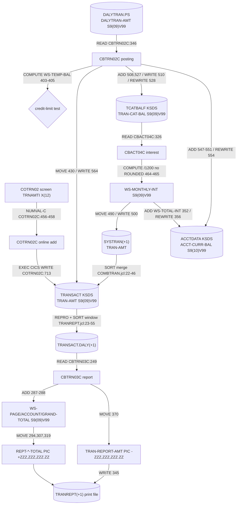
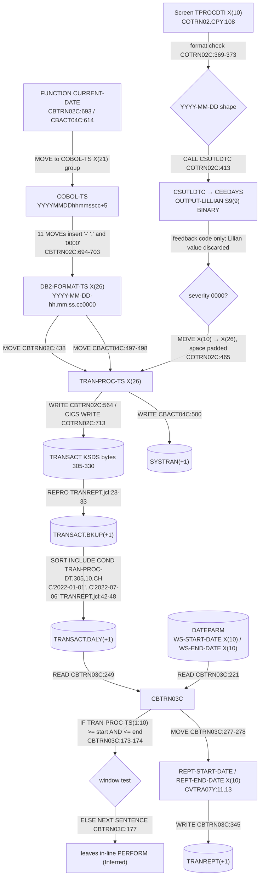

# 04 - Field-level lineage (one money field, one date field)

Two fields are traced hop by hop through the estate. Every hop cites the `path:line` where it is visible. A hop is **Confirmed** when the statement, `PIC` clause, or JCL `DD` is visible at the cited line; it is **Inferred** when the claim depends on compiler or run-time semantics, on data outside the repository, or on a job sequence that no scheduler definition in the repository fixes. Hop counts below are refreshed by `build_discovery.py` from the tables in this file; the prose and the tables are authored.

<!-- generated:lineage-summary -->
| Lineage | Hops | Confirmed | Inferred |
| --- | --- | --- | --- |
| Money field: TRAN-AMT | 18 | 15 | 3 |
| Date field: TRAN-PROC-TS | 19 | 15 | 4 |
| **Total** | **37** | **30** | **7** |
<!-- /generated:lineage-summary -->

Conventions used in the hop tables:

- **PIC** is the picture clause of the receiving field at that hop; `S9(09)V99` is an 11-byte zoned-decimal field with an implied decimal point and no `SIGN SEPARATE` clause, so the sign is an overpunch in the trailing (low-order) byte.
- **Truncation / rounding** records whether the statement at the hop can silently lose high-order digits (no `ON SIZE ERROR`), lose fractional digits (no `ROUNDED`), or change representation (edited picture, alphanumeric `MOVE`).
- **Validation** records what the cited code checks at that hop, or "none found" when the surrounding paragraph was read and no check on this field was found.

## Money field: TRAN-AMT

`TRAN-AMT` is defined once, in `app/cpy/CVTRA05Y.cpy:10` as `PIC S9(09)V99`, and its daily-input twin `DALYTRAN-AMT` in `app/cpy/CVTRA06Y.cpy:10` with the same picture. The record layouts are 350 bytes (`app/cpy/CVTRA05Y.cpy:2`, `app/cpy/CVTRA06Y.cpy:2`), and the amount occupies bytes 133-143 of the record (sum of the preceding pictures at `app/cpy/CVTRA05Y.cpy:5-9`). The sample daily input shows the overpunched trailing byte: the first record carries `0000005047G` in bytes 133-143 (`app/data/ASCII/dailytran.txt:1`).

### Diagram

### Hop table

| # | Hop | Citation | PIC at this hop | Sign | Truncation / rounding / representation | Validation at this hop | Status |
| --- | --- | --- | --- | --- | --- | --- | --- |
| M1 | Daily input dataset `AWS.M2.CARDDEMO.DALYTRAN.PS` is bound to DD `DALYTRAN` for step `STEP15` of job `POSTTRAN`, which executes `CBTRN02C` | `app/jcl/POSTTRAN.jcl:23`, `app/jcl/POSTTRAN.jcl:30-31` | record `X(350)` on the FD (`app/cbl/CBTRN02C.cbl:66-69`) | n/a | none at the JCL level | none (sequential read) | Confirmed |
| M2 | `CBTRN02C` selects `DALYTRAN-FILE ASSIGN TO DALYTRAN` and reads each record into `DALYTRAN-RECORD` (copied from `CVTRA06Y`) | `app/cbl/CBTRN02C.cbl:29`, `app/cbl/CBTRN02C.cbl:102`, `app/cbl/CBTRN02C.cbl:346` | `DALYTRAN-AMT PIC S9(09)V99` (`app/cpy/CVTRA06Y.cpy:10`) | trailing overpunch | none; `READ ... INTO` is a same-length group move | no `NUMERIC` class test on `DALYTRAN-AMT` was found in the validation paragraph (`app/cbl/CBTRN02C.cbl:377-420`); checks there cover card cross-reference, account existence, credit limit, and expiry only | Confirmed |
| M3 | Credit-limit test: `COMPUTE WS-TEMP-BAL = ACCT-CURR-CYC-CREDIT - ACCT-CURR-CYC-DEBIT + DALYTRAN-AMT` | `app/cbl/CBTRN02C.cbl:403-405` | `WS-TEMP-BAL PIC S9(09)V99` (`app/cbl/CBTRN02C.cbl:187`); operands `ACCT-CURR-CYC-CREDIT/DEBIT PIC S9(10)V99` (`app/cpy/CVACT01Y.cpy:13-14`) | trailing overpunch | receiving field has 9 integer digits while two operands have 10; no `ON SIZE ERROR` and no `ROUNDED` at the cited lines, so a high-order digit can be dropped | result compared with `ACCT-CREDIT-LIMIT` (`app/cbl/CBTRN02C.cbl:407`); reject reason 102 on failure | Confirmed |
| M4 | Whether the high-order loss in M3 has ever occurred depends on the account cycle balances in production data | (no source; see `05-government-decisions.md` D2) | n/a | n/a | run-time data dependent | n/a | Inferred |
| M5 | `MOVE DALYTRAN-AMT TO TRAN-AMT`, then the transaction record is written to the transaction master | `app/cbl/CBTRN02C.cbl:430`, `app/cbl/CBTRN02C.cbl:564`; DD `TRANFILE` → `AWS.M2.CARDDEMO.TRANSACT.VSAM.KSDS` (`app/jcl/POSTTRAN.jcl:28-29`) | `TRAN-AMT PIC S9(09)V99` (`app/cpy/CVTRA05Y.cpy:10`) | trailing overpunch | none; identical pictures | none | Confirmed |
| M6 | Category balance: `ADD DALYTRAN-AMT TO TRAN-CAT-BAL`, written for a new key or rewritten for an existing key | `app/cbl/CBTRN02C.cbl:508`, `app/cbl/CBTRN02C.cbl:510`, `app/cbl/CBTRN02C.cbl:527-528`; DD `TCATBALF` → `AWS.M2.CARDDEMO.TCATBALF.VSAM.KSDS` (`app/jcl/POSTTRAN.jcl:42`) | `TRAN-CAT-BAL PIC S9(09)V99` (`app/cpy/CVTRA01Y.cpy:9`) | trailing overpunch | accumulator has the same 9 integer digits as one transaction; no `ON SIZE ERROR`, so a category total exceeding 999,999,999.99 is truncated | none | Confirmed |
| M7 | Account balance: `ADD DALYTRAN-AMT TO ACCT-CURR-BAL`; the sign of the amount routes it to `ACCT-CURR-CYC-CREDIT` or `ACCT-CURR-CYC-DEBIT`; record rewritten | `app/cbl/CBTRN02C.cbl:547-551`, `app/cbl/CBTRN02C.cbl:554`; DD `ACCTFILE` → `AWS.M2.CARDDEMO.ACCTDATA.VSAM.KSDS` (`app/jcl/POSTTRAN.jcl:40`) | `ACCT-CURR-BAL PIC S9(10)V99` (`app/cpy/CVACT01Y.cpy:7`) | trailing overpunch | receiving field gains one integer digit (9 → 10); no `ON SIZE ERROR` | the `IF DALYTRAN-AMT >= 0` at `app/cbl/CBTRN02C.cbl:548` is the only test of the amount's value | Confirmed |
| M8 | Online path: screen field `TRNAMTI` is format-checked, converted with `FUNCTION NUMVAL-C`, moved to `TRAN-AMT`, and written with `EXEC CICS WRITE` to file `TRANSACT` | `app/cpy-bms/COTRN02.CPY:96`, `app/cbl/COTRN02C.cbl:340-343`, `app/cbl/COTRN02C.cbl:456-458`, `app/cbl/COTRN02C.cbl:713-714`; CSD `DEFINE FILE(TRANSACT) ... DSNAME(AWS.M2.CARDDEMO.TRANSACT.VSAM.KSDS)` (`app/csd/CARDDEMO.CSD:76-77`) | `TRNAMTI PIC X(12)` → `WS-TRAN-AMT-N PIC S9(9)V99` (`app/cbl/COTRN02C.cbl:58`) → `TRAN-AMT` | leading `+`/`-` character on the screen; trailing overpunch after `NUMVAL-C` | representation change text → zoned; screen format `-99999999.99` allows only 8 integer digits, one fewer than the file field | sign character, 8 numeric digits, decimal point, 2 numeric digits checked at `app/cbl/COTRN02C.cbl:340-343` | Confirmed |
| M9 | `CBACT04C` reads each category-balance record and computes `WS-MONTHLY-INT = (TRAN-CAT-BAL * DIS-INT-RATE) / 1200` | `app/cbl/CBACT04C.cbl:326`, `app/cbl/CBACT04C.cbl:464-465`; job `INTCALC` step `STEP15` (`app/jcl/INTCALC.jcl:22`), DD `TCATBALF` (`app/jcl/INTCALC.jcl:28`) | `WS-MONTHLY-INT PIC S9(09)V99` (`app/cbl/CBACT04C.cbl:168`); `DIS-INT-RATE PIC S9(04)V99` (`app/cpy/CVTRA02Y.cpy:9`) | trailing overpunch | no `ROUNDED` at `app/cbl/CBACT04C.cbl:464`, so the sub-cent part of the quotient is dropped; the literal `1200` (12 months × 100 for a percentage rate) is hard-coded | rate of zero skips the computation (`app/cbl/CBACT04C.cbl:214`); no range check on the rate was found | Confirmed |
| M10 | Whether dropping sub-cent interest (M9) is the intended rounding rule or a defect is not decidable from source | (no source; see `05-government-decisions.md` D3) | n/a | n/a | n/a | n/a | Inferred |
| M11 | Interest transaction: `MOVE WS-MONTHLY-INT TO TRAN-AMT`; record written to DD `TRANSACT` | `app/cbl/CBACT04C.cbl:490`, `app/cbl/CBACT04C.cbl:500`; DD → `AWS.M2.CARDDEMO.SYSTRAN(+1)` (`app/jcl/INTCALC.jcl:41`) | `TRAN-AMT PIC S9(09)V99` | trailing overpunch | none; identical pictures | none | Confirmed |
| M12 | Account update: `ADD WS-TOTAL-INT TO ACCT-CURR-BAL`, record rewritten | `app/cbl/CBACT04C.cbl:352`, `app/cbl/CBACT04C.cbl:356`; DD `ACCTFILE` → `AWS.M2.CARDDEMO.ACCTDATA.VSAM.KSDS` (`app/jcl/INTCALC.jcl:34`) | `WS-TOTAL-INT PIC S9(09)V99` (`app/cbl/CBACT04C.cbl:169`) → `ACCT-CURR-BAL PIC S9(10)V99` | trailing overpunch | `WS-TOTAL-INT` is reset to zero per account (`app/cbl/CBACT04C.cbl:200`) and accumulated with `ADD` at `app/cbl/CBACT04C.cbl:467` without `ON SIZE ERROR` | none | Confirmed |
| M13 | Interest transactions re-enter the master: `COMBTRAN` sorts `TRANSACT.BKUP(0)` and `SYSTRAN(0)` into `TRANSACT.COMBINED(+1)`, then IDCAMS loads it into the transaction KSDS | `app/jcl/COMBTRAN.jcl:22-26`, `app/jcl/COMBTRAN.jcl:30`, `app/jcl/COMBTRAN.jcl:37`, `app/jcl/COMBTRAN.jcl:41-46` | byte-for-byte copy (`DCB=(*.SORTIN)`, `app/jcl/COMBTRAN.jcl:35`) | unchanged | none (utility copy) | none | Confirmed |
| M14 | The run order `POSTTRAN` → `INTCALC` → `COMBTRAN` → `TRANREPT` is a job sequence; only `INTCALC` → `COMBTRAN` is fixed by a scheduler definition in the repository (`app/scheduler/CardDemo.controlm:69-78`); the rest depends on operations practice | `app/scheduler/CardDemo.controlm:65-83`; `POSTTRAN` appears only in the other scheduler file (`app/scheduler/CardDemo.ca7:70-72`) and `TRANREPT` in neither | n/a | n/a | n/a | n/a | Inferred |
| M15 | Reporting extract: `TRANREPT` backs the KSDS up with `REPROC`, then `SORT` copies the backup into `TRANSACT.DALY(+1)` with an `INCLUDE COND` window on the process date | `app/jcl/TRANREPT.jcl:23-33`, `app/jcl/TRANREPT.jcl:37-55` | record copy (`DCB=(*.SORTIN)`, `app/jcl/TRANREPT.jcl:53`) | unchanged | none | window filter only (see date lineage D6) | Confirmed |
| M16 | `CBTRN03C` reads `TRANFILE` (`TRANSACT.DALY(+1)`) into `TRAN-RECORD` and adds `TRAN-AMT` to page and account totals | `app/cbl/CBTRN03C.cbl:29`, `app/cbl/CBTRN03C.cbl:249`, `app/cbl/CBTRN03C.cbl:287-288`; DD `TRANFILE` (`app/jcl/TRANREPT.jcl:65-66`) | `WS-PAGE-TOTAL`, `WS-ACCOUNT-TOTAL`, `WS-GRAND-TOTAL PIC S9(09)V99` (`app/cbl/CBTRN03C.cbl:134-136`) | trailing overpunch | totals have the same 9 integer digits as a single transaction; `ADD` without `ON SIZE ERROR` at `app/cbl/CBTRN03C.cbl:287-288` and `app/cbl/CBTRN03C.cbl:297` | none on the amount | Confirmed |
| M17 | Detail line: `MOVE TRAN-AMT TO TRAN-REPORT-AMT` | `app/cbl/CBTRN03C.cbl:370` | `TRAN-REPORT-AMT PIC -ZZZ,ZZZ,ZZZ.ZZ` (`app/cpy/CVTRA07Y.cpy:30`) | fixed leading `-` or space | representation change zoned → edited display text (15 bytes, zero suppression, inserted `,` and `.`); 9 integer digits preserved | none | Confirmed |
| M18 | Totals: `MOVE WS-PAGE-TOTAL TO REPT-PAGE-TOTAL`, `WS-ACCOUNT-TOTAL TO REPT-ACCOUNT-TOTAL`, `WS-GRAND-TOTAL TO REPT-GRAND-TOTAL`; report record written to DD `TRANREPT` | `app/cbl/CBTRN03C.cbl:294`, `app/cbl/CBTRN03C.cbl:307`, `app/cbl/CBTRN03C.cbl:319`, `app/cbl/CBTRN03C.cbl:345`; DD → `AWS.M2.CARDDEMO.TRANREPT(+1)` (`app/jcl/TRANREPT.jcl:80`) | `PIC +ZZZ,ZZZ,ZZZ.ZZ` (`app/cpy/CVTRA07Y.cpy:54`, `app/cpy/CVTRA07Y.cpy:60`, `app/cpy/CVTRA07Y.cpy:66`) | fixed leading `+` or `-` | representation change to edited display text | none | Confirmed |

### Observations (all cited above)

- Three accumulators (`TRAN-CAT-BAL`, `WS-PAGE-TOTAL`/`WS-ACCOUNT-TOTAL`/`WS-GRAND-TOTAL`, `WS-TEMP-BAL`) have the same or fewer integer digits than the single amounts they sum (M3, M6, M16). Whether this is a business limit or a latent overflow is a system-owner question (`05-government-decisions.md` D2).
- The only arithmetic with a divisor is M9, and it has no `ROUNDED` phrase (`05-government-decisions.md` D3).
- The online entry path accepts one fewer integer digit than the batch path (M8 vs M2).
- The sign is an overpunch at every stored hop and becomes a separate character only on the screen (M8) and on the report (M17, M18).

## Date field: TRAN-PROC-TS

Of the candidate dates, `TRAN-PROC-TS` (`app/cpy/CVTRA05Y.cpy:17`, `PIC X(26)`) travels furthest: it is set by three batch programs (`app/cbl/CBTRN02C.cbl:438`, `app/cbl/CBACT04C.cbl:498`, `app/cbl/CBIMPORT.cbl:389`) and two online programs (`app/cbl/COTRN02C.cbl:465`, `app/cbl/COBIL00C.cbl:231-232`), stored in the transaction master, used as a SORT selection key in JCL, used as the report window filter in `CBTRN03C`, and printed. The `PARM` date of `CBACT04C` and the `CEEDAYS` path of `CSUTLDTC` are shown where they join this flow. The field occupies bytes 305-330 of the 350-byte record (sum of the pictures at `app/cpy/CVTRA05Y.cpy:5-16`), which matches the hard-coded SORT symbol `TRAN-PROC-DT,305,10,CH` (`app/jcl/TRANREPT.jcl:42`) and the FD split `FD-TRANS-DATA PIC X(304)` / `FD-TRAN-PROC-TS PIC X(26)` in `app/cbl/CBTRN03C.cbl:63-64`.

### Diagram

### Hop table

| # | Hop | Citation | PIC / format at this hop | Format change | Validation at this hop | Status |
| --- | --- | --- | --- | --- | --- | --- |
| T1 | Batch origin: `MOVE FUNCTION CURRENT-DATE TO COBOL-TS` in `CBTRN02C` | `app/cbl/CBTRN02C.cbl:693`; `COBOL-TS` group `app/cbl/CBTRN02C.cbl:150-158` | group of `PIC X` items: `YYYY`(4) `MM`(2) `DD`(2) `HH`(2) `MIN`(2) `SS`(2) `MIL`(2) `REST`(5) = 21 bytes | system clock → Gregorian text `YYYYMMDDhhmmsscc` plus 5 bytes of the 21-byte intrinsic result | none (system value) | Confirmed |
| T2 | Re-formatting into a 26-byte timestamp: eleven `MOVE`s copy the parts into `DB2-FORMAT-TS` through a `REDEFINES`, inserting `-`, `.` and a literal `'0000'` for the last four microsecond digits | `app/cbl/CBTRN02C.cbl:694-703`; `DB2-FORMAT-TS PIC X(26)` and its `REDEFINES` at `app/cbl/CBTRN02C.cbl:159-174` | `X(26)` = `YYYY-MM-DD-hh.mm.ss.cc0000`; `DB2-MIL PIC 9(002)` (`app/cbl/CBTRN02C.cbl:173`) receives the hundredths | text → text with separators; precision is hundredths padded to microseconds | none | Confirmed |
| T3 | `MOVE DB2-FORMAT-TS TO TRAN-PROC-TS`; the origin timestamp is copied from the daily input (`MOVE DALYTRAN-ORIG-TS TO TRAN-ORIG-TS`) and the record is written to the transaction master | `app/cbl/CBTRN02C.cbl:436-438`, `app/cbl/CBTRN02C.cbl:564`; DD `TRANFILE` → `AWS.M2.CARDDEMO.TRANSACT.VSAM.KSDS` (`app/jcl/POSTTRAN.jcl:28-29`) | `TRAN-PROC-TS PIC X(26)` (`app/cpy/CVTRA05Y.cpy:17`) | none (same length) | none; the daily input's own process-timestamp bytes 305-330 are blank in the sample (`app/data/ASCII/dailytran.txt:1`) and are replaced here | Confirmed |
| T4 | Expiry comparison uses the origin timestamp as text: `IF ACCT-EXPIRAION-DATE >= DALYTRAN-ORIG-TS (1:10)` | `app/cbl/CBTRN02C.cbl:414`; `ACCT-EXPIRAION-DATE PIC X(10)` (`app/cpy/CVACT01Y.cpy:11`); `DALYTRAN-ORIG-TS PIC X(26)` (`app/cpy/CVTRA06Y.cpy:16`) | `X(10)` vs reference-modified `X(26)(1:10)` | none; alphanumeric comparison of `YYYY-MM-DD` text | correctness relies on both fields being zero-padded `YYYY-MM-DD`; no format test of either field was found in `CBTRN02C` | Confirmed |
| T5 | Interest origin: `CBACT04C` builds `DB2-FORMAT-TS` the same way and sets both `TRAN-ORIG-TS` and `TRAN-PROC-TS` from it; the record goes to `SYSTRAN(+1)` | `app/cbl/CBACT04C.cbl:614`, `app/cbl/CBACT04C.cbl:497-498`, `app/cbl/CBACT04C.cbl:500`; DD → `AWS.M2.CARDDEMO.SYSTRAN(+1)` (`app/jcl/INTCALC.jcl:41`) | `X(26)` | as T2 | none | Confirmed |
| T6 | `PARM` date joins the flow: `PARM-DATE PIC X(10)` from `PARM='2022071800'` is concatenated with a 6-digit counter into `TRAN-ID`; it is not moved into any timestamp field | `app/cbl/CBACT04C.cbl:176-178`, `app/cbl/CBACT04C.cbl:476-480`; `app/jcl/INTCALC.jcl:22` | `PARM-DATE X(10)` → `TRAN-ID X(16)` (`app/cpy/CVTRA05Y.cpy:5`) | date text becomes the high-order part of a key | none found: `PARM-DATE` is used only in the `STRING`; no numeric, length, or calendar check appears in `CBACT04C` | Confirmed |
| T7 | What the ten characters `2022071800` denote (a `YYYYMMDD` plus a two-digit suffix, or something else) is not stated in source | (no source; see `05-government-decisions.md` D6) | n/a | n/a | n/a | Inferred |
| T8 | Online origin: screen field `TPROCDTI` is shape-checked (`NNNN-NN-NN`) | `app/cpy-bms/COTRN02.CPY:108`; `app/cbl/COTRN02C.cbl:369-373` | `TPROCDTI PIC X(10)` | none | positional `NUMERIC` and `'-'` tests; no month/day range test at this hop | Confirmed |
| T9 | Calendar validation through Language Environment: `COTRN02C` calls `CSUTLDTC` with the date and the mask `'YYYY-MM-DD'`; `CSUTLDTC` wraps the value into a halfword-prefixed string and calls `CEEDAYS` | `app/cbl/COTRN02C.cbl:60`, `app/cbl/COTRN02C.cbl:409-413`; `app/cbl/CSUTLDTC.cbl:105-108`, `app/cbl/CSUTLDTC.cbl:116-120` | `LS-DATE X(10)` (`app/cbl/CSUTLDTC.cbl:84`) → `WS-DATE-TO-TEST` (halfword length + text, `app/cbl/CSUTLDTC.cbl:25-31`) → `OUTPUT-LILLIAN PIC S9(9) BINARY` (`app/cbl/CSUTLDTC.cbl:41`) | Gregorian text → Lilian day number (binary) inside the call | `CEEDAYS` feedback code mapped to a severity and message number (`app/cbl/CSUTLDTC.cbl:123-124`, `app/cbl/CSUTLDTC.cbl:62-70`) | Confirmed |
| T10 | The Lilian day number is not returned to the caller: `LS-RESULT` receives `WS-MESSAGE` (severity, message number, text, the date, the mask), and `OUTPUT-LILLIAN` is not moved anywhere after the call | `app/cbl/CSUTLDTC.cbl:97`, `app/cbl/CSUTLDTC.cbl:42-57`; `OUTPUT-LILLIAN` appears only at `app/cbl/CSUTLDTC.cbl:41`, `app/cbl/CSUTLDTC.cbl:114`, `app/cbl/CSUTLDTC.cbl:119` | `LS-RESULT X(80)` | the binary form exists only inside the subroutine | caller accepts severity `'0000'` or message `'2513'` (`app/cbl/COTRN02C.cbl:417-420`) | Confirmed |
| T11 | The echoed date in the result message is written twice: `MOVE LS-DATE TO ... WS-DATE` copies the ten characters directly, then after the call `MOVE WS-DATE-TO-TEST TO WS-DATE` overwrites them with the group that holds a `PIC S9(4) BINARY` length followed by the text. Whether the second move leaves the two binary length bytes ahead of the date in `WS-DATE` depends on how the compiler sizes a group whose length is governed by `OCCURS ... DEPENDING ON` when it is the sending item, which no runtime output in the repository shows. Separately, the 88-level for a zero feedback code is named `FC-INVALID-DATE` but yields `'Date is valid'` | `app/cbl/CSUTLDTC.cbl:107-108`, `app/cbl/CSUTLDTC.cbl:122`, `app/cbl/CSUTLDTC.cbl:25-31`, `app/cbl/CSUTLDTC.cbl:52`; `app/cbl/CSUTLDTC.cbl:62`, `app/cbl/CSUTLDTC.cbl:129-130` | `WS-DATE X(10)` | group → alphanumeric; byte content of the result after the second move not determinable from source | none; the message is informational | Inferred |
| T12 | `MOVE TPROCDTI OF COTRN2AI TO TRAN-PROC-TS`: a 10-byte date lands in a 26-byte timestamp field, space-padded, then `EXEC CICS WRITE` to file `TRANSACT` | `app/cbl/COTRN02C.cbl:465-466`, `app/cbl/COTRN02C.cbl:711-714`; `app/csd/CARDDEMO.CSD:76-77` | `X(10)` → `X(26)` | online records carry a date with 16 trailing spaces where batch records carry `-hh.mm.ss.cc0000` | none beyond D8-D10 | Confirmed |
| T13 | Backup before reporting: `TRANREPT` step `STEP05R` invokes `REPROC` to copy the KSDS to `TRANSACT.BKUP(+1)` | `app/jcl/TRANREPT.jcl:23-33`; `app/proc/REPROC.prc:21` | byte copy | none | none | Confirmed |
| T14 | SORT window: `INCLUDE COND=(TRAN-PROC-DT,GE,PARM-START-DATE,AND,TRAN-PROC-DT,LE,PARM-END-DATE)` with `TRAN-PROC-DT,305,10,CH` and hard-coded `C'2022-01-01'` / `C'2022-07-06'` | `app/jcl/TRANREPT.jcl:40-48` | 10-byte character compare on bytes 305-314 | none | the window is fixed in the JCL, not read from `DATEPARM`; a record written by T12 (date only) and by T3 (full timestamp) compare identically on these 10 bytes | Confirmed |
| T15 | `CBTRN03C` reads `DATEPARM` (`AWS.M2.CARDDEMO.DATEPARM`) into `WS-START-DATE` / `WS-END-DATE` | `app/cbl/CBTRN03C.cbl:55-57`, `app/cbl/CBTRN03C.cbl:122-125`, `app/cbl/CBTRN03C.cbl:220-240`; DD (`app/jcl/TRANREPT.jcl:73-74`) | `WS-START-DATE X(10)`, `FILLER X(01)`, `WS-END-DATE X(10)` in an `X(80)` record | none | only the file status is tested (`app/cbl/CBTRN03C.cbl:222-240`); no shape or calendar check of either date was found | Confirmed |
| T16 | Whether `DATEPARM` and the SORT literals in T14 are meant to hold the same window is not stated anywhere in the repository; `AWS.M2.CARDDEMO.DATEPARM` has no sample content under `app/data` | `app/jcl/TRANREPT.jcl:43-44` vs `app/cbl/CBTRN03C.cbl:123-125` (see `05-government-decisions.md` D6) | n/a | n/a | n/a | Inferred |
| T17 | Report window test: `IF TRAN-PROC-TS (1:10) >= WS-START-DATE AND TRAN-PROC-TS (1:10) <= WS-END-DATE CONTINUE ELSE NEXT SENTENCE` | `app/cbl/CBTRN03C.cbl:173-178` | reference-modified `X(26)(1:10)` vs `X(10)` | none; text compare | relies on both operands being `YYYY-MM-DD` text | Confirmed |
| T18 | Effect of `NEXT SENTENCE` at T17: control passes to the statement after the next period, which is the `END-PERFORM.` closing the in-line loop at `app/cbl/CBTRN03C.cbl:206`; on that reading, the first out-of-window record ends the report loop rather than skipping the record | `app/cbl/CBTRN03C.cbl:170-206` | n/a | n/a | n/a (control flow; see `05-government-decisions.md` D7) | Inferred |
| T19 | Header: `MOVE WS-START-DATE TO REPT-START-DATE`, `MOVE WS-END-DATE TO REPT-END-DATE`, written with the report | `app/cbl/CBTRN03C.cbl:277-278`, `app/cbl/CBTRN03C.cbl:345`; `app/cpy/CVTRA07Y.cpy:11`, `app/cpy/CVTRA07Y.cpy:13` | `X(10)` → `X(10)` | none | none | Confirmed |

### Observations (all cited above)

- The only calendar validation of any date in this flow is the online `CEEDAYS` call (T9); the batch timestamps come from the system clock (T1, T5) and the batch window dates (`PARM`, SORT literals, `DATEPARM`) are never validated (T6, T14, T15).
- The Lilian representation exists only transiently inside `CSUTLDTC` (T10); nothing stored in the estate is in Lilian, Julian, or packed form. All stored dates are Gregorian text.
- The same 26-byte field holds two shapes (T3 vs T12), which both satisfy the 10-byte comparisons at T14 and T17.
- Two windows exist for the same report (T14, T16) and one control-flow reading of T17 (T18) would make the in-program window a stop condition rather than a filter.
