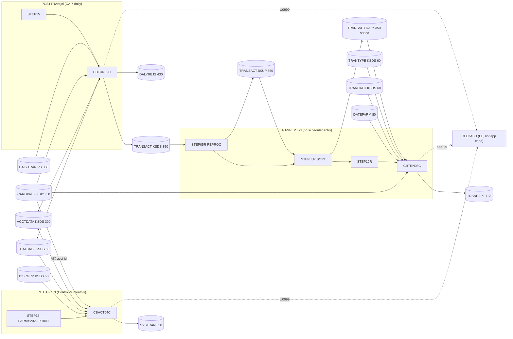

# 1. Dependency inventory — daily posting cycle rooted at CBTRN02C

Scope: the batch flow rooted at `CBTRN02C` (job `POSTTRAN`) plus the two downstream batch jobs
that consume the files it writes: `INTCALC` (`CBACT04C`, reads TCATBALF) and `TRANREPT`
(`DFSORT` + `CBTRN03C`, reads TRANSACT). Everything below was read from the repository; nothing
is inferred from program names alone. Items that could not be resolved from the source are
listed in §7 rather than guessed.

Every path is relative to the repository root. Line numbers refer to the files as they exist
on `main` at the time of this pass.

## 1.1 Programs and subprograms

| Program | Kind | Invoked by | Source | Lines | Calls |
|---|---|---|---|---|---|
| `CBTRN02C` | COBOL batch main | `app/jcl/POSTTRAN.jcl` STEP15 (line 23) | `app/cbl/CBTRN02C.cbl` | 731 | `CEE3ABD` (line 711) only |
| `CBACT04C` | COBOL batch main, `PROCEDURE DIVISION USING EXTERNAL-PARMS` (line 180) | `app/jcl/INTCALC.jcl` STEP15, `PARM='2022071800'` (line 22) | `app/cbl/CBACT04C.cbl` | 652 | `CEE3ABD` (line 632) only |
| `CBTRN03C` | COBOL batch main | `app/jcl/TRANREPT.jcl` STEP10R (line 59) | `app/cbl/CBTRN03C.cbl` | 649 | `CEE3ABD` (line 630) only |
| `SORT` | IBM DFSORT utility, not application code | `app/jcl/TRANREPT.jcl` STEP05R (line 37) | control cards in-stream, lines 40-50 | — | — |
| `IDCAMS` | IBM utility via `PROC=REPROC` | `app/jcl/TRANREPT.jcl` STEP05R (line 23) → `app/proc/TRANREPT.prc`, control `app/ctl/REPROCT.ctl` | — | — |
| `CEE3ABD` | **IBM Language Environment callable service** (terminates the enclave with a user abend code). Not application code; no source in this repository. | called from the three `9999-ABEND-PROGRAM` paragraphs with `ABCODE=999`, `TIMING=0` | — | — | — |

**Application Assembler in this call graph: none.** The repository's two Assembler members,
`app/asm/COBDATFT.asm` and `app/asm/MVSWAIT.asm`, are called from `CBACT01C` and `COBSWAIT`
respectively — neither is in this flow. Verified with `grep -n "CALL" app/cbl/CBTRN02C.cbl
app/cbl/CBACT04C.cbl app/cbl/CBTRN03C.cbl`: the only `CALL` statement in each program is
`CALL 'CEE3ABD'`.

## 1.2 Copybooks

| Copybook | Record / purpose | LRECL | Included by (line) |
|---|---|---|---|
| `app/cpy/CVTRA06Y.cpy` | `DALYTRAN-RECORD` daily transaction input | 350 | CBTRN02C:102 |
| `app/cpy/CVTRA05Y.cpy` | `TRAN-RECORD` transaction master / SYSTRAN / DALY | 350 | CBTRN02C:107, CBACT04C:117, CBTRN03C:93 |
| `app/cpy/CVACT03Y.cpy` | `CARD-XREF-RECORD` card→customer→account | 50 | CBTRN02C:112, CBACT04C:102, CBTRN03C:98 |
| `app/cpy/CVACT01Y.cpy` | `ACCOUNT-RECORD` | 300 | CBTRN02C:121, CBACT04C:112 |
| `app/cpy/CVTRA01Y.cpy` | `TRAN-CAT-BAL-RECORD` per-account/type/category balance | 50 | CBTRN02C:126, CBACT04C:97 |
| `app/cpy/CVTRA02Y.cpy` | `DIS-GROUP-RECORD` disclosure group interest rate | 50 | CBACT04C:107 |
| `app/cpy/CVTRA03Y.cpy` | `TRAN-TYPE-RECORD` | 60 | CBTRN03C:103 |
| `app/cpy/CVTRA04Y.cpy` | `TRAN-CAT-RECORD` | 60 | CBTRN03C:108 |
| `app/cpy/CVTRA07Y.cpy` | report line layouts (`REPORT-NAME-HEADER`, `TRANSACTION-HEADER-1/2`, `TRANSACTION-DETAIL-REPORT`, `REPORT-PAGE-TOTALS`, `REPORT-ACCOUNT-TOTALS`, `REPORT-GRAND-TOTALS`) | 133 | CBTRN03C:113 |

The FD record areas (`FD-*` items in each program's FILE SECTION) are declared inline, not from
copybooks; they redefine only the key fields and a filler for the remaining bytes.

## 1.3 JCL steps

| Job | Step | Program | DD → dataset | Mode | JCL lines |
|---|---|---|---|---|---|
| `POSTTRAN` | STEP15 | CBTRN02C | `DALYTRAN` → `AWS.M2.CARDDEMO.DALYTRAN.PS` | input | 30-31 |
| | | | `TRANFILE` → `AWS.M2.CARDDEMO.TRANSACT.VSAM.KSDS` | output (OPEN OUTPUT, program line 256) | 28-29 |
| | | | `XREFFILE` → `AWS.M2.CARDDEMO.CARDXREF.VSAM.KSDS` | input | 32-33 |
| | | | `DALYREJS` → `AWS.M2.CARDDEMO.DALYREJS(+1)` GDG | output, new generation | 34-38 |
| | | | `ACCTFILE` → `AWS.M2.CARDDEMO.ACCTDATA.VSAM.KSDS` | I-O (REWRITE) | 39-40 |
| | | | `TCATBALF` → `AWS.M2.CARDDEMO.TCATBALF.VSAM.KSDS` | I-O (WRITE/REWRITE) | 41-42 |
| `INTCALC` | STEP15 | CBACT04C `PARM='2022071800'` | `TCATBALF` → `…TCATBALF.VSAM.KSDS` | input, sequential | 27-28 |
| | | | `XREFFILE` → `…CARDXREF.VSAM.KSDS` | input, random by alt key | 29-30 |
| | | | `XREFFIL1` → `…CARDXREF.VSAM.AIX.PATH` | alternate-index path (required for `ALTERNATE RECORD KEY`) | 31-32 |
| | | | `ACCTFILE` → `…ACCTDATA.VSAM.KSDS` | I-O (REWRITE) | 33-34 |
| | | | `DISCGRP` → `…DISCGRP.VSAM.KSDS` | input | 35-36 |
| | | | `TRANSACT` → `AWS.M2.CARDDEMO.SYSTRAN(+1)` GDG | output, sequential | 37-41 |
| `TRANREPT` | STEP05R (first) | `PROC=REPROC` (IDCAMS REPRO) | `FILEIN` `…TRANSACT.VSAM.KSDS` → `FILEOUT` `…TRANSACT.BKUP(+1)` | copy | 23-33 |
| | STEP05R (second, duplicate step name) | SORT | `SORTIN` `…TRANSACT.BKUP(+1)` → `SORTOUT` `…TRANSACT.DALY(+1)`; `SYMNAMES` defines `TRAN-CARD-NUM,263,16,ZD`, `TRAN-PROC-DT,305,10,CH`, `PARM-START-DATE=C'2022-01-01'`, `PARM-END-DATE=C'2022-07-06'`; `SYSIN`: `INCLUDE COND=(TRAN-PROC-DT,GE,PARM-START-DATE,AND,TRAN-PROC-DT,LE,PARM-END-DATE)`, `SORT FIELDS=(TRAN-CARD-NUM,A)` | filter + sort | 37-55 |
| | STEP10R | CBTRN03C | `TRANFILE` → `…TRANSACT.DALY(+1)` | input | 65-66 |
| | | | `CARDXREF` → `…CARDXREF.VSAM.KSDS` | input | 67-68 |
| | | | `TRANTYPE` → `…TRANTYPE.VSAM.KSDS` | input | 69-70 |
| | | | `TRANCATG` → `…TRANCATG.VSAM.KSDS` | input | 71-72 |
| | | | `DATEPARM` → `AWS.M2.CARDDEMO.DATEPARM` | input | 73-74 |
| | | | `TRANREPT` → `AWS.M2.CARDDEMO.TRANREPT(+1)` GDG | output | 76-80 |

Note: `TRANREPT.jcl` uses the step name `STEP05R` twice (lines 23 and 37). JES tolerates
duplicate step names but restart-by-step is ambiguous; recorded in open-questions.

## 1.4 VSAM clusters (from IDCAMS DEFINE steps and `app/catlg/LISTCAT.txt`)

| Dataset | Type | KEYS(len off) | RECORDSIZE | Defined in |
|---|---|---|---|---|
| `AWS.M2.CARDDEMO.TRANSACT.VSAM.KSDS` | KSDS | (16 0) `TRAN-ID` | 350 350 | `app/jcl/TRANFILE.jcl` |
| `AWS.M2.CARDDEMO.TRANSACT.VSAM.AIX` | AIX | (26 304) `TRAN-PROC-TS`, nonunique | — | `app/jcl/TRANFILE.jcl` (not used by this flow) |
| `AWS.M2.CARDDEMO.ACCTDATA.VSAM.KSDS` | KSDS | (11 0) `ACCT-ID` | 300 300 | `app/jcl/ACCTFILE.jcl` |
| `AWS.M2.CARDDEMO.CARDXREF.VSAM.KSDS` | KSDS | (16 0) `XREF-CARD-NUM` | 50 50 | `app/jcl/XREFFILE.jcl` |
| `AWS.M2.CARDDEMO.CARDXREF.VSAM.AIX` (+ `.PATH`) | AIX | (11 25) `XREF-ACCT-ID`, NONUNIQUEKEY | — | `app/jcl/XREFFILE.jcl`; used by CBACT04C via `XREFFIL1` |
| `AWS.M2.CARDDEMO.TCATBALF.VSAM.KSDS` | KSDS | (17 0) acct-id(11)+type(2)+cat(4) | 50 50 | `app/jcl/TCATBALF.jcl` |
| `AWS.M2.CARDDEMO.DISCGRP.VSAM.KSDS` | KSDS | (16 0) group(10)+type(2)+cat(4) | 50 50 | `app/jcl/DISCGRP.jcl` |
| `AWS.M2.CARDDEMO.TRANTYPE.VSAM.KSDS` | KSDS | (2 0) | 60 60 | `app/jcl/TRANTYPE.jcl` |
| `AWS.M2.CARDDEMO.TRANCATG.VSAM.KSDS` | KSDS | (6 0) type(2)+cat(4) | 60 60 | `app/jcl/TRANCATG.jcl` |

## 1.5 Sequential / GDG datasets

| Dataset | LRECL | Producer | Consumer in flow | Sample in repo |
|---|---|---|---|---|
| `AWS.M2.CARDDEMO.DALYTRAN.PS` | 350 | external (daily feed) | CBTRN02C | `app/data/EBCDIC/AWS.M2.CARDDEMO.DALYTRAN.PS` (300 records, 105 000 bytes), ASCII twin |
| `AWS.M2.CARDDEMO.DALYREJS(+1)` | 430 | CBTRN02C | none in flow | none |
| `AWS.M2.CARDDEMO.SYSTRAN(+1)` | 350 | CBACT04C | `COMBTRAN.jcl` (out of scope, noted only as downstream) | none |
| `AWS.M2.CARDDEMO.TRANSACT.BKUP(+1)` | 350 | REPRO | SORT | none |
| `AWS.M2.CARDDEMO.TRANSACT.DALY(+1)` | 350 | SORT | CBTRN03C | none |
| `AWS.M2.CARDDEMO.DATEPARM` | 80 (`FD-DATEPARM-RECORD PIC X(80)`, CBTRN03C:89) | external | CBTRN03C | none — content format inferred from `0550-DATEPARM-READ` (`(1:10)` start, `(12:10)` end) |
| `AWS.M2.CARDDEMO.TRANREPT(+1)` | 133 | CBTRN03C | none in flow | none |

Sample data for the KSDS files exists as flat `.PS` loads under `app/data/EBCDIC/` and
`app/data/ASCII/` (ACCTDATA 50, CARDXREF 50, TCATBALF 50, DISCGRP 51, TRANTYPE 7, TRANCATG 18
records). Encoding of the EBCDIC set was verified as IBM-037 by decoding known fields.

## 1.6 Scheduler dependencies

| Scheduler | File | What it says about this flow |
|---|---|---|
| CA-7 | `app/scheduler/CardDemo.ca7` | `POSTTRAN` (JCL ID 255, SCHID 030) is *triggered by* `CBPAUP0J` (lines 69-70) and *triggers* `WAITSTEP` (lines 96-97). No `INTCALC` or `TRANREPT` job appears in the CA-7 listing. |
| Control-M | `app/scheduler/CardDemo.controlm` | `INTCALC` is in folder `MONTHLY-InterestCalculation` (line 69) and its OUTCOND feeds `COMBTRAN` (lines 76-78). `POSTTRAN` and `TRANREPT` do not appear in the Control-M export. |

So the repository's scheduler definitions do **not** show POSTTRAN → INTCALC → TRANREPT as one
daily chain: INTCALC is defined monthly and TRANREPT is not defined at all. The data-flow
dependency (TCATBALF and TRANSACT written by CBTRN02C, read by the other two) is real; the
"same scheduler cycle" statement in the task brief is not corroborated by these files. Recorded
as open question OQ-01.

## 1.7 Unresolved items (not guessed)

| # | Item | Why unresolved |
|---|---|---|
| U-1 | Content and producer of `AWS.M2.CARDDEMO.DATEPARM` | No sample, no JCL that writes it. Only the read positions in CBTRN03C:220-247 are known. |
| U-2 | Who produces `DALYTRAN.PS` | Not in repo; sample data only. |
| U-3 | Expected consumer of `DALYREJS` and `TRANREPT` | None in the repository. |
| U-4 | Whether `TRANSACT.VSAM.KSDS` is expected to be empty before POSTTRAN | CBTRN02C opens it `OUTPUT` (line 256), which on a VSAM KSDS with existing records fails unless defined `REUSE`. `TRANFILE.jcl` shows the DEFINE; whether REUSE is set must be checked there before asserting. |
| U-5 | `CEE3ABD` semantics | Standard LE service; behavior (user abend U0999, `TIMING=0` → no dump/trace) taken from IBM LE documentation, not from repo. |
| U-6 | Runtime record contents after EOF read in CBTRN03C/CBACT04C | Depends on compiler/runtime; see open questions. |

## 1.8 Call graph

Rendered image: [`call-graph.svg`](call-graph.svg) (generated from [`call-graph.mmd`](call-graph.mmd)).

