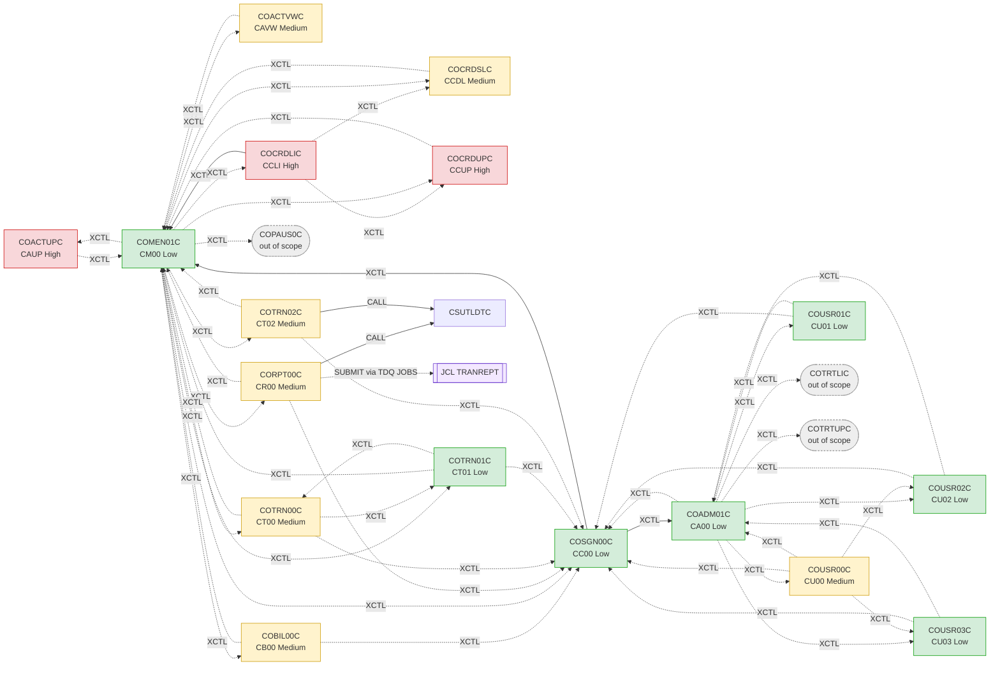
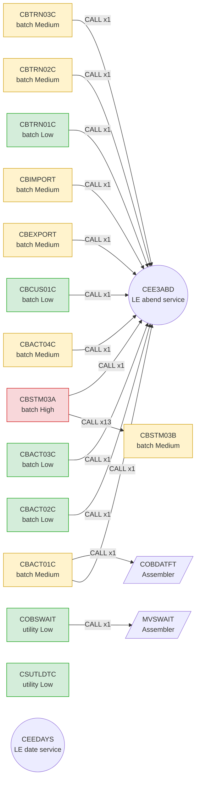
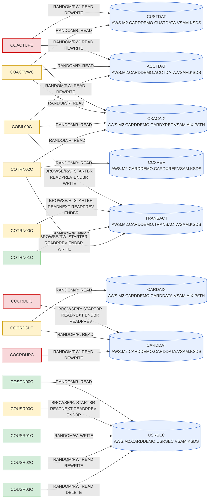

# 02 — Dependency map and complexity ratings (CardDemo)

Generated by `docs/modernization/build_dependency_map.py` from `docs/modernization/inventory.json` (step s1.1 output) plus targeted re-scans of `app/cbl`, `app/cpy` and `app/jcl`. Regenerate with `python3 docs/modernization/build_dependency_map.py`; `--check` verifies freshness, that every program and JCL job appears, and the hub claims; `--render` writes `diagrams/*.svg` with `mmdc`. Machine-readable form: `docs/modernization/dependency-map.json` (edges, ratings, order).

Scope: core module (app/) only; extension apps appear only as out-of-scope XCTL targets.

Totals: **31 COBOL programs** (17 online), **67 program edges**, **72 program→file edges**, **47 copybooks**, **38 JCL jobs + 2 procedures**; ratings: Medium 14, Low 13, High 4.

Node colours in every diagram: green = Low, yellow = Medium, red = High complexity; grey dashed = out-of-scope program; blue cylinder = dataset/file.

## 1. Program → program call graph

Edge kinds: `CALL` (static subprogram call, with call-site count), `EXEC CICS XCTL`/`LINK` (solid = literal PROGRAM name, dotted = run-time operand resolved from `MOVE`/`VALUE`/menu tables), `SUBMIT` (JCL written to the `JOBS` extra-partition TDQ). No program issues EXEC CICS START; the only asynchronous hand-off is CORPT00C writing TRANREPT JCL to TDQ JOBS.

### 1a. Online programs (CICS XCTL/LINK)

### 1b. Batch programs (CALL)

### 1c. Edge list

| Source | Kind | Target | Target type | Sites | Resolution |
| --- | --- | --- | --- | --- | --- |
| CBACT01C | CALL | CEE3ABD | runtime | 1 | static |
| CBACT01C | CALL | COBDATFT | assembler | 1 | static |
| CBACT02C | CALL | CEE3ABD | runtime | 1 | static |
| CBACT03C | CALL | CEE3ABD | runtime | 1 | static |
| CBACT04C | CALL | CEE3ABD | runtime | 1 | static |
| CBCUS01C | CALL | CEE3ABD | runtime | 1 | static |
| CBEXPORT | CALL | CEE3ABD | runtime | 1 | static |
| CBIMPORT | CALL | CEE3ABD | runtime | 1 | static |
| CBSTM03A | CALL | CBSTM03B | program | 13 | static |
| CBSTM03A | CALL | CEE3ABD | runtime | 1 | static |
| CBTRN01C | CALL | CEE3ABD | runtime | 1 | static |
| CBTRN02C | CALL | CEE3ABD | runtime | 1 | static |
| CBTRN03C | CALL | CEE3ABD | runtime | 1 | static |
| COACTUPC | XCTL | COMEN01C | program | 1 | via `CDEMO-TO-PROGRAM` |
| COACTVWC | XCTL | COMEN01C | program | 1 | via `CDEMO-TO-PROGRAM` |
| COADM01C | XCTL | COUSR00C | program | 1 | via `CDEMO-ADMIN-OPT-PGMNAME(WS-OPTION)` |
| COADM01C | XCTL | COUSR01C | program | 1 | via `CDEMO-ADMIN-OPT-PGMNAME(WS-OPTION)` |
| COADM01C | XCTL | COUSR02C | program | 1 | via `CDEMO-ADMIN-OPT-PGMNAME(WS-OPTION)` |
| COADM01C | XCTL | COUSR03C | program | 1 | via `CDEMO-ADMIN-OPT-PGMNAME(WS-OPTION)` |
| COADM01C | XCTL | COTRTLIC | out-of-scope program | 1 | via `CDEMO-ADMIN-OPT-PGMNAME(WS-OPTION)` |
| COADM01C | XCTL | COTRTUPC | out-of-scope program | 1 | via `CDEMO-ADMIN-OPT-PGMNAME(WS-OPTION)` |
| COADM01C | XCTL | COSGN00C | program | 2 | via `CDEMO-TO-PROGRAM` |
| COBIL00C | XCTL | COSGN00C | program | 2 | via `CDEMO-TO-PROGRAM` |
| COBIL00C | XCTL | COMEN01C | program | 1 | via `CDEMO-TO-PROGRAM` |
| COBSWAIT | CALL | MVSWAIT | assembler | 1 | static |
| COCRDLIC | XCTL | COMEN01C | program | 1 | static |
| COCRDLIC | XCTL | COCRDSLC | program | 2 | via `CCARD-NEXT-PROG` |
| COCRDLIC | XCTL | COCRDUPC | program | 2 | via `CCARD-NEXT-PROG` |
| COCRDSLC | XCTL | COMEN01C | program | 1 | via `CDEMO-TO-PROGRAM` |
| COCRDUPC | XCTL | COMEN01C | program | 1 | via `CDEMO-TO-PROGRAM` |
| COMEN01C | XCTL | COACTVWC | program | 2 | via `CDEMO-MENU-OPT-PGMNAME(WS-OPTION)` |
| COMEN01C | XCTL | COACTUPC | program | 2 | via `CDEMO-MENU-OPT-PGMNAME(WS-OPTION)` |
| COMEN01C | XCTL | COCRDLIC | program | 2 | via `CDEMO-MENU-OPT-PGMNAME(WS-OPTION)` |
| COMEN01C | XCTL | COCRDSLC | program | 2 | via `CDEMO-MENU-OPT-PGMNAME(WS-OPTION)` |
| COMEN01C | XCTL | COCRDUPC | program | 2 | via `CDEMO-MENU-OPT-PGMNAME(WS-OPTION)` |
| COMEN01C | XCTL | COTRN00C | program | 2 | via `CDEMO-MENU-OPT-PGMNAME(WS-OPTION)` |
| COMEN01C | XCTL | COTRN01C | program | 2 | via `CDEMO-MENU-OPT-PGMNAME(WS-OPTION)` |
| COMEN01C | XCTL | COTRN02C | program | 2 | via `CDEMO-MENU-OPT-PGMNAME(WS-OPTION)` |
| COMEN01C | XCTL | CORPT00C | program | 2 | via `CDEMO-MENU-OPT-PGMNAME(WS-OPTION)` |
| COMEN01C | XCTL | COBIL00C | program | 2 | via `CDEMO-MENU-OPT-PGMNAME(WS-OPTION)` |
| COMEN01C | XCTL | COPAUS0C | out-of-scope program | 2 | via `CDEMO-MENU-OPT-PGMNAME(WS-OPTION)` |
| COMEN01C | XCTL | COSGN00C | program | 2 | via `CDEMO-TO-PROGRAM` |
| CORPT00C | CALL | CSUTLDTC | program | 2 | static |
| CORPT00C | XCTL | COSGN00C | program | 2 | via `CDEMO-TO-PROGRAM` |
| CORPT00C | XCTL | COMEN01C | program | 1 | via `CDEMO-TO-PROGRAM` |
| CORPT00C | SUBMIT | TRANREPT | jcl | 1 | JCL written to TDQ JOBS (internal reader) |
| COSGN00C | XCTL | COADM01C | program | 1 | static |
| COSGN00C | XCTL | COMEN01C | program | 1 | static |
| COTRN00C | XCTL | COSGN00C | program | 4 | via `CDEMO-TO-PROGRAM` |
| COTRN00C | XCTL | COMEN01C | program | 2 | via `CDEMO-TO-PROGRAM` |
| COTRN00C | XCTL | COTRN01C | program | 2 | via `CDEMO-TO-PROGRAM` |
| COTRN01C | XCTL | COSGN00C | program | 2 | via `CDEMO-TO-PROGRAM` |
| COTRN01C | XCTL | COMEN01C | program | 1 | via `CDEMO-TO-PROGRAM` |
| COTRN01C | XCTL | COTRN00C | program | 1 | via `CDEMO-TO-PROGRAM` |
| COTRN02C | CALL | CSUTLDTC | program | 2 | static |
| COTRN02C | XCTL | COSGN00C | program | 2 | via `CDEMO-TO-PROGRAM` |
| COTRN02C | XCTL | COMEN01C | program | 1 | via `CDEMO-TO-PROGRAM` |
| COUSR00C | XCTL | COSGN00C | program | 6 | via `CDEMO-TO-PROGRAM` |
| COUSR00C | XCTL | COADM01C | program | 3 | via `CDEMO-TO-PROGRAM` |
| COUSR00C | XCTL | COUSR02C | program | 3 | via `CDEMO-TO-PROGRAM` |
| COUSR00C | XCTL | COUSR03C | program | 3 | via `CDEMO-TO-PROGRAM` |
| COUSR01C | XCTL | COSGN00C | program | 2 | via `CDEMO-TO-PROGRAM` |
| COUSR01C | XCTL | COADM01C | program | 1 | via `CDEMO-TO-PROGRAM` |
| COUSR02C | XCTL | COSGN00C | program | 2 | via `CDEMO-TO-PROGRAM` |
| COUSR02C | XCTL | COADM01C | program | 2 | via `CDEMO-TO-PROGRAM` |
| COUSR03C | XCTL | COSGN00C | program | 2 | via `CDEMO-TO-PROGRAM` |
| COUSR03C | XCTL | COADM01C | program | 2 | via `CDEMO-TO-PROGRAM` |

Run-time transfer operands that could not be reduced to a program name:

- `COACTUPC`: `CDEMO-TO-PROGRAM` <- `CDEMO-FROM-PROGRAM` (returns to whichever program transferred in)
- `COACTVWC`: `CDEMO-TO-PROGRAM` <- `CDEMO-FROM-PROGRAM` (returns to whichever program transferred in)
- `COADM01C`: `CDEMO-ADMIN-OPT-PGMNAME(WS-OPTION)` <- table `CDEMO-ADMIN-OPT-PGMNAME` in copybook `COADM02Y` (6 program-name entries)
- `COBIL00C`: `CDEMO-TO-PROGRAM` <- `CDEMO-FROM-PROGRAM` (returns to whichever program transferred in)
- `COCRDSLC`: `CDEMO-TO-PROGRAM` <- `CDEMO-FROM-PROGRAM` (returns to whichever program transferred in)
- `COCRDUPC`: `CDEMO-TO-PROGRAM` <- `CDEMO-FROM-PROGRAM` (returns to whichever program transferred in)
- `COMEN01C`: `CDEMO-MENU-OPT-PGMNAME(WS-OPTION)` <- table `CDEMO-MENU-OPT-PGMNAME` in copybook `COMEN02Y` (11 program-name entries)
- `COTRN01C`: `CDEMO-TO-PROGRAM` <- `CDEMO-FROM-PROGRAM` (returns to whichever program transferred in)
- `COTRN02C`: `CDEMO-TO-PROGRAM` <- `CDEMO-FROM-PROGRAM` (returns to whichever program transferred in)
- `COUSR02C`: `CDEMO-TO-PROGRAM` <- `CDEMO-FROM-PROGRAM` (returns to whichever program transferred in)
- `COUSR03C`: `CDEMO-TO-PROGRAM` <- `CDEMO-FROM-PROGRAM` (returns to whichever program transferred in)

### 1d. Hub confirmation

| Claim from the plan | Verdict | Evidence |
| --- | --- | --- |
| COMEN01C/COADM01C XCTL to every online program | **corrected** | COMEN01C -> 12 programs via COMEN02Y, COADM01C -> 7 via COADM02Y; together they reach 15/17 core online programs. Not reached: COADM01C, COMEN01C (the sign-on program XCTLs *to* the menus, and sub-screens COCRDSLC/COCRDUPC, COTRN01C, COUSR02C/COUSR03C are also reached from their list screens). Menu tables also name COPAUS0C, COTRTLIC, COTRTUPC, which are not core programs (extension apps, out of scope). |
| CBSTM03A calls CBSTM03B 13 times | **confirmed** | 13 CALL 'CBSTM03B' statements in CBSTM03A |
| CSUTLDTC called from 4 programs | **corrected** | 2 direct callers (CORPT00C, COTRN02C) + 1 through copybook procedure code (COACTUPC via CSUTLDPY) = 3 calling programs, not 4. |
| CBACT01C calls COBDATFT/MVSWAIT | **corrected** | CBACT01C calls COBDATFT (and CEE3ABD) only; MVSWAIT is called by COBSWAIT (WAITSTEP job), not by CBACT01C. |
| CEE3ABD used in 11 places | **confirmed** | CALL 'CEE3ABD' appears once in each of 11 batch programs: CBACT01C, CBACT02C, CBACT03C, CBACT04C, CBCUS01C, CBEXPORT, CBIMPORT, CBSTM03A, CBTRN01C, CBTRN02C, CBTRN03C |
| EXEC CICS START edges | **none found** | No program issues EXEC CICS START; the only asynchronous hand-off is CORPT00C writing TRANREPT JCL to TDQ JOBS. |

## 2. Program → file edges (access mode)

### 2a. Online programs → CICS files

| Program | CICS FILE | Dataset (CSD) | Access | Commands |
| --- | --- | --- | --- | --- |
| COACTUPC | CXACAIX | AWS.M2.CARDDEMO.CARDXREF.VSAM.AIX.PATH | RANDOM/R | READ |
| COACTUPC | ACCTDAT | AWS.M2.CARDDEMO.ACCTDATA.VSAM.KSDS | RANDOM/RW | READ REWRITE |
| COACTUPC | CUSTDAT | AWS.M2.CARDDEMO.CUSTDATA.VSAM.KSDS | RANDOM/RW | READ REWRITE |
| COACTVWC | CXACAIX | AWS.M2.CARDDEMO.CARDXREF.VSAM.AIX.PATH | RANDOM/R | READ |
| COACTVWC | ACCTDAT | AWS.M2.CARDDEMO.ACCTDATA.VSAM.KSDS | RANDOM/R | READ |
| COACTVWC | CUSTDAT | AWS.M2.CARDDEMO.CUSTDATA.VSAM.KSDS | RANDOM/R | READ |
| COBIL00C | ACCTDAT | AWS.M2.CARDDEMO.ACCTDATA.VSAM.KSDS | RANDOM/RW | READ REWRITE |
| COBIL00C | CXACAIX | AWS.M2.CARDDEMO.CARDXREF.VSAM.AIX.PATH | RANDOM/R | READ |
| COBIL00C | TRANSACT | AWS.M2.CARDDEMO.TRANSACT.VSAM.KSDS | BROWSE/RW | STARTBR READPREV ENDBR WRITE |
| COCRDLIC | CARDDAT | AWS.M2.CARDDEMO.CARDDATA.VSAM.KSDS | BROWSE/R | STARTBR READNEXT ENDBR READPREV |
| COCRDSLC | CARDDAT | AWS.M2.CARDDEMO.CARDDATA.VSAM.KSDS | RANDOM/R | READ |
| COCRDSLC | CARDAIX | AWS.M2.CARDDEMO.CARDDATA.VSAM.AIX.PATH | RANDOM/R | READ |
| COCRDUPC | CARDDAT | AWS.M2.CARDDEMO.CARDDATA.VSAM.KSDS | RANDOM/RW | READ REWRITE |
| COSGN00C | USRSEC | AWS.M2.CARDDEMO.USRSEC.VSAM.KSDS | RANDOM/R | READ |
| COTRN00C | TRANSACT | AWS.M2.CARDDEMO.TRANSACT.VSAM.KSDS | BROWSE/R | STARTBR READNEXT READPREV ENDBR |
| COTRN01C | TRANSACT | AWS.M2.CARDDEMO.TRANSACT.VSAM.KSDS | RANDOM/R | READ |
| COTRN02C | CXACAIX | AWS.M2.CARDDEMO.CARDXREF.VSAM.AIX.PATH | RANDOM/R | READ |
| COTRN02C | CCXREF | AWS.M2.CARDDEMO.CARDXREF.VSAM.KSDS | RANDOM/R | READ |
| COTRN02C | TRANSACT | AWS.M2.CARDDEMO.TRANSACT.VSAM.KSDS | BROWSE/RW | STARTBR READPREV ENDBR WRITE |
| COUSR00C | USRSEC | AWS.M2.CARDDEMO.USRSEC.VSAM.KSDS | BROWSE/R | STARTBR READNEXT READPREV ENDBR |
| COUSR01C | USRSEC | AWS.M2.CARDDEMO.USRSEC.VSAM.KSDS | RANDOM/W | WRITE |
| COUSR02C | USRSEC | AWS.M2.CARDDEMO.USRSEC.VSAM.KSDS | RANDOM/RW | READ REWRITE |
| COUSR03C | USRSEC | AWS.M2.CARDDEMO.USRSEC.VSAM.KSDS | RANDOM/RW | READ DELETE |

### 2b. Batch programs → datasets

```mermaid
flowchart LR
    classDef high fill:#f8d7da,stroke:#c00;
    classDef medium fill:#fff3cd,stroke:#c90;
    classDef low fill:#d4edda,stroke:#090;
    classDef ext fill:#eee,stroke:#999,stroke-dasharray: 3 3;
    classDef ds fill:#e7f0ff,stroke:#36c;
    classDef job fill:#f3e8ff,stroke:#63c;
    CBACT01C["CBACT01C"]
    class CBACT01C medium;
    CBACT02C["CBACT02C"]
    class CBACT02C low;
    CBACT03C["CBACT03C"]
    class CBACT03C low;
    CBACT04C["CBACT04C"]
    class CBACT04C medium;
    CBCUS01C["CBCUS01C"]
    class CBCUS01C low;
    CBEXPORT["CBEXPORT"]
    class CBEXPORT medium;
    CBIMPORT["CBIMPORT"]
    class CBIMPORT medium;
    CBSTM03A["CBSTM03A"]
    class CBSTM03A high;
    CBSTM03B["CBSTM03B"]
    class CBSTM03B medium;
    CBTRN01C["CBTRN01C"]
    class CBTRN01C low;
    CBTRN02C["CBTRN02C"]
    class CBTRN02C medium;
    CBTRN03C["CBTRN03C"]
    class CBTRN03C medium;
    D_AWS_M2_CARDDEMO_ACCTDATA_VSAM_KSDS[("AWS.M2.CARDDEMO.ACCTDATA.VSAM.KSDS")]
    class D_AWS_M2_CARDDEMO_ACCTDATA_VSAM_KSDS ds;
    D_AWS_M2_CARDDEMO_ACCTDATA_PSCOMP[("AWS.M2.CARDDEMO.ACCTDATA.PSCOMP")]
    class D_AWS_M2_CARDDEMO_ACCTDATA_PSCOMP ds;
    D_AWS_M2_CARDDEMO_ACCTDATA_ARRYPS[("AWS.M2.CARDDEMO.ACCTDATA.ARRYPS")]
    class D_AWS_M2_CARDDEMO_ACCTDATA_ARRYPS ds;
    D_AWS_M2_CARDDEMO_ACCTDATA_VBPS[("AWS.M2.CARDDEMO.ACCTDATA.VBPS")]
    class D_AWS_M2_CARDDEMO_ACCTDATA_VBPS ds;
    D_AWS_M2_CARDDEMO_CARDDATA_VSAM_KSDS[("AWS.M2.CARDDEMO.CARDDATA.VSAM.KSDS")]
    class D_AWS_M2_CARDDEMO_CARDDATA_VSAM_KSDS ds;
    D_AWS_M2_CARDDEMO_CARDXREF_VSAM_KSDS[("AWS.M2.CARDDEMO.CARDXREF.VSAM.KSDS")]
    class D_AWS_M2_CARDDEMO_CARDXREF_VSAM_KSDS ds;
    D_AWS_M2_CARDDEMO_TCATBALF_VSAM_KSDS[("AWS.M2.CARDDEMO.TCATBALF.VSAM.KSDS")]
    class D_AWS_M2_CARDDEMO_TCATBALF_VSAM_KSDS ds;
    D_AWS_M2_CARDDEMO_DISCGRP_VSAM_KSDS[("AWS.M2.CARDDEMO.DISCGRP.VSAM.KSDS")]
    class D_AWS_M2_CARDDEMO_DISCGRP_VSAM_KSDS ds;
    D_AWS_M2_CARDDEMO_SYSTRAN__1_[("AWS.M2.CARDDEMO.SYSTRAN(+1)")]
    class D_AWS_M2_CARDDEMO_SYSTRAN__1_ ds;
    D_AWS_M2_CARDDEMO_CUSTDATA_VSAM_KSDS[("AWS.M2.CARDDEMO.CUSTDATA.VSAM.KSDS")]
    class D_AWS_M2_CARDDEMO_CUSTDATA_VSAM_KSDS ds;
    D_AWS_M2_CARDDEMO_TRANSACT_VSAM_KSDS[("AWS.M2.CARDDEMO.TRANSACT.VSAM.KSDS")]
    class D_AWS_M2_CARDDEMO_TRANSACT_VSAM_KSDS ds;
    D_AWS_M2_CARDDEMO_EXPORT_DATA[("AWS.M2.CARDDEMO.EXPORT.DATA")]
    class D_AWS_M2_CARDDEMO_EXPORT_DATA ds;
    D_AWS_M2_CARDDEMO_CUSTDATA_IMPORT[("AWS.M2.CARDDEMO.CUSTDATA.IMPORT")]
    class D_AWS_M2_CARDDEMO_CUSTDATA_IMPORT ds;
    D_AWS_M2_CARDDEMO_ACCTDATA_IMPORT[("AWS.M2.CARDDEMO.ACCTDATA.IMPORT")]
    class D_AWS_M2_CARDDEMO_ACCTDATA_IMPORT ds;
    D_AWS_M2_CARDDEMO_CARDXREF_IMPORT[("AWS.M2.CARDDEMO.CARDXREF.IMPORT")]
    class D_AWS_M2_CARDDEMO_CARDXREF_IMPORT ds;
    D_AWS_M2_CARDDEMO_TRANSACT_IMPORT[("AWS.M2.CARDDEMO.TRANSACT.IMPORT")]
    class D_AWS_M2_CARDDEMO_TRANSACT_IMPORT ds;
    D__unassigned_DD_CARDOUT_[("(unassigned DD CARDOUT)")]
    class D__unassigned_DD_CARDOUT_ ds;
    D_AWS_M2_CARDDEMO_IMPORT_ERRORS[("AWS.M2.CARDDEMO.IMPORT.ERRORS")]
    class D_AWS_M2_CARDDEMO_IMPORT_ERRORS ds;
    D_AWS_M2_CARDDEMO_STATEMNT_PS[("AWS.M2.CARDDEMO.STATEMNT.PS")]
    class D_AWS_M2_CARDDEMO_STATEMNT_PS ds;
    D_AWS_M2_CARDDEMO_STATEMNT_HTML[("AWS.M2.CARDDEMO.STATEMNT.HTML")]
    class D_AWS_M2_CARDDEMO_STATEMNT_HTML ds;
    D_AWS_M2_CARDDEMO_TRXFL_VSAM_KSDS[("AWS.M2.CARDDEMO.TRXFL.VSAM.KSDS")]
    class D_AWS_M2_CARDDEMO_TRXFL_VSAM_KSDS ds;
    D__unassigned_DD_DALYTRAN_[("(unassigned DD DALYTRAN)")]
    class D__unassigned_DD_DALYTRAN_ ds;
    D__unassigned_DD_CUSTFILE_[("(unassigned DD CUSTFILE)")]
    class D__unassigned_DD_CUSTFILE_ ds;
    D__unassigned_DD_XREFFILE_[("(unassigned DD XREFFILE)")]
    class D__unassigned_DD_XREFFILE_ ds;
    D__unassigned_DD_CARDFILE_[("(unassigned DD CARDFILE)")]
    class D__unassigned_DD_CARDFILE_ ds;
    D__unassigned_DD_ACCTFILE_[("(unassigned DD ACCTFILE)")]
    class D__unassigned_DD_ACCTFILE_ ds;
    D__unassigned_DD_TRANFILE_[("(unassigned DD TRANFILE)")]
    class D__unassigned_DD_TRANFILE_ ds;
    D_AWS_M2_CARDDEMO_DALYTRAN_PS[("AWS.M2.CARDDEMO.DALYTRAN.PS")]
    class D_AWS_M2_CARDDEMO_DALYTRAN_PS ds;
    D_AWS_M2_CARDDEMO_DALYREJS__1_[("AWS.M2.CARDDEMO.DALYREJS(+1)")]
    class D_AWS_M2_CARDDEMO_DALYREJS__1_ ds;
    D_AWS_M2_CARDDEMO_TRANSACT_DALY__1_[("AWS.M2.CARDDEMO.TRANSACT.DALY(+1)")]
    class D_AWS_M2_CARDDEMO_TRANSACT_DALY__1_ ds;
    D_AWS_M2_CARDDEMO_TRANTYPE_VSAM_KSDS[("AWS.M2.CARDDEMO.TRANTYPE.VSAM.KSDS")]
    class D_AWS_M2_CARDDEMO_TRANTYPE_VSAM_KSDS ds;
    D_AWS_M2_CARDDEMO_TRANCATG_VSAM_KSDS[("AWS.M2.CARDDEMO.TRANCATG.VSAM.KSDS")]
    class D_AWS_M2_CARDDEMO_TRANCATG_VSAM_KSDS ds;
    D_AWS_M2_CARDDEMO_TRANREPT__1_[("AWS.M2.CARDDEMO.TRANREPT(+1)")]
    class D_AWS_M2_CARDDEMO_TRANREPT__1_ ds;
    D_AWS_M2_CARDDEMO_DATEPARM[("AWS.M2.CARDDEMO.DATEPARM")]
    class D_AWS_M2_CARDDEMO_DATEPARM ds;
    D_AWS_M2_CARDDEMO_ACCTDATA_VSAM_KSDS -->|"ACCTFILE INDEXED/SEQUENTIAL INPUT"| CBACT01C
    CBACT01C -->|"OUTFILE SEQUENTIAL/SEQUENTIAL OUTPUT"| D_AWS_M2_CARDDEMO_ACCTDATA_PSCOMP
    CBACT01C -->|"ARRYFILE SEQUENTIAL/SEQUENTIAL OUTPUT"| D_AWS_M2_CARDDEMO_ACCTDATA_ARRYPS
    CBACT01C -->|"VBRCFILE SEQUENTIAL/SEQUENTIAL OUTPUT"| D_AWS_M2_CARDDEMO_ACCTDATA_VBPS
    D_AWS_M2_CARDDEMO_CARDDATA_VSAM_KSDS -->|"CARDFILE INDEXED/SEQUENTIAL INPUT"| CBACT02C
    D_AWS_M2_CARDDEMO_CARDXREF_VSAM_KSDS -->|"XREFFILE INDEXED/SEQUENTIAL INPUT"| CBACT03C
    D_AWS_M2_CARDDEMO_TCATBALF_VSAM_KSDS -->|"TCATBALF INDEXED/SEQUENTIAL INPUT"| CBACT04C
    D_AWS_M2_CARDDEMO_CARDXREF_VSAM_KSDS -->|"XREFFILE INDEXED/RANDOM INPUT"| CBACT04C
    CBACT04C <-->|"ACCTFILE INDEXED/RANDOM I-O"| D_AWS_M2_CARDDEMO_ACCTDATA_VSAM_KSDS
    D_AWS_M2_CARDDEMO_DISCGRP_VSAM_KSDS -->|"DISCGRP INDEXED/RANDOM INPUT"| CBACT04C
    CBACT04C -->|"TRANSACT SEQUENTIAL/SEQUENTIAL OUTPUT"| D_AWS_M2_CARDDEMO_SYSTRAN__1_
    D_AWS_M2_CARDDEMO_CUSTDATA_VSAM_KSDS -->|"CUSTFILE INDEXED/SEQUENTIAL INPUT"| CBCUS01C
    D_AWS_M2_CARDDEMO_CUSTDATA_VSAM_KSDS -->|"CUSTFILE INDEXED/SEQUENTIAL INPUT"| CBEXPORT
    D_AWS_M2_CARDDEMO_ACCTDATA_VSAM_KSDS -->|"ACCTFILE INDEXED/SEQUENTIAL INPUT"| CBEXPORT
    D_AWS_M2_CARDDEMO_CARDXREF_VSAM_KSDS -->|"XREFFILE INDEXED/SEQUENTIAL INPUT"| CBEXPORT
    D_AWS_M2_CARDDEMO_TRANSACT_VSAM_KSDS -->|"TRANSACT INDEXED/SEQUENTIAL INPUT"| CBEXPORT
    D_AWS_M2_CARDDEMO_CARDDATA_VSAM_KSDS -->|"CARDFILE INDEXED/SEQUENTIAL INPUT"| CBEXPORT
    CBEXPORT -->|"EXPFILE INDEXED/SEQUENTIAL OUTPUT"| D_AWS_M2_CARDDEMO_EXPORT_DATA
    D_AWS_M2_CARDDEMO_EXPORT_DATA -->|"EXPFILE INDEXED/SEQUENTIAL INPUT"| CBIMPORT
    CBIMPORT -->|"CUSTOUT SEQUENTIAL/SEQUENTIAL OUTPUT"| D_AWS_M2_CARDDEMO_CUSTDATA_IMPORT
    CBIMPORT -->|"ACCTOUT SEQUENTIAL/SEQUENTIAL OUTPUT"| D_AWS_M2_CARDDEMO_ACCTDATA_IMPORT
    CBIMPORT -->|"XREFOUT SEQUENTIAL/SEQUENTIAL OUTPUT"| D_AWS_M2_CARDDEMO_CARDXREF_IMPORT
    CBIMPORT -->|"TRNXOUT SEQUENTIAL/SEQUENTIAL OUTPUT"| D_AWS_M2_CARDDEMO_TRANSACT_IMPORT
    CBIMPORT -->|"CARDOUT SEQUENTIAL/SEQUENTIAL OUTPUT"| D__unassigned_DD_CARDOUT_
    CBIMPORT -->|"ERROUT SEQUENTIAL/SEQUENTIAL OUTPUT"| D_AWS_M2_CARDDEMO_IMPORT_ERRORS
    CBSTM03A -->|"STMTFILE SEQUENTIAL/SEQUENTIAL OUTPUT"| D_AWS_M2_CARDDEMO_STATEMNT_PS
    CBSTM03A -->|"HTMLFILE SEQUENTIAL/SEQUENTIAL OUTPUT"| D_AWS_M2_CARDDEMO_STATEMNT_HTML
    D_AWS_M2_CARDDEMO_TRXFL_VSAM_KSDS -->|"TRNXFILE INDEXED/SEQUENTIAL INPUT"| CBSTM03B
    D_AWS_M2_CARDDEMO_CARDXREF_VSAM_KSDS -->|"XREFFILE INDEXED/SEQUENTIAL INPUT"| CBSTM03B
    D_AWS_M2_CARDDEMO_CUSTDATA_VSAM_KSDS -->|"CUSTFILE INDEXED/RANDOM INPUT"| CBSTM03B
    D_AWS_M2_CARDDEMO_ACCTDATA_VSAM_KSDS -->|"ACCTFILE INDEXED/RANDOM INPUT"| CBSTM03B
    D__unassigned_DD_DALYTRAN_ -->|"DALYTRAN SEQUENTIAL/SEQUENTIAL INPUT"| CBTRN01C
    D__unassigned_DD_CUSTFILE_ -->|"CUSTFILE INDEXED/RANDOM INPUT"| CBTRN01C
    D__unassigned_DD_XREFFILE_ -->|"XREFFILE INDEXED/RANDOM INPUT"| CBTRN01C
    D__unassigned_DD_CARDFILE_ -->|"CARDFILE INDEXED/RANDOM INPUT"| CBTRN01C
    D__unassigned_DD_ACCTFILE_ -->|"ACCTFILE INDEXED/RANDOM INPUT"| CBTRN01C
    D__unassigned_DD_TRANFILE_ -->|"TRANFILE INDEXED/RANDOM INPUT"| CBTRN01C
    D_AWS_M2_CARDDEMO_DALYTRAN_PS -->|"DALYTRAN SEQUENTIAL/SEQUENTIAL INPUT"| CBTRN02C
    CBTRN02C -->|"TRANFILE INDEXED/RANDOM OUTPUT"| D_AWS_M2_CARDDEMO_TRANSACT_VSAM_KSDS
    D_AWS_M2_CARDDEMO_CARDXREF_VSAM_KSDS -->|"XREFFILE INDEXED/RANDOM INPUT"| CBTRN02C
    CBTRN02C -->|"DALYREJS SEQUENTIAL/SEQUENTIAL OUTPUT"| D_AWS_M2_CARDDEMO_DALYREJS__1_
    CBTRN02C <-->|"ACCTFILE INDEXED/RANDOM I-O"| D_AWS_M2_CARDDEMO_ACCTDATA_VSAM_KSDS
    CBTRN02C <-->|"TCATBALF INDEXED/RANDOM I-O"| D_AWS_M2_CARDDEMO_TCATBALF_VSAM_KSDS
    D_AWS_M2_CARDDEMO_TRANSACT_DALY__1_ -->|"TRANFILE SEQUENTIAL/SEQUENTIAL INPUT"| CBTRN03C
    D_AWS_M2_CARDDEMO_CARDXREF_VSAM_KSDS -->|"CARDXREF INDEXED/RANDOM INPUT"| CBTRN03C
    D_AWS_M2_CARDDEMO_TRANTYPE_VSAM_KSDS -->|"TRANTYPE INDEXED/RANDOM INPUT"| CBTRN03C
    D_AWS_M2_CARDDEMO_TRANCATG_VSAM_KSDS -->|"TRANCATG INDEXED/RANDOM INPUT"| CBTRN03C
    CBTRN03C -->|"TRANREPT SEQUENTIAL/SEQUENTIAL OUTPUT"| D_AWS_M2_CARDDEMO_TRANREPT__1_
    D_AWS_M2_CARDDEMO_DATEPARM -->|"DATEPARM SEQUENTIAL/SEQUENTIAL INPUT"| CBTRN03C
```

| Program | DD | Organization | Access mode | OPEN | Verbs | Record key | Dataset(s) from JCL |
| --- | --- | --- | --- | --- | --- | --- | --- |
| CBACT01C | ACCTFILE | INDEXED | SEQUENTIAL | INPUT | READ | FD-ACCT-ID | AWS.M2.CARDDEMO.ACCTDATA.VSAM.KSDS |
| CBACT01C | OUTFILE | SEQUENTIAL | SEQUENTIAL | OUTPUT | WRITE |  | AWS.M2.CARDDEMO.ACCTDATA.PSCOMP |
| CBACT01C | ARRYFILE | SEQUENTIAL | SEQUENTIAL | OUTPUT | WRITE |  | AWS.M2.CARDDEMO.ACCTDATA.ARRYPS |
| CBACT01C | VBRCFILE | SEQUENTIAL | SEQUENTIAL | OUTPUT | WRITE |  | AWS.M2.CARDDEMO.ACCTDATA.VBPS |
| CBACT02C | CARDFILE | INDEXED | SEQUENTIAL | INPUT | READ | FD-CARD-NUM | AWS.M2.CARDDEMO.CARDDATA.VSAM.KSDS |
| CBACT03C | XREFFILE | INDEXED | SEQUENTIAL | INPUT | READ | FD-XREF-CARD-NUM | AWS.M2.CARDDEMO.CARDXREF.VSAM.KSDS |
| CBACT04C | TCATBALF | INDEXED | SEQUENTIAL | INPUT | READ | FD-TRAN-CAT-KEY | AWS.M2.CARDDEMO.TCATBALF.VSAM.KSDS |
| CBACT04C | XREFFILE | INDEXED | RANDOM | INPUT | READ | FD-XREF-CARD-NUM | AWS.M2.CARDDEMO.CARDXREF.VSAM.KSDS |
| CBACT04C | ACCTFILE | INDEXED | RANDOM | I-O | REWRITE READ | FD-ACCT-ID | AWS.M2.CARDDEMO.ACCTDATA.VSAM.KSDS |
| CBACT04C | DISCGRP | INDEXED | RANDOM | INPUT | READ | FD-DISCGRP-KEY | AWS.M2.CARDDEMO.DISCGRP.VSAM.KSDS |
| CBACT04C | TRANSACT | SEQUENTIAL | SEQUENTIAL | OUTPUT | WRITE |  | AWS.M2.CARDDEMO.SYSTRAN(+1) |
| CBCUS01C | CUSTFILE | INDEXED | SEQUENTIAL | INPUT | READ | FD-CUST-ID | AWS.M2.CARDDEMO.CUSTDATA.VSAM.KSDS |
| CBEXPORT | CUSTFILE | INDEXED | SEQUENTIAL | INPUT | READ | CUST-ID | AWS.M2.CARDDEMO.CUSTDATA.VSAM.KSDS |
| CBEXPORT | ACCTFILE | INDEXED | SEQUENTIAL | INPUT | READ | ACCT-ID | AWS.M2.CARDDEMO.ACCTDATA.VSAM.KSDS |
| CBEXPORT | XREFFILE | INDEXED | SEQUENTIAL | INPUT | READ | XREF-CARD-NUM | AWS.M2.CARDDEMO.CARDXREF.VSAM.KSDS |
| CBEXPORT | TRANSACT | INDEXED | SEQUENTIAL | INPUT | READ | TRAN-ID | AWS.M2.CARDDEMO.TRANSACT.VSAM.KSDS |
| CBEXPORT | CARDFILE | INDEXED | SEQUENTIAL | INPUT | READ | CARD-NUM | AWS.M2.CARDDEMO.CARDDATA.VSAM.KSDS |
| CBEXPORT | EXPFILE | INDEXED | SEQUENTIAL | OUTPUT | WRITE | EXPORT-SEQUENCE-NUM | AWS.M2.CARDDEMO.EXPORT.DATA |
| CBIMPORT | EXPFILE | INDEXED | SEQUENTIAL | INPUT | READ | EXPORT-SEQUENCE-NUM | AWS.M2.CARDDEMO.EXPORT.DATA |
| CBIMPORT | CUSTOUT | SEQUENTIAL | SEQUENTIAL | OUTPUT | WRITE |  | AWS.M2.CARDDEMO.CUSTDATA.IMPORT |
| CBIMPORT | ACCTOUT | SEQUENTIAL | SEQUENTIAL | OUTPUT | WRITE |  | AWS.M2.CARDDEMO.ACCTDATA.IMPORT |
| CBIMPORT | XREFOUT | SEQUENTIAL | SEQUENTIAL | OUTPUT | WRITE |  | AWS.M2.CARDDEMO.CARDXREF.IMPORT |
| CBIMPORT | TRNXOUT | SEQUENTIAL | SEQUENTIAL | OUTPUT | WRITE |  | AWS.M2.CARDDEMO.TRANSACT.IMPORT |
| CBIMPORT | CARDOUT | SEQUENTIAL | SEQUENTIAL | OUTPUT | WRITE |  | (no JCL DD found) |
| CBIMPORT | ERROUT | SEQUENTIAL | SEQUENTIAL | OUTPUT | WRITE |  | AWS.M2.CARDDEMO.IMPORT.ERRORS |
| CBSTM03A | STMTFILE | SEQUENTIAL | SEQUENTIAL | OUTPUT | WRITE |  | AWS.M2.CARDDEMO.STATEMNT.PS |
| CBSTM03A | HTMLFILE | SEQUENTIAL | SEQUENTIAL | OUTPUT | WRITE |  | AWS.M2.CARDDEMO.STATEMNT.HTML |
| CBSTM03B | TRNXFILE | INDEXED | SEQUENTIAL | INPUT | READ | FD-TRNXS-ID | AWS.M2.CARDDEMO.TRXFL.VSAM.KSDS |
| CBSTM03B | XREFFILE | INDEXED | SEQUENTIAL | INPUT | READ | FD-XREF-CARD-NUM | AWS.M2.CARDDEMO.CARDXREF.VSAM.KSDS |
| CBSTM03B | CUSTFILE | INDEXED | RANDOM | INPUT | READ | FD-CUST-ID | AWS.M2.CARDDEMO.CUSTDATA.VSAM.KSDS |
| CBSTM03B | ACCTFILE | INDEXED | RANDOM | INPUT | READ | FD-ACCT-ID | AWS.M2.CARDDEMO.ACCTDATA.VSAM.KSDS |
| CBTRN01C | DALYTRAN | SEQUENTIAL | SEQUENTIAL | INPUT | READ |  | (no JCL DD found) |
| CBTRN01C | CUSTFILE | INDEXED | RANDOM | INPUT |  | FD-CUST-ID | (no JCL DD found) |
| CBTRN01C | XREFFILE | INDEXED | RANDOM | INPUT | READ | FD-XREF-CARD-NUM | (no JCL DD found) |
| CBTRN01C | CARDFILE | INDEXED | RANDOM | INPUT |  | FD-CARD-NUM | (no JCL DD found) |
| CBTRN01C | ACCTFILE | INDEXED | RANDOM | INPUT | READ | FD-ACCT-ID | (no JCL DD found) |
| CBTRN01C | TRANFILE | INDEXED | RANDOM | INPUT |  | FD-TRANS-ID | (no JCL DD found) |
| CBTRN02C | DALYTRAN | SEQUENTIAL | SEQUENTIAL | INPUT | READ |  | AWS.M2.CARDDEMO.DALYTRAN.PS |
| CBTRN02C | TRANFILE | INDEXED | RANDOM | OUTPUT | WRITE | FD-TRANS-ID | AWS.M2.CARDDEMO.TRANSACT.VSAM.KSDS |
| CBTRN02C | XREFFILE | INDEXED | RANDOM | INPUT | READ | FD-XREF-CARD-NUM | AWS.M2.CARDDEMO.CARDXREF.VSAM.KSDS |
| CBTRN02C | DALYREJS | SEQUENTIAL | SEQUENTIAL | OUTPUT | WRITE |  | AWS.M2.CARDDEMO.DALYREJS(+1) |
| CBTRN02C | ACCTFILE | INDEXED | RANDOM | I-O | READ REWRITE | FD-ACCT-ID | AWS.M2.CARDDEMO.ACCTDATA.VSAM.KSDS |
| CBTRN02C | TCATBALF | INDEXED | RANDOM | I-O | READ WRITE REWRITE | FD-TRAN-CAT-KEY | AWS.M2.CARDDEMO.TCATBALF.VSAM.KSDS |
| CBTRN03C | TRANFILE | SEQUENTIAL | SEQUENTIAL | INPUT | READ |  | AWS.M2.CARDDEMO.TRANSACT.DALY(+1) |
| CBTRN03C | CARDXREF | INDEXED | RANDOM | INPUT | READ | FD-XREF-CARD-NUM | AWS.M2.CARDDEMO.CARDXREF.VSAM.KSDS |
| CBTRN03C | TRANTYPE | INDEXED | RANDOM | INPUT | READ | FD-TRAN-TYPE | AWS.M2.CARDDEMO.TRANTYPE.VSAM.KSDS |
| CBTRN03C | TRANCATG | INDEXED | RANDOM | INPUT | READ | FD-TRAN-CAT-KEY | AWS.M2.CARDDEMO.TRANCATG.VSAM.KSDS |
| CBTRN03C | TRANREPT | SEQUENTIAL | SEQUENTIAL | OUTPUT | WRITE |  | AWS.M2.CARDDEMO.TRANREPT(+1) |
| CBTRN03C | DATEPARM | SEQUENTIAL | SEQUENTIAL | INPUT | READ |  | AWS.M2.CARDDEMO.DATEPARM |

## 3. Copybook → program usage

| Copybook | Kind | Code LOC | Record bytes | COMP-3 fields | Used by | Nested COPY |
| --- | --- | --- | --- | --- | --- | --- |
| COADM02Y | data | 32 | 272 | 0 | COADM01C |  |
| COCOM01Y | data | 26 | 160 | 0 | COACTUPC, COACTVWC, COADM01C, COBIL00C, COCRDLIC, COCRDSLC, COCRDUPC, COMEN01C, CORPT00C, COSGN00C, COTRN00C, COTRN01C, COTRN02C, COUSR00C, COUSR01C, COUSR02C, COUSR03C, COPAUS0C, COPAUS1C, COTRTLIC, COTRTUPC |  |
| CODATECN | data | 36 | 80 | 0 | CBACT01C |  |
| COMEN02Y | data | 64 | 508 | 0 | COMEN01C |  |
| COSTM01 | data | 17 | 350 | 0 | CBSTM03A |  |
| COTTL01Y | data | 7 | 120 | 0 | COACTUPC, COACTVWC, COADM01C, COBIL00C, COCRDLIC, COCRDSLC, COCRDUPC, COMEN01C, CORPT00C, COSGN00C, COTRN00C, COTRN01C, COTRN02C, COUSR00C, COUSR01C, COUSR02C, COUSR03C, COPAUS0C, COPAUS1C, COTRTLIC, COTRTUPC |  |
| CSDAT01Y | data | 39 | 58 | 0 | COACTUPC, COACTVWC, COADM01C, COBIL00C, COCRDLIC, COCRDSLC, COCRDUPC, COMEN01C, CORPT00C, COSGN00C, COTRN00C, COTRN01C, COTRN02C, COUSR00C, COUSR01C, COUSR02C, COUSR03C, COPAUS0C, COPAUS1C, COTRTLIC, COTRTUPC |  |
| CSLKPCDY | data | 1283 | 7 | 0 | COACTUPC |  |
| CSMSG01Y | data | 5 | 100 | 0 | COACTUPC, COACTVWC, COADM01C, COBIL00C, COCRDLIC, COCRDSLC, COCRDUPC, COMEN01C, CORPT00C, COSGN00C, COTRN00C, COTRN01C, COTRN02C, COUSR00C, COUSR01C, COUSR02C, COUSR03C, COPAUS0C, COPAUS1C, COTRTLIC, COTRTUPC |  |
| CSMSG02Y | data | 9 | 134 | 0 | COACTUPC, COACTVWC, COCRDSLC, COCRDUPC, COPAUS0C, COPAUS1C, COTRTUPC |  |
| CSSETATY | procedure | 10 |  | 0 | COACTUPC, COTRTUPC |  |
| CSSTRPFY | procedure | 63 |  | 0 | *(unused)* |  |
| CSUSR01Y | data | 7 | 80 | 0 | COACTUPC, COACTVWC, COADM01C, COCRDLIC, COCRDSLC, COCRDUPC, COMEN01C, COSGN00C, COUSR00C, COUSR01C, COUSR02C, COUSR03C, COTRTLIC, COTRTUPC |  |
| CSUTLDPY | procedure | 289 |  | 0 | COACTUPC |  |
| CSUTLDWY | data | 82 |  | 0 | *(unused)* |  |
| CUSTREC | data | 20 | 500 | 0 | CBSTM03A |  |
| CVACT01Y | data | 14 | 300 | 0 | CBACT01C, CBACT04C, CBEXPORT, CBIMPORT, CBSTM03A, CBTRN01C, CBTRN02C, COACTUPC, COACTVWC, COBIL00C, COTRN02C, COPAUA0C, COPAUS0C, COACCT01 |  |
| CVACT02Y | data | 8 | 150 | 0 | CBACT02C, CBEXPORT, CBIMPORT, CBTRN01C, COACTVWC, COCRDLIC, COCRDSLC, COCRDUPC, COPAUS0C, COTRTLIC |  |
| CVACT03Y | data | 5 | 50 | 0 | CBACT03C, CBACT04C, CBEXPORT, CBIMPORT, CBSTM03A, CBTRN01C, CBTRN02C, CBTRN03C, COACTUPC, COACTVWC, COBIL00C, COTRN02C, COPAUA0C, COPAUS0C |  |
| CVCRD01Y | data | 34 | 213 | 0 | COACTUPC, COACTVWC, COCRDLIC, COCRDSLC, COCRDUPC, COTRTLIC, COTRTUPC |  |
| CVCUS01Y | data | 20 | 500 | 0 | CBCUS01C, CBEXPORT, CBIMPORT, CBTRN01C, COACTUPC, COACTVWC, COCRDSLC, COCRDUPC, COPAUA0C, COPAUS0C |  |
| CVEXPORT | data | 72 | 500 | 4 | CBEXPORT, CBIMPORT |  |
| CVTRA01Y | data | 7 | 50 | 0 | CBACT04C, CBTRN02C |  |
| CVTRA02Y | data | 7 | 50 | 0 | CBACT04C |  |
| CVTRA03Y | data | 4 | 60 | 0 | CBTRN03C |  |
| CVTRA04Y | data | 6 | 60 | 0 | CBTRN03C |  |
| CVTRA05Y | data | 15 | 350 | 0 | CBACT04C, CBEXPORT, CBIMPORT, CBTRN01C, CBTRN02C, CBTRN03C, COBIL00C, CORPT00C, COTRN00C, COTRN01C, COTRN02C |  |
| CVTRA06Y | data | 15 | 350 | 0 | CBTRN01C, CBTRN02C |  |
| CVTRA07Y | data | 57 | 133 | 0 | CBTRN03C |  |
| UNUSED1Y | data | 7 | 80 | 0 | *(unused)* |  |
| COACTUP | bms symbolic map | 652 | 1095 | 0 | COACTUPC |  |
| COACTVW | bms symbolic map | 448 | 955 | 0 | COACTVWC |  |
| COADM01 | bms symbolic map | 244 | 820 | 0 | COADM01C |  |
| COBIL00 | bms symbolic map | 124 | 294 | 0 | COBIL00C |  |
| COCRDLI | bms symbolic map | 544 | 797 | 0 | COCRDLIC |  |
| COCRDSL | bms symbolic map | 184 | 504 | 0 | COCRDSLC |  |
| COCRDUP | bms symbolic map | 208 | 484 | 0 | COCRDUPC |  |
| COMEN01 | bms symbolic map | 244 | 820 | 0 | COMEN01C |  |
| CORPT00 | bms symbolic map | 208 | 337 | 0 | CORPT00C |  |
| COSGN00 | bms symbolic map | 136 | 308 | 0 | COSGN00C |  |
| COTRN00 | bms symbolic map | 712 | 1265 | 0 | COTRN00C |  |
| COTRN01 | bms symbolic map | 256 | 575 | 0 | COTRN01C |  |
| COTRN02 | bms symbolic map | 256 | 555 | 0 | COTRN02C |  |
| COUSR00 | bms symbolic map | 712 | 1127 | 0 | COUSR00C |  |
| COUSR01 | bms symbolic map | 148 | 339 | 0 | COUSR01C |  |
| COUSR02 | bms symbolic map | 148 | 339 | 0 | COUSR02C |  |
| COUSR03 | bms symbolic map | 136 | 324 | 0 | COUSR03C |  |

## 4. JCL job → step → program → DD → dataset chains

### 4a. Dataset lineage of the application batch chain

Steps that only DELETE/DEFINE are omitted from the picture (they are in the table). `(+1)`/`(0)` are GDG relative generations; datasets marked GDG are GDG bases in `LISTCAT`.

```mermaid
flowchart LR
    classDef high fill:#f8d7da,stroke:#c00;
    classDef medium fill:#fff3cd,stroke:#c90;
    classDef low fill:#d4edda,stroke:#090;
    classDef ext fill:#eee,stroke:#999,stroke-dasharray: 3 3;
    classDef ds fill:#e7f0ff,stroke:#36c;
    classDef job fill:#f3e8ff,stroke:#63c;
    D_AWS_M2_CARDDEMO_IMPORT_ERRORS[("AWS.M2.CARDDEMO.IMPORT.ERRORS")]
    class D_AWS_M2_CARDDEMO_IMPORT_ERRORS ds;
    D_AWS_M2_CARDDEMO_TRANSACT_IMPORT[("AWS.M2.CARDDEMO.TRANSACT.IMPORT")]
    class D_AWS_M2_CARDDEMO_TRANSACT_IMPORT ds;
    D_AWS_M2_CARDDEMO_CARDXREF_IMPORT[("AWS.M2.CARDDEMO.CARDXREF.IMPORT")]
    class D_AWS_M2_CARDDEMO_CARDXREF_IMPORT ds;
    D_AWS_M2_CARDDEMO_ACCTDATA_IMPORT[("AWS.M2.CARDDEMO.ACCTDATA.IMPORT")]
    class D_AWS_M2_CARDDEMO_ACCTDATA_IMPORT ds;
    D_AWS_M2_CARDDEMO_CUSTDATA_IMPORT[("AWS.M2.CARDDEMO.CUSTDATA.IMPORT")]
    class D_AWS_M2_CARDDEMO_CUSTDATA_IMPORT ds;
    D_AWS_M2_CARDDEMO_EXPORT_DATA[("AWS.M2.CARDDEMO.EXPORT.DATA")]
    class D_AWS_M2_CARDDEMO_EXPORT_DATA ds;
    D_AWS_M2_CARDDEMO_TCATBALF_REPT[("AWS.M2.CARDDEMO.TCATBALF.REPT")]
    class D_AWS_M2_CARDDEMO_TCATBALF_REPT ds;
    D_AWS_M2_CARDDEMO_TCATBALF_BKUP[("AWS.M2.CARDDEMO.TCATBALF.BKUP<br/>GDG")]
    class D_AWS_M2_CARDDEMO_TCATBALF_BKUP ds;
    D_AWS_M2_CARDDEMO_STATEMNT_HTML[("AWS.M2.CARDDEMO.STATEMNT.HTML")]
    class D_AWS_M2_CARDDEMO_STATEMNT_HTML ds;
    D_AWS_M2_CARDDEMO_STATEMNT_PS[("AWS.M2.CARDDEMO.STATEMNT.PS")]
    class D_AWS_M2_CARDDEMO_STATEMNT_PS ds;
    D_AWS_M2_CARDDEMO_TRXFL_VSAM_KSDS[("AWS.M2.CARDDEMO.TRXFL.VSAM.KSDS")]
    class D_AWS_M2_CARDDEMO_TRXFL_VSAM_KSDS ds;
    D_AWS_M2_CARDDEMO_TRXFL_SEQ[("AWS.M2.CARDDEMO.TRXFL.SEQ")]
    class D_AWS_M2_CARDDEMO_TRXFL_SEQ ds;
    D_AWS_M2_CARDDEMO_TRANSACT_COMBINED[("AWS.M2.CARDDEMO.TRANSACT.COMBINED<br/>GDG")]
    class D_AWS_M2_CARDDEMO_TRANSACT_COMBINED ds;
    D_AWS_M2_CARDDEMO_TRANREPT[("AWS.M2.CARDDEMO.TRANREPT<br/>GDG")]
    class D_AWS_M2_CARDDEMO_TRANREPT ds;
    D_AWS_M2_CARDDEMO_DATEPARM[("AWS.M2.CARDDEMO.DATEPARM")]
    class D_AWS_M2_CARDDEMO_DATEPARM ds;
    D_AWS_M2_CARDDEMO_TRANSACT_DALY[("AWS.M2.CARDDEMO.TRANSACT.DALY<br/>GDG")]
    class D_AWS_M2_CARDDEMO_TRANSACT_DALY ds;
    D_AWS_M2_CARDDEMO_TRANSACT_BKUP[("AWS.M2.CARDDEMO.TRANSACT.BKUP<br/>GDG")]
    class D_AWS_M2_CARDDEMO_TRANSACT_BKUP ds;
    D_AWS_M2_CARDDEMO_SYSTRAN[("AWS.M2.CARDDEMO.SYSTRAN<br/>GDG")]
    class D_AWS_M2_CARDDEMO_SYSTRAN ds;
    D_AWS_M2_CARDDEMO_CARDXREF_VSAM_AIX_PATH[("AWS.M2.CARDDEMO.CARDXREF.VSAM.AIX.PATH")]
    class D_AWS_M2_CARDDEMO_CARDXREF_VSAM_AIX_PATH ds;
    D_AWS_M2_CARDDEMO_DALYREJS[("AWS.M2.CARDDEMO.DALYREJS<br/>GDG")]
    class D_AWS_M2_CARDDEMO_DALYREJS ds;
    D_AWS_M2_CARDDEMO_DALYTRAN_PS[("AWS.M2.CARDDEMO.DALYTRAN.PS")]
    class D_AWS_M2_CARDDEMO_DALYTRAN_PS ds;
    D_AWS_M2_CARDDEMO_ACCTDATA_VBPS[("AWS.M2.CARDDEMO.ACCTDATA.VBPS")]
    class D_AWS_M2_CARDDEMO_ACCTDATA_VBPS ds;
    D_AWS_M2_CARDDEMO_ACCTDATA_ARRYPS[("AWS.M2.CARDDEMO.ACCTDATA.ARRYPS")]
    class D_AWS_M2_CARDDEMO_ACCTDATA_ARRYPS ds;
    D_AWS_M2_CARDDEMO_ACCTDATA_PSCOMP[("AWS.M2.CARDDEMO.ACCTDATA.PSCOMP")]
    class D_AWS_M2_CARDDEMO_ACCTDATA_PSCOMP ds;
    D_AWS_M2_CARDDEMO_USRSEC_VSAM_KSDS[("AWS.M2.CARDDEMO.USRSEC.VSAM.KSDS")]
    class D_AWS_M2_CARDDEMO_USRSEC_VSAM_KSDS ds;
    D_AWS_M2_CARDDEMO_USRSEC_PS[("AWS.M2.CARDDEMO.USRSEC.PS")]
    class D_AWS_M2_CARDDEMO_USRSEC_PS ds;
    D_AWS_M2_CARDDEMO_TCATBALF_VSAM_KSDS[("AWS.M2.CARDDEMO.TCATBALF.VSAM.KSDS")]
    class D_AWS_M2_CARDDEMO_TCATBALF_VSAM_KSDS ds;
    D_AWS_M2_CARDDEMO_TCATBALF_PS[("AWS.M2.CARDDEMO.TCATBALF.PS")]
    class D_AWS_M2_CARDDEMO_TCATBALF_PS ds;
    D_AWS_M2_CARDDEMO_DISCGRP_VSAM_KSDS[("AWS.M2.CARDDEMO.DISCGRP.VSAM.KSDS")]
    class D_AWS_M2_CARDDEMO_DISCGRP_VSAM_KSDS ds;
    D_AWS_M2_CARDDEMO_DISCGRP_PS[("AWS.M2.CARDDEMO.DISCGRP.PS")]
    class D_AWS_M2_CARDDEMO_DISCGRP_PS ds;
    D_AWS_M2_CARDDEMO_TRANCATG_VSAM_KSDS[("AWS.M2.CARDDEMO.TRANCATG.VSAM.KSDS")]
    class D_AWS_M2_CARDDEMO_TRANCATG_VSAM_KSDS ds;
    D_AWS_M2_CARDDEMO_TRANCATG_PS[("AWS.M2.CARDDEMO.TRANCATG.PS")]
    class D_AWS_M2_CARDDEMO_TRANCATG_PS ds;
    D_AWS_M2_CARDDEMO_TRANTYPE_VSAM_KSDS[("AWS.M2.CARDDEMO.TRANTYPE.VSAM.KSDS")]
    class D_AWS_M2_CARDDEMO_TRANTYPE_VSAM_KSDS ds;
    D_AWS_M2_CARDDEMO_TRANTYPE_PS[("AWS.M2.CARDDEMO.TRANTYPE.PS")]
    class D_AWS_M2_CARDDEMO_TRANTYPE_PS ds;
    D_AWS_M2_CARDDEMO_TRANSACT_VSAM_KSDS[("AWS.M2.CARDDEMO.TRANSACT.VSAM.KSDS")]
    class D_AWS_M2_CARDDEMO_TRANSACT_VSAM_KSDS ds;
    D_AWS_M2_CARDDEMO_DALYTRAN_PS_INIT[("AWS.M2.CARDDEMO.DALYTRAN.PS.INIT")]
    class D_AWS_M2_CARDDEMO_DALYTRAN_PS_INIT ds;
    D_AWS_M2_CARDDEMO_CARDXREF_VSAM_KSDS[("AWS.M2.CARDDEMO.CARDXREF.VSAM.KSDS")]
    class D_AWS_M2_CARDDEMO_CARDXREF_VSAM_KSDS ds;
    D_AWS_M2_CARDDEMO_CARDXREF_PS[("AWS.M2.CARDDEMO.CARDXREF.PS")]
    class D_AWS_M2_CARDDEMO_CARDXREF_PS ds;
    D_AWS_M2_CARDDEMO_CUSTDATA_VSAM_KSDS[("AWS.M2.CARDDEMO.CUSTDATA.VSAM.KSDS")]
    class D_AWS_M2_CARDDEMO_CUSTDATA_VSAM_KSDS ds;
    D_AWS_M2_CARDDEMO_CUSTDATA_PS[("AWS.M2.CARDDEMO.CUSTDATA.PS")]
    class D_AWS_M2_CARDDEMO_CUSTDATA_PS ds;
    D_AWS_M2_CARDDEMO_CARDDATA_VSAM_KSDS[("AWS.M2.CARDDEMO.CARDDATA.VSAM.KSDS")]
    class D_AWS_M2_CARDDEMO_CARDDATA_VSAM_KSDS ds;
    D_AWS_M2_CARDDEMO_CARDDATA_PS[("AWS.M2.CARDDEMO.CARDDATA.PS")]
    class D_AWS_M2_CARDDEMO_CARDDATA_PS ds;
    D_AWS_M2_CARDDEMO_ACCTDATA_VSAM_KSDS[("AWS.M2.CARDDEMO.ACCTDATA.VSAM.KSDS")]
    class D_AWS_M2_CARDDEMO_ACCTDATA_VSAM_KSDS ds;
    D_AWS_M2_CARDDEMO_ACCTDATA_PS[("AWS.M2.CARDDEMO.ACCTDATA.PS")]
    class D_AWS_M2_CARDDEMO_ACCTDATA_PS ds;
    subgraph J_ACCTFILE["JOB ACCTFILE"]
        ACCTFILE_STEP15["STEP15<br/>IDCAMS"]
    end
    subgraph J_CARDFILE["JOB CARDFILE"]
        CARDFILE_STEP15["STEP15<br/>IDCAMS"]
    end
    subgraph J_CUSTFILE["JOB CUSTFILE"]
        CUSTFILE_STEP15["STEP15<br/>IDCAMS"]
    end
    subgraph J_XREFFILE["JOB XREFFILE"]
        XREFFILE_STEP15["STEP15<br/>IDCAMS"]
    end
    subgraph J_TRANFILE["JOB TRANFILE"]
        TRANFILE_STEP15["STEP15<br/>IDCAMS"]
    end
    subgraph J_TRANTYPE["JOB TRANTYPE"]
        TRANTYPE_STEP15["STEP15<br/>IDCAMS"]
    end
    subgraph J_TRANCATG["JOB TRANCATG"]
        TRANCATG_STEP15["STEP15<br/>IDCAMS"]
    end
    subgraph J_DISCGRP["JOB DISCGRP"]
        DISCGRP_STEP15["STEP15<br/>IDCAMS"]
    end
    subgraph J_TCATBALF["JOB TCATBALF"]
        TCATBALF_STEP15["STEP15<br/>IDCAMS"]
    end
    subgraph J_DUSRSECJ["JOB DUSRSECJ"]
        DUSRSECJ_STEP01["STEP01<br/>IEBGENER"]
        DUSRSECJ_STEP03["STEP03<br/>IDCAMS"]
    end
    subgraph J_READACCT["JOB READACCT"]
        READACCT_STEP05["STEP05<br/>CBACT01C"]
        class READACCT_STEP05 medium;
    end
    subgraph J_READCARD["JOB READCARD"]
        READCARD_STEP05["STEP05<br/>CBACT02C"]
        class READCARD_STEP05 low;
    end
    subgraph J_READCUST["JOB READCUST"]
        READCUST_STEP05["STEP05<br/>CBCUS01C"]
        class READCUST_STEP05 low;
    end
    subgraph J_READXREF["JOB READXREF"]
        READXREF_STEP05["STEP05<br/>CBACT03C"]
        class READXREF_STEP05 low;
    end
    subgraph J_POSTTRAN["JOB POSTTRAN"]
        POSTTRAN_STEP15["STEP15<br/>CBTRN02C"]
        class POSTTRAN_STEP15 medium;
    end
    subgraph J_INTCALC["JOB INTCALC"]
        INTCALC_STEP15["STEP15<br/>CBACT04C"]
        class INTCALC_STEP15 medium;
    end
    subgraph J_TRANBKP["JOB TRANBKP"]
        TRANBKP_STEP05R["STEP05R<br/>PROC REPROC"]
    end
    subgraph J_TRANREPT["JOB TRANREPT"]
        TRANREPT_STEP05R["STEP05R<br/>PROC REPROC"]
        TRANREPT_STEP05R["STEP05R<br/>SORT"]
        TRANREPT_STEP10R["STEP10R<br/>CBTRN03C"]
        class TRANREPT_STEP10R medium;
    end
    subgraph J_COMBTRAN["JOB COMBTRAN"]
        COMBTRAN_STEP05R["STEP05R<br/>SORT"]
        COMBTRAN_STEP10["STEP10<br/>IDCAMS"]
    end
    subgraph J_CREASTMT["JOB CREASTMT"]
        CREASTMT_STEP010["STEP010<br/>SORT"]
        CREASTMT_STEP020["STEP020<br/>IDCAMS"]
        CREASTMT_STEP040["STEP040<br/>CBSTM03A"]
        class CREASTMT_STEP040 high;
    end
    subgraph J_PRTCATBL["JOB PRTCATBL"]
        PRTCATBL_STEP05R["STEP05R<br/>PROC REPROC"]
        PRTCATBL_STEP10R["STEP10R<br/>SORT"]
    end
    subgraph J_CBEXPORT["JOB CBEXPORT"]
        CBEXPORT_STEP02["STEP02<br/>CBEXPORT"]
        class CBEXPORT_STEP02 medium;
    end
    subgraph J_CBIMPORT["JOB CBIMPORT"]
        CBIMPORT_STEP01["STEP01<br/>CBIMPORT"]
        class CBIMPORT_STEP01 medium;
    end
    subgraph J_TXT2PDF1["JOB TXT2PDF1"]
        TXT2PDF1_TXT2PDF["TXT2PDF<br/>IKJEFT1B"]
    end
    D_AWS_M2_CARDDEMO_ACCTDATA_PS -->|"ACCTDATA"| ACCTFILE_STEP15
    ACCTFILE_STEP15 -->|"ACCTVSAM"| D_AWS_M2_CARDDEMO_ACCTDATA_VSAM_KSDS
    D_AWS_M2_CARDDEMO_CARDDATA_PS -->|"CARDDATA"| CARDFILE_STEP15
    CARDFILE_STEP15 -->|"CARDVSAM"| D_AWS_M2_CARDDEMO_CARDDATA_VSAM_KSDS
    D_AWS_M2_CARDDEMO_CUSTDATA_PS -->|"CUSTDATA"| CUSTFILE_STEP15
    CUSTFILE_STEP15 -->|"CUSTVSAM"| D_AWS_M2_CARDDEMO_CUSTDATA_VSAM_KSDS
    D_AWS_M2_CARDDEMO_CARDXREF_PS -->|"XREFDATA"| XREFFILE_STEP15
    XREFFILE_STEP15 -->|"XREFVSAM"| D_AWS_M2_CARDDEMO_CARDXREF_VSAM_KSDS
    D_AWS_M2_CARDDEMO_DALYTRAN_PS_INIT -->|"TRANSACT"| TRANFILE_STEP15
    TRANFILE_STEP15 -->|"TRANVSAM"| D_AWS_M2_CARDDEMO_TRANSACT_VSAM_KSDS
    D_AWS_M2_CARDDEMO_TRANTYPE_PS -->|"TRANTYPE"| TRANTYPE_STEP15
    TRANTYPE_STEP15 -->|"TTYPVSAM"| D_AWS_M2_CARDDEMO_TRANTYPE_VSAM_KSDS
    D_AWS_M2_CARDDEMO_TRANCATG_PS -->|"TRANCATG"| TRANCATG_STEP15
    TRANCATG_STEP15 -->|"TCATVSAM"| D_AWS_M2_CARDDEMO_TRANCATG_VSAM_KSDS
    D_AWS_M2_CARDDEMO_DISCGRP_PS -->|"DISCGRP"| DISCGRP_STEP15
    DISCGRP_STEP15 -->|"DISCVSAM"| D_AWS_M2_CARDDEMO_DISCGRP_VSAM_KSDS
    D_AWS_M2_CARDDEMO_TCATBALF_PS -->|"TCATBAL"| TCATBALF_STEP15
    TCATBALF_STEP15 -->|"TCATBALV"| D_AWS_M2_CARDDEMO_TCATBALF_VSAM_KSDS
    DUSRSECJ_STEP01 -->|"SYSUT2"| D_AWS_M2_CARDDEMO_USRSEC_PS
    D_AWS_M2_CARDDEMO_USRSEC_PS -->|"IN"| DUSRSECJ_STEP03
    DUSRSECJ_STEP03 -->|"OUT"| D_AWS_M2_CARDDEMO_USRSEC_VSAM_KSDS
    D_AWS_M2_CARDDEMO_ACCTDATA_VSAM_KSDS -->|"ACCTFILE"| READACCT_STEP05
    READACCT_STEP05 -->|"OUTFILE"| D_AWS_M2_CARDDEMO_ACCTDATA_PSCOMP
    READACCT_STEP05 -->|"ARRYFILE"| D_AWS_M2_CARDDEMO_ACCTDATA_ARRYPS
    READACCT_STEP05 -->|"VBRCFILE"| D_AWS_M2_CARDDEMO_ACCTDATA_VBPS
    D_AWS_M2_CARDDEMO_CARDDATA_VSAM_KSDS -->|"CARDFILE"| READCARD_STEP05
    D_AWS_M2_CARDDEMO_CUSTDATA_VSAM_KSDS -->|"CUSTFILE"| READCUST_STEP05
    D_AWS_M2_CARDDEMO_CARDXREF_VSAM_KSDS -->|"XREFFILE"| READXREF_STEP05
    POSTTRAN_STEP15 -->|"TRANFILE"| D_AWS_M2_CARDDEMO_TRANSACT_VSAM_KSDS
    D_AWS_M2_CARDDEMO_DALYTRAN_PS -->|"DALYTRAN"| POSTTRAN_STEP15
    D_AWS_M2_CARDDEMO_CARDXREF_VSAM_KSDS -->|"XREFFILE"| POSTTRAN_STEP15
    POSTTRAN_STEP15 -->|"DALYREJS (+1)"| D_AWS_M2_CARDDEMO_DALYREJS
    POSTTRAN_STEP15 <-->|"ACCTFILE"| D_AWS_M2_CARDDEMO_ACCTDATA_VSAM_KSDS
    POSTTRAN_STEP15 <-->|"TCATBALF"| D_AWS_M2_CARDDEMO_TCATBALF_VSAM_KSDS
    D_AWS_M2_CARDDEMO_TCATBALF_VSAM_KSDS -->|"TCATBALF"| INTCALC_STEP15
    D_AWS_M2_CARDDEMO_CARDXREF_VSAM_KSDS -->|"XREFFILE"| INTCALC_STEP15
    D_AWS_M2_CARDDEMO_CARDXREF_VSAM_AIX_PATH -->|"XREFFIL1"| INTCALC_STEP15
    INTCALC_STEP15 <-->|"ACCTFILE"| D_AWS_M2_CARDDEMO_ACCTDATA_VSAM_KSDS
    D_AWS_M2_CARDDEMO_DISCGRP_VSAM_KSDS -->|"DISCGRP"| INTCALC_STEP15
    INTCALC_STEP15 -->|"TRANSACT (+1)"| D_AWS_M2_CARDDEMO_SYSTRAN
    D_AWS_M2_CARDDEMO_TRANSACT_VSAM_KSDS -->|"PRC001.FILEIN"| TRANBKP_STEP05R
    TRANBKP_STEP05R -->|"PRC001.FILEOUT (+1)"| D_AWS_M2_CARDDEMO_TRANSACT_BKUP
    D_AWS_M2_CARDDEMO_TRANSACT_VSAM_KSDS -->|"PRC001.FILEIN"| TRANREPT_STEP05R
    TRANREPT_STEP05R -->|"PRC001.FILEOUT (+1)"| D_AWS_M2_CARDDEMO_TRANSACT_BKUP
    D_AWS_M2_CARDDEMO_TRANSACT_BKUP -->|"SORTIN (+1)"| TRANREPT_STEP05R
    TRANREPT_STEP05R -->|"SORTOUT (+1)"| D_AWS_M2_CARDDEMO_TRANSACT_DALY
    D_AWS_M2_CARDDEMO_TRANSACT_DALY -->|"TRANFILE (+1)"| TRANREPT_STEP10R
    D_AWS_M2_CARDDEMO_CARDXREF_VSAM_KSDS -->|"CARDXREF"| TRANREPT_STEP10R
    D_AWS_M2_CARDDEMO_TRANTYPE_VSAM_KSDS -->|"TRANTYPE"| TRANREPT_STEP10R
    D_AWS_M2_CARDDEMO_TRANCATG_VSAM_KSDS -->|"TRANCATG"| TRANREPT_STEP10R
    D_AWS_M2_CARDDEMO_DATEPARM -->|"DATEPARM"| TRANREPT_STEP10R
    TRANREPT_STEP10R -->|"TRANREPT (+1)"| D_AWS_M2_CARDDEMO_TRANREPT
    D_AWS_M2_CARDDEMO_TRANSACT_BKUP -->|"SORTIN (0)"| COMBTRAN_STEP05R
    D_AWS_M2_CARDDEMO_SYSTRAN -->|"SORTIN (0)"| COMBTRAN_STEP05R
    COMBTRAN_STEP05R -->|"SORTOUT (+1)"| D_AWS_M2_CARDDEMO_TRANSACT_COMBINED
    D_AWS_M2_CARDDEMO_TRANSACT_COMBINED -->|"TRANSACT (+1)"| COMBTRAN_STEP10
    COMBTRAN_STEP10 -->|"TRANVSAM"| D_AWS_M2_CARDDEMO_TRANSACT_VSAM_KSDS
    D_AWS_M2_CARDDEMO_TRANSACT_VSAM_KSDS -->|"SORTIN"| CREASTMT_STEP010
    CREASTMT_STEP010 -->|"SORTOUT"| D_AWS_M2_CARDDEMO_TRXFL_SEQ
    D_AWS_M2_CARDDEMO_TRXFL_SEQ -->|"INFILE"| CREASTMT_STEP020
    CREASTMT_STEP020 -->|"OUTFILE"| D_AWS_M2_CARDDEMO_TRXFL_VSAM_KSDS
    D_AWS_M2_CARDDEMO_TRXFL_VSAM_KSDS -->|"TRNXFILE"| CREASTMT_STEP040
    D_AWS_M2_CARDDEMO_CARDXREF_VSAM_KSDS -->|"XREFFILE"| CREASTMT_STEP040
    D_AWS_M2_CARDDEMO_ACCTDATA_VSAM_KSDS -->|"ACCTFILE"| CREASTMT_STEP040
    D_AWS_M2_CARDDEMO_CUSTDATA_VSAM_KSDS -->|"CUSTFILE"| CREASTMT_STEP040
    CREASTMT_STEP040 -->|"STMTFILE"| D_AWS_M2_CARDDEMO_STATEMNT_PS
    CREASTMT_STEP040 -->|"HTMLFILE"| D_AWS_M2_CARDDEMO_STATEMNT_HTML
    D_AWS_M2_CARDDEMO_TCATBALF_VSAM_KSDS -->|"PRC001.FILEIN"| PRTCATBL_STEP05R
    PRTCATBL_STEP05R -->|"PRC001.FILEOUT (+1)"| D_AWS_M2_CARDDEMO_TCATBALF_BKUP
    D_AWS_M2_CARDDEMO_TCATBALF_BKUP -->|"SORTIN (+1)"| PRTCATBL_STEP10R
    PRTCATBL_STEP10R -->|"SORTOUT"| D_AWS_M2_CARDDEMO_TCATBALF_REPT
    D_AWS_M2_CARDDEMO_CUSTDATA_VSAM_KSDS -->|"CUSTFILE"| CBEXPORT_STEP02
    D_AWS_M2_CARDDEMO_ACCTDATA_VSAM_KSDS -->|"ACCTFILE"| CBEXPORT_STEP02
    D_AWS_M2_CARDDEMO_CARDXREF_VSAM_KSDS -->|"XREFFILE"| CBEXPORT_STEP02
    D_AWS_M2_CARDDEMO_TRANSACT_VSAM_KSDS -->|"TRANSACT"| CBEXPORT_STEP02
    D_AWS_M2_CARDDEMO_CARDDATA_VSAM_KSDS -->|"CARDFILE"| CBEXPORT_STEP02
    CBEXPORT_STEP02 -->|"EXPFILE"| D_AWS_M2_CARDDEMO_EXPORT_DATA
    D_AWS_M2_CARDDEMO_EXPORT_DATA -->|"EXPFILE"| CBIMPORT_STEP01
    CBIMPORT_STEP01 -->|"CUSTOUT"| D_AWS_M2_CARDDEMO_CUSTDATA_IMPORT
    CBIMPORT_STEP01 -->|"ACCTOUT"| D_AWS_M2_CARDDEMO_ACCTDATA_IMPORT
    CBIMPORT_STEP01 -->|"XREFOUT"| D_AWS_M2_CARDDEMO_CARDXREF_IMPORT
    CBIMPORT_STEP01 -->|"TRNXOUT"| D_AWS_M2_CARDDEMO_TRANSACT_IMPORT
    CBIMPORT_STEP01 -->|"ERROUT"| D_AWS_M2_CARDDEMO_IMPORT_ERRORS
    D_AWS_M2_CARDDEMO_STATEMNT_PS -->|"INDD"| TXT2PDF1_TXT2PDF
```

### 4b. All jobs and procedures

| Job | Step | Program | Class | DD | Dataset | GDG gen | Direction / DISP |
| --- | --- | --- | --- | --- | --- | --- | --- |
| ACCTFILE | STEP05 | IDCAMS | system utility |  | DELETE |  |  |
| ACCTFILE | STEP10 | IDCAMS | system utility |  | DEFINE CLUSTER AWS.M2.CARDDEMO.ACCTDATA.VSAM.KSDS, AWS.M2.CARDDEMO.ACCTDATA.VSAM.KSDS.DATA, AWS.M2.CARDDEMO.ACCTDATA.VSAM.KSDS.INDEX |  |  |
| ACCTFILE | STEP15 | IDCAMS | system utility | ACCTDATA | AWS.M2.CARDDEMO.ACCTDATA.PS |  | read SHR |
|  |  |  |  | ACCTVSAM | AWS.M2.CARDDEMO.ACCTDATA.VSAM.KSDS |  | write SHR |
| CARDFILE | CLCIFIL | SDSF | application |  | (no dataset DD) |  |  |
| CARDFILE | STEP05 | IDCAMS | system utility |  | DELETE, DELETE |  |  |
| CARDFILE | STEP10 | IDCAMS | system utility |  | DEFINE CLUSTER AWS.M2.CARDDEMO.CARDDATA.VSAM.KSDS, AWS.M2.CARDDEMO.CARDDATA.VSAM.KSDS.DATA, AWS.M2.CARDDEMO.CARDDATA.VSAM.KSDS.INDEX |  |  |
| CARDFILE | STEP15 | IDCAMS | system utility | CARDDATA | AWS.M2.CARDDEMO.CARDDATA.PS |  | read SHR |
|  |  |  |  | CARDVSAM | AWS.M2.CARDDEMO.CARDDATA.VSAM.KSDS |  | write SHR |
| CARDFILE | STEP40 | IDCAMS | system utility |  | DEFINE ALTERNATEINDEX AWS.M2.CARDDEMO.CARDDATA.VSAM.AIX, AWS.M2.CARDDEMO.CARDDATA.VSAM.KSDS, AWS.M2.CARDDEMO.CARDDATA.VSAM.AIX.DATA, AWS.M2.CARDDEMO.CARDDATA.VSAM.AIX.INDEX |  |  |
| CARDFILE | STEP50 | IDCAMS | system utility |  | DEFINE PATH AWS.M2.CARDDEMO.CARDDATA.VSAM.AIX.PATH, AWS.M2.CARDDEMO.CARDDATA.VSAM.AIX |  |  |
| CARDFILE | STEP60 | IDCAMS | system utility |  | BLDINDEX AWS.M2.CARDDEMO.CARDDATA.VSAM.KSDS, AWS.M2.CARDDEMO.CARDDATA.VSAM.AIX |  |  |
| CARDFILE | OPCIFIL | SDSF | application |  | (no dataset DD) |  |  |
| CBADMCDJ | STEP1 | DFHCSDUP | system utility | STEPLIB | OEM.CICSTS.V05R06M0.CICS.SDFHLOAD |  | library SHR |
|  |  |  |  | DFHCSD | OEM.CICSTS.DFHCSD |  | read SHR |
| CBEXPORT | STEP01 | IDCAMS | system utility |  | DELETE, SET, DEFINE CLUSTER AWS.M2.CARDDEMO.EXPORT.DATA, AWS.M2.CARDDEMO.EXPORT.DATA.DATA, AWS.M2.CARDDEMO.EXPORT.DATA.INDEX |  |  |
| CBEXPORT | STEP02 | CBEXPORT | application | STEPLIB | AWS.M2.CARDDEMO.LOADLIB |  | library SHR |
|  |  |  |  | CUSTFILE | AWS.M2.CARDDEMO.CUSTDATA.VSAM.KSDS |  | read SHR |
|  |  |  |  | ACCTFILE | AWS.M2.CARDDEMO.ACCTDATA.VSAM.KSDS |  | read SHR |
|  |  |  |  | XREFFILE | AWS.M2.CARDDEMO.CARDXREF.VSAM.KSDS |  | read SHR |
|  |  |  |  | TRANSACT | AWS.M2.CARDDEMO.TRANSACT.VSAM.KSDS |  | read SHR |
|  |  |  |  | CARDFILE | AWS.M2.CARDDEMO.CARDDATA.VSAM.KSDS |  | read SHR |
|  |  |  |  | EXPFILE | AWS.M2.CARDDEMO.EXPORT.DATA |  | write SHR |
| CBIMPORT | STEP01 | CBIMPORT | application | STEPLIB | AWS.M2.CARDDEMO.LOADLIB |  | library SHR |
|  |  |  |  | EXPFILE | AWS.M2.CARDDEMO.EXPORT.DATA |  | read SHR |
|  |  |  |  | CUSTOUT | AWS.M2.CARDDEMO.CUSTDATA.IMPORT |  | write (NEW,CATLG,DELETE) |
|  |  |  |  | ACCTOUT | AWS.M2.CARDDEMO.ACCTDATA.IMPORT |  | write (NEW,CATLG,DELETE) |
|  |  |  |  | XREFOUT | AWS.M2.CARDDEMO.CARDXREF.IMPORT |  | write (NEW,CATLG,DELETE) |
|  |  |  |  | TRNXOUT | AWS.M2.CARDDEMO.TRANSACT.IMPORT |  | write (NEW,CATLG,DELETE) |
|  |  |  |  | ERROUT | AWS.M2.CARDDEMO.IMPORT.ERRORS |  | write (NEW,CATLG,DELETE) |
| CLOSEFIL | CLCIFIL | SDSF | application |  | (no dataset DD) |  |  |
| COMBTRAN | STEP05R | SORT | system utility | SORTIN | AWS.M2.CARDDEMO.TRANSACT.BKUP | 0 | read SHR |
|  |  |  |  | SORTIN | AWS.M2.CARDDEMO.SYSTRAN | 0 | read SHR |
|  |  |  |  | SORTOUT | AWS.M2.CARDDEMO.TRANSACT.COMBINED | +1 | write (NEW,CATLG,DELETE) |
| COMBTRAN | STEP10 | IDCAMS | system utility | TRANSACT | AWS.M2.CARDDEMO.TRANSACT.COMBINED | +1 | read SHR |
|  |  |  |  | TRANVSAM | AWS.M2.CARDDEMO.TRANSACT.VSAM.KSDS |  | write SHR |
| CREASTMT | DELDEF01 | IDCAMS | system utility |  | DELETE, DELETE, SET, DEFINE CLUSTER AWS.M2.CARDDEMO.TRXFL.VSAM.KSDS, AWS.M2.CARDDEMO.TRXFL.DATA, AWS.M2.CARDDEMO.TRXFL.INDEX |  |  |
| CREASTMT | STEP010 | SORT | system utility | SORTIN | AWS.M2.CARDDEMO.TRANSACT.VSAM.KSDS |  | read SHR |
|  |  |  |  | SORTOUT | AWS.M2.CARDDEMO.TRXFL.SEQ |  | write (NEW,CATLG,DELETE) |
| CREASTMT | STEP020 | IDCAMS | system utility | INFILE | AWS.M2.CARDDEMO.TRXFL.SEQ |  | read SHR |
|  |  |  |  | OUTFILE | AWS.M2.CARDDEMO.TRXFL.VSAM.KSDS |  | write SHR |
| CREASTMT | STEP030 | IEFBR14 | system utility | HTMLFILE | AWS.M2.CARDDEMO.STATEMNT.HTML |  | delete (MOD,DELETE,DELETE) |
|  |  |  |  | STMTFILE | AWS.M2.CARDDEMO.STATEMNT.PS |  | delete (MOD,DELETE,DELETE) |
| CREASTMT | STEP040 | CBSTM03A | application | STEPLIB | AWS.M2.CARDDEMO.LOADLIB |  | library SHR |
|  |  |  |  | TRNXFILE | AWS.M2.CARDDEMO.TRXFL.VSAM.KSDS |  | read SHR |
|  |  |  |  | XREFFILE | AWS.M2.CARDDEMO.CARDXREF.VSAM.KSDS |  | read SHR |
|  |  |  |  | ACCTFILE | AWS.M2.CARDDEMO.ACCTDATA.VSAM.KSDS |  | read SHR |
|  |  |  |  | CUSTFILE | AWS.M2.CARDDEMO.CUSTDATA.VSAM.KSDS |  | read SHR |
|  |  |  |  | STMTFILE | AWS.M2.CARDDEMO.STATEMNT.PS |  | write (NEW,CATLG,DELETE) |
|  |  |  |  | HTMLFILE | AWS.M2.CARDDEMO.STATEMNT.HTML |  | write (NEW,CATLG,DELETE) |
| CUSTFILE | CLCIFIL | SDSF | application |  | (no dataset DD) |  |  |
| CUSTFILE | STEP05 | IDCAMS | system utility |  | DELETE |  |  |
| CUSTFILE | STEP10 | IDCAMS | system utility |  | DEFINE CLUSTER AWS.M2.CARDDEMO.CUSTDATA.VSAM.KSDS, AWS.M2.CARDDEMO.CUSTDATA.VSAM.KSDS.DATA, AWS.M2.CARDDEMO.CUSTDATA.VSAM.KSDS.INDEX |  |  |
| CUSTFILE | STEP15 | IDCAMS | system utility | CUSTDATA | AWS.M2.CARDDEMO.CUSTDATA.PS |  | read SHR |
|  |  |  |  | CUSTVSAM | AWS.M2.CARDDEMO.CUSTDATA.VSAM.KSDS |  | write SHR |
| CUSTFILE | OPCIFIL | SDSF | application |  | (no dataset DD) |  |  |
| DALYREJS | STEP05 | IDCAMS | system utility |  | DEFINE GENERATIONDATAGROUP AWS.M2.CARDDEMO.DALYREJS |  |  |
| DEFCUST | STEP05 | IDCAMS | system utility |  | DELETE |  |  |
| DEFCUST | STEP05 | IDCAMS | system utility |  | DEFINE CLUSTER AWS.CUSTDATA.CLUSTER, AWS.CUSTDATA.CLUSTER.DATA, AWS.CUSTDATA.CLUSTER.INDEX |  |  |
| DEFGDGB | STEP05 | IDCAMS | system utility |  | DEFINE GENERATIONDATAGROUP, DEFINE GENERATIONDATAGROUP, DEFINE GENERATIONDATAGROUP, DEFINE GENERATIONDATAGROUP, DEFINE GENERATIONDATAGROUP, DEFINE GENERATIONDATAGROUP AWS.M2.CARDDEMO.TRANSACT.BKUP, AWS.M2.CARDDEMO.TRANSACT.DALY, AWS.M2.CARDDEMO.TRANREPT, AWS.M2.CARDDEMO.TCATBALF.BKUP, AWS.M2.CARDDEMO.SYSTRAN, AWS.M2.CARDDEMO.TRANSACT.COMBINED |  |  |
| DEFGDGD | STEP10 | IDCAMS | system utility |  | DEFINE GENERATIONDATAGROUP AWS.M2.CARDDEMO.TRANTYPE.BKUP |  |  |
| DEFGDGD | STEP20 | IEBGENER | system utility | SYSUT1 | AWS.M2.CARDDEMO.TRANTYPE.PS |  | read SHR |
|  |  |  |  | SYSUT2 | AWS.M2.CARDDEMO.TRANTYPE.BKUP | +1 | write (NEW,CATLG) |
| DEFGDGD | STEP30 | IDCAMS | system utility |  | DEFINE GENERATIONDATAGROUP AWS.M2.CARDDEMO.TRANCATG.PS.BKUP |  |  |
| DEFGDGD | STEP40 | IEBGENER | system utility | SYSUT1 | AWS.M2.CARDDEMO.TRANCATG.PS |  | read SHR |
|  |  |  |  | SYSUT2 | AWS.M2.CARDDEMO.TRANCATG.PS.BKUP | +1 | write (NEW,CATLG) |
| DEFGDGD | STEP50 | IDCAMS | system utility |  | DEFINE GENERATIONDATAGROUP AWS.M2.CARDDEMO.DISCGRP.BKUP |  |  |
| DEFGDGD | STEP60 | IEBGENER | system utility | SYSUT1 | AWS.M2.CARDDEMO.DISCGRP.PS |  | read SHR |
|  |  |  |  | SYSUT2 | AWS.M2.CARDDEMO.DISCGRP.BKUP | +1 | write (NEW,CATLG) |
| DISCGRP | STEP05 | IDCAMS | system utility |  | DELETE, SET |  |  |
| DISCGRP | STEP10 | IDCAMS | system utility |  | DEFINE CLUSTER AWS.M2.CARDDEMO.DISCGRP.VSAM.KSDS, AWS.M2.CARDDEMO.DISCGRP.VSAM.KSDS.DATA, AWS.M2.CARDDEMO.DISCGRP.VSAM.KSDS.INDEX |  |  |
| DISCGRP | STEP15 | IDCAMS | system utility | DISCGRP | AWS.M2.CARDDEMO.DISCGRP.PS |  | read SHR |
|  |  |  |  | DISCVSAM | AWS.M2.CARDDEMO.DISCGRP.VSAM.KSDS |  | write OLD |
| DUSRSECJ | PREDEL | IEFBR14 | system utility | DD01 | AWS.M2.CARDDEMO.USRSEC.PS |  | delete (MOD,DELETE,DELETE) |
| DUSRSECJ | STEP01 | IEBGENER | system utility | SYSUT2 | AWS.M2.CARDDEMO.USRSEC.PS |  | write (NEW,CATLG,DELETE) |
| DUSRSECJ | STEP02 | IDCAMS | system utility |  | DELETE, SET, DEFINE CLUSTER AWS.M2.CARDDEMO.USRSEC.VSAM.KSDS, AWS.M2.CARDDEMO.USRSEC.VSAM.KSDS.DAT, AWS.M2.CARDDEMO.USRSEC.VSAM.KSDS.IDX |  |  |
| DUSRSECJ | STEP03 | IDCAMS | system utility | IN | AWS.M2.CARDDEMO.USRSEC.PS |  | read SHR |
|  |  |  |  | OUT | AWS.M2.CARDDEMO.USRSEC.VSAM.KSDS |  | write SHR |
| ESDSRRDS | PREDEL | IEFBR14 | system utility | DD01 | AWS.M2.CARDDEMO.ESDSRRDS.PS |  | delete (MOD,DELETE,DELETE) |
| ESDSRRDS | STEP01 | IEBGENER | system utility | SYSUT2 | AWS.M2.CARDDEMO.ESDSRRDS.PS |  | write (NEW,CATLG,DELETE) |
| ESDSRRDS | STEP02 | IDCAMS | system utility |  | DELETE, SET, DEFINE CLUSTER AWS.M2.CARDDEMO.USRSEC.VSAM.ESDS, AWS.M2.CARDDEMO.USRSEC.VSAM.ESDS.DAT |  |  |
| ESDSRRDS | STEP03 | IDCAMS | system utility | IN | AWS.M2.CARDDEMO.ESDSRRDS.PS |  | read SHR |
|  |  |  |  | OUT | AWS.M2.CARDDEMO.USRSEC.VSAM.ESDS |  | write SHR |
| ESDSRRDS | STEP04 | IDCAMS | system utility |  | DELETE, SET, DEFINE CLUSTER AWS.M2.CARDDEMO.USRSEC.VSAM.RRDS, AWS.M2.CARDDEMO.USRSEC.VSAM.RRDS.DAT |  |  |
| ESDSRRDS | STEP05 | IDCAMS | system utility | IN | AWS.M2.CARDDEMO.ESDSRRDS.PS |  | read SHR |
|  |  |  |  | OUT | AWS.M2.CARDDEMO.USRSEC.VSAM.RRDS |  | write SHR |
| FTPJCL | STEP1 | FTP | system utility |  | (no dataset DD) |  |  |
| INTCALC | STEP15 | CBACT04C | application | STEPLIB | AWS.M2.CARDDEMO.LOADLIB |  | library SHR |
|  |  |  |  | TCATBALF | AWS.M2.CARDDEMO.TCATBALF.VSAM.KSDS |  | read SHR |
|  |  |  |  | XREFFILE | AWS.M2.CARDDEMO.CARDXREF.VSAM.KSDS |  | read SHR |
|  |  |  |  | XREFFIL1 | AWS.M2.CARDDEMO.CARDXREF.VSAM.AIX.PATH |  | read SHR |
|  |  |  |  | ACCTFILE | AWS.M2.CARDDEMO.ACCTDATA.VSAM.KSDS |  | update SHR |
|  |  |  |  | DISCGRP | AWS.M2.CARDDEMO.DISCGRP.VSAM.KSDS |  | read SHR |
|  |  |  |  | TRANSACT | AWS.M2.CARDDEMO.SYSTRAN | +1 | write (NEW,CATLG,DELETE) |
| INTRDRJ1 | IDCAMS | IDCAMS | system utility | IN | AWS.M2.CARDEMO.FTP.TEST |  | read SHR |
|  |  |  |  | OUT | AWS.M2.CARDEMO.FTP.TEST.BKUP |  | write SHR |
| INTRDRJ1 | STEP01 | IEBGENER | system utility | SYSUT1 | AWS.M2.CARDDEMO.JCL(INTRDRJ2) |  | read SHR |
| INTRDRJ2 | IDCAMS | IDCAMS | system utility | IN | AWS.M2.CARDEMO.FTP.TEST.BKUP |  | read SHR |
|  |  |  |  | OUT | AWS.M2.CARDEMO.FTP.TEST.BKUP.INTRDR |  | write SHR |
| OPENFIL | OPCIFIL | SDSF | application |  | (no dataset DD) |  |  |
| POSTTRAN | STEP15 | CBTRN02C | application | STEPLIB | AWS.M2.CARDDEMO.LOADLIB |  | library SHR |
|  |  |  |  | TRANFILE | AWS.M2.CARDDEMO.TRANSACT.VSAM.KSDS |  | write SHR |
|  |  |  |  | DALYTRAN | AWS.M2.CARDDEMO.DALYTRAN.PS |  | read SHR |
|  |  |  |  | XREFFILE | AWS.M2.CARDDEMO.CARDXREF.VSAM.KSDS |  | read SHR |
|  |  |  |  | DALYREJS | AWS.M2.CARDDEMO.DALYREJS | +1 | write (NEW,CATLG,DELETE) |
|  |  |  |  | ACCTFILE | AWS.M2.CARDDEMO.ACCTDATA.VSAM.KSDS |  | update SHR |
|  |  |  |  | TCATBALF | AWS.M2.CARDDEMO.TCATBALF.VSAM.KSDS |  | update SHR |
| PRTCATBL | DELDEF | IEFBR14 | system utility | THEFILE | AWS.M2.CARDDEMO.TCATBALF.REPT |  | delete (MOD,DELETE) |
| PRTCATBL | STEP05R | PROC REPROC | procedure | PRC001.FILEIN | AWS.M2.CARDDEMO.TCATBALF.VSAM.KSDS |  | read SHR |
|  |  |  |  | PRC001.FILEOUT | AWS.M2.CARDDEMO.TCATBALF.BKUP | +1 | write (NEW,CATLG,DELETE) |
| PRTCATBL | STEP10R | SORT | system utility | SORTIN | AWS.M2.CARDDEMO.TCATBALF.BKUP | +1 | read SHR |
|  |  |  |  | SORTOUT | AWS.M2.CARDDEMO.TCATBALF.REPT |  | write (NEW,CATLG,DELETE) |
| READACCT | PREDEL | IEFBR14 | system utility | DD01 | AWS.M2.CARDDEMO.ACCTDATA.PSCOMP |  | delete (MOD,DELETE,DELETE) |
|  |  |  |  | DD02 | AWS.M2.CARDDEMO.ACCTDATA.ARRYPS |  | delete (MOD,DELETE,DELETE) |
|  |  |  |  | DD03 | AWS.M2.CARDDEMO.ACCTDATA.VBPS |  | delete (MOD,DELETE,DELETE) |
| READACCT | STEP05 | CBACT01C | application | STEPLIB | AWS.M2.CARDDEMO.LOADLIB |  | library SHR |
|  |  |  |  | ACCTFILE | AWS.M2.CARDDEMO.ACCTDATA.VSAM.KSDS |  | read SHR |
|  |  |  |  | OUTFILE | AWS.M2.CARDDEMO.ACCTDATA.PSCOMP |  | write (NEW,CATLG,DELETE) |
|  |  |  |  | ARRYFILE | AWS.M2.CARDDEMO.ACCTDATA.ARRYPS |  | write (NEW,CATLG,DELETE) |
|  |  |  |  | VBRCFILE | AWS.M2.CARDDEMO.ACCTDATA.VBPS |  | write (NEW,CATLG,DELETE) |
| READCARD | STEP05 | CBACT02C | application | STEPLIB | AWS.M2.CARDDEMO.LOADLIB |  | library SHR |
|  |  |  |  | CARDFILE | AWS.M2.CARDDEMO.CARDDATA.VSAM.KSDS |  | read SHR |
| READCUST | STEP05 | CBCUS01C | application | STEPLIB | AWS.M2.CARDDEMO.LOADLIB |  | library SHR |
|  |  |  |  | CUSTFILE | AWS.M2.CARDDEMO.CUSTDATA.VSAM.KSDS |  | read SHR |
| READXREF | STEP05 | CBACT03C | application | STEPLIB | AWS.M2.CARDDEMO.LOADLIB |  | library SHR |
|  |  |  |  | XREFFILE | AWS.M2.CARDDEMO.CARDXREF.VSAM.KSDS |  | read SHR |
| REPTFILE | STEP05 | IDCAMS | system utility |  | DEFINE GENERATIONDATAGROUP AWS.M2.CARDDEMO.TRANREPT |  |  |
| TCATBALF | STEP05 | IDCAMS | system utility |  | DELETE, SET |  |  |
| TCATBALF | STEP10 | IDCAMS | system utility |  | DEFINE CLUSTER AWS.M2.CARDDEMO.TCATBALF.VSAM.KSDS, AWS.M2.CARDDEMO.TCATBALF.VSAM.KSDS.DATA, AWS.M2.CARDDEMO.TCATBALF.VSAM.KSDS.INDEX |  |  |
| TCATBALF | STEP15 | IDCAMS | system utility | TCATBAL | AWS.M2.CARDDEMO.TCATBALF.PS |  | read SHR |
|  |  |  |  | TCATBALV | AWS.M2.CARDDEMO.TCATBALF.VSAM.KSDS |  | write OLD |
| TRANBKP | STEP05R | PROC REPROC | procedure | PRC001.FILEIN | AWS.M2.CARDDEMO.TRANSACT.VSAM.KSDS |  | read SHR |
|  |  |  |  | PRC001.FILEOUT | AWS.M2.CARDDEMO.TRANSACT.BKUP | +1 | write (NEW,CATLG,DELETE) |
| TRANBKP | STEP05 | IDCAMS | system utility |  | DELETE, DELETE |  |  |
| TRANBKP | STEP10 | IDCAMS | system utility |  | DEFINE CLUSTER AWS.M2.CARDDEMO.TRANSACT.VSAM.KSDS, AWS.M2.CARDDEMO.TRANSACT.VSAM.KSDS.DATA, AWS.M2.CARDDEMO.TRANSACT.VSAM.KSDS.INDEX |  |  |
| TRANCATG | STEP05 | IDCAMS | system utility |  | DELETE, SET |  |  |
| TRANCATG | STEP10 | IDCAMS | system utility |  | DEFINE CLUSTER AWS.M2.CARDDEMO.TRANCATG.VSAM.KSDS, AWS.M2.CARDDEMO.TRANCATG.VSAM.KSDS.DATA, AWS.M2.CARDDEMO.TRANCATG.VSAM.KSDS.INDEX |  |  |
| TRANCATG | STEP15 | IDCAMS | system utility | TRANCATG | AWS.M2.CARDDEMO.TRANCATG.PS |  | read SHR |
|  |  |  |  | TCATVSAM | AWS.M2.CARDDEMO.TRANCATG.VSAM.KSDS |  | write OLD |
| TRANFILE | CLCIFIL | SDSF | application |  | (no dataset DD) |  |  |
| TRANFILE | STEP05 | IDCAMS | system utility |  | DELETE, DELETE |  |  |
| TRANFILE | STEP10 | IDCAMS | system utility |  | DEFINE CLUSTER AWS.M2.CARDDEMO.TRANSACT.VSAM.KSDS, AWS.M2.CARDDEMO.TRANSACT.VSAM.KSDS.DATA, AWS.M2.CARDDEMO.TRANSACT.VSAM.KSDS.INDEX |  |  |
| TRANFILE | STEP15 | IDCAMS | system utility | TRANSACT | AWS.M2.CARDDEMO.DALYTRAN.PS.INIT |  | read SHR |
|  |  |  |  | TRANVSAM | AWS.M2.CARDDEMO.TRANSACT.VSAM.KSDS |  | write SHR |
| TRANFILE | STEP20 | IDCAMS | system utility |  | DEFINE ALTERNATEINDEX AWS.M2.CARDDEMO.TRANSACT.VSAM.AIX, AWS.M2.CARDDEMO.TRANSACT.VSAM.KSDS, AWS.M2.CARDDEMO.TRANSACT.VSAM.AIX.DATA, AWS.M2.CARDDEMO.TRANSACT.VSAM.AIX.INDEX |  |  |
| TRANFILE | STEP25 | IDCAMS | system utility |  | DEFINE PATH AWS.M2.CARDDEMO.TRANSACT.VSAM.AIX.PATH, AWS.M2.CARDDEMO.TRANSACT.VSAM.AIX |  |  |
| TRANFILE | STEP30 | IDCAMS | system utility |  | BLDINDEX AWS.M2.CARDDEMO.TRANSACT.VSAM.KSDS, AWS.M2.CARDDEMO.TRANSACT.VSAM.AIX |  |  |
| TRANFILE | OPCIFIL | SDSF | application |  | (no dataset DD) |  |  |
| TRANIDX | STEP20 | IDCAMS | system utility |  | DEFINE ALTERNATEINDEX AWS.M2.CARDDEMO.TRANSACT.VSAM.AIX, AWS.M2.CARDDEMO.TRANSACT.VSAM.KSDS, AWS.M2.CARDDEMO.TRANSACT.VSAM.AIX.DATA, AWS.M2.CARDDEMO.TRANSACT.VSAM.AIX.INDEX |  |  |
| TRANIDX | STEP25 | IDCAMS | system utility |  | DEFINE PATH AWS.M2.CARDDEMO.TRANSACT.VSAM.AIX.PATH, AWS.M2.CARDDEMO.TRANSACT.VSAM.AIX |  |  |
| TRANIDX | STEP30 | IDCAMS | system utility |  | BLDINDEX AWS.M2.CARDDEMO.TRANSACT.VSAM.KSDS, AWS.M2.CARDDEMO.TRANSACT.VSAM.AIX |  |  |
| TRANREPT | STEP05R | PROC REPROC | procedure | PRC001.FILEIN | AWS.M2.CARDDEMO.TRANSACT.VSAM.KSDS |  | read SHR |
|  |  |  |  | PRC001.FILEOUT | AWS.M2.CARDDEMO.TRANSACT.BKUP | +1 | write (NEW,CATLG,DELETE) |
| TRANREPT | STEP05R | SORT | system utility | SORTIN | AWS.M2.CARDDEMO.TRANSACT.BKUP | +1 | read SHR |
|  |  |  |  | SORTOUT | AWS.M2.CARDDEMO.TRANSACT.DALY | +1 | write (NEW,CATLG,DELETE) |
| TRANREPT | STEP10R | CBTRN03C | application | STEPLIB | AWS.M2.CARDDEMO.LOADLIB |  | library SHR |
|  |  |  |  | TRANFILE | AWS.M2.CARDDEMO.TRANSACT.DALY | +1 | read SHR |
|  |  |  |  | CARDXREF | AWS.M2.CARDDEMO.CARDXREF.VSAM.KSDS |  | read SHR |
|  |  |  |  | TRANTYPE | AWS.M2.CARDDEMO.TRANTYPE.VSAM.KSDS |  | read SHR |
|  |  |  |  | TRANCATG | AWS.M2.CARDDEMO.TRANCATG.VSAM.KSDS |  | read SHR |
|  |  |  |  | DATEPARM | AWS.M2.CARDDEMO.DATEPARM |  | read SHR |
|  |  |  |  | TRANREPT | AWS.M2.CARDDEMO.TRANREPT | +1 | write (NEW,CATLG,DELETE) |
| TRANTYPE | STEP05 | IDCAMS | system utility |  | DELETE, SET |  |  |
| TRANTYPE | STEP10 | IDCAMS | system utility |  | DEFINE CLUSTER AWS.M2.CARDDEMO.TRANTYPE.VSAM.KSDS, AWS.M2.CARDDEMO.TRANTYPE.VSAM.KSDS.DATA, AWS.M2.CARDDEMO.TRANTYPE.VSAM.KSDS.INDEX |  |  |
| TRANTYPE | STEP15 | IDCAMS | system utility | TRANTYPE | AWS.M2.CARDDEMO.TRANTYPE.PS |  | read SHR |
|  |  |  |  | TTYPVSAM | AWS.M2.CARDDEMO.TRANTYPE.VSAM.KSDS |  | write OLD |
| TXT2PDF1 | TXT2PDF | IKJEFT1B | system utility | STEPLIB | AWS.M2.LBD.TXT2PDF.LOAD |  | library SHR |
|  |  |  |  | SYSEXEC | AWS.M2.LBD.TXT2PDF.EXEC |  | library SHR |
|  |  |  |  | INDD | AWS.M2.CARDDEMO.STATEMNT.PS |  | read SHR |
| WAITSTEP | WAIT | COBSWAIT | application | STEPLIB | AWS.M2.CARDDEMO.LOADLIB |  | library SHR |
| XREFFILE | STEP05 | IDCAMS | system utility |  | DELETE, DELETE |  |  |
| XREFFILE | STEP10 | IDCAMS | system utility |  | DEFINE CLUSTER AWS.M2.CARDDEMO.CARDXREF.VSAM.KSDS, AWS.M2.CARDDEMO.CARDXREF.VSAM.KSDS.DATA, AWS.M2.CARDDEMO.CARDXREF.VSAM.KSDS.INDEX |  |  |
| XREFFILE | STEP15 | IDCAMS | system utility | XREFDATA | AWS.M2.CARDDEMO.CARDXREF.PS |  | read SHR |
|  |  |  |  | XREFVSAM | AWS.M2.CARDDEMO.CARDXREF.VSAM.KSDS |  | write SHR |
| XREFFILE | STEP20 | IDCAMS | system utility |  | DEFINE ALTERNATEINDEX AWS.M2.CARDDEMO.CARDXREF.VSAM.AIX, AWS.M2.CARDDEMO.CARDXREF.VSAM.KSDS, AWS.M2.CARDDEMO.CARDXREF.VSAM.AIX.DATA, AWS.M2.CARDDEMO.CARDXREF.VSAM.AIX.INDEX |  |  |
| XREFFILE | STEP25 | IDCAMS | system utility |  | DEFINE PATH AWS.M2.CARDDEMO.CARDXREF.VSAM.AIX.PATH, AWS.M2.CARDDEMO.CARDXREF.VSAM.AIX |  |  |
| XREFFILE | STEP30 | IDCAMS | system utility |  | BLDINDEX AWS.M2.CARDDEMO.CARDXREF.VSAM.KSDS, AWS.M2.CARDDEMO.CARDXREF.VSAM.AIX |  |  |
| REPROC (PROC) | PRC001 | IDCAMS | system utility | FILEIN | NULLFILE |  | read SHR |
|  |  |  |  | FILEOUT | NULLFILE |  | read SHR |
|  |  |  |  | SYSIN | &CNTLLIB(REPROCT) |  | read SHR |
| TRANREPT (PROC) | STEP01R | PROC REPROC | procedure | PRC001.FILEIN | AWS.M2.CARDDEMO.TRANSACT.VSAM.KSDS |  | read SHR |
|  |  |  |  | PRC001.FILEOUT | AWS.M2.CARDDEMO.TRANSACT.BKUP | +1 | write (NEW,CATLG,DELETE) |
| TRANREPT (PROC) | STEP05R | SORT | system utility | SORTIN | AWS.M2.CARDDEMO.TRANSACT.BKUP | +1 | read SHR |
|  |  |  |  | SORTOUT | AWS.M2.CARDDEMO.TRANSACT.DALY | +1 | write (NEW,CATLG,DELETE) |
| TRANREPT (PROC) | STEP10R | CBTRN03C | application | STEPLIB | AWS.M2.CARDDEMO.LOADLIB |  | library SHR |
|  |  |  |  | TRANFILE | AWS.M2.CARDDEMO.TRANSACT.DALY | +1 | read SHR |
|  |  |  |  | CARDXREF | AWS.M2.CARDDEMO.CARDXREF.VSAM.KSDS |  | read SHR |
|  |  |  |  | TRANTYPE | AWS.M2.CARDDEMO.TRANTYPE.VSAM.KSDS |  | read SHR |
|  |  |  |  | TRANCATG | AWS.M2.CARDDEMO.TRANCATG.VSAM.KSDS |  | read SHR |
|  |  |  |  | DATEPARM | AWS.M2.CARDDEMO.DATEPARM |  | read SHR |
|  |  |  |  | TRANREPT | AWS.M2.CARDDEMO.TRANREPT | +1 | write (NEW,CATLG,DELETE) |

### 4c. Job dependencies derived from dataset lineage

Job B depends on job A when B reads (or updates) a dataset that A writes or defines. This is the order used for phase B of the migration order.

| Job | Depends on (through dataset) |
| --- | --- |
| CBEXPORT | CUSTFILE (AWS.M2.CARDDEMO.CUSTDATA.VSAM.KSDS); ACCTFILE (AWS.M2.CARDDEMO.ACCTDATA.VSAM.KSDS); INTCALC (AWS.M2.CARDDEMO.ACCTDATA.VSAM.KSDS); POSTTRAN (AWS.M2.CARDDEMO.ACCTDATA.VSAM.KSDS, AWS.M2.CARDDEMO.TRANSACT.VSAM.KSDS); XREFFILE (AWS.M2.CARDDEMO.CARDXREF.VSAM.KSDS); COMBTRAN (AWS.M2.CARDDEMO.TRANSACT.VSAM.KSDS); TRANBKP (AWS.M2.CARDDEMO.TRANSACT.VSAM.KSDS); TRANFILE (AWS.M2.CARDDEMO.TRANSACT.VSAM.KSDS); TRANIDX (AWS.M2.CARDDEMO.TRANSACT.VSAM.KSDS); CARDFILE (AWS.M2.CARDDEMO.CARDDATA.VSAM.KSDS) |
| CBIMPORT | CBEXPORT (AWS.M2.CARDDEMO.EXPORT.DATA) |
| COMBTRAN | DEFGDGB (AWS.M2.CARDDEMO.SYSTRAN, AWS.M2.CARDDEMO.TRANSACT.BKUP, AWS.M2.CARDDEMO.TRANSACT.COMBINED); TRANBKP (AWS.M2.CARDDEMO.TRANSACT.BKUP); TRANREPT (AWS.M2.CARDDEMO.TRANSACT.BKUP); INTCALC (AWS.M2.CARDDEMO.SYSTRAN) |
| CREASTMT | COMBTRAN (AWS.M2.CARDDEMO.TRANSACT.VSAM.KSDS); POSTTRAN (AWS.M2.CARDDEMO.ACCTDATA.VSAM.KSDS, AWS.M2.CARDDEMO.TRANSACT.VSAM.KSDS); TRANBKP (AWS.M2.CARDDEMO.TRANSACT.VSAM.KSDS); TRANFILE (AWS.M2.CARDDEMO.TRANSACT.VSAM.KSDS); TRANIDX (AWS.M2.CARDDEMO.TRANSACT.VSAM.KSDS); XREFFILE (AWS.M2.CARDDEMO.CARDXREF.VSAM.KSDS); ACCTFILE (AWS.M2.CARDDEMO.ACCTDATA.VSAM.KSDS); INTCALC (AWS.M2.CARDDEMO.ACCTDATA.VSAM.KSDS); CUSTFILE (AWS.M2.CARDDEMO.CUSTDATA.VSAM.KSDS) |
| INTCALC | POSTTRAN (AWS.M2.CARDDEMO.ACCTDATA.VSAM.KSDS, AWS.M2.CARDDEMO.TCATBALF.VSAM.KSDS); TCATBALF (AWS.M2.CARDDEMO.TCATBALF.VSAM.KSDS); XREFFILE (AWS.M2.CARDDEMO.CARDXREF.VSAM.AIX.PATH, AWS.M2.CARDDEMO.CARDXREF.VSAM.KSDS); ACCTFILE (AWS.M2.CARDDEMO.ACCTDATA.VSAM.KSDS); DISCGRP (AWS.M2.CARDDEMO.DISCGRP.VSAM.KSDS) |
| INTRDRJ2 | INTRDRJ1 (AWS.M2.CARDEMO.FTP.TEST.BKUP) |
| POSTTRAN | XREFFILE (AWS.M2.CARDDEMO.CARDXREF.VSAM.KSDS); ACCTFILE (AWS.M2.CARDDEMO.ACCTDATA.VSAM.KSDS); INTCALC (AWS.M2.CARDDEMO.ACCTDATA.VSAM.KSDS); TCATBALF (AWS.M2.CARDDEMO.TCATBALF.VSAM.KSDS) |
| PRTCATBL | POSTTRAN (AWS.M2.CARDDEMO.TCATBALF.VSAM.KSDS); TCATBALF (AWS.M2.CARDDEMO.TCATBALF.VSAM.KSDS); DEFGDGB (AWS.M2.CARDDEMO.TCATBALF.BKUP) |
| READACCT | ACCTFILE (AWS.M2.CARDDEMO.ACCTDATA.VSAM.KSDS); INTCALC (AWS.M2.CARDDEMO.ACCTDATA.VSAM.KSDS); POSTTRAN (AWS.M2.CARDDEMO.ACCTDATA.VSAM.KSDS) |
| READCARD | CARDFILE (AWS.M2.CARDDEMO.CARDDATA.VSAM.KSDS) |
| READCUST | CUSTFILE (AWS.M2.CARDDEMO.CUSTDATA.VSAM.KSDS) |
| READXREF | XREFFILE (AWS.M2.CARDDEMO.CARDXREF.VSAM.KSDS) |
| TRANBKP | COMBTRAN (AWS.M2.CARDDEMO.TRANSACT.VSAM.KSDS); POSTTRAN (AWS.M2.CARDDEMO.TRANSACT.VSAM.KSDS); TRANFILE (AWS.M2.CARDDEMO.TRANSACT.VSAM.KSDS); TRANIDX (AWS.M2.CARDDEMO.TRANSACT.VSAM.KSDS) |
| TRANREPT | COMBTRAN (AWS.M2.CARDDEMO.TRANSACT.VSAM.KSDS); POSTTRAN (AWS.M2.CARDDEMO.TRANSACT.VSAM.KSDS); TRANBKP (AWS.M2.CARDDEMO.TRANSACT.BKUP, AWS.M2.CARDDEMO.TRANSACT.VSAM.KSDS); TRANFILE (AWS.M2.CARDDEMO.TRANSACT.VSAM.KSDS); TRANIDX (AWS.M2.CARDDEMO.TRANSACT.VSAM.KSDS); DEFGDGB (AWS.M2.CARDDEMO.TRANSACT.BKUP, AWS.M2.CARDDEMO.TRANSACT.DALY); XREFFILE (AWS.M2.CARDDEMO.CARDXREF.VSAM.KSDS); TRANTYPE (AWS.M2.CARDDEMO.TRANTYPE.VSAM.KSDS); TRANCATG (AWS.M2.CARDDEMO.TRANCATG.VSAM.KSDS) |
| TXT2PDF1 | CREASTMT (AWS.M2.CARDDEMO.STATEMNT.PS) |

### 4d. Scheduler edges (CA-7 triggers / Control-M conditions) for comparison

| Job | Triggers | Scheduler | SCHID / folder |
| --- | --- | --- | --- |
| CLOSEFIL | CBPAUP0J | CardDemo.ca7 | 030 |
| CLOSEFIL | TRANTYPE | CardDemo.ca7 | 030 |
| CLOSEFIL | READACCT | CardDemo.ca7 | 030 |
| CLOSEFIL | CREASTMT | CardDemo.ca7 | 030 |
| CLOSEFIL | PRTCATBL | CardDemo.ca7 | 031 |
| CBPAUP0J | POSTTRAN | CardDemo.ca7 | 030 |
| POSTTRAN | WAITSTEP | CardDemo.ca7 | 030 |
| WAITSTEP | OPENFIL | CardDemo.ca7 | 030 |
| WAITSTEP | CLOSEFIL1 | CardDemo.ca7 | 031 |
| WAITSTEP | CLOSEFIL2 | CardDemo.ca7 | 032 |
| WAITSTEP | CLOSEFIL | CardDemo.ca7 | 030 |
| WAITSTEP | OPENFIL | CardDemo.ca7 | 031 |
| OPENFIL | CLOSEFIL | CardDemo.ca7 | 031 |
| TRANTYPE | WAITSTEP | CardDemo.ca7 | 030 |
| CLOSEFIL1 | TRANCATG | CardDemo.ca7 | 031 |
| CLOSEFIL2 | TCATBALF | CardDemo.ca7 | 032 |
| TRANCATG | WAITSTEP | CardDemo.ca7 | 031 |
| TCATBALF | WAITSTEP | CardDemo.ca7 | 032 |
| READACCT | READCARD | CardDemo.ca7 | 030 |
| READCARD | READCUST | CardDemo.ca7 | 030 |
| READCUST | READXREF | CardDemo.ca7 | 030 |
| READXREF | WAITSTEP | CardDemo.ca7 | 030 |
| CREASTMT | TXT2PDF1 | CardDemo.ca7 | 030 |
| TXT2PDF1 | WAITSTEP | CardDemo.ca7 | 030 |
| PRTCATBL | WAITSTEP | CardDemo.ca7 | 031 |
| CLOSEFIL | TRANBKP | CardDemo.controlm | DAILY-TransactionBackup |
| TRANBKP | WAITSTEP | CardDemo.controlm | DAILY-TransactionBackup |
| WAITSTEP | OPENFIL | CardDemo.controlm | DAILY-TransactionBackup |
| CLOSEFIL | DISCGRP | CardDemo.controlm | WEEKLY-DisclosureGroupsRefresh |
| DISCGRP | WAITSTEP | CardDemo.controlm | WEEKLY-DisclosureGroupsRefresh |
| WAITSTEP | OPENFIL | CardDemo.controlm | WEEKLY-DisclosureGroupsRefresh |
| CLOSEFIL | INTCALC | CardDemo.controlm | MONTHLY-InterestCalculation |
| INTCALC | COMBTRAN | CardDemo.controlm | MONTHLY-InterestCalculation |
| COMBTRAN | WAITSTEP | CardDemo.controlm | MONTHLY-InterestCalculation |
| WAITSTEP | OPENFIL | CardDemo.controlm | MONTHLY-InterestCalculation |

## 5. Complexity ratings

Scoring (each criterion scores 0-3; total 0-15; Low <= 4, Medium 5-8, High >= 9; a program containing ALTER is raised one level (ALTER has no Java equivalent and forces a control-flow rewrite)):

- **loc**: code lines (comments/blank excluded): >=200 ->1, >=500 ->2, >=1000 ->3
- **files**: distinct datasets touched (batch SELECT/ASSIGN + CICS FILE via CSD): >=1 ->1, >=3 ->2, >=5 ->3
- **control_flow**: GO TO + ALTER count: >=1 ->1, >=10 ->2, >=30 ->3; +1 if any ALTER; +1 if EVALUATE nests >= 2 deep (capped at 3)
- **arithmetic**: COMP-3 fields (own + via copybooks) + ROUNDED + COMPUTE statements: >=1 ->1, >=6 ->2, >=15 ->3
- **coupling**: fan-in + fan-out over program/assembler edges (CALL, XCTL, LINK, resolved dynamic targets): >=1 ->1, >=3 ->2, >=6 ->3

| Program | Type | Rating | Score | Code LOC (pts) | Files (pts) | Control flow (pts) | Arithmetic (pts) | Coupling (pts) | CICS cmds |
| --- | --- | --- | --- | --- | --- | --- | --- | --- | --- |
| COACTUPC | online | **High** | 11 | 3368 (3) | 3 (2) | GO TO 51, ALTER 0, EVALUATE depth 2 (3) | COMP-3 4, ROUNDED 0, COMPUTE 5 (2) | in 1 / out 1 (1) | 17 |
| COCRDLIC | online | **High** | 10 | 1093 (3) | 1 (1) | GO TO 16, ALTER 0, EVALUATE depth 2 (3) | COMP-3 1, ROUNDED 0, COMPUTE 1 (1) | in 1 / out 3 (2) | 18 |
| COCRDUPC | online | **High** | 9 | 1194 (3) | 1 (1) | GO TO 21, ALTER 0, EVALUATE depth 2 (3) | COMP-3 0, ROUNDED 0, COMPUTE 0 (0) | in 2 / out 1 (2) | 12 |
| CBSTM03A | batch | **High** | 8 | 784 (2) | 2 (1) | GO TO 14, ALTER 4, EVALUATE depth 2 (3) | COMP-3 1, ROUNDED 0, COMPUTE 4 (1) | in 0 / out 1 (1) | 0 |
| CORPT00C | online | **Medium** | 7 | 498 (1) | 0 (0) | GO TO 1, ALTER 0, EVALUATE depth 2 (2) | COMP-3 0, ROUNDED 0, COMPUTE 7 (2) | in 1 / out 3 (2) | 7 |
| COTRN02C | online | **Medium** | 7 | 614 (2) | 3 (2) | GO TO 0, ALTER 0, EVALUATE depth 1 (0) | COMP-3 0, ROUNDED 0, COMPUTE 4 (1) | in 1 / out 3 (2) | 11 |
| CBACT04C | batch | **Medium** | 6 | 552 (2) | 5 (3) | GO TO 0, ALTER 0, EVALUATE depth 0 (0) | COMP-3 0, ROUNDED 0, COMPUTE 1 (1) | in 0 / out 0 (0) | 0 |
| CBTRN02C | batch | **Medium** | 6 | 619 (2) | 6 (3) | GO TO 0, ALTER 0, EVALUATE depth 0 (0) | COMP-3 0, ROUNDED 0, COMPUTE 1 (1) | in 0 / out 0 (0) | 0 |
| CBTRN03C | batch | **Medium** | 6 | 545 (2) | 6 (3) | GO TO 0, ALTER 0, EVALUATE depth 1 (0) | COMP-3 2, ROUNDED 0, COMPUTE 0 (1) | in 0 / out 0 (0) | 0 |
| COACTVWC | online | **Medium** | 6 | 703 (2) | 3 (2) | GO TO 9, ALTER 0, EVALUATE depth 1 (1) | COMP-3 0, ROUNDED 0, COMPUTE 0 (0) | in 1 / out 1 (1) | 15 |
| COBIL00C | online | **Medium** | 6 | 420 (1) | 3 (2) | GO TO 0, ALTER 0, EVALUATE depth 1 (0) | COMP-3 1, ROUNDED 0, COMPUTE 1 (1) | in 1 / out 2 (2) | 13 |
| COCRDSLC | online | **Medium** | 6 | 642 (2) | 2 (1) | GO TO 9, ALTER 0, EVALUATE depth 1 (1) | COMP-3 0, ROUNDED 0, COMPUTE 0 (0) | in 2 / out 1 (2) | 14 |
| COTRN00C | online | **Medium** | 6 | 529 (2) | 1 (1) | GO TO 0, ALTER 0, EVALUATE depth 1 (0) | COMP-3 0, ROUNDED 0, COMPUTE 4 (1) | in 2 / out 3 (2) | 10 |
| COUSR00C | online | **Medium** | 6 | 531 (2) | 1 (1) | GO TO 0, ALTER 0, EVALUATE depth 1 (0) | COMP-3 0, ROUNDED 0, COMPUTE 4 (1) | in 1 / out 4 (2) | 11 |
| CBACT01C | batch | **Medium** | 5 | 358 (1) | 4 (2) | GO TO 0, ALTER 0, EVALUATE depth 0 (0) | COMP-3 2, ROUNDED 0, COMPUTE 0 (1) | in 0 / out 1 (1) | 0 |
| CBEXPORT | batch | **Medium** | 5 | 396 (1) | 6 (3) | GO TO 0, ALTER 0, EVALUATE depth 0 (0) | COMP-3 4, ROUNDED 0, COMPUTE 0 (1) | in 0 / out 0 (0) | 0 |
| CBIMPORT | batch | **Medium** | 5 | 337 (1) | 7 (3) | GO TO 0, ALTER 0, EVALUATE depth 1 (0) | COMP-3 4, ROUNDED 0, COMPUTE 0 (1) | in 0 / out 0 (0) | 0 |
| CBSTM03B | batch | **Medium** | 5 | 162 (0) | 4 (2) | GO TO 13, ALTER 0, EVALUATE depth 1 (2) | COMP-3 0, ROUNDED 0, COMPUTE 0 (0) | in 1 / out 0 (1) | 0 |
| CBTRN01C | batch | **Low** | 4 | 415 (1) | 6 (3) | GO TO 0, ALTER 0, EVALUATE depth 0 (0) | COMP-3 0, ROUNDED 0, COMPUTE 0 (0) | in 0 / out 0 (0) | 0 |
| COMEN01C | online | **Low** | 4 | 213 (1) | 0 (0) | GO TO 0, ALTER 0, EVALUATE depth 1 (0) | COMP-3 0, ROUNDED 0, COMPUTE 0 (0) | in 11 / out 12 (3) | 7 |
| COSGN00C | online | **Low** | 4 | 172 (0) | 1 (1) | GO TO 0, ALTER 0, EVALUATE depth 1 (0) | COMP-3 0, ROUNDED 0, COMPUTE 0 (0) | in 11 / out 2 (3) | 10 |
| COTRN01C | online | **Low** | 4 | 231 (1) | 1 (1) | GO TO 0, ALTER 0, EVALUATE depth 1 (0) | COMP-3 0, ROUNDED 0, COMPUTE 0 (0) | in 2 / out 3 (2) | 5 |
| COUSR02C | online | **Low** | 4 | 303 (1) | 1 (1) | GO TO 0, ALTER 0, EVALUATE depth 1 (0) | COMP-3 0, ROUNDED 0, COMPUTE 0 (0) | in 2 / out 2 (2) | 6 |
| COUSR03C | online | **Low** | 4 | 251 (1) | 1 (1) | GO TO 0, ALTER 0, EVALUATE depth 1 (0) | COMP-3 0, ROUNDED 0, COMPUTE 0 (0) | in 2 / out 2 (2) | 6 |
| COADM01C | online | **Low** | 3 | 189 (0) | 0 (0) | GO TO 0, ALTER 0, EVALUATE depth 1 (0) | COMP-3 0, ROUNDED 0, COMPUTE 0 (0) | in 5 / out 7 (3) | 7 |
| COUSR01C | online | **Low** | 3 | 198 (0) | 1 (1) | GO TO 0, ALTER 0, EVALUATE depth 1 (0) | COMP-3 0, ROUNDED 0, COMPUTE 0 (0) | in 1 / out 2 (2) | 5 |
| CBACT02C | batch | **Low** | 1 | 129 (0) | 1 (1) | GO TO 0, ALTER 0, EVALUATE depth 0 (0) | COMP-3 0, ROUNDED 0, COMPUTE 0 (0) | in 0 / out 0 (0) | 0 |
| CBACT03C | batch | **Low** | 1 | 130 (0) | 1 (1) | GO TO 0, ALTER 0, EVALUATE depth 0 (0) | COMP-3 0, ROUNDED 0, COMPUTE 0 (0) | in 0 / out 0 (0) | 0 |
| CBCUS01C | batch | **Low** | 1 | 130 (0) | 1 (1) | GO TO 0, ALTER 0, EVALUATE depth 0 (0) | COMP-3 0, ROUNDED 0, COMPUTE 0 (0) | in 0 / out 0 (0) | 0 |
| COBSWAIT | utility | **Low** | 1 | 13 (0) | 0 (0) | GO TO 0, ALTER 0, EVALUATE depth 0 (0) | COMP-3 0, ROUNDED 0, COMPUTE 0 (0) | in 0 / out 1 (1) | 0 |
| CSUTLDTC | utility | **Low** | 1 | 114 (0) | 0 (0) | GO TO 0, ALTER 0, EVALUATE depth 1 (0) | COMP-3 0, ROUNDED 0, COMPUTE 0 (0) | in 2 / out 0 (1) | 0 |

No program uses `ROUNDED`; packed-decimal arithmetic is concentrated in CBACT04C (interest), CBTRN02C/CBTRN03C and the account/bill-payment screens (COACTUPC, COBIL00C). `ALTER` exists only in CBSTM03A (4 sites, with 14 GO TOs) and CBSTM03B is a GO TO-driven dispatcher (13 GO TOs in 162 lines).

## 6. Recommended migration order

Phases run in order A → B → C; within a phase, steps run in the listed order. Later plan steps should reference items as `phase.step` (e.g. `B2 POSTTRAN`).

### Phase A — Data-only utilities and plumbing (no business logic)

Dataset definitions, loads, backups and operator jobs translate to schema/DDL, seed loaders and Spring Batch infrastructure; they have no COBOL business rules and unblock every later phase.

A1. **programs/jobs**: `COBSWAIT`, `MVSWAIT`, `WAITSTEP`. Timer utility (COBSWAIT -> MVSWAIT STIMER); becomes a scheduler delay, no port needed.
A2. **programs**: `CSUTLDTC`, `CEEDAYS`. Pure date-validation subprogram shared by CORPT00C, COTRN02C and COACTUPC (via CSUTLDPY); port first as a java.time utility so online phases reuse it.
A3. **jobs**: `DEFGDGB`, `DEFGDGD`, `DEFCUST`, `DALYREJS`, `REPTFILE`, `TRANIDX`, `ESDSRRDS`, `CBADMCDJ`. IDCAMS DEFINE CLUSTER/AIX/GDG and CSD upload: become Flyway DDL + table/sequence definitions.
A4. **jobs**: `ACCTFILE`, `CARDFILE`, `CUSTFILE`, `XREFFILE`, `TRANFILE`, `TRANTYPE`, `TRANCATG`, `DISCGRP`, `TCATBALF`, `DUSRSECJ`. File loads (REPRO PS -> VSAM): become seed-data loaders for the golden set; needed before any batch or online program can be verified.
A5. **jobs**: `OPENFIL`, `CLOSEFIL`, `TRANBKP`, `PRTCATBL`, `COMBTRAN`, `FTPJCL`, `INTRDRJ1`, `INTRDRJ2`, `TXT2PDF1`. CICS file open/close, GDG backups, SORT merges and transfer jobs: become batch job steps/ops scripts with no COBOL to translate.

### Phase B — Batch jobs in JCL/dataset dependency order

Order follows the dataset lineage in section 4: each job only reads datasets written by jobs earlier in the list (POSTTRAN updates ACCTFILE/TCATBALF that INTCALC reads; INTCALC writes SYSTRAN(+1) that COMBTRAN merges back; TRANREPT and CREASTMT read the posted TRANSACT file).

B1. **jobs**: `READACCT`, `READCARD`, `READCUST`, `READXREF` — programs: `CBACT01C`, `CBACT02C`, `CBACT03C`, `CBCUS01C`, `COBDATFT`. Read-only file dump programs: lowest risk, exercise the VSAM -> JPA repositories and the COBDATFT date formatter.
B2. **jobs**: `POSTTRAN` — programs: `CBTRN02C`, `CBTRN01C`. Daily transaction posting (validation + account/category balance update, rejects to DALYREJS(+1)). CBTRN01C is the earlier validation-only variant with no JCL; port alongside as the validation module.
B3. **jobs**: `INTCALC` — programs: `CBACT04C`. Interest calculation over TCATBALF/DISCGRP, writes SYSTRAN(+1) and updates ACCTFILE; depends on POSTTRAN output.
B4. **jobs**: `TRANREPT`, `CREASTMT` — programs: `CBTRN03C`, `CBSTM03A`, `CBSTM03B`. Reporting: TRANREPT (REPROC backup -> SORT -> CBTRN03C report GDG) and CREASTMT (SORT -> REPRO -> CBSTM03A/B statements). CBSTM03A/B carry the GO TO/ALTER logic and are the hardest batch port.
B5. **jobs**: `CBEXPORT`, `CBIMPORT` — programs: `CBEXPORT`, `CBIMPORT`. Branch migration export/import; independent of the daily chain, last because they are operational tooling.

### Phase C — Online programs from leaf screens to menus

Leaf screens have no forward XCTL (they only return to the menu/sign-on), so each can be verified in isolation against its BMS map; list screens that XCTL into detail/update screens follow; menus and sign-on last because they depend on every target existing.

C1. **programs**: `COUSR01C`, `COUSR02C`, `COUSR03C`, `COACTVWC`, `COBIL00C`, `COCRDSLC`, `CORPT00C`, `COTRN02C`, `COCRDUPC`, `COACTUPC`. Leaf screens, ordered by complexity score (lowest first).
C2. **programs**: `COUSR00C`, `COCRDLIC`, `COTRN01C`, `COTRN00C`. List screens that transfer to detail/update screens (COUSR00C -> COUSR02C, COUSR03C; COCRDLIC -> COCRDSLC, COCRDUPC; COTRN01C -> COTRN00C; COTRN00C -> COTRN01C). Mutual transfers (COTRN00C <-> COTRN01C) are ported as a pair.
C3. **programs**: `COMEN01C`, `COADM01C`. Menus (table-driven XCTL from COMEN02Y/COADM02Y).
C4. **programs**: `COSGN00C`. Sign-on / entry transaction CC00 (USRSEC read, XCTL to the two menus); last so the full navigation path can be verified end to end.

Order coverage: 31/31 core programs and 38/38 JCL jobs are placed.
