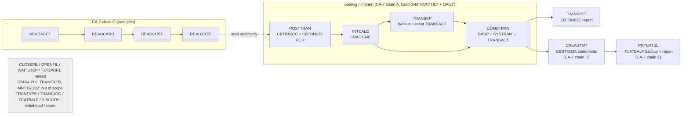

# Batch scheduling — legacy jobs and their Java mapping

Status: complete for every scheduler job (step s4.6). Started as a stub with the reporting/housekeeping port (s4.4);
decision `d-scheduler` (one Spring Batch flow job with in-app cron) is recorded in
[ADR-0016](adr/ADR-0016-nightly-cycle-flow-job.md). Legacy schedules: `app/scheduler/CardDemo.controlm` (Control-M
folders) and `app/scheduler/CardDemo.ca7` (CA-7 `LJOB` listing); see also `02-dependency-map.md` §4d (scheduler edges).

## 1. The legacy schedules

### 1a. Control-M (`CardDemo.controlm`)

Five folders, 14 job definitions (9 distinct jobs). Every job has `TIMETO="23:00"`, `MAXWAIT="7"`, `MAXRERUN="5"`,
all twelve months; conditions are `ODATE="ODAT"` (same order date). `+` adds a condition, `-` deletes one.

| Folder (type) | Calendar | Job | In-condition (predecessor) | Out-conditions |
|---|---|---|---|---|
| `DAILY-TransactionBackup` (folder) | `DAYS="ALL"`: every day | `CLOSEFIL` | — | `+DAILY-TransactionBackup-CLOSEFIL` |
| | every day | `TRANBKP` | `DAILY-TransactionBackup-CLOSEFIL` | `-…-CLOSEFIL`, `+…-TRANBKP` |
| | every day | `WAITSTEP` | `DAILY-TransactionBackup-TRANBKP` | `-…-TRANBKP`, `+…-WAITSTEP` |
| | every day | `OPENFIL` | `DAILY-TransactionBackup-WAITSTEP` | `-…-WAITSTEP` |
| `WEEKLY-TransactionTypesDBRefresh` (folder) | no `DAYS`: ordered on demand / by the smart folder below | `MNTTRDB2` | — | `+WEEKLY-TransactionTypesDBRefresh-MNTTRDB2` |
| `WEEKLY-DisclosureGroupsRefresh` (smart folder, `DAYS="SA"`, `SHIFT="Ignore Job"`) | Saturdays | `CLOSEFIL` | `WEEKLY-TransactionTypesDBRefresh-MNTTRDB2` | `+WEEKLY-DisclosureGroupsRefresh-CLOSEFIL` |
| | Saturdays | `DISCGRP` | `WEEKLY-DisclosureGroupsRefresh-CLOSEFIL` | `-…-CLOSEFIL`, `+…-DISCGRP` |
| | Saturdays | `WAITSTEP` | `WEEKLY-DisclosureGroupsRefresh-DISCGRP` | `-…-DISCGRP`, `+…-WAITSTEP` |
| | Saturdays | `OPENFIL` | `WEEKLY-DisclosureGroupsRefresh-WAITSTEP` | `-…-WAITSTEP` |
| `WEEKLY-TransactionTypesDBRefresh` (smart folder, `DAYS="SA"`) | Saturdays | `TRANEXTR` | `WEEKLY-TransactionTypesDBRefresh-MNTTRDB2` | — |
| `MONTHLY-InterestCalculation` (folder) | no `DAYS` in the definition: ordered by the monthly cycle (the folder name; no rule-based calendar is attached, `RULE_BASED_CALENDARS NAME="*"`) | `CLOSEFIL` | — | `+MONTHLY-InterestCalculation-CLOSEFIL` |
| | monthly | `INTCALC` | `MONTHLY-InterestCalculation-CLOSEFIL` | `-…-CLOSEFIL`, `+…-INTCALC` |
| | monthly | `COMBTRAN` | `MONTHLY-InterestCalculation-INTCALC` | `-…-INTCALC`, `+…-COMBTRAN` |
| | monthly | `WAITSTEP` | `MONTHLY-InterestCalculation-COMBTRAN` | `-…-COMBTRAN`, `+…-WAITSTEP` |
| | monthly | `OPENFIL` | `MONTHLY-InterestCalculation-WAITSTEP` | `-…-WAITSTEP` |

A Control-M job only adds its out-condition when it ends OK. The definitions carry no `ON`/`DO` statements, so
the Java flow uses the JCL convention of the harness for "ended OK": no abend and RC ≤ 4 (§2).

### 1b. CA-7 (`CardDemo.ca7`)

30 `LJOB` sections, 17 distinct jobs; every job is `SCHED DSNBR *NONE*` (no date schedule of its own) and is started
by a completion trigger (`COMP TRIGGERS OTHER JOBS`) of its predecessor, `QTM=0100` (one hour queue time),
`LEADTM=0000`, `DONT SCHEDULE BEFORE 03237`; a completion trigger fires on normal completion of the predecessor.
`SCHID` selects the schedule-ID variant of the triggered job: in this listing 030 is used for the chains below,
031/032 for the `CLOSEFIL1`/`CLOSEFIL2` legs of chain B and for the PRTCATBL leg (chain E). The listing is the concatenation of five trigger chains, each bracketed by the CICS file
protocol:

| Chain | Trigger sequence (SCHID) |
|---|---|
| A — posting | `CLOSEFIL` → `CBPAUP0J` → `POSTTRAN` → `WAITSTEP` → `OPENFIL` (030) |
| B — reference refresh | `CLOSEFIL` → `TRANTYPE` → `WAITSTEP` → { `CLOSEFIL1` (031) → `TRANCATG` → `WAITSTEP` ; `CLOSEFIL2` (032) → `TCATBALF` → `WAITSTEP` } → `CLOSEFIL` (030) |
| C — print jobs | `CLOSEFIL` → `READACCT` → `READCARD` → `READCUST` → `READXREF` → `WAITSTEP` → `OPENFIL` (030) |
| D — statements | `CLOSEFIL` → `CREASTMT` → `TXT2PDF1` → `WAITSTEP` → `OPENFIL` (030) |
| E — category balance report | `OPENFIL` (030) → `CLOSEFIL` (031) → `PRTCATBL` → `WAITSTEP` → `OPENFIL` (031) |

### 1c. Every scheduler job

| Job | Scheduler(s) | Trigger / calendar | Predecessors (conditions) | Java world |
|---|---|---|---|---|
| `CLOSEFIL` (also `CLOSEFIL1`, `CLOSEFIL2`) | Control-M (daily, weekly, monthly), CA-7 (head of every chain) | daily 23:00 window / Saturday / monthly; CA-7 trigger | none, or the previous chain (CA-7 `WAITSTEP`/`OPENFIL`), `WEEKLY-…-MNTTRDB2` | **Retired** (§3) |
| `OPENFIL` | Control-M, CA-7 | end of each chain | `WAITSTEP` | **Retired** (§3) |
| `WAITSTEP` | Control-M, CA-7 | after each business job | the business job | **Retired** (§3) |
| `CBPAUP0J` | CA-7 chain A | trigger | `CLOSEFIL` | **Out of scope** (IMS/DB2/MQ authorization extension `app/app-authorization-ims-db2-mq`, `d-scope`: core app only); its CA-7 edge collapses to `POSTTRAN` having no predecessor |
| `POSTTRAN` | CA-7 chain A | trigger, nightly | `CBPAUP0J` (→ `CLOSEFIL`) | `nightly-cycle` member `POSTTRAN` → stream `posttran` (STEP15 `cbtrn02c`); CBTRN01C (`STEP10`) is the baseline's separate validation job, run as the stream's first step |
| `INTCALC` | Control-M `MONTHLY-InterestCalculation` | monthly | `MONTHLY-…-CLOSEFIL` | member `INTCALC` → stream `intcalc` (PARM date = run date; golden: `2022071800`), `COND=(4,LT,POSTTRAN)` |
| `COMBTRAN` | Control-M monthly | monthly | `MONTHLY-…-INTCALC` | member `COMBTRAN` → stream `combtran`, `COND=((4,LT,TRANBKP),(4,LT,INTCALC))` |
| `TRANBKP` | Control-M `DAILY-TransactionBackup` | daily | `DAILY-…-CLOSEFIL` | member `TRANBKP` → stream `tranbkp`, `COND=(4,LT,INTCALC)` (baseline order: after INTCALC, before COMBTRAN, which reads `TRANSACT.BKUP(0)`) |
| `TRANREPT` | baseline only (no scheduler entry) | — | — | member `TRANREPT` → stream `tranrept`, `COND=(4,LT,COMBTRAN)` |
| `CREASTMT` | CA-7 chain D | trigger | `CLOSEFIL` | member `CREASTMT` → stream `creastmt`, `COND=(4,LT,COMBTRAN)` |
| `TXT2PDF1` | CA-7 chain D | trigger | `CREASTMT` | **Retired**: REXX `TXT2PDF` turns `STATEMNT.PS` into a PDF; the Java port already writes `STATEMNT.HTML` and the dated `STATEMNT.PS` generation, and PDF rendering is a presentation concern for the web UI (`d-ui`), not a batch job. Not in the baseline (no COBOL). |
| `PRTCATBL` | CA-7 chain E | trigger | `CLOSEFIL` (031, after chain D) | member `PRTCATBL` → stream `prtcatbl`, `COND=(4,LT,CREASTMT)` |
| `READACCT`, `READCARD`, `READCUST`, `READXREF` | CA-7 chain C | trigger, in this order | `CLOSEFIL`, then each other | members of the same names → print jobs `readacct` … `readxref`, each `COND=(4,LT,<previous>)`; independent of the posting branch |
| `TRANTYPE`, `TRANCATG`, `TCATBALF` | CA-7 chain B | trigger | `CLOSEFIL`/`CLOSEFIL1`/`CLOSEFIL2` | **Not nightly in Java**: reference-data (re)loads = IDCAMS DEFINE + REPRO of the sample; covered by `initial-load` (REPLACE/UPSERT, `--job=initial-load`) and `--job=repro --DATASET=<ds>` on demand |
| `DISCGRP` | Control-M `WEEKLY-DisclosureGroupsRefresh` | Saturdays | `WEEKLY-…-CLOSEFIL` (← `MNTTRDB2`) | **Not nightly in Java**: same as above (`--job=repro --DATASET=DISCGRP` or `initial-load`); runnable on a weekly cron by an operator, no flow job needed |
| `MNTTRDB2` | Control-M `WEEKLY-TransactionTypesDBRefresh` | Saturdays (on demand) | — | **Out of scope (Db2 extension)** (`app/app-transaction-type-db2`) |
| `TRANEXTR` | Control-M weekly smart folder | Saturdays | `WEEKLY-…-MNTTRDB2` | **Out of scope (Db2 extension)** |

Baseline-only jobs that no scheduler runs (dataset definition/loading, utilities): `ACCTFILE`, `CARDFILE`,
`CUSTFILE`, `XREFFILE`, `TRANFILE`, `DUSRSECJ` → `initial-load`; `CBEXPORT`/`CBIMPORT` → `cbexport`/`cbimport`
(on demand); `CSUTLDTC` → `com.carddemo.common.date`; `WAITSTEP` → retired.

## 2. The Java world: `nightly-cycle`

`com.carddemo.batch.scheduler`. One Spring Batch job, `nightly-cycle`, with one step per member, in the GnuCOBOL
baseline run order (`docs/validation/baseline/00-ORDER.md`, `scripts/baseline/run_baseline.sh`) restricted to the
in-scope scheduled jobs:

Solid arrows are `COND` dependencies; steps run strictly in the order listed (one at a time, as in the baseline).

| # | Member (step) | Implementation (`--job=`) | Predecessors → `COND` | After-images (`--AFTER-IMAGES=`) |
|---|---|---|---|---|
| 1 | `READACCT` | `readacct` | — | — |
| 2 | `READCARD` | `readcard` | `(4,LT,READACCT)` | — |
| 3 | `READCUST` | `readcust` | `(4,LT,READCARD)` | — |
| 4 | `READXREF` | `readxref` | `(4,LT,READCUST)` | — |
| 5 | `POSTTRAN` | stream `posttran` | — | TRANSACT, ACCTDATA, TCATBALF |
| 6 | `INTCALC` | stream `intcalc` | `(4,LT,POSTTRAN)` | ACCTDATA, TCATBALF |
| 7 | `TRANBKP` | stream `tranbkp` | `(4,LT,INTCALC)` | TRANSACT |
| 8 | `COMBTRAN` | stream `combtran` | `((4,LT,TRANBKP),(4,LT,INTCALC))` | TRANSACT |
| 9 | `TRANREPT` | stream `tranrept` | `(4,LT,COMBTRAN)` | TRANSACT |
| 10 | `CREASTMT` | stream `creastmt` | `(4,LT,COMBTRAN)` | — |
| 11 | `PRTCATBL` | stream `prtcatbl` | `(4,LT,CREASTMT)` | — |

Semantics (`NightlyCycleJobConfiguration`):

- **Scheduler condition → `COND`.** A Control-M in-condition / CA-7 completion trigger means "the predecessor ended
  OK". The member runs only when every predecessor ran, ended with RC ≤ 4 and did not abend: `COND=(4,LT,<pred>)`
  evaluated by `JclCond` (the s4.1 harness), so POSTTRAN's RC 4 (rejects written) does not stop INTCALC, an RC 8+
  or an abend does. A member whose predecessor was bypassed is bypassed too (exit code `BYPASSED` in `batch_run`).
  Members without predecessors (the head of each CA-7 chain) always run, so a failure in one branch does not stop
  an independent branch (the print jobs vs posting).
- **Inside a member** the stream keeps its own JCL `COND`s (`JobStream`/`JobChain`, ADR-0015).
- **RC.** Member step RC = MAXCC of its stream; `nightly-cycle` RC = highest member RC (JCL MAXCC), which is also
  the CLI exit code. On the sample data: 4 (POSTTRAN).
- **`batch_run`.** One row for the cycle (`job_name = 'nightly-cycle'`, RC = MAXCC), one per member step (exit code
  `COMPLETED`/`ABEND`/`BYPASSED`, RC, and the read/write/skip/filter counts summed over the member's child jobs),
  and the child jobs' own job/step rows as if run from the CLI, tagged `cycle.member=<MEMBER>` (identifying) and
  `cycle.execution-id=<cycle job execution id>` in `parameters`.
- **One cycle at a time.** `CycleLock` takes a PostgreSQL advisory lock on a dedicated connection when the job
  starts and releases it when it ends; a second cycle (manual CLI during the cron run, or another instance's cron)
  fails before any member runs (RC 12, `batch_run` row, no member rows).
- **After-images.** A requested `--AFTER-IMAGES` snapshot that cannot be written raises the member RC to at least 8.
- **No restart.** `preventRestart()`: posting jobs refuse restarts (PR #63); a failed night is repaired by re-running
  the failing stream (and its successors) individually with `--job=<stream>`.
- **Parameters.** All cycle parameters reach every member; `--<MEMBER>.<name>=` only reaches that member as
  `<name>` (e.g. `--POSTTRAN.STEP15.SYSOUT=…`, `--INTCALC.DISCGRP=<file>`), so file-mode DDs can be routed per job.
- **Generations.** Each stream writes new dated generations (ADR-0012); a downstream member resolves `(0)` from
  `batch_output_file`, i.e. the generation the upstream member just wrote (COMBTRAN ← TRANBKP's `TRANSACT.BKUP`,
  INTCALC's `SYSTRAN`).

### Triggers

| How | Command / config | Notes |
|---|---|---|
| In-app cron | `carddemo.batch.scheduler.enabled` (`CARDDEMO_SCHEDULER_ENABLED`, default `true`) and `carddemo.batch.scheduler.nightly-cycle.cron` (`CARDDEMO_NIGHTLY_CYCLE_CRON`, default `0 0 22 * * *`, zone `carddemo.clock.zone`) in `application.yml` | `NightlyCycleTrigger` (`@Scheduled`), registered by `NightlyCycleScheduling` only in the web application with the flag on; `run-date` = today on the injected clock (ADR-0014); a fire is skipped while another `nightly-cycle` execution is running. 22:00 puts the cycle inside the legacy window (Control-M `TIMETO="23:00"`). |
| Disabled | `application-test.yml`, `application-golden.yml`: `carddemo.batch.scheduler.enabled: false`; CLI launches are not web applications | no cron fire in tests or CI |
| Manual | `java -jar carddemo-app.jar --job=nightly-cycle --run-date=YYYY-MM-DD [--<MEMBER>.<DD>=…]` | exit code = cycle RC |
| Weekly / monthly cadence | — | The monthly INTCALC/COMBTRAN and daily TRANBKP folders run every night in the cycle, as in the baseline (which runs them all on one business date); interest on a non-cycle day is governed by CBACT04C's PARM date, not by the scheduler. A calendar split (e.g. INTCALC only on the last business day) is a cron/flow change, not a code change. |

### Evidence (gate g-batch)

`scripts/batch/run_nightly_cycle.sh file|table <out-dir>` (`make nightly-cycle`, part of `make batch-equivalence`
and the CI job `batch-equivalence`) loads the sample data with `initial-load`, launches `--job=nightly-cycle` once,
and compares every output of every member with `docs/validation/baseline/<JOB>/` using the existing compare
scripts; the job × mode × result matrix is in `build/batch-equivalence/nightly-cycle-{file,table}/REPORT.md` and
`nightly-cycle-matrix/REPORT.md`. Unlike the per-job scripts, which start each job from the baseline's
after-images of the job before it, every job here reads the previous Java job's output. The only chained-run-only
difference is `scripts/batch/nightly-cycle-table-expected-diffs/intcalc.txt` (ACCTDATA record 49 ZIP from the
EBCDIC sample, carried from POSTTRAN into INTCALC's after-image; the same root cause as the POSTTRAN table-mode
entry). File mode has none.

## 3. Ported streams (s4.2–s4.5)

| Legacy job | Java stream (`--job=`) | Steps (Java jobs) | Notes |
|---|---|---|---|
| POSTTRAN | `posttran` | `STEP15` `cbtrn02c` | rules `rules/CBTRN02C.md` |
| INTCALC | `intcalc` | `STEP15` `cbact04c` | rules `rules/CBACT04C.md` |
| TRANBKP | `tranbkp` | `STEP05R` `reproc`, `STEP05` `idcams-delete`, `STEP10` `idcams-define` | TRANSACT → dated `TRANSACT.BKUP`, then the table is emptied (DELETE/DEFINE CLUSTER = reset of the `transaction` table) |
| COMBTRAN | `combtran` | `STEP05R` `combtran-sort`, `STEP10` `idcams-repro` | `TRANSACT.BKUP(0)` + `SYSTRAN(0)` sorted on TRAN-ID → dated `TRANSACT.COMBINED`, loaded into `transaction` (duplicate key → RC 12, nothing loaded) |
| TRANREPT | `tranrept` | `STEP05` `reproc`, `STEP10` `tranrept-sort`, `STEP15` `cbtrn03c` (JCL `STEP05R` ×2, `STEP10R`) | dated backup, DATEPARM window extract of that backup → `TRANSACT.DALY`, report → `TRANREPT`; rules `rules/CBTRN03C.md` |
| CREASTMT | `creastmt` | `STEP010` `creastmt-sort`, `STEP020` `trxfl-repro`, `STEP040` `cbstm03a` | `DELDEF01` (DELETE/DEFINE TRXFL) and `STEP030` (IEFBR14 delete of the statements) are not needed: TRXFL.SEQ, TRXFL, STATEMNT.PS and STATEMNT.HTML are new dated generations. TRANSACT sorted by card + TRAN-ID with OUTREC → `TRXFL.SEQ`, loaded (key check) → `TRXFL`, statements → `STATEMNT.PS` (80) / `STATEMNT.HTML` (100); rules `rules/CBSTM03A.md`, `rules/CBSTM03B.md` |
| PRTCATBL | `prtcatbl` | `STEP05R` `reproc`, `STEP10R` `prtcatbl-sort` | `DELDEF` (IEFBR14 delete of `TCATBALF.REPT`) is not needed: every output is a new dated generation. TCATBALF → dated `TCATBALF.BKUP`; DFSORT `SORT` + `OUTREC` → dated `TCATBALF.REPT` (41-byte records as in the baseline, although the JCL says LRECL 40) |

The baseline order is `POSTTRAN → INTCALC → TRANBKP → COMBTRAN → TRANREPT → CREASTMT → PRTCATBL`
(`docs/validation/baseline/00-ORDER.md`); `nightly-cycle` (§2) runs them in that order after the print jobs.

Generations: a step that reads what an earlier step of the same stream wrote (COMBTRAN `STEP10`, TRANREPT `STEP10`
and `STEP15`, CREASTMT `STEP020` and `STEP040`, PRTCATBL `STEP10R`) is bound to that step's file (`SequentialDatasets.bind`), not to a `(0)` lookup,
which ranks generations by business date and could return another run's output after a backdated run. Inputs
produced by a different stream (COMBTRAN's `TRANSACT.BKUP(0)` from TRANBKP and `SYSTRAN(0)` from INTCALC) stay
`(0)` lookups, as in the JCL.

## 4. Retired jobs (no PostgreSQL equivalent)

| Legacy job | What it does | Java |
|---|---|---|
| `CLOSEFIL` | SDSF `/F CICSAWSA,'CEMT SET FIL(…) CLO'` for TRANSACT, CCXREF, ACCTDAT, CXACAIX, USRSEC: closes the VSAM files in the CICS region so batch can open them for update | **Retired.** The online app and batch share PostgreSQL; there is no file ownership to hand over. Concurrency is handled by transactions and the `version` columns (optimistic locking) on the online tables. |
| `OPENFIL` | `CEMT SET FIL(…) OPE` for the same files after the batch window: gives them back to CICS | **Retired**, same reason. |
| `TXT2PDF1` | TSO REXX `TXT2PDF` (`IKJEFT1B`) converts `STATEMNT.PS` to `STATEMNT.PS.PDF` after CREASTMT (CA-7 chain D) | **Retired.** No COBOL, not in the baseline; the Java statements are already HTML (`STATEMNT.HTML`) and dated text generations. PDF output, if wanted, belongs to the web UI. |
| `WAITSTEP` | `COBSWAIT` (calls `MVSWAIT`) sleeps for the SYSIN value, 3600 centiseconds (36 s), between the CLOSEFIL/OPENFIL steps and the batch jobs in the CA-7 chain | **Retired.** It only lets CICS finish closing files; the flow job sequences steps by completion. If a delay is ever needed it is a scheduler setting, not a job. |

CA-7 dependencies that point at these jobs (e.g. `POSTTRAN → WAITSTEP → OPENFIL`) collapse to direct step-to-step
dependencies in the flow job (§2).
