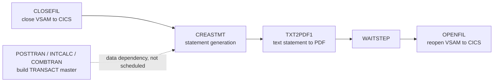
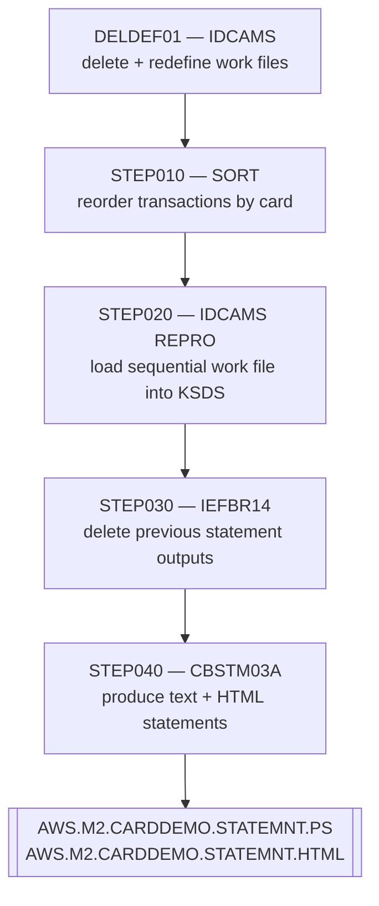
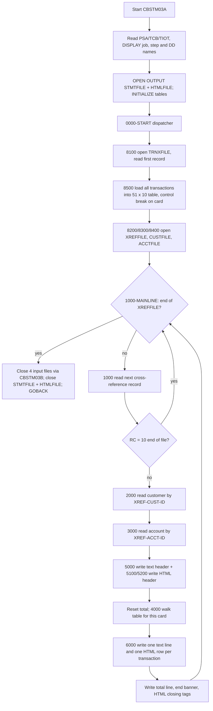

# Business Specification — Account Statement Generation (job `CREASTMT`, programs `CBSTM03A` / `CBSTM03B`)

Status: **DRAFT — awaiting human approval.** Input document for a future COBOL → Java migration. No code changes are proposed here.

Sources read in full for this document:

| Artifact | Path |
| --- | --- |
| Driver program | `app/cbl/CBSTM03A.CBL` (924 lines) |
| File-handling subprogram | `app/cbl/CBSTM03B.CBL` (230 lines) |
| Job control | `app/jcl/CREASTMT.JCL` (97 lines) |
| Downstream job | `app/jcl/TXT2PDF1.JCL` |
| Reporting transaction layout | `app/cpy/COSTM01.CPY` |
| Card cross-reference layout | `app/cpy/CVACT03Y.cpy` |
| Customer layout | `app/cpy/CUSTREC.cpy` |
| Account layout | `app/cpy/CVACT01Y.cpy` |
| Transaction master layout (SORT input) | `app/cpy/CVTRA05Y.cpy` |
| Schedulers / drivers | `app/scheduler/CardDemo.ca7`, `app/scheduler/CardDemo.controlm`, `scripts/run_full_batch.sh` |
| Reference data used for volumetrics | `app/data/ASCII/cardxref.txt`, `app/data/ASCII/dailytran.txt` |

Every rule below cites the file and line(s) it is derived from. Anything ambiguous, dead, unimplemented or defective is called out explicitly in sections 8, 9 and 10 rather than smoothed over.

Note on file names: the JCL member is `CREASTMT.JCL` and the programs are `CBSTM03A.CBL` / `CBSTM03B.CBL` (upper-case extensions in this repo).

---

## 1. Purpose and position in the batch flow

### 1.1 Business purpose

`CREASTMT` produces the **customer-facing account statement** for every credit card carried on the card cross-reference file, in two renditions from a single pass:

1. a **fixed-width plain-text statement** (80 characters per line) intended for print / PDF conversion (`CREASTMT.JCL:87-91`, `CBSTM03A.CBL:44-45`);
2. an **HTML statement** (100 characters per line) intended for electronic delivery (`CREASTMT.JCL:92-96`, `CBSTM03A.CBL:46-47`).

Each statement presents the cardholder's name and address, three "basic details" (account id, current balance, FICO score), and a line-item transaction summary with a total (`CBSTM03A.CBL:85-146`). The JCL states the intent as "create statement for each CARD present in the XREF file" (`CREASTMT.JCL:19-20`), and that is literally what the code does — see the **statement granularity** finding in section 5.1.

The program header also states an explicit secondary purpose: the program is a deliberate showcase of modernization-hostile constructs — z/OS control-block addressing, `ALTER`/`GO TO`, `COMP`/`COMP-3`, a two-dimensional table and a called subroutine (`CBSTM03A.CBL:26-35`). That matters for migration: several constructs exist to be exercised, not because the business needs them.

### 1.2 Where the job sits

**CA-7** (`app/scheduler/CardDemo.ca7`) is the only scheduler that knows this job. The chain is:

`CLOSEFIL` → **`CREASTMT`** → `TXT2PDF1` → `WAITSTEP` → `OPENFIL`

- `CLOSEFIL` (SCHID 030) triggers `CREASTMT` (`CardDemo.ca7:465-468`).
- `CREASTMT` is defined with JCL member `CREASTMT`, system `CARDDEMO`, 5 steps (`CardDemo.ca7:470-476`).
- On completion `CREASTMT` triggers `TXT2PDF1` (`CardDemo.ca7:495-497`), which converts `AWS.M2.CARDDEMO.STATEMNT.PS` into `AWS.M2.CARDDEMO.STATEMNT.PS.PDF` via the TXT2PDF REXX utility (`TXT2PDF1.JCL:33,38-39`).
- `TXT2PDF1` triggers `WAITSTEP` then `OPENFIL` (`CardDemo.ca7:522-529`), which returns the VSAM files to CICS.

Business ordering implied: the VSAM files must be **closed to CICS** before the batch job opens them, and reopened afterwards; the PDF rendition is a *separate* downstream job, not part of `CREASTMT`.

**Control-M** (`app/scheduler/CardDemo.controlm`): `CREASTMT`, `CBSTM03A` and `TXT2PDF1` do **not** appear anywhere (0 occurrences). *Flagged as a scheduling-inventory gap (G1).*

**Shell driver** `scripts/run_full_batch.sh`: `CREASTMT` is **not** submitted (jobs 1–16 cover data refresh, `POSTTRAN`, `INTCALC`, `TRANBKP`, `COMBTRAN`, `TRANIDX`, `OPENFIL`). Statement generation is therefore absent from the scripted end-to-end run. *Flagged as G1.*

**Data dependency (not expressed as a scheduling dependency):** the job sorts `AWS.M2.CARDDEMO.TRANSACT.VSAM.KSDS` (`CREASTMT.JCL:45`), which is the transaction master produced by `POSTTRAN` and enriched by `INTCALC` + `COMBTRAN`. For statements to include interest and daily transactions, `CREASTMT` must run **after** `COMBTRAN`; nothing in CA-7 enforces that ordering. *Flagged as G2.*



---

## 2. The job step by step

`CREASTMT` is a five-step job (CA-7 records `STP 005`, `CardDemo.ca7:476`). Steps 2–5 carry `COND=(0,NE)`, i.e. **run only if every preceding step ended with return code 0** — any failure stops the rest of the job.



### 2.1 `DELDEF01` — IDCAMS delete / define (`CREASTMT.JCL:22-40`)

| Item | Value |
| --- | --- |
| Program | `IDCAMS` |
| Condition | none — always runs, first step |
| Deletes | `AWS.M2.CARDDEMO.TRXFL.SEQ`; `AWS.M2.CARDDEMO.TRXFL.VSAM.KSDS` (CLUSTER) |
| `SET MAXCC = 0` | Suppresses the non-zero condition code produced when the datasets do not yet exist (`jcl:28`) — makes the step safe on a first run and on re-runs |
| Defines | Cluster `AWS.M2.CARDDEMO.TRXFL.VSAM.KSDS`, `KEYS(32 0)`, `RECORDSIZE(350 350)`, `INDEXED`, `SHAREOPTIONS(2 3)`, `ERASE`, `CYL(1 5)`, volume `TSU023`; data component `...TRXFL.DATA` `CISZ(4096)`; index component `...TRXFL.INDEX` |

**Business meaning:** each run starts from a clean, empty *work* copy of the transaction file. The key is **32 bytes at offset 0** — card number (16) + transaction id (16) — which is the grouping the statement program depends on. `ERASE` means the data component is physically overwritten on delete (cardholder data hygiene).

### 2.2 `STEP010` — SORT (`CREASTMT.JCL:44-55`)

| DD | Dataset | DISP | Organisation |
| --- | --- | --- | --- |
| `SORTIN` | `AWS.M2.CARDDEMO.TRANSACT.VSAM.KSDS` | `SHR` | VSAM KSDS (transaction master, 350-byte records) |
| `SORTOUT` | `AWS.M2.CARDDEMO.TRXFL.SEQ` | `(NEW,CATLG,DELETE)`, `UNIT=SYSDA`, `SPACE=(CYL,(1,1),RLSE)` | Sequential, `RECFM=FB`, `LRECL=350`, `BLKSIZE=3500` |
| `SYSPRINT`, `SYSOUT` | spool | | |

Control statements (`jcl:53-54`):

```
SORT   FIELDS=(263,16,CH,A,1,16,CH,A)
OUTREC FIELDS=(1:263,16, 17:1,262, 279:279,50)
```

**Sort keys** (positions relate to `CVTRA05Y` `TRAN-RECORD`):

| Order | Position / length | Field | Direction | Business purpose |
| --- | --- | --- | --- | --- |
| 1 | 263,16 | `TRAN-CARD-NUM` | ascending | Groups every transaction of one card together |
| 2 | 1,16 | `TRAN-ID` | ascending | Deterministic line ordering within a card |

**Reformat (`OUTREC`)** — this converts the transaction master layout (`CVTRA05Y`) into the reporting layout (`COSTM01`), i.e. it **moves the card number to the front so it can become the leading part of the key**:

| Output positions | Source positions | Content | `COSTM01` field |
| --- | --- | --- | --- |
| 1–16 | 263–278 | Card number | `TRNX-CARD-NUM` |
| 17–32 | 1–16 | Transaction id | `TRNX-ID` |
| 33–278 | 17–262 | Type, category, source, description, amount, merchant id/name/city/zip | `TRNX-TYPE-CD` … `TRNX-MERCHANT-ZIP` |
| 279–304 | 279–304 | Original timestamp | `TRNX-ORIG-TS` |
| 305–328 | 305–328 | **First 24 bytes only** of the processing timestamp | first 24 bytes of `TRNX-PROC-TS` (26) |
| 329–350 | — | not produced by `OUTREC` | last 2 bytes of `TRNX-PROC-TS` + `FILLER X(20)` |

**Business outcome:** a card-ordered, statement-ready copy of the transaction master. Note the reformatted record is **328 bytes** while the `SORTOUT` DCB and the target cluster both declare **350** — see defect D1 (section 9). Neither `TRNX-PROC-TS` (fully) nor the trailing filler is used by `CBSTM03A`, so the truncation has no visible effect today.

### 2.3 `STEP020` — IDCAMS `REPRO` (`CREASTMT.JCL:56-62`)

| DD | Dataset | DISP | Role |
| --- | --- | --- | --- |
| `INFILE` | `AWS.M2.CARDDEMO.TRXFL.SEQ` | `SHR` | Sorted sequential work file from `STEP010` |
| `OUTFILE` | `AWS.M2.CARDDEMO.TRXFL.VSAM.KSDS` | `SHR` | Empty KSDS defined in `DELDEF01` |
| `SYSIN` | `REPRO INFILE(INFILE) OUTFILE(OUTFILE)` | | Copy every record |

**Business meaning:** load the card-ordered transactions into an indexed file. The program only ever reads this file **sequentially** (`CBSTM03B.CBL:31-35`), so the KSDS is not strictly required — but making it indexed on card+transaction-id guarantees the ascending card order the in-memory grouping logic assumes, and rejects duplicate card+transaction-id pairs at load time (an implicit uniqueness control).

### 2.4 `STEP030` — IEFBR14 allocation/deletion (`CREASTMT.JCL:66-75`)

| DD | Dataset | DISP | DCB |
| --- | --- | --- | --- |
| `HTMLFILE` | `AWS.M2.CARDDEMO.STATEMNT.HTML` | `(MOD,DELETE,DELETE)` | `LRECL=80, BLKSIZE=3200, RECFM=FB` |
| `STMTFILE` | `AWS.M2.CARDDEMO.STATEMNT.PS` | `(MOD,DELETE,DELETE)` | `LRECL=80, BLKSIZE=8000, RECFM=FB` |

`IEFBR14` executes nothing; the *allocation* does the work. `DISP=(MOD,...)` creates the dataset if it does not exist and deletes it at step end, whether the step ends normally or abnormally — the standard "delete previous run's output" idiom. **Business meaning:** statements are fully replaced each run; there is no history and no accumulation.

Inconsistency: `HTMLFILE` is declared here with `LRECL=80` but is created with `LRECL=100` in `STEP040` (`jcl:94`). Harmless for a delete, but it is a latent trap if the DD is ever reused (defect D2).

### 2.5 `STEP040` — `CBSTM03A` execution (`CREASTMT.JCL:79-96`)

| DD | Dataset | DISP | Organisation / DCB | Direction |
| --- | --- | --- | --- | --- |
| `STEPLIB` | `AWS.M2.CARDDEMO.LOADLIB` | `SHR` | PDS load library (holds `CBSTM03A` and `CBSTM03B`) | — |
| `TRNXFILE` | `AWS.M2.CARDDEMO.TRXFL.VSAM.KSDS` | `SHR` | KSDS, key 32 bytes, 350-byte records | input, sequential |
| `XREFFILE` | `AWS.M2.CARDDEMO.CARDXREF.VSAM.KSDS` | `SHR` | KSDS, key `XREF-CARD-NUM` X(16), 50-byte records | input, sequential — **drives the job** |
| `ACCTFILE` | `AWS.M2.CARDDEMO.ACCTDATA.VSAM.KSDS` | `SHR` | KSDS, key `ACCT-ID` 9(11), 300-byte records | input, random by key |
| `CUSTFILE` | `AWS.M2.CARDDEMO.CUSTDATA.VSAM.KSDS` | `SHR` | KSDS, key `CUST-ID` X(09), 500-byte records | input, random by key |
| `STMTFILE` | `AWS.M2.CARDDEMO.STATEMNT.PS` | `(NEW,CATLG,DELETE)`, `UNIT=SYSDA`, `SPACE=(CYL,(1,1),RLSE)` | `RECFM=FB, LRECL=80, BLKSIZE=8000` | **output** — plain-text statements |
| `HTMLFILE` | `AWS.M2.CARDDEMO.STATEMNT.HTML` | `(NEW,CATLG,DELETE)`, `UNIT=SYSDA`, `SPACE=(CYL,(1,1),RLSE)` | `RECFM=FB, LRECL=100, BLKSIZE=800` | **output** — HTML statements |
| `SYSPRINT`, `SYSOUT` | `SYSOUT=*` | | spool | `DISPLAY` output |

`DISP=(NEW,CATLG,DELETE)` on both outputs means an abend leaves **no** statement datasets behind — the run is all-or-nothing from the consumer's point of view.

The `STMTFILE` DD card contains corrupted text: `// SPACE=(CYL,(1,1),RLSE), 00,RECFM=FB), ATA.VSAM.KSDS` (`jcl:90`). Everything after the blank following `RLSE),` falls in the JCL comment field, so the job still runs, but the member is clearly damaged (defect D3).

---

## 3. Program structure: `CBSTM03A` (driver) and `CBSTM03B` (file handler)

### 3.1 Roles

| Program | Role |
| --- | --- |
| `CBSTM03A` | **Driver.** Owns all business logic, statement formatting and the two output files, which it opens and writes with ordinary COBOL `WRITE` verbs (`CBSTM03A.CBL:39-47, 293, 339`). Owns no input file. |
| `CBSTM03B` | **File-handling subprogram.** Owns all four *input* VSAM files and performs every open, read and close on behalf of the driver (`CBSTM03B.CBL:31-53, 114-229`). Contains no business logic. |

### 3.2 How `CBSTM03B` is called

`CALL 'CBSTM03B' USING WS-M03B-AREA` — a **literal** program name, called at 14 sites in the driver (opens, reads, closes). Whether the call is resolved statically (link-edited into `CBSTM03A`) or dynamically at run time depends on the `DYNAM`/`NODYNAM` compile option, which is **not** visible in this repository; `STEPLIB` points at a single load library that would satisfy either (`jcl:80`). *To be confirmed with the build — see G3.* No `CANCEL` is ever issued, so `CBSTM03B` keeps its state (open file handles, file statuses) for the life of the job: it is a **stateful file-access service**, not a pure function.

### 3.3 The interface: `WS-M03B-AREA` / `LK-M03B-AREA` (1040 bytes)

Declared identically in both programs (`CBSTM03A.CBL:71-83`, `CBSTM03B.CBL:100-112`):

| Field | PIC | Length | Direction | Meaning |
| --- | --- | --- | --- | --- |
| `…-M03B-DD` | `X(08)` | 8 | in | Logical file to act on: `TRNXFILE`, `XREFFILE`, `CUSTFILE`, `ACCTFILE`. Any other value returns immediately without action (`CBSTM03B.CBL:127-128`) |
| `…-M03B-OPER` | `X(01)` | 1 | in | Operation: `O` open, `C` close, `R` read next, `K` read by key, `W` write, `Z` rewrite (`CBSTM03B.CBL:102-108`) |
| `…-M03B-RC` | `X(02)` | 2 | out | The COBOL **file status** of the operation, passed back verbatim |
| `…-M03B-KEY` | `X(25)` | 25 | in | Key value for `K` operations, left-justified |
| `…-M03B-KEY-LN` | `S9(4)` (DISPLAY) | 4 | in | Significant length of the key; used as `LK-M03B-KEY (1:LK-M03B-KEY-LN)` (`CBSTM03B.CBL:189, 214`) |
| `…-M03B-FLDT` | `X(1000)` | 1000 | out | The record image returned by a read (`READ … INTO`) |

Operation support is **not uniform** — the subprogram implements only what each file needs:

| Logical file | `O` open | `R` read next | `K` read by key | `C` close | `W` write | `Z` rewrite |
| --- | --- | --- | --- | --- | --- | --- |
| `TRNXFILE` | yes (`INPUT`) | yes | **no** | yes | no | no |
| `XREFFILE` | yes (`INPUT`) | yes | **no** | yes | no | no |
| `CUSTFILE` | yes (`INPUT`) | **no** | yes | yes | no | no |
| `ACCTFILE` | yes (`INPUT`) | **no** | yes | yes | no | no |

`W` and `Z` are declared in the interface but implemented nowhere: **dead interface options** (D4). An unsupported request falls straight through to the paragraph's exit, which moves the file's **last** status into `…-M03B-RC` (`CBSTM03B.CBL:151-152, 175-176, 200-201, 225-226`) — i.e. it silently returns a **stale success code** for an operation that never happened (D5).

### 3.4 Call sequence

```mermaid
sequenceDiagram
    participant JCL as CREASTMT STEP040
    participant A as CBSTM03A (driver)
    participant B as CBSTM03B (file handler)
    participant V as VSAM (TRNX / XREF / CUST / ACCT)
    JCL->>A: EXEC PGM=CBSTM03A
    A->>A: read TIOT control blocks, DISPLAY DD names
    A->>A: OPEN OUTPUT STMTFILE, HTMLFILE
    A->>B: DD=TRNXFILE OPER=O then repeated OPER=R
    B->>V: OPEN INPUT / READ NEXT
    B-->>A: record image + file status
    A->>A: load all transactions into 51 x 10 table (8500)
    A->>B: OPEN XREFFILE, CUSTFILE, ACCTFILE
    loop for each cross-reference record (one per card)
        A->>B: DD=XREFFILE OPER=R
        A->>B: DD=CUSTFILE OPER=K key=XREF-CUST-ID
        A->>B: DD=ACCTFILE OPER=K key=XREF-ACCT-ID
        A->>A: 5000 write statement header (text + HTML)
        A->>A: 4000 walk table, 6000 write each transaction line, accumulate total
        A->>A: write total + end-of-statement + HTML close tags
    end
    A->>B: CLOSE all four input files
    A->>A: CLOSE STMTFILE, HTMLFILE; GOBACK
```

### 3.5 The `ALTER` / `GO TO` dispatcher

Initialisation is driven by a state variable `WS-FL-DD` (`CBSTM03A.CBL:67`) and the `0000-START` `EVALUATE` (`CBSTM03A.CBL:296-314`). Each open paragraph sets the next state and jumps back to `0000-START`:

| State | Paragraph performed | Next state set |
| --- | --- | --- |
| `TRNXFILE` (initial) | `8100-TRNXFILE-OPEN` — open, read first record, seed counters (`cbl:730-762`) | `READTRNX` |
| `READTRNX` | `8500-READTRNX-READ` — load the whole file into the table (`cbl:818-853`) | `XREFFILE` (at `8599-EXIT`) |
| `XREFFILE` | `8200-XREFFILE-OPEN` (`cbl:765-781`) | `CUSTFILE` |
| `CUSTFILE` | `8300-CUSTFILE-OPEN` (`cbl:783-799`) | `ACCTFILE` |
| `ACCTFILE` | `8400-ACCTFILE-OPEN` (`cbl:801-816`) | falls through to `1000-MAINLINE` |
| anything else | `9999-GOBACK` | — |

The `ALTER 8100-FILE-OPEN TO PROCEED TO …` statements (`cbl:300-310`) rewrite the target of the `GO TO` inside `8100-FILE-OPEN` (`cbl:726-728`) at run time. Because every branch performs its own `ALTER` immediately before the `GO TO`, the behaviour is equivalent to a plain switch on `WS-FL-DD`; the statically coded `GO TO 8100-TRNXFILE-OPEN` at `cbl:727` is **always overwritten and therefore dead**. In Java this is simply a state machine / `switch`. `ALTER` is an obsolete element removed from later COBOL standards and is the single biggest readability trap in this program.

---

## 4. Inputs and outputs — record layouts

All layouts below are **USAGE DISPLAY** (zoned decimal). No copybook used by this job declares `COMP` or `COMP-3`; the only binary/packed items are working-storage counters inside `CBSTM03A` (section 7.1).

### 4.1 `TRNXFILE` — reporting transaction (`app/cpy/COSTM01.CPY`, 350 bytes, KSDS key = first 32 bytes)

| Field | PIC | Offset | Key | Business meaning | Used on the statement |
| --- | --- | --- | --- | --- | --- |
| `TRNX-CARD-NUM` | `X(16)` | 1–16 | key part 1 | Card the transaction belongs to | grouping only |
| `TRNX-ID` | `X(16)` | 17–32 | key part 2 | Transaction identifier | yes — "Tran ID" column |
| `TRNX-TYPE-CD` | `X(02)` | 33–34 | | Transaction type | no |
| `TRNX-CAT-CD` | `9(04)` | 35–38 | | Transaction category | no |
| `TRNX-SOURCE` | `X(10)` | 39–48 | | Origin (POS terminal, System, …) | no |
| `TRNX-DESC` | `X(100)` | 49–148 | | Description | yes — **truncated to 49 characters** |
| `TRNX-AMT` | `S9(09)V99` | 149–159 | | Transaction amount, signed zoned | yes — amount column and total |
| `TRNX-MERCHANT-ID` | `9(09)` | 160–168 | | Merchant id | no |
| `TRNX-MERCHANT-NAME` | `X(50)` | 169–218 | | Merchant name | no |
| `TRNX-MERCHANT-CITY` | `X(50)` | 219–268 | | Merchant city | no |
| `TRNX-MERCHANT-ZIP` | `X(10)` | 269–278 | | Merchant ZIP | no |
| `TRNX-ORIG-TS` | `X(26)` | 279–304 | | Original timestamp | no |
| `TRNX-PROC-TS` | `X(26)` | 305–330 | | Processing timestamp (only 24 bytes populated — section 2.2) | no |
| `FILLER` | `X(20)` | 331–350 | | Unused | no |

The statement shows **no date** for any transaction even though two timestamps are carried (defect D6).

### 4.2 `XREFFILE` — card cross-reference (`app/cpy/CVACT03Y.cpy`, 50 bytes, KSDS)

| Field | PIC | Key | Business meaning | Use here |
| --- | --- | --- | --- | --- |
| `XREF-CARD-NUM` | `X(16)` | primary key | Card number | Drives the run; matched against the transaction table |
| `XREF-CUST-ID` | `9(09)` | | Customer owning the card | Key into `CUSTFILE` (`cbl:372-374`) |
| `XREF-ACCT-ID` | `9(11)` | | Account the card belongs to | Key into `ACCTFILE` (`cbl:396-398`) |
| `FILLER` | `X(14)` | | Unused | |

Read **sequentially in card-number order** (`CBSTM03B.CBL:37-41`), so one statement is produced per cross-reference record. The card number itself is never printed on the statement (defect D7 — the reader cannot tell which card a statement is for).

### 4.3 `CUSTFILE` — customer (`app/cpy/CUSTREC.cpy`, 500 bytes, KSDS, key `CUST-ID`)

| Field | PIC | Business meaning | Used |
| --- | --- | --- | --- |
| `CUST-ID` | `9(09)` | Customer id (key) | lookup key |
| `CUST-FIRST-NAME` / `CUST-MIDDLE-NAME` / `CUST-LAST-NAME` | `X(25)` each | Name parts | yes — concatenated (`cbl:462-469`) |
| `CUST-ADDR-LINE-1` / `-2` / `-3` | `X(50)` each | Address lines | yes (`cbl:470-472`) |
| `CUST-ADDR-STATE-CD` | `X(02)` | State | yes — appended to line 3 |
| `CUST-ADDR-COUNTRY-CD` | `X(03)` | Country | yes — appended to line 3 |
| `CUST-ADDR-ZIP` | `X(10)` | ZIP | yes — appended to line 3 |
| `CUST-PHONE-NUM-1` / `-2` | `X(15)` each | Phones | no |
| `CUST-SSN` | `9(09)` | Social security number | no (correctly absent from the statement) |
| `CUST-GOVT-ISSUED-ID` | `X(20)` | Government id | no |
| `CUST-DOB-YYYYMMDD` | `X(10)` | Date of birth | no |
| `CUST-EFT-ACCOUNT-ID` | `X(10)` | EFT account | no |
| `CUST-PRI-CARD-HOLDER-IND` | `X(01)` | Primary cardholder indicator | **no** — not used to decide whom to bill (see section 5.1) |
| `CUST-FICO-CREDIT-SCORE` | `9(03)` | FICO score | yes — printed in "Basic Details" |
| `FILLER` | `X(168)` | Unused | |

Note the copybook is indented with tab characters from `CUST-FIRST-NAME` onwards (`CUSTREC.cpy:55-71`), unlike every other copybook in `app/cpy/`. It compiles, but any Java-side copybook parser must tolerate tabs (G4).

### 4.4 `ACCTFILE` — account master (`app/cpy/CVACT01Y.cpy`, 300 bytes, KSDS, key `ACCT-ID`)

| Field | PIC | Business meaning | Used |
| --- | --- | --- | --- |
| `ACCT-ID` | `9(11)` | Account id (key) | yes — printed |
| `ACCT-ACTIVE-STATUS` | `X(01)` | Active flag | **no** — statements are produced for closed accounts too (D8) |
| `ACCT-CURR-BAL` | `S9(10)V99` | Current balance | yes — printed (see D9, truncation) |
| `ACCT-CREDIT-LIMIT` | `S9(10)V99` | Credit limit | no |
| `ACCT-CASH-CREDIT-LIMIT` | `S9(10)V99` | Cash credit limit | no |
| `ACCT-OPEN-DATE` / `ACCT-EXPIRAION-DATE` / `ACCT-REISSUE-DATE` | `X(10)` each | Lifecycle dates (field name misspelled in source) | no |
| `ACCT-CURR-CYC-CREDIT` / `ACCT-CURR-CYC-DEBIT` | `S9(10)V99` each | Current-cycle credits / debits | **no** — the statement shows neither cycle total nor a statement period |
| `ACCT-ADDR-ZIP` | `X(10)` | Account ZIP | no (customer address is used instead) |
| `ACCT-GROUP-ID` | `X(10)` | Disclosure group | no |
| `FILLER` | `X(178)` | Unused | |

### 4.5 Output 1 — plain-text statement (`STMTFILE`, `RECFM=FB LRECL=80`)

Every line is a fixed 80-byte record built from `STATEMENT-LINES` (`CBSTM03A.CBL:85-146`). Widths add up to exactly 80 on every line.

| Line | Layout | Composition |
| --- | --- | --- |
| `ST-LINE0` | `X(31)` `*` + `X(18)` `START OF STATEMENT` + `X(31)` `*` | Start banner |
| `ST-LINE1` | `ST-NAME X(75)` + 5 spaces | `CUST-FIRST-NAME` + ` ` + `CUST-MIDDLE-NAME` + ` ` + `CUST-LAST-NAME` + ` `, each part `DELIMITED BY ' '` (i.e. trimmed at the first blank) |
| `ST-LINE2` | `ST-ADD1 X(50)` + 30 spaces | `CUST-ADDR-LINE-1` |
| `ST-LINE3` | `ST-ADD2 X(50)` + 30 spaces | `CUST-ADDR-LINE-2` |
| `ST-LINE4` | `ST-ADD3 X(80)` | `CUST-ADDR-LINE-3` + state + country + ZIP, each trimmed at the first blank and separated by one space |
| `ST-LINE5` | 80 × `-` | Rule |
| `ST-LINE6` | 33 spaces + `Basic Details` + 33 spaces | Section heading |
| `ST-LINE7` | `Account ID         :` + `ST-ACCT-ID X(20)` + 40 spaces | `ACCT-ID` moved to an alphanumeric field → **left-justified digits**, e.g. `00000000011         ` |
| `ST-LINE8` | `Current Balance    :` + `ST-CURR-BAL PIC 9(9).99-` + 47 spaces | Numeric-edited: 9 integer digits, decimal point, 2 decimals, trailing `-` for negatives |
| `ST-LINE9` | `FICO Score         :` + `ST-FICO-SCORE X(20)` + 40 spaces | `CUST-FICO-CREDIT-SCORE` as text, left-justified |
| `ST-LINE10` | 80 × `-` | Rule |
| `ST-LINE11` | 30 spaces + `TRANSACTION SUMMARY ` + 30 spaces | Section heading |
| `ST-LINE12` | 80 × `-` | Rule |
| `ST-LINE13` | `Tran ID         ` + `Tran Details    ` (padded to 51) + `  Tran Amount` | Column headings |
| `ST-LINE14` | `ST-TRANID X(16)` + space + `ST-TRANDT X(49)` + `$` + `ST-TRANAMT PIC Z(9).99-` | One per transaction; amount zero-suppressed with trailing minus |
| `ST-LINE14A` | `Total EXP:` + 56 spaces + `$` + `ST-TOTAL-TRAMT PIC Z(9).99-` | Statement total |
| `ST-LINE15` | 32 × `*` + `END OF STATEMENT` + 32 × `*` | End banner |

Write order per statement (`cbl:460`, `cbl:488-502`, `cbl:679`, `cbl:435-437`):

```
ST-LINE0
ST-LINE1  ST-LINE2  ST-LINE3  ST-LINE4
ST-LINE5  ST-LINE6  ST-LINE5
ST-LINE7  ST-LINE8  ST-LINE9
ST-LINE10 ST-LINE11 ST-LINE12 ST-LINE13 ST-LINE12
ST-LINE14  (repeated, one per transaction of this card)
ST-LINE12 ST-LINE14A ST-LINE15
```

All statements are written to **one** dataset, back to back, with no page control, no carriage-control channel and no page numbering. Pagination is entirely the downstream PDF utility's problem (`TXT2PDF1.JCL`).

### 4.6 Output 2 — HTML statement (`HTMLFILE`, `RECFM=FB LRECL=100`)

The HTML is emitted as one fixed 100-byte record per markup line. Two mechanisms are used:

1. **Constant lines** — a single `HTML-FIXED-LN PIC X(100)` with ~30 condition-names (`88` levels) carrying the literal markup; `SET HTML-Lxx TO TRUE` loads the literal, then `WRITE` emits it (`CBSTM03A.CBL:148-211`). In Java these become string constants or template fragments.
2. **Composed lines** — built with `STRING` into `HTML-L11`, `HTML-ADDR-LN`, `HTML-BSIC-LN`, `HTML-TRAN-LN` (`cbl:212-223`, `cbl:560-633`, `cbl:686-716`).

Document structure produced per card:

| Section | Markup | Source |
| --- | --- | --- |
| Document head | `<!DOCTYPE html>`, `<html lang="en">`, `<head>`, `<meta charset="utf-8">`, `<title>HTML Table Layout</title>`, `</head>`, `<body style="margin:0px;">`, `<table align="center" frame="box" style="width:70%; font:12px Segoe UI,sans-serif;">` | `cbl:508-523` |
| Title row | `<h3>Statement for Account Number: <ACCT-ID></h3>` on a dark-blue cell | `cbl:524-534` |
| Bank block | `Bank of XYZ`, `410 Terry Ave N`, `Seattle WA 99999` on an orange cell — **hard-coded issuer identity** | `cbl:535-548` |
| Customer block | name and three address lines as `<p>` elements on a grey cell | `cbl:549-552`, `cbl:560-592` |
| "Basic Details" banner | teal centred cell | `cbl:598-607` |
| Basic details | `Account ID`, `Current Balance`, `FICO Score` paragraphs | `cbl:613-633` |
| "Transaction Summary" banner | teal centred cell | `cbl:638-647` |
| Column header row | three cells at 25 % / 55 % / 20 % width: `Tran ID`, `Tran Details`, `Amount` | `cbl:648-669` |
| Transaction rows | one `<tr>` per transaction with the same three cells | `cbl:681-721` |
| Footer | `<h3>End of Statement</h3>`, `</td></tr></table></body></html>` | `cbl:439-454` |

Formatting mechanics worth carrying into the Java design:

- The `STRING … DELIMITED BY '*'` idiom (e.g. `cbl:614-618`) uses a delimiter that never occurs in the literal, i.e. it means "take the whole item". Where trailing blanks must be dropped, the delimiter is two spaces — `L23-NAME DELIMITED BY '  '` (`cbl:563`) — a hand-rolled right-trim.
- Values are inserted **without HTML escaping**. A customer name or merchant description containing `&`, `<` or `>` corrupts the output (defect D10).
- Records are fixed-length, so every emitted line is blank-padded to 100 bytes; a browser ignores the padding, but any Java writer must decide whether to keep or trim it (section 7.4).

---

## 5. Processing logic

### 5.1 Grouping / control-break model

There are **two** distinct grouping mechanisms, and only one of them is a classic control break:

**(a) Load phase — control break on card number while reading `TRNXFILE`** (`8500-READTRNX-READ`, `cbl:818-853`). The whole transaction file is read sequentially and pivoted into a two-dimensional in-memory table:

| Structure | Declaration | Capacity |
| --- | --- | --- |
| `WS-CARD-TBL` | `OCCURS 51 TIMES` (`cbl:226`) | **51 cards** |
| `WS-TRAN-TBL` within each card | `OCCURS 10 TIMES` (`cbl:228`) | **10 transactions per card** |
| `WS-TRCT (n)` | `OCCURS 51`, `S9(4) COMP` (`cbl:231-233`) | transaction count for card *n* |

Break rule (`cbl:819-825`): if the current record's `TRNX-CARD-NUM` equals `WS-SAVE-CARD`, increment the transaction counter; otherwise store the completed count into `WS-TRCT (CR-CNT)`, advance the card index and restart the transaction counter at 1. At end of file the final count is stored (`cbl:850`). The rule is valid **only because the file is in card order**, which is what `STEP010`/`STEP020` guarantee.

**(b) Statement phase — one statement per cross-reference record** (`1000-MAINLINE`, `cbl:316-329`). For each `XREFFILE` record the driver reads the customer, reads the account, writes the statement header, then matches transactions.

> **Statement granularity — the single most important business fact in this specification.** A statement is produced **per card**, not per account and not per customer. An account with three cards produces three statements, each showing the *same* account id, *same* full account balance and *same* FICO score, but only the transactions of its own card, and each with its own "Total EXP" covering only that card. Nothing in the code aggregates cards up to an account. The heading nevertheless reads "Statement for Account Number: …" (`cbl:213-214`), which is misleading for multi-card accounts. Flagged as **Q1** — this must be confirmed as intended before the Java target replicates it.

### 5.2 Matching transactions to the card (`4000-TRNXFILE-GET`, `cbl:416-456`)

```
PERFORM VARYING CR-JMP FROM 1 BY 1
  UNTIL CR-JMP > CR-CNT OR WS-CARD-NUM (CR-JMP) > XREF-CARD-NUM
    IF XREF-CARD-NUM = WS-CARD-NUM (CR-JMP)
        PERFORM VARYING TR-JMP FROM 1 BY 1 UNTIL TR-JMP > WS-TRCT (CR-JMP)
            move table entry into the TRNX-RECORD work area
            PERFORM 6000-WRITE-TRANS      (writes one text line + one HTML row)
            ADD TRNX-AMT TO WS-TOTAL-AMT
        END-PERFORM
    END-IF
END-PERFORM
```

| Aspect | Behaviour | Note |
| --- | --- | --- |
| Search | Linear from slot 1 on every statement, aborting early once a stored card number sorts higher than the wanted one | O(cards²) overall; acceptable at 50 cards, not at production volumes |
| Ordering assumption | Both `XREFFILE` and the loaded table must be in ascending card-number order | Holds today; breaks silently (transactions simply vanish from the statement) if either ordering changes — **D11** |
| Card with no transactions | Loop finds no match; statement is still produced with headings and a `Total EXP` of zero | Intentional-looking, worth confirming |
| Accumulation | `WS-TOTAL-AMT` (`COMP-3 S9(9)V99`) is reset to zero in the mainline before each card (`cbl:325`) and summed per transaction (`cbl:429`) | Sum of signed amounts — credits reduce the total |
| Total rendering | `WS-TOTAL-AMT` → `WS-TRN-AMT` (`S9(9)V99` DISPLAY) → `ST-TOTAL-TRAMT` (`Z(9).99-`) (`cbl:433-434`) | Packed → zoned → edited |
| `MOVE 1 TO CR-JMP` before the call (`cbl:324`) | Redundant — `PERFORM VARYING … FROM 1` re-initialises it | Dead statement |

There is **no** interest/fee section, no minimum-payment calculation, no due date, no previous balance and no statement period. The "statement" is a transaction listing plus the live account balance at run time.

### 5.3 End-to-end program flow



---

## 6. Error handling, abends and restartability

### 6.1 Where errors are detected

`CBSTM03B` never inspects a file status: it performs the I/O and returns the status to the caller (`CBSTM03B.CBL:151-152, 175-176, 200-201, 225-226`). There is no `INVALID KEY` clause, no `AT END` clause and no abend inside the subprogram. **All** error policy lives in `CBSTM03A`.

| Situation | Accepted codes | Action on anything else | Citation |
| --- | --- | --- | --- |
| Open `TRNXFILE` / `XREFFILE` / `CUSTFILE` / `ACCTFILE` | `00`, `04` | `DISPLAY 'ERROR OPENING <file>'` + RC, then abend | `cbl:736-742, 771-777, 789-795, 807-813` |
| First read of `TRNXFILE` | `00`, `04` | `ERROR READING TRNXFILE` + abend | `cbl:748-754` |
| Subsequent reads of `TRNXFILE` | `00` continue, `10` end of load | `ERROR READING TRNXFILE` + abend | `cbl:837-847` |
| Read `XREFFILE` | `00` continue, `10` sets `END-OF-FILE = 'Y'` | `ERROR READING XREFFILE` + abend | `cbl:353-362` |
| Read `CUSTFILE` by key | `00` only | `ERROR READING CUSTFILE` + abend — **including status `23`, record not found** | `cbl:379-386` |
| Read `ACCTFILE` by key | `00` only | `ERROR READING ACCTFILE` + abend — **including status `23`** | `cbl:403-410` |
| Close any input file | `00`, `04` | `ERROR CLOSING <file>` + abend | `cbl:862-917` |
| Writes to `STMTFILE` / `HTMLFILE` | — | **no status is checked at all** (no `FILE STATUS` clause on either FD, `cbl:39-47`) | D12 |

Accepting `04` on open/close is unusual (`04` is normally a record-length mismatch on a read) and looks like defensive copy-paste; it is harmless in practice.

### 6.2 Missing related records

A card whose customer or account record is absent **abends the whole job** (status `23` is not `00`). There is no reject file, no "skip and report", and no partial-statement path. One orphaned cross-reference record therefore stops statement production for every customer. Flagged as **Q2** (business policy decision).

### 6.3 Abend mechanics

`9999-ABEND-PROGRAM` displays `ABENDING PROGRAM` and issues `CALL 'CEE3ABD'` (`cbl:921-923`). Unlike the other CardDemo batch programs (e.g. `CBACT04C`, `CBTRN02C`), **no parameters are passed** to `CEE3ABD`, which the Language Environment service requires (abend code, cleanup indicator). The behaviour of a no-argument call is undefined/implementation-dependent — in practice it produces a protection exception rather than a controlled abend, which still terminates the step non-zero but with a misleading dump. Flagged as **D13** (verify against a real run before replicating).

Also note `9999-ABEND-PROGRAM` is invoked with `PERFORM`, so if the abend call ever *returned*, control would fall back into the caller and processing would continue with bad data.

### 6.4 Restartability

| Property | Current behaviour |
| --- | --- |
| Checkpointing | none — no checkpoint, no restart key, no commit scope |
| Inputs | read-only; no input file is updated, so nothing is corrupted by a failure |
| Outputs | `DISP=(NEW,CATLG,DELETE)` — both statement datasets are **deleted** if the step abends (`jcl:87, 92`) |
| Work files | `TRXFL.SEQ` and `TRXFL.VSAM.KSDS` are deleted and rebuilt by `DELDEF01` on every run (`jcl:25-39`) |
| Re-run procedure | Resubmit the whole job. Because every step recreates its own inputs and `SET MAXCC = 0` tolerates missing datasets, a re-run is **idempotent** |
| Point-of-failure restart | Not supported and not needed — the job is cheap and side-effect free |

This is the one area where `CREASTMT` is *easier* to modernise than the posting/interest jobs: it is a pure read-and-render job.

---

## 7. Data-type and modernization concerns for Java

### 7.1 Storage formats — verified, not assumed

Every field in every copybook this job uses (`COSTM01.CPY`, `CVACT03Y.cpy`, `CUSTREC.cpy`, `CVACT01Y.cpy`, `CVTRA05Y.cpy`) is **USAGE DISPLAY** (zoned decimal for numerics, with the sign carried as an overpunch in the last byte of signed fields). **No copybook field is `COMP-3`.** Sample data confirms it: in `app/data/ASCII/dailytran.txt` the amount field ends in letters such as `G` (`+7`) rather than a digit.

Binary and packed items exist only inside `CBSTM03A`'s working storage (`cbl:59-65`), despite the program header advertising "COMP and COMP-3 variables" as a showcase feature:

| Working-storage item | Usage | Java equivalent |
| --- | --- | --- |
| `CR-CNT`, `TR-CNT`, `CR-JMP`, `TR-JMP` `PIC S9(4)` | `COMP` (halfword binary) | `int`/`short` loop indices |
| `WS-TRCT (n)` `PIC S9(4)` | `COMP` | `int[]` |
| `WS-TOTAL-AMT` `PIC S9(9)V99` | `COMP-3` (packed) | `BigDecimal` scale 2 |
| `WS-TRN-AMT` `PIC S9(9)V99` | DISPLAY | `BigDecimal` scale 2 |
| `BUMP-TIOT` `PIC S9(8) BINARY` + `TIOT-INDEX REDEFINES … POINTER` | binary / pointer | no equivalent — drop (section 7.6) |

| COBOL declaration | Java representation | Notes |
| --- | --- | --- |
| `TRNX-AMT PIC S9(09)V99` DISPLAY | `BigDecimal`, scale 2, precision ≤ 11 | Zoned with overpunch sign |
| `ACCT-CURR-BAL PIC S9(10)V99` DISPLAY | `BigDecimal`, scale 2, precision ≤ 12 | See D9 |
| `XREF-CUST-ID 9(09)`, `XREF-ACCT-ID 9(11)`, `ACCT-ID 9(11)` | `String` of digits (leading zeros are significant in the record image) | Used as keys; do not carry as `long` unless re-padded on write |
| `TRNX-CARD-NUM X(16)`, `TRNX-ID X(16)` | `String`, fixed 16 | Compared byte-wise, including padding |
| `CUST-FICO-CREDIT-SCORE 9(03)` | `int` for logic, 3-char string for rendering | Moved to `X(20)` → left-justified text |

### 7.2 Arithmetic, scale and rounding

Only one computation exists: `ADD TRNX-AMT TO WS-TOTAL-AMT` (`cbl:429`). Both operands have scale 2 and the target has the same scale, so **no rounding or truncation occurs** and no `ROUNDED` phrase is needed. The Java equivalent is `total = total.add(amount)` on `BigDecimal` with scale 2 — but the target must be **fixed at scale 2 and never rescaled**, and `MathContext`-based arithmetic must be avoided so results stay exact.

Overflow: `WS-TOTAL-AMT` is `S9(9)V99` — a card whose transactions exceed 999,999,999.99 in a period would silently lose the high-order digits (no `ON SIZE ERROR` anywhere). Not reachable with plausible card volumes, but the Java target should assert rather than truncate.

### 7.3 Numeric editing — the formatting contract

| Edited field | PIC | Produces | Java equivalent |
| --- | --- | --- | --- |
| `ST-CURR-BAL` | `9(9).99-` | 13 chars, **leading zeros kept**, e.g. `000001234.56 `; trailing `-` (blank when positive) | `String.format("%09d.%02d%s", …)` or a `DecimalFormat` with pattern `000000000.00` plus manual trailing sign |
| `ST-TRANAMT`, `ST-TOTAL-TRAMT` | `Z(9).99-` | 13 chars, **leading zeros suppressed to blanks**, e.g. `     1234.56 ` | `DecimalFormat("#########.00")` right-justified in 13, plus trailing sign |

The trailing-minus convention (sign *after* the number, blank when positive) is not a Java default anywhere and must be implemented explicitly. Note the two conventions differ between the balance and the amounts — reproduce both exactly or the text statement will not match byte-for-byte in a parallel run.

**D9 — balance truncation:** `ACCT-CURR-BAL` is `S9(10)V99` (10 integer digits) but `ST-CURR-BAL` is `9(9).99-` (9 integer digits). A balance of 1,000,000,000.00 or more is printed with its leading digit silently removed. Also, moving a signed source into a `9(9)` receiving field means a negative balance is printed with the trailing `-`, which is correct — but the same edited value is embedded verbatim into the HTML (`cbl:621-625`), so the HTML shows the padded/edited form, not a locale-formatted number.

### 7.4 Fixed-width records, padding and encoding

- `STMTFILE` is `RECFM=FB LRECL=80`; `HTMLFILE` is `RECFM=FB LRECL=100`. There are **no line terminators** in the datasets — the record structure *is* the line structure. A Java implementation writing to a POSIX filesystem must decide between fixed-width 80/100-byte records (for byte-for-byte parity with the mainframe dataset) and newline-delimited trimmed lines (for usability). This is a **deliverable-format decision the business must make (Q3)**, because the downstream consumer (`TXT2PDF1`) reads the fixed-width dataset.
- Every record is space-padded to the full width, including the HTML lines, which therefore carry up to ~90 trailing blanks each.
- On z/OS the datasets are **EBCDIC**; the HTML declares `<meta charset="utf-8">` (`cbl:153`), which is wrong for the dataset as written on the mainframe and only becomes true after an EBCDIC→ASCII/UTF-8 transfer (D14). A Java target writing UTF-8 directly makes the declaration correct but changes the byte image — parallel-run comparisons must compare *after* a controlled code-page conversion, not raw bytes.
- Field-level trimming in COBOL is done with `DELIMITED BY ' '` / `DELIMITED BY '  '`, which truncates at the **first** blank (or first double blank), not at the end of the text. A name such as `Mary Ann` in `CUST-FIRST-NAME` is therefore cut to `Mary`. Java's `trim()`/`strip()` is **not** equivalent (D15).

### 7.5 Dates and timestamps

The job reads no date, prints no date and takes no run-date parameter (there is no `PARM` on `STEP040`). `TRNX-ORIG-TS` and `TRNX-PROC-TS` (`X(26)`, DB2 format `YYYY-MM-DD-HH.MM.SS.mmmmmm`) are carried through the sort but never rendered. Consequently there is **no statement date, no statement period and no transaction date on any line** (D6). Any Java implementation that adds them is changing the business output and needs approval.

### 7.6 Constructs with no Java equivalent

| Construct | Location | Disposition in Java |
| --- | --- | --- |
| PSA → TCB → TIOT control-block walk, `DISPLAY` of job name, step name and DD names | `cbl:235-291` | **Drop.** Pure z/OS diagnostics with no business function. It relies on the uninitialised `PSAPTR` defaulting to address 0, where the z/OS PSA resides — *this is an inference from the code, not a documented contract*, and it is exactly the kind of construct that cannot be ported |
| `ALTER … TO PROCEED TO` + `GO TO` dispatcher | `cbl:300-310, 726-728` | Replace with a state machine or plain sequential calls |
| Two-dimensional fixed table as the whole data-access strategy | `cbl:225-233` | Replace with a `Map<String, List<Transaction>>` or, better, a streaming join (section 10, item 4) |
| `CALL 'CBSTM03B'` stateful file service | throughout | Replace with repository/DAO objects; the RC contract (`00`/`04`/`10`/`23`) becomes exceptions or `Optional` |
| Numeric-edited `PIC` clauses | `cbl:113, 137, 142` | Explicit formatters (section 7.3) |

### 7.7 Mapping the rendering to a Java templating approach

The COBOL interleaves two renderers over one data walk: every statement event writes both a text record and one or more HTML records (`5000`/`5100`/`5200` for headers, `6000` for each transaction, `4000` for the footer). The natural Java shape is:

1. **Build a statement model** — a `Statement` object (customer name and address, account id, balance, FICO, ordered list of `TransactionLine`, total) produced once per cross-reference record. This is the piece that carries business meaning and should be unit-tested against the COBOL output.
2. **Two renderers over the same model**:
   - *Text*: a fixed-width writer. Templating engines are a poor fit for column-exact 80-byte records; prefer an explicit line-builder with the field widths from section 4.5 encoded as constants, so a width change is a one-line diff and is testable.
   - *HTML*: a template (Thymeleaf/Freemarker/JTE) mirroring the section order in section 4.6, with **auto-escaping switched on** (fixes D10) and the bank identity, colours and column widths lifted out of the code into the template.
3. **Emit one document per statement.** Today all statements are concatenated into a single dataset, so the HTML file contains N complete `<!DOCTYPE html> … </html>` documents end to end — it is **not** a valid single HTML document (D16). The Java target should either emit one file per card (and let a downstream process bundle them) or emit one valid document containing N sections; either choice changes the deliverable and needs sign-off (Q3).
4. **Keep rendering out of the data walk** so the text and HTML renditions cannot drift apart — today a change to the transaction line must be made twice (`cbl:676-679` and `cbl:681-721`).

---

## 8. Capacity limits — the hard blocker

| Limit | Value | Source | Consequence when exceeded |
| --- | --- | --- | --- |
| Cards held in memory | **51** | `WS-CARD-TBL OCCURS 51` (`cbl:226`) | Subscript beyond 51 writes past the table |
| Transactions per card | **10** | `WS-TRAN-TBL OCCURS 10` (`cbl:228`) | Subscript beyond 10 writes past the entry |

Neither `CR-CNT` nor `TR-CNT` is bounds-checked anywhere in `8500-READTRNX-READ` (`cbl:818-853`). Unless the program is compiled with `SSRANGE` (not evident anywhere in this repository), exceeding either limit **silently corrupts adjacent working storage** rather than failing — the classic worst-case failure mode.

The limits are sized exactly to the shipped sample data: `app/data/ASCII/cardxref.txt` holds **50** cards (51 slots) and `app/data/ASCII/dailytran.txt` holds **300** transactions spread over those 50 cards, at most **6** per card (10 slots). The program as written cannot process a 51st card or an 11th transaction on any card. This is a demo-scale constraint, not a business rule, and the Java target must not reproduce it — see section 10, item 4.

---

## 9. Defects and ambiguities to resolve before migrating

| # | Finding | Evidence | Impact |
| --- | --- | --- | --- |
| D1 | `OUTREC` builds a 328-byte record while `SORTOUT` and the KSDS both declare 350; the last 2 bytes of `TRNX-PROC-TS` and the 20-byte filler are never produced | `jcl:50, 32, 54` | Depends on the sort product padding short records to the declared LRECL; verify on a real run before assuming the `REPRO` into a `RECORDSIZE(350 350)` cluster succeeds |
| D2 | `STEP030` declares `HTMLFILE` as `LRECL=80`, `STEP040` creates it as `LRECL=100` | `jcl:69, 94` | Harmless for a delete; latent trap |
| D3 | Corrupted text on the `STMTFILE` DD card | `jcl:90` | Cosmetic today (falls in the comment field); the member is damaged and should be repaired |
| D4 | Interface operations `W` (write) and `Z` (rewrite) are declared but implemented for no file | `CBSTM03B.CBL:107-108` | Dead interface surface |
| D5 | An unsupported operation returns the file's **previous** status instead of an error | `CBSTM03B.CBL:151-152` and equivalents | A no-op can be reported as success |
| D6 | No date anywhere on the statement — no statement date, no period, no transaction dates, although two timestamps are available | `COSTM01.CPY:34-35`; no reference in `CBSTM03A` | A statement without a date is not usable as a customer document |
| D7 | The card number is never printed, yet statements are produced per card | `cbl:85-146` | Multi-card customers receive indistinguishable statements |
| D8 | `ACCT-ACTIVE-STATUS` is never inspected | `CVACT01Y.cpy:81`; no reference in `CBSTM03A` | Statements are produced for closed accounts |
| D9 | `ACCT-CURR-BAL S9(10)V99` printed through `ST-CURR-BAL 9(9).99-` | `cbl:113, 484` | Balances ≥ 1e9 print with a digit missing |
| D10 | Customer names, addresses and transaction descriptions are embedded in HTML without escaping | `cbl:560-592, 686-716` | Broken markup / injection with `&`, `<`, `>` |
| D11 | Transaction matching assumes both the cross-reference file and the loaded table are in ascending card order; there is no verification | `cbl:417-419` | Out-of-order data silently drops transactions from statements |
| D12 | No `FILE STATUS` and no status check on either output file | `cbl:39-47` | An out-of-space or I/O error on `STMTFILE`/`HTMLFILE` is not detected |
| D13 | `CALL 'CEE3ABD'` with no arguments | `cbl:923` | Undefined behaviour instead of a controlled abend; abend is also invoked via `PERFORM`, so a return would resume processing |
| D14 | `<meta charset="utf-8">` in an EBCDIC dataset | `cbl:153` | Declaration contradicts the actual encoding until conversion |
| D15 | `DELIMITED BY ' '` truncates names/addresses at the first embedded blank rather than trimming trailing blanks | `cbl:462-481, 563` | `Mary Ann` renders as `Mary`; addresses with spaces lose everything after the first word — a visible customer-facing defect |
| D16 | The HTML dataset is N concatenated complete HTML documents | `cbl:508-523` per card, `cbl:449-454` per card | Not a valid single document; needs a delivery decision |
| D17 | Dead code: the static `GO TO 8100-TRNXFILE-OPEN` (always overwritten by `ALTER`), `MOVE 1 TO CR-JMP` before a `PERFORM VARYING … FROM 1`, and duplicate data-name `FD-ACCT-DATA` declared in two FDs and never referenced | `cbl:727`, `cbl:324`, `CBSTM03B.CBL:63, 78` | Noise; do not carry into Java |
| G1 | `CREASTMT` is absent from Control-M and from `scripts/run_full_batch.sh`; only CA-7 knows it | `CardDemo.controlm` (0 hits), `run_full_batch.sh` | Incomplete scheduling inventory for the migration |
| G2 | The dependency on `COMBTRAN`/`INTCALC` output is a data dependency only, not a scheduled one | `jcl:45` vs `CardDemo.ca7:465-468` | Statements can be produced from a stale transaction master |
| G3 | Static vs dynamic `CALL` resolution is not determinable from the repository | `cbl:351` etc., no build files | Affects how the Java modularisation is scoped |
| G4 | `CUSTREC.cpy` is tab-indented, unlike every other copybook | `CUSTREC.cpy:55-71` | Any copybook-driven code generator must tolerate tabs |

---

## 10. Open questions for the business

1. **Q1 — Statement granularity.** Is one statement *per card* (section 5.1) the intended product, or should the Java target consolidate all cards of an account into a single statement? This changes the customer-facing output and cannot be decided by the migration team.
2. **Q2 — Missing customer/account records.** Today one orphaned cross-reference record abends the entire job. Should the Java target abort, skip the card and report it, or produce a partial statement?
3. **Q3 — Deliverable format.** Should the Java target keep fixed-width 80/100-byte records (byte-for-byte parity, keeps `TXT2PDF1` working) or emit newline-delimited text and one HTML document per statement? And should PDF generation be folded in, or stay a separate downstream step?
4. **Q4 — Missing statement content.** Statement date, statement period, previous balance, payments/credits subtotal, minimum payment and due date are all absent (D6). Are they genuinely out of scope, or is the COBOL a reduced demo of a richer real statement?
5. **Q5 — Defect disposition.** For each of D6, D7, D9, D10 and D15 (all customer-visible), should the Java target **reproduce** the current behaviour for parallel-run parity and fix it later, or fix it as part of the migration? A mixed answer is fine but must be explicit per defect.
6. **Q6 — Issuer identity.** `Bank of XYZ / 410 Terry Ave N / Seattle WA 99999` is hard-coded in the HTML (`cbl:168-172`). Should this become configuration, and is there a text-statement equivalent (there is none today)?
7. **Q7 — Volumes.** What are the real production card and transaction volumes? The answer decides whether the Java target can keep any in-memory grouping at all (section 8).

---

## 11. Proposed fixes / next steps

1. **Obtain sign-off on Q1–Q3** before any Java design is frozen; they determine the shape of the output and of the domain model.
2. **Repair the JCL member** (D3) and align the `STEP030` `HTMLFILE` DCB with `STEP040` (D2) — both are low-risk, in-place fixes that make the job safe to re-derive.
3. **Verify the sort reformat length** (D1) on a real run: confirm whether `SORTOUT`/`REPRO` pad the 328-byte reformatted record to 350, and either widen the `OUTREC` to `(1:263,16, 17:1,262, 279:279,72)` or narrow the declared LRECL/`RECORDSIZE` so the intent is explicit.
4. **Replace the 51 × 10 table with a streaming join** in the Java target: both `TRNXFILE` and `XREFFILE` are already in ascending card order, so a classic two-file merge-join needs **no** in-memory accumulation beyond one card's transactions, and removes the capacity blocker (section 8) and D11 in one move.
5. **Split the renderers** (section 7.7): one statement model, one fixed-width writer, one auto-escaping HTML template. Fixes D10, prevents text/HTML drift.
6. **Build a parallel-run harness**: run the COBOL job and the Java implementation over the same `TRXFL`, `CARDXREF`, `CUSTDATA` and `ACCTDATA` extracts, then compare the text dataset byte-for-byte (after a controlled code-page conversion) and the HTML after normalising whitespace. Include at least one card with zero transactions, one negative balance, one name containing an embedded space (D15) and one description containing `&` (D10).
7. **Reconcile the scheduling inventory** (G1/G2): add `CREASTMT` to Control-M and to `run_full_batch.sh`, and make the dependency on `COMBTRAN` an explicit scheduling predecessor.
8. **Decide the fate of the showcase constructs** (section 7.6) explicitly in the migration plan, so reviewers are not surprised that the TIOT walk and the `ALTER` dispatcher have no counterpart in the Java code.

---

**Approval gate:** this specification is submitted for human review. No migration, refactoring or code change should begin until a reviewer approves it or requests changes.
