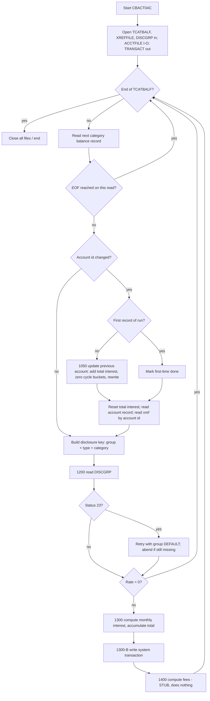

# Business Specification — Monthly Interest Calculation (job `INTCALC`, program `CBACT04C`)

Status: **DRAFT — awaiting human approval.** Input document for a future COBOL → Java migration. No code changes are proposed here.

Sources read in full for this document:

| Artifact | Path |
| --- | --- |
| Batch program | `app/cbl/CBACT04C.cbl` (652 lines) |
| Job control | `app/jcl/INTCALC.jcl` (44 lines) |
| Transaction category balance layout | `app/cpy/CVTRA01Y.cpy` |
| Card cross-reference layout | `app/cpy/CVACT03Y.cpy` |
| Disclosure group layout | `app/cpy/CVTRA02Y.cpy` |
| Account layout | `app/cpy/CVACT01Y.cpy` |
| Transaction layout | `app/cpy/CVTRA05Y.cpy` |
| Schedulers / drivers | `app/scheduler/CardDemo.controlm`, `app/scheduler/CardDemo.ca7`, `scripts/run_full_batch.sh`, `scripts/run_interest_calc.sh` |

Every rule below cites the file and line(s) it is derived from. Anything that is ambiguous, unimplemented, or appears to be a defect is called out explicitly in sections 7, 10 and 11.

---

## 1. Purpose and position in the batch flow

### 1.1 Business purpose

`INTCALC` runs the **monthly interest accrual cycle** for credit-card accounts. For every account/transaction-category balance carried on the transaction category balance file, it:

1. determines the interest rate that applies to that account's disclosure group, transaction type and transaction category (`CBACT04C.cbl:210-213`);
2. computes one month's interest on that category balance (`CBACT04C.cbl:462-467`);
3. writes a **system-generated interest transaction** to a new transaction file for downstream posting/statementing (`CBACT04C.cbl:473-515`);
4. accumulates interest per account and, on an account break, adds the accumulated interest to the account's current balance and **zeroes the current-cycle credit and debit buckets** (`CBACT04C.cbl:350-370`).

The JCL header states the intent as "Process transaction balance file and compute interest and fees." (`INTCALC.jcl:20`). Fee computation is **not implemented** — see section 7.

### 1.2 Where the job sits

**Control-M** (`app/scheduler/CardDemo.controlm:64-96`) defines a dedicated folder `MONTHLY-InterestCalculation` with this chain:

`CLOSEFIL` → **`INTCALC`** → `COMBTRAN` → `WAITSTEP` → `OPENFIL`

`INTCALC` has `INCOND MONTHLY-InterestCalculation-CLOSEFIL` and posts `OUTCOND MONTHLY-InterestCalculation-INTCALC`, which `COMBTRAN` consumes (`CardDemo.controlm:69-77`). The folder is scheduled for all twelve months with `TIMETO="23:00"`.

**Shell driver** `scripts/run_interest_calc.sh` submits the same cycle over FTP/JES: `CLOSEFIL` → `INTCALC` → `TRANBKP` → `COMBTRAN` → `TRANIDX` → `OPENFIL` (`run_interest_calc.sh:14-35`).

**Full batch** `scripts/run_full_batch.sh` runs data refresh jobs 1–11, then `POSTTRAN` (job 12), then **`INTCALC` as job 13** (`run_full_batch.sh:50-51`), then `TRANBKP` (14), `COMBTRAN` (15).

**CA-7** (`app/scheduler/CardDemo.ca7`): `INTCALC` does **not** appear anywhere in the CA-7 definitions (0 occurrences). Only the Control-M definition and the shell drivers schedule this job. *Flagged as a scheduling-inventory gap for migration planning.*

Business ordering implied by the above: CICS files must be closed first (`CLOSEFIL`) because the job opens the account VSAM file for update; afterwards the generated transactions are merged with daily transactions (`COMBTRAN`) and the files are reopened to CICS (`OPENFIL`).

---

## 2. Inputs and outputs

### 2.1 DD / dataset inventory (from `INTCALC.jcl:22-41` and `CBACT04C.cbl:28-56`)

| DD name | Dataset | Organization / access | Open mode | Record key | Purpose |
| --- | --- | --- | --- | --- | --- |
| `TCATBALF` | `AWS.M2.CARDDEMO.TCATBALF.VSAM.KSDS` | Indexed (KSDS), **sequential** access | `OPEN INPUT` (`cbl:236`) | `FD-TRAN-CAT-KEY` = acct id + type + category (`cbl:63-66`) | Driving file: per-account, per-category balances |
| `XREFFILE` | `AWS.M2.CARDDEMO.CARDXREF.VSAM.KSDS` | Indexed (KSDS), **random** access | `OPEN INPUT` (`cbl:254`) | Primary `FD-XREF-CARD-NUM`; **alternate** `FD-XREF-ACCT-ID` (`cbl:37-38`) | Supplies the card number for the generated transaction |
| `XREFFIL1` | `AWS.M2.CARDDEMO.CARDXREF.VSAM.AIX.PATH` | VSAM **alternate index path** | allocated by JCL only (`jcl:31-32`) | account id | Physical path backing the alternate-key read in `1110-GET-XREF-DATA` (`cbl:394-398`) |
| `ACCTFILE` | `AWS.M2.CARDDEMO.ACCTDATA.VSAM.KSDS` | Indexed (KSDS), random | **`OPEN I-O`** (`cbl:291`) — read **and** rewrite | `FD-ACCT-ID` (`cbl:86`) | Account master; source of disclosure group, target of balance update |
| `DISCGRP` | `AWS.M2.CARDDEMO.DISCGRP.VSAM.KSDS` | Indexed (KSDS), random | `OPEN INPUT` (`cbl:272`) | `FD-DISCGRP-KEY` = group + type + category (`cbl:78-81`) | Disclosure-group interest rates |
| `TRANSACT` | `AWS.M2.CARDDEMO.SYSTRAN(+1)` — GDG, `DISP=(NEW,CATLG,DELETE)`, `RECFM=F`, `LRECL=350` (`jcl:37-41`) | Sequential | `OPEN OUTPUT` (`cbl:309`) | n/a | **Output**: system-generated interest transactions |
| `STEPLIB` | `AWS.M2.CARDDEMO.LOADLIB` | PDS | `DISP=SHR` | n/a | Program load library |
| `SYSPRINT`, `SYSOUT` | `SYSOUT=*` | Spool | n/a | n/a | `DISPLAY` output, including every input record (`cbl:193`) |

Note the naming mismatch to carry into the target design: the output *DD* is `TRANSACT`, the output *dataset* is the `SYSTRAN` generation data group.

### 2.2 `TCATBALF` — transaction category balance (`app/cpy/CVTRA01Y.cpy`, record length 50)

| Field | PIC | Key | Business meaning |
| --- | --- | --- | --- |
| `TRANCAT-ACCT-ID` | `9(11)` | key part 1 | Account the balance belongs to |
| `TRANCAT-TYPE-CD` | `X(02)` | key part 2 | Transaction type (e.g. purchase, cash advance) |
| `TRANCAT-CD` | `9(04)` | key part 3 | Transaction category within the type |
| `TRAN-CAT-BAL` | `S9(09)V99` | | Balance carried in that account/type/category — the interest base |
| `FILLER` | `X(22)` | | Unused |

The file is read sequentially in key order, so records for one account arrive contiguously; this is what makes the account-break logic valid (`cbl:30`, `cbl:194`).

### 2.3 `XREFFILE` — card cross-reference (`app/cpy/CVACT03Y.cpy`, RECLN 50)

| Field | PIC | Key | Business meaning |
| --- | --- | --- | --- |
| `XREF-CARD-NUM` | `X(16)` | primary key | Card number — copied to the generated transaction |
| `XREF-CUST-ID` | `9(09)` | | Customer owning the card |
| `XREF-ACCT-ID` | `9(11)` | **alternate key** | Account id; used as the lookup key by this job |
| `FILLER` | `X(14)` | | Unused |

Read via the alternate key (`READ ... KEY IS FD-XREF-ACCT-ID`, `cbl:394-395`). Where an account has several cards, only the record returned by the alternate-index read is used; there is no logic to choose among multiple cards.

### 2.4 `ACCTFILE` — account master (`app/cpy/CVACT01Y.cpy`, RECLN 300)

| Field | PIC | Business meaning | Used by this job |
| --- | --- | --- | --- |
| `ACCT-ID` | `9(11)` | Account id (key) | Read key; also embedded in the transaction description |
| `ACCT-ACTIVE-STATUS` | `X(01)` | Active flag | **Not inspected** — interest is accrued regardless of status |
| `ACCT-CURR-BAL` | `S9(10)V99` | Current balance | **Updated**: accumulated interest added (`cbl:352`) |
| `ACCT-CREDIT-LIMIT` | `S9(10)V99` | Credit limit | Not used |
| `ACCT-CASH-CREDIT-LIMIT` | `S9(10)V99` | Cash credit limit | Not used |
| `ACCT-OPEN-DATE` / `ACCT-EXPIRAION-DATE` / `ACCT-REISSUE-DATE` | `X(10)` each | Lifecycle dates (field name misspelled in source) | Not used |
| `ACCT-CURR-CYC-CREDIT` | `S9(10)V99` | Current-cycle credits | **Reset to 0** (`cbl:353`) |
| `ACCT-CURR-CYC-DEBIT` | `S9(10)V99` | Current-cycle debits | **Reset to 0** (`cbl:354`) |
| `ACCT-ADDR-ZIP` | `X(10)` | Address ZIP | Not used |
| `ACCT-GROUP-ID` | `X(10)` | **Disclosure group** the account belongs to | Drives the rate lookup (`cbl:210`) |
| `FILLER` | `X(178)` | Unused | |

### 2.5 `DISCGRP` — disclosure group rates (`app/cpy/CVTRA02Y.cpy`, RECLN 50)

| Field | PIC | Key | Business meaning |
| --- | --- | --- | --- |
| `DIS-ACCT-GROUP-ID` | `X(10)` | key part 1 | Disclosure group (from the account), or literal `DEFAULT` |
| `DIS-TRAN-TYPE-CD` | `X(02)` | key part 2 | Transaction type |
| `DIS-TRAN-CAT-CD` | `9(04)` | key part 3 | Transaction category |
| `DIS-INT-RATE` | `S9(04)V99` | | **Annual** interest rate as a percentage (e.g. `0150{` → 1.50 %) |
| `FILLER` | `X(28)` | | Unused |

Reference data in `app/data/ASCII/discgrp.txt` confirms both account-specific rows (`A000000000100010015...`) and `DEFAULT` rows (lines 18+).

### 2.6 `TRANSACT` / `SYSTRAN` — output transaction (`app/cpy/CVTRA05Y.cpy`, RECLN 350)

| Field | PIC | Value written by this job |
| --- | --- | --- |
| `TRAN-ID` | `X(16)` | Generated — see section 3.3 |
| `TRAN-TYPE-CD` | `X(02)` | `'01'` (`cbl:482`) |
| `TRAN-CAT-CD` | `9(04)` | `'05'` (`cbl:483`) |
| `TRAN-SOURCE` | `X(10)` | `'System'` (`cbl:484`) |
| `TRAN-DESC` | `X(100)` | `'Int. for a/c ' || ACCT-ID` (`cbl:485-489`) |
| `TRAN-AMT` | `S9(09)V99` | `WS-MONTHLY-INT` for this category (`cbl:490`) |
| `TRAN-MERCHANT-ID` | `9(09)` | `0` (`cbl:491`) |
| `TRAN-MERCHANT-NAME` | `X(50)` | spaces (`cbl:492`) |
| `TRAN-MERCHANT-CITY` | `X(50)` | spaces (`cbl:493`) |
| `TRAN-MERCHANT-ZIP` | `X(10)` | spaces (`cbl:494`) |
| `TRAN-CARD-NUM` | `X(16)` | `XREF-CARD-NUM` from the cross-reference (`cbl:495`) |
| `TRAN-ORIG-TS` | `X(26)` | Current DB2-format timestamp (`cbl:496-497`) |
| `TRAN-PROC-TS` | `X(26)` | Same timestamp (`cbl:498`) |
| `FILLER` | `X(20)` | Not set by this job — retains whatever is in the record area |

---

## 3. Run parameter (`PARM`)

### 3.1 How it is passed

`//STEP15 EXEC PGM=CBACT04C,PARM='2022071800'` (`INTCALC.jcl:22`). The program receives it through the linkage item (`cbl:175-180`):

| Field | PIC | Meaning |
| --- | --- | --- |
| `PARM-LENGTH` | `S9(04) COMP` | Length of the parameter text supplied by z/OS |
| `PARM-DATE` | `X(10)` | The run-date string, e.g. `2022071800` |

### 3.2 Parsing and validation — **none**

`PARM-LENGTH` is never referenced anywhere in the program, and `PARM-DATE` is never edited, converted or range-checked. Its only use is as the first 10 bytes of the generated transaction id (`cbl:476-479`). Consequences to decide on in the target:

- a PARM shorter than 10 characters leaves the tail of `PARM-DATE` undefined;
- a missing PARM leaves the whole field undefined (potential S0C4/garbage transaction ids);
- a non-date value (any 10 characters) is accepted silently;
- the value is **not** used as an accounting/effective date anywhere; the transaction timestamps use the *system* clock instead (section 6).

The literal `'2022071800'` reads as `YYYYMMDD` + `HH` (2022-07-18, hour 00), but this interpretation is **not enforced by the code** — it is an inference from the constant in the JCL.

### 3.3 TRAN-ID composition (`cbl:473-480`)

```
ADD 1 TO WS-TRANID-SUFFIX                 (PIC 9(06), starts at 0)
STRING PARM-DATE, WS-TRANID-SUFFIX DELIMITED BY SIZE INTO TRAN-ID
```

| Positions | Length | Content |
| --- | --- | --- |
| 1–10 | 10 | `PARM-DATE` verbatim |
| 11–16 | 6 | Zero-filled running counter, incremented once per generated transaction across the whole run |

Total exactly 16 characters, matching `TRAN-ID PIC X(16)`. Example: PARM `2022071800`, first transaction → `2022071800000001`.

Uniqueness therefore depends entirely on the PARM value being unique per run. Re-running the job with the same PARM regenerates identical transaction ids. The counter wraps silently after 999 999 transactions in one run.

---

## 4. Interest-rate lookup

### 4.1 Key construction (`cbl:210-213`)

For every balance record, the lookup key is built as:

| Key part | Source | Note |
| --- | --- | --- |
| `FD-DIS-ACCT-GROUP-ID` | `ACCT-GROUP-ID` from the account record read at the account break | Same for all categories of the account |
| `FD-DIS-TRAN-TYPE-CD` | `TRANCAT-TYPE-CD` from the balance record | |
| `FD-DIS-TRAN-CAT-CD` | `TRANCAT-CD` from the balance record | |

### 4.2 Primary read and DEFAULT fallback (`1200-GET-INTEREST-RATE`, `cbl:415-440`)

| File status | Behaviour |
| --- | --- |
| `00` | Rate taken from the record just read |
| `23` (record not found) | `DISPLAY 'DISCLOSURE GROUP RECORD MISSING'` + `'TRY WITH DEFAULT GROUP CODE'`; group id replaced with the literal `DEFAULT` (blank-padded to 10) and `1200-A-GET-DEFAULT-INT-RATE` is performed (`cbl:436-439`) |
| anything else | `DISPLAY 'ERROR READING DISCLOSURE GROUP FILE'`, dump file status, **abend** (`cbl:430-435`) |

### 4.3 DEFAULT read (`1200-A-GET-DEFAULT-INT-RATE`, `cbl:443-460`)

Re-reads `DISCGRP` on key `DEFAULT / type / category`. **If the DEFAULT record is also missing** the read returns status `23`, which is *not* tolerated here: `APPL-RESULT` becomes 12, the program displays `'ERROR READING DEFAULT DISCLOSURE GROUP'` and the file status, and **abends with CEE3ABD code 999** (`cbl:446-459`, `cbl:628-632`). In business terms: a gap in the DEFAULT rate table kills the whole monthly run.

**Ambiguity to resolve for Java (`cbl:444`):** the fallback read has no `INVALID KEY` clause and the record area is only refreshed on a successful read. On status `23` from the *primary* read, `DIS-GROUP-RECORD` still holds the **previous** record's contents until the DEFAULT read succeeds. This is invisible today because a failed DEFAULT read abends, but the target implementation must not silently reuse a stale rate.

### 4.4 Zero-rate short-circuit (`cbl:214-217`)

If `DIS-INT-RATE = 0`, neither interest nor fees are computed and **no transaction is written** for that category. A zero rate is therefore indistinguishable from "no accrual".

---

## 5. Interest formula and accumulation

### 5.1 Formula (`1300-COMPUTE-INTEREST`, `cbl:462-467`)

```
WS-MONTHLY-INT = (TRAN-CAT-BAL * DIS-INT-RATE) / 1200
WS-TOTAL-INT   = WS-TOTAL-INT + WS-MONTHLY-INT
```

`DIS-INT-RATE` is an annual percentage, so dividing by 1200 converts "percent per year" to "fraction per month" in one step. There is **no `ROUNDED` clause** — the result is truncated toward zero to the two decimals of `WS-MONTHLY-INT PIC S9(09)V99` (`cbl:168`).

Worked example: balance 1 000.00, rate 18.00 → 1000.00 × 18.00 = 18 000.00; ÷ 1200 = 15.00 monthly interest.

### 5.2 Accumulation and account break

| Event | Action | Citation |
| --- | --- | --- |
| Balance record read whose `TRANCAT-ACCT-ID` differs from `WS-LAST-ACCT-NUM` | Account break | `cbl:194` |
| Break, and this is **not** the first record | `1050-UPDATE-ACCOUNT` for the *previous* account | `cbl:195-196` |
| Break, first record only | Set `WS-FIRST-TIME = 'N'`, no update | `cbl:197-199` |
| Every break | `WS-TOTAL-INT = 0`; remember the new account; read the account record (`1100-GET-ACCT-DATA`) and the cross-reference (`1110-GET-XREF-DATA`) | `cbl:200-205` |
| Each category with a non-zero rate | Add `WS-MONTHLY-INT` to `WS-TOTAL-INT` and write one transaction | `cbl:467-468` |

### 5.3 Applying the total to the account (`1050-UPDATE-ACCOUNT`, `cbl:350-370`)

```
ACCT-CURR-BAL = ACCT-CURR-BAL + WS-TOTAL-INT
ACCT-CURR-CYC-CREDIT = 0
ACCT-CURR-CYC-DEBIT  = 0
REWRITE the account record
```

A non-`00` status on the rewrite displays `'ERROR RE-WRITING ACCOUNT FILE'` and abends.

### 5.4 Processing flow



**Defect visible in the loop (`cbl:188-222`):** the `ELSE PERFORM 1050-UPDATE-ACCOUNT` branch at `cbl:219-220` is unreachable. It can only run when `END-OF-FILE = 'Y'` at the top of the loop body, but in that state the `PERFORM UNTIL END-OF-FILE = 'Y'` has already terminated. Consequently **the last account processed in each run never gets its accumulated interest applied to `ACCT-CURR-BAL`, and its cycle buckets are never reset**, although its interest transactions *were* written. See section 10.

---

## 6. System-generated interest transaction

Written once per account/category with a non-zero rate (`1300-B-WRITE-TX`, `cbl:473-515`). Attribute-by-attribute values are tabulated in section 2.6. Business summary:

| Attribute | Rule |
| --- | --- |
| Identity | `PARM-DATE` + 6-digit run-sequential counter (section 3.3) |
| Classification | Type `01`, category `05` — the "system interest" classification |
| Source | Literal `System` |
| Description | `Int. for a/c ` followed by the 11-digit account id, left-justified in a 100-byte field |
| Amount | The **category-level** monthly interest, not the account total |
| Card | Card number obtained from the cross-reference by account id |
| Merchant attributes | Deliberately empty (id `0`, name/city/zip spaces) |
| Timestamps | `TRAN-ORIG-TS` = `TRAN-PROC-TS` = current system timestamp, DB2 format `YYYY-MM-DD-HH.MM.SS.mm0000` built in `Z-GET-DB2-FORMAT-TIMESTAMP` (`cbl:613-626`) |
| Trailing `FILLER X(20)` | Never initialised by this program |

Note the timestamps come from `FUNCTION CURRENT-DATE` (wall clock at run time), **not** from the PARM run-date — so a re-run or a late run stamps transactions with the actual execution moment (`cbl:614`). Only hundredths of a second are captured; the final four digits are the literal `'0000'` (`cbl:621-622`).

---

## 7. Known functional gap — `1400-COMPUTE-FEES` is a stub

```cobol
1400-COMPUTE-FEES.
* To be implemented
    EXIT.
```
(`cbl:518-520`, invoked at `cbl:216`)

The JCL advertises the job as computing "interest **and fees**" (`INTCALC.jcl:20`), but **no fee is ever calculated, accumulated or posted**. The paragraph is called for every category with a non-zero rate and does nothing.

Decisions required before/with the Java migration:

1. Is fee computation genuinely out of scope (the Java target drops the call entirely), or is it a known backlog item that must be designed in?
2. If fees are to exist, what drives them — the disclosure group record (its `FILLER X(28)` is unused and could have been intended to carry fee terms), a separate fee table, or an external service?
3. Would fees be posted as separate transactions (a different type/category) or folded into the interest transaction and the account balance?

Until answered, the Java implementation should preserve current behaviour (no fees) and mark the extension point explicitly.

---

## 8. Data-type and precision concerns for the Java target

### 8.1 Storage formats — correction to a common assumption

None of the copybooks used by this job declare `COMP-3`/packed-decimal fields. All numerics are **USAGE DISPLAY** (zoned decimal with a trailing overpunch sign for signed fields) — see `CVTRA01Y.cpy`, `CVTRA02Y.cpy`, `CVACT01Y.cpy`, `CVTRA05Y.cpy`, and confirm in the sample data (`app/data/ASCII/discgrp.txt`, where rate `0150{` encodes `+150`, i.e. 1.50). The migration must therefore implement **zoned-decimal / overpunch** encode-decode, and must not assume packed decimal for these files. (Other CardDemo programs do use `COMP-3`; this job does not.)

| COBOL declaration | Java representation | Notes |
| --- | --- | --- |
| `TRAN-CAT-BAL PIC S9(09)V99` | `BigDecimal` scale 2, precision ≤ 11 | Signed, zoned |
| `DIS-INT-RATE PIC S9(04)V99` | `BigDecimal` scale 2 | Annual percentage |
| `WS-MONTHLY-INT`, `WS-TOTAL-INT PIC S9(09)V99` | `BigDecimal` scale 2 | Working accumulators (`cbl:168-169`) |
| `ACCT-CURR-BAL`, `ACCT-CURR-CYC-*` `PIC S9(10)V99` | `BigDecimal` scale 2 | Signed, zoned |
| `TRANCAT-ACCT-ID PIC 9(11)` | `String` of digits (or `long`) | Key; leading zeros are significant in the record image |
| `WS-TRANID-SUFFIX PIC 9(06)` | Zero-padded 6-char counter | Feeds `TRAN-ID` |
| `PARM-LENGTH PIC S9(04) COMP` | `short` | Currently unused |

### 8.2 Rounding / truncation of the `/1200` division

IBM Enterprise COBOL evaluates `(TRAN-CAT-BAL * DIS-INT-RATE) / 1200` with compiler-chosen intermediate precision (sufficient to hold the exact product, then a division carried to extra digits), and the **final store into `WS-MONTHLY-INT` truncates** the excess decimals because no `ROUNDED` phrase is present (`cbl:464-465`).

Java equivalent that reproduces this:

```java
BigDecimal monthly = balance.multiply(rate)            // exact product, scale 4
                            .divide(new BigDecimal("1200"), 2, RoundingMode.DOWN);
```

`RoundingMode.DOWN` (truncate toward zero), **not** `HALF_UP`, and truncation applied only at the final store. For negative balances COBOL truncation is also toward zero, which `DOWN` matches. Any deviation changes cent-level results on high volumes and will break a parallel-run comparison.

Secondary precision notes:

- `WS-TOTAL-INT` accumulates already-truncated per-category amounts; the account-level total is therefore the **sum of truncated values**, not the truncation of the sum. Preserve that order.
- `WS-MONTHLY-INT` and `WS-TOTAL-INT` have no `VALUE` clause (`cbl:168-169`); `WS-TOTAL-INT` is explicitly zeroed at each account break (`cbl:200`), so it is safe, but the Java target should initialise both to `ZERO` deliberately.
- Overflow: `TRAN-AMT` is `S9(09)V99` while `ACCT-CURR-BAL` is `S9(10)V99`; a computed interest above 999 999 999.99 would be silently truncated on the high-order side by the `MOVE` (`cbl:490`). No `ON SIZE ERROR` exists anywhere.

### 8.3 Signed fields, dates and timestamps

- Signed zoned fields carry the sign as an overpunch in the last byte; Java readers/writers must encode identically or downstream mainframe consumers will reject the file.
- `ACCT-*-DATE` fields are `X(10)` free-form text and are not validated or used here.
- The generated timestamp is a fixed 26-character DB2 string assembled by hand (`cbl:613-626`); reproduce the exact layout `YYYY-MM-DD-HH.MM.SS.mm0000`, including the literal trailing `0000`, rather than formatting a `LocalDateTime` with microseconds.
- `WS-LAST-ACCT-NUM` is `PIC X(11)` compared against the numeric `TRANCAT-ACCT-ID PIC 9(11)` (`cbl:167`, `cbl:194`). The comparison works only because the zoned representation of the digits is byte-identical; in Java compare account ids as canonical strings or longs, consistently.

### 8.4 Non-atomic multi-file updates and restartability

The job updates the account KSDS in place (`REWRITE`) while writing a brand-new GDG generation of transactions, with **no commit scope, no checkpoint and no restart logic**. A mid-run abend leaves:

- account records for all accounts processed *before* the failing account already updated on disk (balances increased, cycle buckets zeroed);
- an incomplete, uncatalogued `SYSTRAN(+1)` generation (`DISP=(NEW,CATLG,DELETE)` deletes it on abnormal end, `jcl:37`);
- no record of how far the run got beyond the `DISPLAY` output in `SYSOUT`.

A blind re-run therefore **double-applies interest** to every account updated before the failure, and reuses the same transaction ids (same PARM). The Java target should introduce either an idempotency key (account + period), a checkpoint/restart position on the driving file, or a transactional unit of work covering both updates — this is a design decision that needs a business owner's sign-off.

---

## 9. Error handling and abend behaviour

Every I/O operation follows the same pattern: check the file status, set `APPL-RESULT` (0 = ok, 12 = error, 16 = EOF), and on error display a message, dump the formatted status and abend.

| Situation | Message | Outcome | Citation |
| --- | --- | --- | --- |
| Any open failure (each of the 5 files) | `ERROR OPENING ...` | abend | `cbl:234-323` |
| `TCATBALF` read status `10` | none | normal end-of-file, `END-OF-FILE = 'Y'` | `cbl:330-340` |
| `TCATBALF` read, other non-`00` | `ERROR READING TRANSACTION CATEGORY FILE` | abend | `cbl:342-345` |
| Account not found on read | `ACCOUNT NOT FOUND: <id>` from `INVALID KEY`, then status ≠ `00` → `ERROR READING ACCOUNT FILE` | **abend** (the `INVALID KEY` message does not prevent it) | `cbl:372-390` |
| Cross-reference not found | `ACCOUNT NOT FOUND: <id>`, then `ERROR READING XREF FILE` | **abend** | `cbl:393-412` |
| Disclosure group not found (`23`) | `DISCLOSURE GROUP RECORD MISSING` / `TRY WITH DEFAULT GROUP CODE` | tolerated, DEFAULT fallback | `cbl:415-439` |
| DEFAULT disclosure group missing | `ERROR READING DEFAULT DISCLOSURE GROUP` | abend | `cbl:443-459` |
| Transaction write failure | `ERROR WRITING TRANSACTION RECORD` | abend | `cbl:500-514` |
| Account rewrite failure | `ERROR RE-WRITING ACCOUNT FILE` | abend | `cbl:356-369` |
| Any close failure | `ERROR CLOSING ...` | abend | `cbl:522-611` |

Abend mechanics: `9999-ABEND-PROGRAM` displays `ABENDING PROGRAM` and calls `CEE3ABD` with abend code **999**, timing 0 — an immediate, non-retryable task abend (`cbl:628-632`). Status formatting for display is handled by `9910-DISPLAY-IO-STATUS`, which renders VSAM `9x` statuses as a 4-digit `NNNN` value (`cbl:635-648`).

Observability notes for the target: the job `DISPLAY`s **every input record** (`cbl:193`) plus start/end banners (`cbl:181`, `cbl:230`); `WS-RECORD-COUNT` is incremented (`cbl:192`) but **never displayed or used** — there is no run summary, no count of transactions written and no total-interest report.

---

## 10. Defects and ambiguities to resolve before migrating

| # | Finding | Evidence | Impact |
| --- | --- | --- | --- |
| D1 | Last account of every run is never updated — the final `1050-UPDATE-ACCOUNT` is unreachable | `cbl:188-222` (see section 5.4) | Interest transactions exist without the matching balance update; cycle buckets not reset for that account |
| D2 | Fees never computed despite the job's stated purpose | `cbl:518-520`, `INTCALC.jcl:20` | Section 7 |
| D3 | Missing DEFAULT rate row aborts the entire monthly run | `cbl:443-459` | Single bad reference row = failed cycle |
| D4 | Stale-rate exposure in the fallback path (no `INVALID KEY`, record area not cleared) | `cbl:444` | Latent; must not be reproduced |
| D5 | PARM is neither validated nor used as an effective date | `cbl:175-180`, `cbl:476-479` | Wrong/duplicate PARM silently yields duplicate transaction ids |
| D6 | No restart/idempotency; partial updates survive an abend | section 8.4 | Re-run double-applies interest |
| D7 | Account status / closed accounts not checked | `CVACT01Y.cpy`, no reference in `cbl` | Interest accrued on inactive accounts |
| D8 | Zero rate silently produces no transaction | `cbl:214-217` | Cannot distinguish "0 % product" from "no accrual" |
| D9 | `INTCALC` absent from the CA-7 schedule while present in Control-M | `CardDemo.ca7` (0 hits), `CardDemo.controlm:69` | Scheduling inventory incomplete |
| D10 | Multi-card accounts: rate/card selection is whatever the alternate index returns first | `cbl:394-398` | Ambiguous business rule |
| D11 | No run statistics; `WS-RECORD-COUNT` computed but unused | `cbl:192` | No reconciliation evidence |
| D12 | Possible high-order truncation moving interest into `TRAN-AMT`; no `ON SIZE ERROR` anywhere | `cbl:490` | Silent data loss at extreme values |

---

## 11. Proposed next steps

1. **Business sign-off on D1** — is the "last account not updated" behaviour a bug to fix in the Java target, or behaviour that downstream reconciliation already depends on? This changes financial results, so it cannot be decided by the migration team alone.
2. **Decide the fee scope (D2)** before the Java design is frozen.
3. **Agree the rounding contract (section 8.2)** — confirm truncate-toward-zero at the per-category level, and capture it as an explicit test with production-like balances and rates.
4. **Define restartability (D6)** — checkpointing, idempotency key, or an "already accrued for period" guard.
5. **Define the failure policy for missing reference data (D3/D7)** — abend, skip-with-reject-file, or default-and-report.
6. **Build a parallel-run harness**: run COBOL and Java against the same `TCATBALF`/`ACCTFILE`/`DISCGRP` extracts and diff both the `SYSTRAN` output and the updated account balances byte-for-byte.
7. **Reconcile the scheduler inventory (D9)** so the migrated job is triggered from the same dependency chain.

---

**Approval gate:** this specification is submitted for human review. No migration, refactoring or code change should begin until a reviewer approves it or requests changes.
