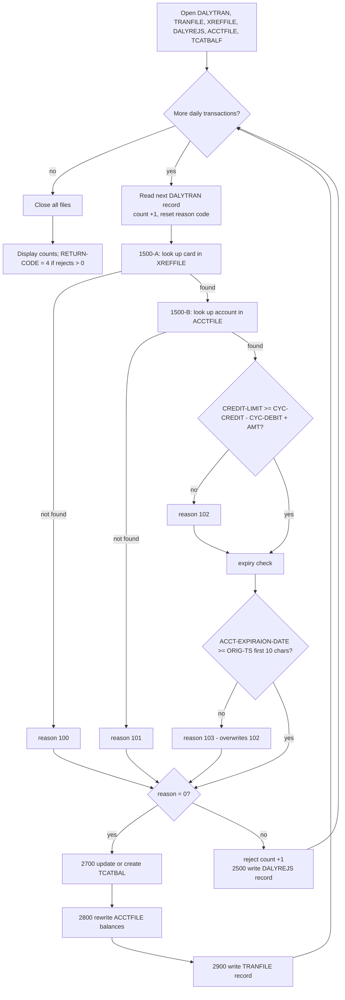

# Business Specification — Daily Transaction Posting (job `POSTTRAN`, program `CBTRN02C`)

Status: **DRAFT — awaiting human approval.** Input document for a future COBOL → Java migration. No code changes are proposed or made here.

Sources read in full for this specification:

| Artefact | Path |
|---|---|
| Batch program | `app/cbl/CBTRN02C.cbl` (731 lines) |
| Job JCL | `app/jcl/POSTTRAN.jcl` |
| Daily transaction layout | `app/cpy/CVTRA06Y.cpy` |
| Transaction master layout | `app/cpy/CVTRA05Y.cpy` |
| Card cross-reference layout | `app/cpy/CVACT03Y.cpy` |
| Account master layout | `app/cpy/CVACT01Y.cpy` |
| Transaction category balance layout | `app/cpy/CVTRA01Y.cpy` |
| Schedules / drivers | `app/scheduler/CardDemo.ca7`, `app/scheduler/CardDemo.controlm`, `scripts/run_full_batch.sh`, `scripts/run_posting.sh` |

Every rule below cites the file and paragraph/line it was derived from. Anything not evidenced in those files is listed in **[§8 Open questions / gaps](#8-open-questions--gaps)** rather than assumed.

---

## 1. Purpose and position in the nightly batch

### 1.1 Business purpose

`POSTTRAN` is the core nightly posting job of CardDemo. It takes the day's captured card transactions, checks each one against the card cross-reference and the account master, and then either **posts** it (updating the account's balances and the per-category balance, and adding the transaction to the transaction master) or **rejects** it with a numeric reason code into a dated reject file. Program header: "Post the records from daily transaction file." (`app/cbl/CBTRN02C.cbl`, lines 2–5); JCL comment: "Process and load daily transaction file and create transaction category balance and update transaction master vsam" (`app/jcl/POSTTRAN.jcl`).

Business outcomes of one run:

1. Valid transactions become permanent entries in the transaction master (`TRANFILE`).
2. Account current balance and current-cycle credit/debit totals are updated (`2800-UPDATE-ACCOUNT-REC`).
3. Per-account/per-transaction-type/per-category running balances are updated or created (`2700-UPDATE-TCATBAL`).
4. Invalid transactions are written unposted to a rejects file with a reason code (`2500-WRITE-REJECT-REC`).
5. Run totals are printed and the job return code is set to 4 if anything was rejected (`CBTRN02C.cbl`, lines 227–231).

### 1.2 Position in the nightly flow

Two independent definitions of the flow exist; they do not agree, which is itself a migration risk (see §8).

**CA-7 (`app/scheduler/CardDemo.ca7`)** — trigger chain, "TRIGGERED JOBS" blocks:

`CLOSEFIL` (close CICS files, line 43) → `CBPAUP0J` (purge expired authorizations, line 70) → **`POSTTRAN`** (line 78, triggers line 97) → `WAITSTEP` → `OPENFIL` (reopen CICS files, line 124).

So the immediate predecessor is `CBPAUP0J` and the immediate successor is `WAITSTEP`, then `OPENFIL`. The online files must be closed to CICS before the job runs and reopened after it.

**`scripts/run_posting.sh`** (posting-only driver) submits, in order: `CLOSEFIL` → `ACCTFILE` (refresh account master) → `TCATBALF` (refresh category balances) → `TRANBKP` (refresh/recreate transaction master) → **`POSTTRAN`** → `TRANIDX` (define alternate index on the transaction file) → `OPENFIL`.

**`scripts/run_full_batch.sh`** (full demo batch) submits: `CLOSEFIL` → data refresh jobs `ACCTFILE`, `CARDFILE`, `XREFFILE`, `CUSTFILE`, `TRANBKP`, `DISCGRP`, `TCATBALF`, `TRANTYPE`, `DUSRSECJ` → **`POSTTRAN`** (job 12) → `INTCALC` (interest calculation) → `TRANBKP` (backup) → `COMBTRAN` (combine system transactions with daily ones) → `TRANIDX` → `OPENFIL`.

**Control-M (`app/scheduler/CardDemo.controlm`)** does **not** contain a `POSTTRAN` job at all; its DAILY folder is `CLOSEFIL` → `TRANBKP` → `WAITSTEP` → `OPENFIL` (lines 4–20), and the monthly folder runs `INTCALC`/`COMBTRAN`. See §8.

Key scheduling consequence for the migration: **the transaction master is recreated by `TRANBKP` immediately before `POSTTRAN` in both shell drivers**, which is consistent with the program opening `TRANFILE` as `OPEN OUTPUT` (§2.4) — i.e. the job is designed to be run against a freshly (re)loaded transaction master, not to append to an accumulated one.

---

## 2. Inputs and outputs

### 2.1 File inventory (DD names, datasets, organisation, access)

| Logical file | DD name | Dataset (from `POSTTRAN.jcl`) | Organisation | Open mode (`CBTRN02C.cbl`) | Access | Key | Copybook |
|---|---|---|---|---|---|---|---|
| Daily transactions (input) | `DALYTRAN` | `AWS.M2.CARDDEMO.DALYTRAN.PS` (DISP=SHR) | Sequential (PS), fixed 350 | `OPEN INPUT` (`0000-DALYTRAN-OPEN`, l.238) | Sequential read | none | `CVTRA06Y` |
| Card cross-reference (input) | `XREFFILE` | `AWS.M2.CARDDEMO.CARDXREF.VSAM.KSDS` (DISP=SHR) | VSAM KSDS, 50 bytes | `OPEN INPUT` (`0200-XREFFILE-OPEN`, l.275) | Random by key | `FD-XREF-CARD-NUM` `PIC X(16)`, offset 1 | `CVACT03Y` |
| Account master (input/update) | `ACCTFILE` | `AWS.M2.CARDDEMO.ACCTDATA.VSAM.KSDS` (DISP=SHR) | VSAM KSDS, 300 bytes | `OPEN I-O` (`0400-ACCTFILE-OPEN`, l.311) | Random by key, read + rewrite | `FD-ACCT-ID` `PIC 9(11)`, offset 1 | `CVACT01Y` |
| Transaction category balance (input/update) | `TCATBALF` | `AWS.M2.CARDDEMO.TCATBALF.VSAM.KSDS` (DISP=SHR) | VSAM KSDS, 50 bytes | `OPEN I-O` (`0500-TCATBALF-OPEN`, l.329) | Random by key, read + rewrite + write | `FD-TRAN-CAT-KEY` = acct id `9(11)` + type `X(02)` + category `9(04)`, offset 1–17 | `CVTRA01Y` |
| Transaction master (output) | `TRANFILE` | `AWS.M2.CARDDEMO.TRANSACT.VSAM.KSDS` (DISP=SHR) | VSAM KSDS, 350 bytes | **`OPEN OUTPUT`** (`0100-TRANFILE-OPEN`, l.256) | Sequential load (write only) | `FD-TRANS-ID` `PIC X(16)`, offset 1 | `CVTRA05Y` |
| Daily rejects (output) | `DALYREJS` | `AWS.M2.CARDDEMO.DALYREJS(+1)` — new GDG generation, `RECFM=F, LRECL=430` | Sequential (GDG, PS) | `OPEN OUTPUT` (`0300-DALYREJS-OPEN`, l.293) | Sequential write | none | none (defined in-program, l.176–182) |

Load library: `AWS.M2.CARDDEMO.LOADLIB`; single step `STEP15 EXEC PGM=CBTRN02C`. `SYSPRINT`/`SYSOUT` go to the held output class (`POSTTRAN.jcl`).

`AWS.M2.CARDDEMO.DALYREJS` is catalogued as a GDG base with existing generations (`app/catlg/LISTCAT.txt`, lines 684–697), created by `app/jcl/DALYREJS.jcl`; each run therefore produces one new dated generation.

### 2.2 DALYTRAN — daily transaction record (`CVTRA06Y`, 350 bytes)

| Offset | Field | PIC | Business meaning |
|---|---|---|---|
| 1–16 | `DALYTRAN-ID` | `X(16)` | Transaction identifier; becomes the transaction-master key |
| 17–18 | `DALYTRAN-TYPE-CD` | `X(02)` | Transaction type (part of the category-balance key) |
| 19–22 | `DALYTRAN-CAT-CD` | `9(04)` | Transaction category (part of the category-balance key) |
| 23–32 | `DALYTRAN-SOURCE` | `X(10)` | Capture source / channel |
| 33–132 | `DALYTRAN-DESC` | `X(100)` | Free-text description |
| 133–143 | `DALYTRAN-AMT` | `S9(09)V99` (zoned display, 11 bytes) | Signed transaction amount, 2 decimals |
| 144–152 | `DALYTRAN-MERCHANT-ID` | `9(09)` | Merchant identifier |
| 153–202 | `DALYTRAN-MERCHANT-NAME` | `X(50)` | Merchant name |
| 203–252 | `DALYTRAN-MERCHANT-CITY` | `X(50)` | Merchant city |
| 253–262 | `DALYTRAN-MERCHANT-ZIP` | `X(10)` | Merchant postcode |
| 263–278 | `DALYTRAN-CARD-NUM` | `X(16)` | Card number — lookup key into the cross-reference |
| 279–304 | `DALYTRAN-ORIG-TS` | `X(26)` | Origination timestamp, DB2 character format; first 10 characters used as the transaction date |
| 305–330 | `DALYTRAN-PROC-TS` | `X(26)` | Processing timestamp as supplied on input (**not** carried forward; see §4.3) |
| 331–350 | `FILLER` | `X(20)` | Reserved |

Note: the program's FD describes this file only as key `X(16)` + `X(334)` (l.67–69) and reads `INTO DALYTRAN-RECORD` (l.346); all field-level meaning comes from the copybook.

### 2.3 XREFFILE — card cross-reference (`CVACT03Y`, 50 bytes, KSDS)

| Offset | Field | PIC | Business meaning |
|---|---|---|---|
| 1–16 | `XREF-CARD-NUM` | `X(16)` | **Primary key** — card number |
| 17–25 | `XREF-CUST-ID` | `9(09)` | Owning customer (not used by this program) |
| 26–36 | `XREF-ACCT-ID` | `9(11)` | Account the card belongs to — drives the account and category-balance lookups |
| 37–50 | `FILLER` | `X(14)` | Reserved |

### 2.4 ACCTFILE — account master (`CVACT01Y`, 300 bytes, KSDS)

| Offset | Field | PIC | Business meaning | Used by |
|---|---|---|---|---|
| 1–11 | `ACCT-ID` | `9(11)` | **Primary key** — account number | lookup (l.394) |
| 12 | `ACCT-ACTIVE-STATUS` | `X(01)` | Account open/closed indicator | **not used** (§8) |
| 13–24 | `ACCT-CURR-BAL` | `S9(10)V99` | Current account balance | updated (l.547) |
| 25–36 | `ACCT-CREDIT-LIMIT` | `S9(10)V99` | Credit limit | over-limit test (l.407) |
| 37–48 | `ACCT-CASH-CREDIT-LIMIT` | `S9(10)V99` | Cash credit limit | not used |
| 49–58 | `ACCT-OPEN-DATE` | `X(10)` | Account open date | not used |
| 59–68 | `ACCT-EXPIRAION-DATE` | `X(10)` | Account expiry date (spelling as in copybook) | expiry test (l.414) |
| 69–78 | `ACCT-REISSUE-DATE` | `X(10)` | Reissue date | not used |
| 79–90 | `ACCT-CURR-CYC-CREDIT` | `S9(10)V99` | Current-cycle credit total | read in over-limit test, updated (l.549) |
| 91–102 | `ACCT-CURR-CYC-DEBIT` | `S9(10)V99` | Current-cycle debit total | read in over-limit test, updated (l.551) |
| 103–112 | `ACCT-ADDR-ZIP` | `X(10)` | Account postcode | not used |
| 113–122 | `ACCT-GROUP-ID` | `X(10)` | Pricing/disclosure group | not used |
| 123–300 | `FILLER` | `X(178)` | Reserved | — |

### 2.5 TCATBALF — transaction category balance (`CVTRA01Y`, 50 bytes, KSDS)

| Offset | Field | PIC | Business meaning |
|---|---|---|---|
| 1–11 | `TRANCAT-ACCT-ID` | `9(11)` | Account (key part 1) |
| 12–13 | `TRANCAT-TYPE-CD` | `X(02)` | Transaction type (key part 2) |
| 14–17 | `TRANCAT-CD` | `9(04)` | Transaction category (key part 3) |
| 18–28 | `TRAN-CAT-BAL` | `S9(09)V99` | Running balance for that account/type/category |
| 29–50 | `FILLER` | `X(22)` | Reserved |

### 2.6 TRANFILE — transaction master (`CVTRA05Y`, 350 bytes, KSDS)

Field-for-field identical in layout to `CVTRA06Y` (§2.2) with the `TRAN-` prefix; key is `TRAN-ID` `X(16)` at offset 1. Field population is described in §4.3.

### 2.7 DALYREJS — reject file (in-program layout, 430 bytes)

| Offset | Field | PIC | Content |
|---|---|---|---|
| 1–350 | `REJECT-TRAN-DATA` | `X(350)` | The complete rejected `DALYTRAN-RECORD`, byte-for-byte (l.447) |
| 351–354 | `WS-VALIDATION-FAIL-REASON` | `9(04)` | Numeric reason code (100/101/102/103) |
| 355–430 | `WS-VALIDATION-FAIL-REASON-DESC` | `X(76)` | Human-readable reason text |

Positions 351–430 are the 80-byte "validation trailer" (`WS-VALIDATION-TRAILER`, l.180–182; moved at l.448). `RECFM=F, LRECL=430` in the JCL matches 350 + 80.

---

## 3. Validation rules

Driver: main loop, `CBTRN02C.cbl` lines 202–219. For each daily transaction the program resets the reason code to 0 and the description to spaces (l.208–209), performs `1500-VALIDATE-TRAN`, and then posts if and only if the reason code is still 0 (l.211–216).

| Reason | Business rule | Trigger / data compared | Coded as | Outcome |
|---|---|---|---|---|
| **100 — "INVALID CARD NUMBER FOUND"** | The card on the transaction must exist in the card cross-reference. | `DALYTRAN-CARD-NUM` used as the key of `XREFFILE`; record not found (`INVALID KEY`). | `1500-A-LOOKUP-XREF`, l.382–391 | Transaction rejected; **account lookup is skipped entirely** (l.372–376). |
| **101 — "ACCOUNT RECORD NOT FOUND"** | The account referenced by the cross-reference must exist in the account master. | `XREF-ACCT-ID` used as the key of `ACCTFILE`; record not found (`INVALID KEY`). | `1500-B-LOOKUP-ACCT`, l.394–399 | Transaction rejected; no balance or expiry checks performed. |
| **102 — "OVERLIMIT TRANSACTION"** | Posting the transaction must not take the account's cycle position beyond its credit limit. | Compute `WS-TEMP-BAL = ACCT-CURR-CYC-CREDIT − ACCT-CURR-CYC-DEBIT + DALYTRAN-AMT`. Pass if `ACCT-CREDIT-LIMIT >= WS-TEMP-BAL`; otherwise reject. | l.403–413 | Reason set to 102, but evaluation continues into the expiry test (no short-circuit). |
| **103 — "TRANSACTION RECEIVED AFTER ACCT EXPIRATION"** | The transaction date must not be after the account expiry date. | Character comparison `ACCT-EXPIRAION-DATE >= DALYTRAN-ORIG-TS (1:10)` (first 10 characters of the origination timestamp). Pass if true; otherwise reject. | l.414–420 | Reason set to 103, **overwriting 102 if both failed**. |

### 3.1 Ordering, short-circuiting and multiple reasons

* Validation is strictly staged: cross-reference first, then account (`1500-VALIDATE-TRAN`, l.370–378). A card-number failure short-circuits everything downstream, so a transaction can never be reported as both 100 and 101.
* Inside `1500-B-LOOKUP-ACCT` the over-limit test and the expiry test are **independent `IF` statements with no `ELSE` and no early exit** (l.407–420). Both can fire for the same transaction, and both write into the same single field `WS-VALIDATION-FAIL-REASON`.
* **Only one reason is ever recorded — the last one set.** If a transaction is both over limit and past expiry, the reject file shows 103 and the over-limit condition is invisible. This is a genuine behaviour of the current system that a Java implementation must decide whether to reproduce (bug-for-bug) or correct (multi-reason rejects). See §8.
* The comment "ADD MORE VALIDATIONS HERE" (l.377) shows the rule set is intentionally an extension point; no amount/format/duplicate-key/status validations exist today.
* Reason code **109 — "ACCOUNT RECORD NOT FOUND"** also exists in the source (`2800-UPDATE-ACCOUNT-REC`, l.556–558) but is set *after* validation has passed and is never tested; it cannot produce a reject (§5, §8).

---

## 4. Posting logic

`2000-POST-TRANSACTION` (l.424–444) runs only for transactions with reason code 0. It builds the transaction-master image, then performs, in this order: `2700-UPDATE-TCATBAL` → `2800-UPDATE-ACCOUNT-REC` → `2900-WRITE-TRANSACTION-FILE`.

### 4.1 `2700-UPDATE-TCATBAL` — category balance update (l.467–542)

1. Build the category key from the **cross-reference account id** plus the transaction's type and category: `XREF-ACCT-ID` → `FD-TRANCAT-ACCT-ID`, `DALYTRAN-TYPE-CD` → `FD-TRANCAT-TYPE-CD`, `DALYTRAN-CAT-CD` → `FD-TRANCAT-CD` (l.469–471).
2. Read `TCATBALF` by that key (l.474–479). If the record is absent (`INVALID KEY`), the program prints "TCATBAL record not found for key : … Creating." and sets the create flag (l.476–478). File status `'00'` (found) and `'23'` (not found) are both treated as acceptable; any other status is a fatal I/O error (l.481–493).
3. **Create path** `2700-A-CREATE-TCATBAL-REC` (l.503–524): initialise a fresh record, set the three key fields, add `DALYTRAN-AMT` to the (initialised, i.e. zero) balance, and `WRITE` a new record. So the new record's balance is exactly the transaction amount, signed.
4. **Update path** `2700-B-UPDATE-TCATBAL-REC` (l.526–542): add `DALYTRAN-AMT` to the existing `TRAN-CAT-BAL` and `REWRITE` the record in place.

Business statement: **the category balance is a signed running total of every posted transaction for that account / transaction-type / category combination; the record is created on first use and accumulated thereafter.** No netting, rounding or sign inversion is applied.

### 4.2 `2800-UPDATE-ACCOUNT-REC` — account balance update (l.545–560)

Applied to the account record read during validation (`1500-B-LOOKUP-ACCT`), in memory, then rewritten:

| Field | Change | Condition | Line |
|---|---|---|---|
| `ACCT-CURR-BAL` | `+ DALYTRAN-AMT` (signed) | always | 547 |
| `ACCT-CURR-CYC-CREDIT` | `+ DALYTRAN-AMT` | when `DALYTRAN-AMT >= 0` | 548–549 |
| `ACCT-CURR-CYC-DEBIT` | `+ DALYTRAN-AMT` | when `DALYTRAN-AMT < 0` | 550–551 |

Sign conventions as coded: a **positive** amount increases the current balance and the cycle **credit** bucket; a **negative** amount decreases the current balance and is added (i.e. makes more negative) to the cycle **debit** bucket. Note that the cycle-debit bucket therefore accumulates negative values, while the over-limit formula (§3) *subtracts* that bucket — so negative amounts increase `WS-TEMP-BAL` twice over. This naming/sign combination is counter-intuitive versus normal card terminology and must be confirmed with the business before it is encoded in Java (§8).

The record is then `REWRITE`n to `ACCTFILE` (l.554–559). On `INVALID KEY` the program sets reason 109 and a description but takes **no further action** — no reject is written, no abend is raised, and processing continues to write the transaction to the master (see §5/§6).

### 4.3 `2900-WRITE-TRANSACTION-FILE` — transaction master write (l.562–579)

The transaction-master image is assembled in `2000-POST-TRANSACTION` (l.425–438): id, type, category, source, description, amount, merchant id/name/city/zip, card number and origination timestamp are copied one-for-one from the daily transaction record. The **processing timestamp is regenerated** by `Z-GET-DB2-FORMAT-TIMESTAMP` (l.692–705) from the current system clock in DB2 character format `YYYY-MM-DD-HH.MM.SS.hh0000`; the inbound `DALYTRAN-PROC-TS` is discarded.

The record is then `WRITE`n to the KSDS (l.564). Because the file is opened `OUTPUT` (l.256), this is a **load** of the transaction master: any pre-existing content is replaced, and records must arrive in ascending `TRAN-ID` sequence or the write fails (status ≠ `'00'` → abend, l.566–578). Operationally this is why `TRANBKP` recreates the file immediately before the job (§1.2).

### 4.4 Processing loop

---

## 5. Reject handling

`2500-WRITE-REJECT-REC` (l.446–465):

1. The **entire original daily transaction record** is copied unchanged into the first 350 bytes of the reject record (l.447) — rejects are a faithful copy of the input, so they can be corrected and re-presented.
2. The 80-byte validation trailer (4-digit reason code + 76-character description) is appended (l.448).
3. The record is written to `DALYREJS`; any file status other than `'00'` displays "ERROR WRITING TO REJECTS FILE", displays the file status and abends (l.450–464).

Counters and run outcome:

* `WS-TRANSACTION-COUNT` — incremented for every daily transaction read (l.206).
* `WS-REJECT-COUNT` — incremented immediately before each reject write (l.214).
* At end of job both are displayed: "TRANSACTIONS PROCESSED :" and "TRANSACTIONS REJECTED  :" (l.227–228).
* If any transaction was rejected, `RETURN-CODE` is set to **4** (l.229–231). What the schedulers do with that code is not evidenced in this repository: neither `CardDemo.ca7` nor `CardDemo.controlm` states an acceptable-condition-code policy for `POSTTRAN`, and the shell drivers do not test it either (§8).

Downstream consumption: within this repository **nothing reads `AWS.M2.CARDDEMO.DALYREJS`**. The dataset is a GDG (`app/jcl/DALYREJS.jcl`; catalogued generations in `app/catlg/LISTCAT.txt`, lines 684–697) and each run creates generation `(+1)`; consumption is presumably manual or out of scope for the demo (§8).

---

## 6. Abend and error handling

### 6.1 Pattern

Every file operation follows the same shape: set `APPL-RESULT` to 8, perform the operation, set it to 0 on status `'00'` (plus `'23'` for the TCATBAL read, l.481) else 12, and if it is not 0 display a message, move the file status to `IO-STATUS`, `PERFORM 9910-DISPLAY-IO-STATUS`, `PERFORM 9999-ABEND-PROGRAM`.

Covered operations: all six opens (l.236–343), the sequential read (l.345–369, where status `'10'` is end-of-file and sets `END-OF-FILE = 'Y'`, l.351–361), the reject write (l.450–464), the TCATBAL read/write/rewrite (l.481–542), the transaction-master write (l.563–578), and all six closes (l.582–690).

**Not covered:** the `READ` of `XREFFILE` and `ACCTFILE` in validation (only `INVALID KEY` is handled — any other bad status is silently treated as success), and the `REWRITE` of `ACCTFILE` in `2800` (only `INVALID KEY`, and that outcome is ignored). See §8.

### 6.2 `9910-DISPLAY-IO-STATUS` (l.714–727)

Diagnostic only. It renders the two-byte file status as a 4-digit value: for a non-numeric status or one starting with `'9'` (compiler/runtime extension statuses) it prints the first byte plus the binary value of the second byte; otherwise it prints `00` + the two status digits. Output line: `FILE STATUS IS: NNNN<value>`.

### 6.3 `9999-ABEND-PROGRAM` (l.707–711)

Displays "ABENDING PROGRAM" and calls the Language Environment service `CEE3ABD` with **abend code 999** and timing 0 — an immediate, non-clean-up user abend. No files are closed, no summary is printed and no return code is set.

### 6.4 What is committed vs lost; restartability

* There is **no unit of work and no commit/rollback**. VSAM updates issued through `REWRITE`/`WRITE` before the abend are already applied; there is no backout.
* Because posting touches three files in sequence (`TCATBALF`, then `ACCTFILE`, then `TRANFILE`) with no atomicity, an abend between them leaves a transaction **partially posted**: e.g. a category balance and account balance updated but no transaction-master record.
* The `DALYREJS` GDG generation is catalogued only at successful step end (`DISP=(NEW,CATLG,DELETE)`), so on abend the rejects written so far are deleted while the VSAM updates persist.
* **The job is not restartable from the point of failure.** There is no checkpoint, no restart key and no idempotency: rerunning from the top would re-apply every already-posted amount to `ACCTFILE` and `TCATBALF`. The only recovery visible in this codebase is the set of refresh jobs that `scripts/run_posting.sh` runs before `POSTTRAN` — `ACCTFILE` and `TCATBALF` reload **baseline** data, and `TRANBKP` copies the transaction master to a backup GDG and then deletes and redefines an **empty** cluster (`app/jcl/TRANBKP.jcl`, STEP05R/STEP05/STEP10). That is a reset to a known starting point, not a restore to the point of failure; whether it is the sanctioned production recovery procedure is not evidenced here (§8).
* Reruns are safe for `TRANFILE` only because it is opened `OUTPUT` (loaded from empty), not for the two I-O files.

---

## 7. Edge cases and data-type concerns for the Java target

| Concern | Evidence | Java implication |
|---|---|---|
| **Amounts are zoned decimal, not COMP-3** | No `COMP-3`/`COMP` appears in `CVTRA06Y`, `CVTRA05Y`, `CVACT01Y`, `CVTRA01Y`, `CVACT03Y`; `S9(09)V99` occupies 11 bytes and `S9(10)V99` 12 bytes, which reconciles with the documented record lengths (350/300/50). | Parse signed zoned decimal (trailing sign overpunch) rather than packed decimal. Map to `BigDecimal` with **scale exactly 2**. The only in-program packed/binary items are `APPL-RESULT`, `ABCODE`, `TIMING` (`COMP`/`BINARY`) and the `TWO-BYTES-BINARY` status helper. |
| **Working field narrower than the fields it holds** | `WS-TEMP-BAL PIC S9(09)V99` (l.187) receives `ACCT-CURR-CYC-CREDIT − ACCT-CURR-CYC-DEBIT + DALYTRAN-AMT`, where the account fields are `S9(10)V99` (`CVACT01Y`). | Silent high-order truncation is possible in COBOL for cycle totals ≥ 1,000,000,000. In Java, use unbounded `BigDecimal` and decide explicitly whether to reproduce truncation or raise an error. |
| **Category balance narrower than account balances** | `TRAN-CAT-BAL S9(09)V99` vs `ACCT-CURR-BAL S9(10)V99`. | Accumulation overflow on `TRAN-CAT-BAL` is possible and unchecked; define behaviour (overflow exception vs wrap) before migration. |
| **No rounding anywhere** | All arithmetic is `ADD`/`COMPUTE` on 2-decimal operands (l.403–405, 508, 527, 547–551). | Use `BigDecimal` addition only; no `ROUND` semantics to emulate. Do **not** use `double`. |
| **Signed fields and sign conventions** | §4.2. | Preserve signs exactly; a negative amount adds a negative value to the "debit" bucket. |
| **Date handling is string comparison, not date arithmetic** | `ACCT-EXPIRAION-DATE >= DALYTRAN-ORIG-TS (1:10)` (l.414) compares 10 characters. | Only correct while both are zero-padded `YYYY-MM-DD`. Any other format, blanks or low-values silently change the outcome. In Java, either replicate the lexicographic comparison or parse to `LocalDate` with explicit validation — and define the behaviour for unparseable values. |
| **Timestamp generation** | `Z-GET-DB2-FORMAT-TIMESTAMP` (l.692–705) builds `YYYY-MM-DD-HH.MM.SS.hh0000` from `FUNCTION CURRENT-DATE`, hundredths only, trailing `0000`. | Reproduce the exact 26-character format and precision (hundredths, not milliseconds/microseconds) or downstream consumers/statements will differ. `FUNCTION CURRENT-DATE` is local server time — pin the time zone explicitly in Java. |
| **Blanks / low-values / non-numeric input** | No numeric-class or space checks exist anywhere in the program. | A blank `DALYTRAN-AMT` or non-numeric `DALYTRAN-CAT-CD` would abend or corrupt arithmetic in COBOL. Java parsing must define explicit behaviour — this is new behaviour to agree with the business. |
| **Key formatting** | `FD-ACCT-ID PIC 9(11)` receives `XREF-ACCT-ID PIC 9(11)`; TCATBAL key concatenates `9(11)` + `X(02)` + `9(04)`. | Keys are fixed-width, zero-padded character strings. Do not use numeric types as keys in Java without preserving padding. |
| **EBCDIC vs ASCII** | Datasets are mainframe EBCDIC (`app/data/EBCDIC/…` in the repo; ASCII copies also exist under `app/data/ASCII/`). | Define the code page (typically IBM-1047) for fixed-width parsing, especially for the sign overpunch characters and for the `>=` comparison of card numbers/dates, whose collating sequence differs between EBCDIC and ASCII for mixed alphanumeric data. |
| **Non-atomic multi-file update** | §6.4. | The Java design should wrap the three updates per transaction in a single transactional unit (database transaction or compensating logic) and add idempotency (e.g. natural key on transaction id) so reruns are safe — this is a deliberate improvement over the current behaviour and needs business sign-off. |
| **Sequential-load constraint on the transaction master** | `OPEN OUTPUT` (l.256). | A Java implementation writing to a database has no ascending-key requirement, but must decide whether posting *replaces* or *appends to* the transaction master. Today it replaces. |
| **Return code semantics** | `RETURN-CODE = 4` when rejects exist (l.229–231). | Keep an equivalent "completed with rejects" exit status for the scheduler. |

---

## 8. Open questions / gaps

Items that are ambiguous, unimplemented, or inconsistent in the source and must be resolved by a human before the Java design is finalised.

1. **Multiple reject reasons collapse to one.** A transaction failing both 102 and 103 is reported only as 103 (l.407–420). Reproduce or fix?
2. **Reason code 109 is dead logic.** `2800-UPDATE-ACCOUNT-REC` sets 109 on a failed `REWRITE` (l.556–558) but nothing tests it: no reject is written, the reject counter is not incremented, the transaction is still written to the master, and the job still ends with RC 0/4. A failed account update is therefore silently lost. Intended behaviour?
3. **Unchecked file statuses on the validation reads and the account rewrite.** `READ XREF-FILE`/`READ ACCOUNT-FILE`/`REWRITE FD-ACCTFILE-REC` handle only `INVALID KEY`; a hard I/O error (e.g. status `'9x'`) is treated as success. Should the Java version abend instead?
4. **`ACCT-ACTIVE-STATUS` is never checked.** Transactions post to closed accounts. Is a "closed account" reject code required?
5. **No duplicate-transaction detection.** A repeated `DALYTRAN-ID` would fail the KSDS write and abend the job (status ≠ `'00'` at l.566) rather than being rejected. Desired behaviour?
6. **Over-limit formula does not use `ACCT-CURR-BAL`.** The test is on cycle credit minus cycle debit plus the amount (l.403–407), not on the outstanding balance. Confirm this is the intended business definition of "over limit".
7. **Cycle credit/debit naming and signs look inverted** versus standard card terminology (§4.2). Confirm the intended semantics before re-implementing.
8. **Control-M schedule does not include `POSTTRAN`.** `app/scheduler/CardDemo.controlm` defines only `CLOSEFIL`/`TRANBKP`/`WAITSTEP`/`OPENFIL` daily and `INTCALC`/`COMBTRAN` monthly. Which scheduler is authoritative for the target state — CA-7 (which does include it) or Control-M?
9. **CA-7 predecessor `CBPAUP0J` has no JCL in this repository** (`app/jcl/` contains no `CBPAUP0J.jcl`; the README describes it as "Purge expired authorizations", IMS-DB2-MQ). Its outputs may or may not feed `DALYTRAN`.
10. **Producer of `AWS.M2.CARDDEMO.DALYTRAN.PS` is not established here.** The README lists it as "Transaction data for posting" (line 139) with an `.INIT` variant (line 138). Only two JCL members reference `DALYTRAN`: `POSTTRAN.jcl` (reads `.PS`) and `TRANFILE.jcl`, which uses `AWS.M2.CARDDEMO.DALYTRAN.PS.INIT` to seed the transaction master KSDS (STEP15). Nothing in `app/jcl/` writes `.PS` itself — it appears to arrive from outside the repository.
11. **No consumer of `DALYREJS` exists in the repository.** Who corrects and re-presents rejects, and within what SLA? Does the reject file need to be machine-readable (e.g. re-fed to a later `POSTTRAN` run)?
12. **`TRANFILE` is loaded, not appended.** Confirm that "the posting job rebuilds the transaction master each night from a restored backup" is the intended business behaviour and not an artefact of the demo.
13. **Restart/rerun policy.** There is no checkpoint/restart. Confirm the operational procedure (restore + full rerun) so the Java design can either replicate it or provide true restartability.
14. **Time zone / clock source** for `TRAN-PROC-TS` (§7) is unspecified.
15. **Successor/condition-code policy for RC 4 is unverified.** Nothing in `CardDemo.ca7`, `CardDemo.controlm` or the shell drivers states whether RC 4 is tolerated, held or treated as a failure. Confirm with operations before the Java job's exit-code contract is fixed.
16. **Behaviour on malformed numeric input** (blanks, low-values, non-numeric) is undefined in the current code and needs an explicit business decision.

---

## 9. Proposed fixes / next steps

Not to be actioned until this document is approved.

1. **Reviewer walkthrough** of §3 and §4 with a business owner to confirm the over-limit formula, the credit/debit sign convention and the single-reason reject behaviour.
2. **Resolve §8 items 1, 2, 6, 7, 12** — these change externally visible behaviour and must be settled before any Java class design.
3. **Define the target transactional model**: one database transaction per posted transaction covering the category balance, account balance and transaction insert, plus an idempotency key on the transaction id so reruns are safe (replaces the current non-atomic, non-restartable behaviour).
4. **Agree the reject contract**: keep the 430-byte fixed layout for continuity, or move to a structured format supporting multiple reason codes per transaction.
5. **Build a golden-data regression harness** before writing Java: run `POSTTRAN` over a fixed `DALYTRAN` extract and capture `ACCTFILE`, `TCATBALF`, `TRANFILE` and `DALYREJS` as expected results, so the Java implementation can be proven equivalent record-for-record.
6. **Pin encoding and decimal handling decisions** (IBM-1047, zoned-decimal sign overpunch, `BigDecimal` scale 2, no rounding) in a shared conversion utility rather than per-field code.
7. **Extend this spec set** to the adjacent jobs in the same flow (`CBPAUP0J`, `INTCALC`, `COMBTRAN`, `TRANBKP`/`TRANIDX`) so the nightly chain can be migrated as a unit.
