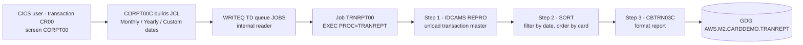
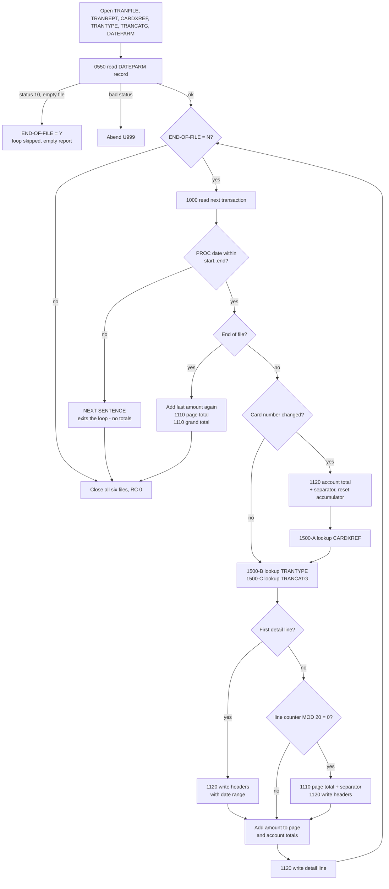

# Business Specification — Transaction Detail Report (job `TRANREPT`, program `CBTRN03C`)

Status: **DRAFT — awaiting human approval.** Input document for a future COBOL → Java migration. No code changes are proposed or made here.

Sources read in full for this specification:

| Artefact | Path |
|---|---|
| Batch program | `app/cbl/CBTRN03C.cbl` (649 lines) |
| Job JCL | `app/jcl/TRANREPT.jcl` (84 lines) |
| Catalogued procedure (CICS-submitted variant) | `app/proc/TRANREPT.prc` |
| REPRO utility procedure | `app/proc/REPROC.prc` |
| Online submitter (supplies the date parameters) | `app/cbl/CORPT00C.cbl` |
| Transaction record layout | `app/cpy/CVTRA05Y.cpy` |
| Card cross-reference layout | `app/cpy/CVACT03Y.cpy` |
| Transaction type layout | `app/cpy/CVTRA03Y.cpy` |
| Transaction category layout | `app/cpy/CVTRA04Y.cpy` |
| Report line layouts | `app/cpy/CVTRA07Y.cpy` |
| Dataset definitions | `app/jcl/DEFGDGB.jcl`, `app/jcl/REPTFILE.jcl`, `app/jcl/TRANFILE.jcl`, `app/jcl/TRANIDX.jcl`, `app/jcl/TRANTYPE.jcl`, `app/jcl/TRANCATG.jcl`, `app/catlg/LISTCAT.txt` |
| Schedules / drivers | `app/scheduler/CardDemo.ca7`, `app/scheduler/CardDemo.controlm`, `scripts/run_full_batch.sh`, `README.md` |

Every rule below cites the file and paragraph/line it was derived from. Anything not evidenced in those files is listed in **[§9 Open questions / gaps](#9-open-questions--gaps)** rather than assumed. The date-parameter copybook named in the migration request does not exist: the date parameters are described by an in-program layout, not a copybook (§3.1).

---

## 1. Purpose and position in the batch flow

### 1.1 Business purpose

`TRANREPT` produces the **Daily Transaction Report**: a printable, fixed-width listing of every posted transaction whose processing date falls inside a requested date range, grouped by card, enriched with transaction-type and transaction-category descriptions, with page subtotals, per-card ("Account Total") subtotals and a grand total. Program header: "Print the transaction detail report." (`app/cbl/CBTRN03C.cbl`, l.5); JCL comment: "Produce a formatted report for processed transactions" (`app/jcl/TRANREPT.jcl`, l.57).

Business outcomes of one run:

1. A new generation of the report dataset `AWS.M2.CARDDEMO.TRANREPT` containing the formatted 133-byte print lines (`TRANREPT.jcl`, l.76–80).
2. A filtered, card-number-ordered extract of the transaction master retained as `AWS.M2.CARDDEMO.TRANSACT.DALY(+1)` (`TRANREPT.jcl`, l.51–55).
3. A flat backup of the transaction master retained as `AWS.M2.CARDDEMO.TRANSACT.BKUP(+1)` (`TRANREPT.jcl`, l.29–33).

The job is **read-only against all business data**: no master file is updated. Its only outputs are the report and two working/backup extracts.

### 1.2 Position in the batch flow

**This job is not scheduled.** It appears in neither scheduler nor the shell driver:

* `app/scheduler/CardDemo.ca7` — the CA-7 trigger chains contain `CLOSEFIL`, `CBPAUP0J`, `POSTTRAN`, `WAITSTEP`, `OPENFIL`, `TRANTYPE`, `TRANCATG`, `TCATBALF`; no `TRANREPT`.
* `app/scheduler/CardDemo.controlm` — DAILY folder is `CLOSEFIL` → `TRANBKP` → `WAITSTEP` → `OPENFIL`; MONTHLY folder is `CLOSEFIL` → `INTCALC` → `COMBTRAN` → `WAITSTEP` → `OPENFIL`; weekly folders cover disclosure groups and transaction types. No `TRANREPT`.
* `scripts/run_full_batch.sh` — submits `CLOSEFIL`, `ACCTFILE`, `CARDFILE`, `XREFFILE`, `CUSTFILE`, `TRANBKP`, `DISCGRP`, `TCATBALF`, `TRANTYPE`, `DUSRSECJ`, `POSTTRAN`, `INTCALC`, `TRANBKP`, `COMBTRAN`, `TRANIDX`, `OPENFIL`. No `TRANREPT`.

It is instead **submitted on demand from the CICS online application**: `README.md` line 322 records "TRANREPT | CBTRN03C | Transaction Report - Submitted from CICS", and transaction `CR00` / program `CORPT00C` ("Transaction Reports", `README.md` line 281) builds the JCL in working storage and writes it to the `JOBS` transient data queue (the internal reader) line by line (`CORPT00C.cbl`, `SUBMIT-JOB-TO-INTRDR` l.462–510 and `WIRTE-JOBSUB-TDQ` l.515–535).

Business consequence: the report is a **user-initiated, ad-hoc reporting job**, not part of the nightly chain. Its only real predecessor dependency is that posting (`POSTTRAN`/`CBTRN02C`) has already loaded the transaction master `AWS.M2.CARDDEMO.TRANSACT.VSAM.KSDS`, which this job unloads in its first step.



---

## 2. Job steps, DD names and datasets

Two definitions of the same job exist and they differ; both are documented because both are live in the repository.

### 2.1 `app/jcl/TRANREPT.jcl` — standalone batch member

Job card `//TRANREPT JOB 'TRANSACTION REPORT', CLASS=A, MSGCLASS=0, NOTIFY=&SYSUID` (l.1–2); procedure library `AWS.M2.CARDDEMO.PROC` (l.19).

| # | Step name | Program / proc | Purpose | Line |
|---|---|---|---|---|
| 1 | `STEP05R` | `EXEC PROC=REPROC` → `PGM=IDCAMS` (`app/proc/REPROC.prc`, `PRC001`) | Unload ("REPRO") the transaction master KSDS to a flat sequential GDG generation | l.23–33 |
| 2 | `STEP05R` *(name duplicated — see §9)* | `PGM=SORT` | Filter the unloaded records to the requested date range and sequence them by card number | l.37–55 |
| 3 | `STEP10R` | `PGM=CBTRN03C` | Read the filtered extract and write the formatted report | l.59–80 |

**Step 1 — IDCAMS REPRO (`REPROC` procedure).** The procedure itself is `//PRC001 EXEC PGM=IDCAMS` with `SYSIN` taken from `&CNTLLIB(REPROCT)`, i.e. `AWS.M2.CARDDEMO.CNTL(REPROCT)` (`REPROC.prc`; `CNTLLIB` supplied at l.24 of the job). That control member is **not present in this repository** (§9).

| DD | Dataset | DISP | Organisation | Access |
|---|---|---|---|---|
| `PRC001.FILEIN` | `AWS.M2.CARDDEMO.TRANSACT.VSAM.KSDS` | `SHR` | VSAM KSDS, `RECORDSIZE(350 350)`, `KEYS(16 0)` (`app/jcl/TRANFILE.jcl`, l.49–54) | Sequential read by IDCAMS |
| `PRC001.FILEOUT` | `AWS.M2.CARDDEMO.TRANSACT.BKUP(+1)` | `(NEW,CATLG,DELETE)`, `UNIT=SYSDA`, `SPACE=(CYL,(1,1),RLSE)`, `DCB=(LRECL=350,RECFM=FB,BLKSIZE=0)` | Sequential GDG generation (`LIMIT(5) SCRATCH`, `app/jcl/DEFGDGB.jcl`, l.24–28) | Sequential write |
| `SYSPRINT` | `SYSOUT=*` | — | — | Utility messages |

**Step 2 — SORT.**

| DD | Dataset / content | DISP | Organisation | Access |
|---|---|---|---|---|
| `SORTIN` | `AWS.M2.CARDDEMO.TRANSACT.BKUP(+1)` | `SHR` | PS, FB 350 | Sequential read (same generation just created) |
| `SYMNAMES` | Instream symbol definitions (l.40–44) | — | — | — |
| `SYSIN` | Instream SORT/INCLUDE control statements (l.45–49) | — | — | — |
| `SORTOUT` | `AWS.M2.CARDDEMO.TRANSACT.DALY(+1)` | `(NEW,CATLG,DELETE)`, `UNIT=SYSDA`, `DCB=(*.SORTIN)`, `SPACE=(CYL,(1,1),RLSE)` | Sequential GDG generation (`LIMIT(5) SCRATCH`, `DEFGDGB.jcl`, l.30–34) | Sequential write |
| `SYSOUT` | `SYSOUT=*` | — | — | Sort messages |

Symbols and control statements (l.41–48):

| Symbol | Definition | Meaning |
|---|---|---|
| `TRAN-CARD-NUM` | position 263, length 16, format `ZD` | Card number (`TRAN-CARD-NUM` in `CVTRA05Y`) — the sort key, ascending |
| `TRAN-PROC-DT` | position 305, length 10, format `CH` | First 10 characters of `TRAN-PROC-TS` — the processing date |
| `PARM-START-DATE` | `C'2022-01-01'` | Report start date (hard-coded in this member) |
| `PARM-END-DATE` | `C'2022-07-06'` | Report end date (hard-coded in this member) |

`SORT FIELDS=(TRAN-CARD-NUM,A)` and `INCLUDE COND=(TRAN-PROC-DT,GE,PARM-START-DATE,AND,TRAN-PROC-DT,LE,PARM-END-DATE)` — i.e. **keep transactions whose processing date is within the inclusive range, ordered ascending by card number**. Card-number ordering is what makes the program's control break work (§5.3).

**Step 3 — `CBTRN03C`.** `STEPLIB` = `AWS.M2.CARDDEMO.LOADLIB` (l.60–61); `SYSOUT`/`SYSPRINT` to `SYSOUT=*` (l.62–63).

| DD | Dataset | DISP | Organisation | COBOL access (`CBTRN03C.cbl` l.29–57) | Open mode |
|---|---|---|---|---|---|
| `TRANFILE` | `AWS.M2.CARDDEMO.TRANSACT.DALY(+1)` | `SHR` | PS, FB 350 | `ORGANIZATION IS SEQUENTIAL` | `OPEN INPUT` (`0000-TRANFILE-OPEN`, l.376–392) |
| `CARDXREF` | `AWS.M2.CARDDEMO.CARDXREF.VSAM.KSDS` | `SHR` | VSAM KSDS, 50 bytes | `INDEXED`, `ACCESS RANDOM`, key `FD-XREF-CARD-NUM` `X(16)` | `OPEN INPUT` (`0200-CARDXREF-OPEN`, l.412–428) |
| `TRANTYPE` | `AWS.M2.CARDDEMO.TRANTYPE.VSAM.KSDS` | `SHR` | VSAM KSDS, `RECORDSIZE(60 60)`, `KEYS(2 0)` (`app/jcl/TRANTYPE.jcl`, l.36–41) | `INDEXED`, `ACCESS RANDOM`, key `FD-TRAN-TYPE` `X(02)` | `OPEN INPUT` (`0300-TRANTYPE-OPEN`, l.430–446) |
| `TRANCATG` | `AWS.M2.CARDDEMO.TRANCATG.VSAM.KSDS` | `SHR` | VSAM KSDS, `RECORDSIZE(60 60)`, `KEYS(6 0)` (`app/jcl/TRANCATG.jcl`, l.36–41) | `INDEXED`, `ACCESS RANDOM`, key `FD-TRAN-CAT-KEY` `X(02)+9(04)` | `OPEN INPUT` (`0400-TRANCATG-OPEN`, l.448–464) |
| `DATEPARM` | `AWS.M2.CARDDEMO.DATEPARM` | `SHR` | Non-VSAM sequential (`app/catlg/LISTCAT.txt`, "NONVSAM ------- AWS.M2.CARDDEMO.DATEPARM") | `ORGANIZATION IS SEQUENTIAL`, record `X(80)` | `OPEN INPUT` (`0500-DATEPARM-OPEN`, l.466–482) |
| `TRANREPT` | `AWS.M2.CARDDEMO.TRANREPT(+1)` | `(NEW,CATLG,DELETE)`, `UNIT=SYSDA`, `DCB=(LRECL=133,RECFM=FB,BLKSIZE=0)`, `SPACE=(CYL,(1,1),RLSE)` | Sequential GDG generation (base defined `LIMIT(10)` by `app/jcl/REPTFILE.jcl` l.24–28 and `LIMIT(5)` by `app/jcl/DEFGDGB.jcl` l.36–40; catalogue shows `LIMIT 5`) | `ORGANIZATION IS SEQUENTIAL`, record `X(133)` | `OPEN OUTPUT` (`0100-REPTFILE-OPEN`, l.394–410) |

All six files are opened up-front in the order `TRANFILE`, `TRANREPT`, `CARDXREF`, `TRANTYPE`, `TRANCATG`, `DATEPARM` (l.161–166) and closed in the same order at end of job (l.208–213). There is no `RETURN-CODE` setting anywhere in the program: a successful run ends RC 0, and any failure is an abend (§7).

### 2.2 `app/proc/TRANREPT.prc` — the procedure actually used online

Identical step content, but packaged as a procedure with **distinct step names** `STEP01R` (REPROC), `STEP05R` (SORT), `STEP10R` (CBTRN03C), and terminated with `PEND`. `CORPT00C` submits a five-line job that executes this procedure and overrides only the two parameter-bearing DDs (`CORPT00C.cbl`, l.83–125):

```
//TRNRPT00 JOB 'TRAN REPORT',CLASS=A,MSGCLASS=0,
// NOTIFY=&SYSUID
//JOBLIB JCLLIB ORDER=('AWS.M2.CARDDEMO.PROC')
//STEP10 EXEC PROC=TRANREPT
//STEP05R.SYMNAMES DD *        <- SORT symbols incl. PARM-START-DATE / PARM-END-DATE
//STEP10R.DATEPARM DD *        <- "YYYY-MM-DD YYYY-MM-DD" for CBTRN03C
```

So in the online path the **same pair of dates is supplied twice**: once to the SORT `INCLUDE` and once to the program (§3). In the standalone JCL member the SORT dates are hard-coded constants while the program reads a catalogued `DATEPARM` dataset, so the two can disagree (§9).

---

## 3. Date-range parameter handling

### 3.1 How the parameters are supplied

There is **no date-parameter copybook**. The layout is declared in working storage (`CBTRN03C.cbl`, l.122–125) and mapped onto the first 21 bytes of the 80-byte `DATEPARM` record (`FD-DATEPARM-REC PIC X(80)`, l.88):

| Offset | Field | PIC | Business meaning |
|---|---|---|---|
| 1–10 | `WS-START-DATE` | `X(10)` | Report start date, inclusive, expected `YYYY-MM-DD` |
| 11 | `FILLER` | `X(01)` | Single separator character (a space in every producer seen) |
| 12–21 | `WS-END-DATE` | `X(10)` | Report end date, inclusive, expected `YYYY-MM-DD` |
| 22–80 | *(not mapped)* | — | Ignored — the record is read `INTO` a 21-byte structure |

Producers of that record (`CORPT00C.cbl`, `PROCESS-ENTER-KEY`, l.208–443), all writing `YYYY-MM-DD` built from `FUNCTION CURRENT-DATE` or screen input:

| Screen option | Start date | End date | Lines |
|---|---|---|---|
| Monthly | 1st of the current month | last day of the current month (computed as *first of next month − 1 day* via `INTEGER-OF-DATE`/`DATE-OF-INTEGER`) | 213–238 |
| Yearly | 1 January of the current year | 31 December of the current year | 239–255 |
| Custom | `SDTYYYYI-SDTMMI-SDTDDI` from the screen | `EDTYYYYI-EDTMMI-EDTDDI` from the screen | 256–436 |

### 3.2 Validation — where it happens, and where it does not

**Online (CORPT00C), for the Custom option only** (l.256–426): each of the six date components must be non-blank; month must be numeric and ≤ 12; day must be numeric and ≤ 31; year must be numeric; then the assembled `YYYY-MM-DD` start and end dates are each passed to `CSUTLDTC` (the CICS date-validation utility) and rejected unless severity is `0000` or message number `2513`. **No check that start ≤ end** exists anywhere.

**Batch (CBTRN03C): none.** `0550-DATEPARM-READ` (l.220–243) reads one record and inspects only the *file status*:

| File status | `APPL-RESULT` | Program behaviour | Lines |
|---|---|---|---|
| `'00'` — record read | 0 | Displays `Reporting from <start> to <end>` and continues | 223–224, 231–233 |
| `'10'` — end of file (empty `DATEPARM`) | 16 (`APPL-EOF`) | Sets `END-OF-FILE = 'Y'` — **the main loop is never entered; the job ends normally with an empty report file and RC 0** | 225–226, 235–236 |
| anything else | 12 | Displays `ERROR READING DATEPARM FILE`, displays the file status, abends U999 | 227–228, 238–241 |

The date *values* are never validated by the batch program: no format check, no numeric check, no start ≤ end check, no missing-value check.

### 3.3 How the dates filter transactions

Filtering happens **twice**, on the same field, with the same inclusive semantics:

1. **In the SORT step** — `INCLUDE COND=(TRAN-PROC-DT,GE,PARM-START-DATE,AND,TRAN-PROC-DT,LE,PARM-END-DATE)` on bytes 305–314 (`TRANREPT.jcl`, l.47–48).
2. **In the program** — `IF TRAN-PROC-TS (1:10) >= WS-START-DATE AND TRAN-PROC-TS (1:10) <= WS-END-DATE` (l.173–174).

Both are **character comparisons** on the first 10 characters of the transaction's *processing* timestamp (not the origination timestamp), which is only equivalent to date ordering while the value is a zero-padded `YYYY-MM-DD`.

### 3.4 Behaviour when dates are missing or malformed

All of the following are derived from the code, not from documentation:

* **Empty `DATEPARM` dataset** → empty report, RC 0, no error (§3.2). The 133-byte report generation is still created and catalogued, containing zero records.
* **Blank dates in the record** → every transaction fails the `<= WS-END-DATE` half of the test (any printable date is greater than spaces in both EBCDIC and ASCII), so the very first transaction takes the `ELSE NEXT SENTENCE` path, which **terminates the main loop** (§5.1) — the report is created with no headers, no details and no totals.
* **Malformed but non-blank dates** (e.g. `01/02/2022`, unpadded, low-values) → the comparison silently produces an arbitrary subset; no diagnostic is issued.
* **Start later than end** → no transaction can satisfy both conditions, so the first record ends the loop as above: an empty report, no error.
* **Dates disagreeing between SORT and `DATEPARM`** (possible only in the standalone member, §2.1) → the SORT selection wins for what reaches the program, and the program's own filter then narrows it further or terminates the loop early.

---

## 4. Inputs and outputs — record layouts

### 4.1 `TRANFILE` — filtered transaction extract (`CVTRA05Y`, 350 bytes, PS/FB)

The program's FD describes only `FD-TRANS-DATA X(304)`, `FD-TRAN-PROC-TS X(26)`, `FD-FILLER X(20)` (l.62–65) and reads `INTO TRAN-RECORD` (l.249); all field meaning comes from the copybook.

| Offset | Field | PIC | Storage | Business meaning | Used by this job |
|---|---|---|---|---|---|
| 1–16 | `TRAN-ID` | `X(16)` | display | Transaction identifier (KSDS key on the master) | Detail column 1 |
| 17–18 | `TRAN-TYPE-CD` | `X(02)` | display | Transaction type code | Detail; key into `TRANTYPE` and part of `TRANCATG` key |
| 19–22 | `TRAN-CAT-CD` | `9(04)` | zoned display | Transaction category code | Detail; part of `TRANCATG` key |
| 23–32 | `TRAN-SOURCE` | `X(10)` | display | Capture source / channel | Detail column 5 |
| 33–132 | `TRAN-DESC` | `X(100)` | display | Free-text description | **not printed** |
| 133–143 | `TRAN-AMT` | `S9(09)V99` | zoned display, 11 bytes | Signed transaction amount, 2 decimals | Detail amount; all totals |
| 144–152 | `TRAN-MERCHANT-ID` | `9(09)` | zoned display | Merchant identifier | not used |
| 153–202 | `TRAN-MERCHANT-NAME` | `X(50)` | display | Merchant name | not used |
| 203–252 | `TRAN-MERCHANT-CITY` | `X(50)` | display | Merchant city | not used |
| 253–262 | `TRAN-MERCHANT-ZIP` | `X(10)` | display | Merchant postcode | not used |
| 263–278 | `TRAN-CARD-NUM` | `X(16)` | display | Card number | SORT key; control-break key; `CARDXREF` lookup key |
| 279–304 | `TRAN-ORIG-TS` | `X(26)` | display | Origination timestamp | not used |
| 305–330 | `TRAN-PROC-TS` | `X(26)` | display | Processing timestamp, DB2 character format | first 10 characters = the date filtered on (§3.3) |
| 331–350 | `FILLER` | `X(20)` | — | Reserved | — |

**Alternate index.** `AWS.M2.CARDDEMO.TRANSACT.VSAM.AIX` is defined over the master with `KEYS(26 304)` — i.e. on `TRAN-PROC-TS` — plus a path `…AIX.PATH` (`app/jcl/TRANIDX.jcl`, l.25–46; also `app/jcl/TRANFILE.jcl`, l.82–102). **This job does not use it.** It reaches the same result by unloading the whole master with IDCAMS and filtering with SORT. An AIX-based browse over the processing-timestamp range would be the direct alternative (§9).

### 4.2 `CARDXREF` — card cross-reference (`CVACT03Y`, 50 bytes, KSDS)

| Offset | Field | PIC | Business meaning | Used by this job |
|---|---|---|---|---|
| 1–16 | `XREF-CARD-NUM` | `X(16)` | **Primary key** — card number | Lookup key |
| 17–25 | `XREF-CUST-ID` | `9(09)` | Owning customer | not used |
| 26–36 | `XREF-ACCT-ID` | `9(11)` | Account the card belongs to | Printed as "Account ID" on every detail line |
| 37–50 | `FILLER` | `X(14)` | Reserved | — |

### 4.3 `TRANTYPE` — transaction type reference (`CVTRA03Y`, 60 bytes, KSDS)

| Offset | Field | PIC | Business meaning | Used by this job |
|---|---|---|---|---|
| 1–2 | `TRAN-TYPE` | `X(02)` | **Primary key** — transaction type code | Lookup key |
| 3–52 | `TRAN-TYPE-DESC` | `X(50)` | Transaction type description | Printed, **truncated to 15 characters** (§5.2) |
| 53–60 | `FILLER` | `X(08)` | Reserved | — |

### 4.4 `TRANCATG` — transaction category reference (`CVTRA04Y`, 60 bytes, KSDS)

| Offset | Field | PIC | Business meaning | Used by this job |
|---|---|---|---|---|
| 1–2 | `TRAN-TYPE-CD` | `X(02)` | **Key part 1** — transaction type | Lookup key |
| 3–6 | `TRAN-CAT-CD` | `9(04)` | **Key part 2** — category code | Lookup key |
| 7–56 | `TRAN-CAT-TYPE-DESC` | `X(50)` | Category description | Printed, **truncated to 29 characters** (§5.2) |
| 57–60 | `FILLER` | `X(04)` | Reserved | — |

### 4.5 `DATEPARM` — date parameter record

See §3.1.

### 4.6 `TRANREPT` — printed report (`CVTRA07Y`, 133-byte records, PS/FB)

Every line is built in a `CVTRA07Y` structure, moved into `FD-REPTFILE-REC PIC X(133)` and written by `1111-WRITE-REPORT-REC` (l.343–359). Structures shorter than 133 bytes are space-padded on the right by the COBOL `MOVE`. `RECFM=FB` (not `FBA`) — there is **no ANSI carriage-control byte and no form feed**; pagination is purely logical (§5.4).

---

## 5. Report structure and control-break logic

### 5.1 Main loop (`CBTRN03C.cbl`, l.170–206)

```
PERFORM UNTIL END-OF-FILE = 'Y'
   IF END-OF-FILE = 'N'
      PERFORM 1000-TRANFILE-GET-NEXT
      IF TRAN-PROC-TS (1:10) >= WS-START-DATE
         AND TRAN-PROC-TS (1:10) <= WS-END-DATE
         CONTINUE
      ELSE
         NEXT SENTENCE            <- see warning below
      END-IF
      IF END-OF-FILE = 'N'
         ... control break, three lookups, write detail ...
      ELSE
         ... add last amount again, write page total, write grand total ...
      END-IF
   END-IF
END-PERFORM.
```

Two behaviours here are load-bearing and neither is what the structure suggests:

* **`NEXT SENTENCE` exits the whole loop.** A COBOL sentence ends at the next period, which here is after `END-PERFORM` (l.206). `NEXT SENTENCE` therefore transfers control past the `END-PERFORM` to `PERFORM 9000-TRANFILE-CLOSE` (l.208) — it does **not** skip to the next transaction. The first record failing the date test ends report production immediately, with no page total, no account total and no grand total written. In the normal online flow this is masked because the SORT step has already removed out-of-range records, so the in-program test never fails; it becomes visible whenever the SORT dates and the `DATEPARM` dates disagree, or when `DATEPARM` holds blank/invalid dates (§3.4).
* **The end-of-file branch re-uses the last record.** When `1000-TRANFILE-GET-NEXT` hits status `'10'` it sets `END-OF-FILE = 'Y'` but leaves `TRAN-RECORD` holding the previously read transaction (l.248–272). The `ELSE` branch then displays and **adds `TRAN-AMT` to the page and account totals a second time** (l.198–201) before writing the closing page total and grand total. The last transaction of the extract is therefore counted twice in the page total and in the grand total.

### 5.2 Report line types

All widths below are taken from `app/cpy/CVTRA07Y.cpy`.

**Report name header (`REPORT-NAME-HEADER`, 115 bytes used of 133)** — written by `1120-WRITE-HEADERS` (l.324–341):

| Cols | Field | PIC | Content |
|---|---|---|---|
| 1–38 | `REPT-SHORT-NAME` | `X(38)` | literal `DALYREPT`, space-padded |
| 39–79 | `REPT-LONG-NAME` | `X(41)` | literal `Daily Transaction Report` |
| 80–91 | `REPT-DATE-HEADER` | `X(12)` | literal `Date Range: ` |
| 92–101 | `REPT-START-DATE` | `X(10)` | report start date (moved at l.277) |
| 102–105 | `FILLER` | `X(04)` | literal ` to ` |
| 106–115 | `REPT-END-DATE` | `X(10)` | report end date (moved at l.278) |

**Blank line** — `WS-BLANK-LINE PIC X(133) VALUE SPACES` (l.133).

**Column header (`TRANSACTION-HEADER-1`, 114 bytes)**:

| Cols | Width | Heading text |
|---|---|---|
| 1–17 | `X(17)` | `Transaction ID` |
| 18–29 | `X(12)` | `Account ID` |
| 30–48 | `X(19)` | `Transaction Type` |
| 49–83 | `X(35)` | `Tran Category` |
| 84–97 | `X(14)` | `Tran Source` |
| 98 | `X(01)` | space |
| 99–114 | `X(16)` | `        Amount` (8 leading spaces) |

**Separator (`TRANSACTION-HEADER-2`)** — `PIC X(133) VALUE ALL '-'`: a full-width rule of 133 hyphens.

**Detail line (`TRANSACTION-DETAIL-REPORT`, 114 bytes)** — built by `1120-WRITE-DETAIL` (l.361–374):

| Cols | Field | PIC | Source |
|---|---|---|---|
| 1–16 | `TRAN-REPORT-TRANS-ID` | `X(16)` | `TRAN-ID` |
| 17 | `FILLER` | `X(01)` | space |
| 18–28 | `TRAN-REPORT-ACCOUNT-ID` | `X(11)` | `XREF-ACCT-ID` (from the cross-reference, §6) |
| 29 | `FILLER` | `X(01)` | space |
| 30–31 | `TRAN-REPORT-TYPE-CD` | `X(02)` | `TRAN-TYPE-CD` |
| 32 | `FILLER` | `X(01)` | literal `-` |
| 33–47 | `TRAN-REPORT-TYPE-DESC` | `X(15)` | `TRAN-TYPE-DESC` — **truncated from 50 characters** |
| 48 | `FILLER` | `X(01)` | space |
| 49–52 | `TRAN-REPORT-CAT-CD` | `9(04)` | `TRAN-CAT-CD` |
| 53 | `FILLER` | `X(01)` | literal `-` |
| 54–82 | `TRAN-REPORT-CAT-DESC` | `X(29)` | `TRAN-CAT-TYPE-DESC` — **truncated from 50 characters** |
| 83 | `FILLER` | `X(01)` | space |
| 84–93 | `TRAN-REPORT-SOURCE` | `X(10)` | `TRAN-SOURCE` |
| 94–97 | `FILLER` | `X(04)` | spaces |
| 98–112 | `TRAN-REPORT-AMT` | `-ZZZ,ZZZ,ZZZ.ZZ` | `TRAN-AMT`, edited: leading minus for negatives, blank for positives, comma grouping, leading zeros suppressed |
| 113–114 | `FILLER` | `X(02)` | spaces |

Note the amount column occupies 98–112 while the `Amount` heading occupies 99–114 — the heading is one character right of the data and two wide of it. The detail line carries **no transaction date column**, even though the report is date-range driven.

**Total lines** — all three share the same geometry, amount right-aligned in columns 98–112 with an explicit sign (`+ZZZ,ZZZ,ZZZ.ZZ`, so positives print `+`):

| Line type | Structure | Cols 1–n label | Filler | Amount field | Written by |
|---|---|---|---|---|---|
| Page total | `REPORT-PAGE-TOTALS` | `Page Total` `X(11)` | `X(86)` of `.` | `REPT-PAGE-TOTAL` cols 98–112 | `1110-WRITE-PAGE-TOTALS` (l.293–304) |
| Account total | `REPORT-ACCOUNT-TOTALS` | `Account Total` `X(13)` | `X(84)` of `.` | `REPT-ACCOUNT-TOTAL` cols 98–112 | `1120-WRITE-ACCOUNT-TOTALS` (l.306–316) |
| Grand total | `REPORT-GRAND-TOTALS` | `Grand Total` `X(11)` | `X(86)` of `.` | `REPT-GRAND-TOTAL` cols 98–112 | `1110-WRITE-GRAND-TOTALS` (l.318–322) |

### 5.3 Control breaks and accumulation

| Accumulator | PIC | Added to | Reset | Printed |
|---|---|---|---|---|
| `WS-PAGE-TOTAL` | `S9(09)V99` display | every detail amount (l.287) plus the duplicated end-of-file amount (l.200) | to 0 after each page-total line (l.298) | as `Page Total` |
| `WS-ACCOUNT-TOTAL` | `S9(09)V99` display | same amounts as above (l.288, 201) | to 0 after each account-total line (l.310) | as `Account Total` |
| `WS-GRAND-TOTAL` | `S9(09)V99` display | each page total as it is printed (l.297) | never | as `Grand Total`, once, at end of job |

**Grouping key is the card number, not the account.** The break test is `IF WS-CURR-CARD-NUM NOT= TRAN-CARD-NUM` (l.181); the label printed is nevertheless "Account Total". Because one account can hold several cards, a subtotal labelled "Account Total" is in fact a **per-card** subtotal, and an account with two cards yields two such lines (§9).

Break sequence when the card changes (l.181–188):

1. If this is not the first transaction (`WS-FIRST-TIME = 'N'`), write the account-total line for the card just finished, reset the account accumulator, and write a separator line (`1120-WRITE-ACCOUNT-TOTALS`).
2. Remember the new card number and look up its account in `CARDXREF` (`1500-A-LOOKUP-XREF`).

**The final card group never gets an account-total line** — the break only fires on a card change, and the end-of-file branch (l.197–204) writes only the page total and the grand total.

### 5.4 Pagination

* `WS-PAGE-SIZE` is `9(03) COMP-3 VALUE 20` (l.131–132); `WS-LINE-COUNTER` is `9(09) COMP-3` starting at 0 (l.129–130) and is incremented by 1 for **every** line written — headers, separators, details and total lines alike.
* A page break is evaluated **only when a detail line is about to be written**: `IF FUNCTION MOD(WS-LINE-COUNTER, WS-PAGE-SIZE) = 0` (l.282–285). When it fires, the program writes the page total, a separator, then the four header lines, then the detail.
* Therefore the **page total for a page is printed at the top of the next page**, immediately before that page's headers, not at the foot of the page it belongs to.
* First page: 4 header lines + 16 detail lines = 20 lines. Subsequent pages: page total + separator + 4 header lines + 14 detail lines = 20 lines — **provided no account break occurs**.
* An account break inserts 2 lines without a page check, so the counter can step over a multiple of 20 (e.g. 19 → 21) and the page break is **skipped entirely**, producing a page of up to ~39 lines. This is a real behaviour of the current report, not a rounding effect.
* No form feed, no page number, no run date/time on the page: "page" exists only as this line-count rhythm (§4.6).

### 5.5 Processing / control-break flow



---

## 6. Lookup and enrichment rules

| Enrichment | Key built from | File | Paragraph | Frequency |
|---|---|---|---|---|
| Account number printed on each detail line | `TRAN-CARD-NUM` → `FD-XREF-CARD-NUM` (l.186) | `CARDXREF` KSDS | `1500-A-LOOKUP-XREF` (l.484–492) | **Only when the card number changes** (l.181–188); the account id from the last successful read is reused for every detail line of that card |
| Transaction type description | `TRAN-TYPE-CD` → `FD-TRAN-TYPE` (l.189) | `TRANTYPE` KSDS | `1500-B-LOOKUP-TRANTYPE` (l.494–502) | Every transaction |
| Transaction category description | `TRAN-TYPE-CD` + `TRAN-CAT-CD` → `FD-TRAN-CAT-KEY` (l.191–194) | `TRANCATG` KSDS | `1500-C-LOOKUP-TRANCATG` (l.504–512) | Every transaction |

**Behaviour when a lookup fails is identical in all three cases: the job abends.** Each `READ … INVALID KEY` displays a diagnostic (`INVALID CARD NUMBER : `, `INVALID TRANSACTION TYPE : `, `INVALID TRAN CATG KEY : `), moves the literal `23` into `IO-STATUS`, displays the file status and performs `9999-ABEND-PROGRAM` (U999). There is no default description, no "unknown" placeholder, no skip-and-continue and no reject file: **a single unreferenced code or an unregistered card kills the whole report run**, after an arbitrary number of report lines have already been written to the output generation.

Note also that the three lookups are performed **before** the date/first-time/page logic of `1100-WRITE-TRANSACTION-REPORT`, and are repeated for every transaction with no caching, even though transaction-type and category values repeat heavily.

---

## 7. Error handling, abends and restartability

### 7.1 Pattern

Every open, close and report write follows the same shape (e.g. `0000-TRANFILE-OPEN`, l.376–392): set `APPL-RESULT` to 8, perform the operation, set it to 0 when the file status is `'00'` else 12; if it is not 0, display a message, move the file status to `IO-STATUS`, `PERFORM 9910-DISPLAY-IO-STATUS`, `PERFORM 9999-ABEND-PROGRAM`.

| Operation | Paragraph | Lines | Statuses treated as success |
|---|---|---|---|
| Open `TRANFILE` / `TRANREPT` / `CARDXREF` / `TRANTYPE` / `TRANCATG` / `DATEPARM` | `0000`, `0100`, `0200`, `0300`, `0400`, `0500` | 376–482 | `'00'` only |
| Read `DATEPARM` | `0550-DATEPARM-READ` | 220–243 | `'00'`; `'10'` ends the job quietly (§3.2) |
| Read `TRANFILE` | `1000-TRANFILE-GET-NEXT` | 248–272 | `'00'`; `'10'` = end of file |
| Random reads of the three reference KSDSs | `1500-A/B/C` | 484–512 | Only `INVALID KEY` is trapped — **any other non-zero status is treated as a successful read** and stale record content is printed |
| Write report line | `1111-WRITE-REPORT-REC` | 343–359 | `'00'` only |
| Close all six files | `9000`–`9500` | 514–621 | `'00'` only |

### 7.2 Diagnostics and abend

* `9910-DISPLAY-IO-STATUS` (l.633–646) renders the two-byte status as four digits: for a non-numeric status or one beginning `'9'`, it prints the first byte plus the binary value of the second; otherwise `00` + the two digits. Output line: `FILE STATUS IS: NNNN<value>`.
* `9999-ABEND-PROGRAM` (l.626–630) displays `ABENDING PROGRAM` and calls the Language Environment service `CEE3ABD` with **abend code 999**, timing 0 — an immediate user abend. Files are not closed, no totals are written, no return code is set.
* The program also issues `DISPLAY TRAN-RECORD` for **every** transaction processed (l.180) — the entire 350-byte record goes to `SYSOUT`, plus `DISPLAY 'TRAN-AMT '` and `'WS-PAGE-TOTAL'` at end of file (l.198–199). On a production-sized extract this is a large, unstructured SYSOUT volume.

### 7.3 Restartability

* The job updates no master data, so a rerun is **functionally idempotent from a business standpoint** — the only side effects are new GDG generations.
* Each rerun consumes one generation of each of `AWS.M2.CARDDEMO.TRANSACT.BKUP`, `AWS.M2.CARDDEMO.TRANSACT.DALY` and `AWS.M2.CARDDEMO.TRANREPT`, all limited to 5 generations with `SCRATCH` (`DEFGDGB.jcl`), so repeated reruns silently roll off older reports and backups.
* On abend in step 3 the `TRANREPT(+1)` generation is `DISP=(NEW,CATLG,DELETE)` and is therefore deleted; the partially written report is not retained for diagnosis.
* There is no checkpoint and no restart logic: recovery is to correct the parameters or reference data and resubmit the whole job from step 1.
* Because the job reads the live transaction master with `DISP=SHR` in step 1, a run concurrent with posting sees whatever has been committed at that moment; there is no isolation or point-in-time guarantee.

---

## 8. Data-type and modernization concerns for the Java target

| Concern | Evidence | Java implication |
|---|---|---|
| **Business amounts are zoned DISPLAY, not COMP-3** | Verified in the copybooks: `CVTRA05Y` declares `TRAN-AMT PIC S9(09)V99` with no `COMP-3`/`COMP`; the whole record reconciles to 350 bytes only if that field occupies 11 bytes. `CVTRA03Y`, `CVTRA04Y`, `CVACT03Y` and `CVTRA07Y` contain no packed or binary items at all. | Parse signed zoned decimal with a trailing-byte sign overpunch; map to `BigDecimal` with **scale exactly 2**. Do not write a packed-decimal reader for these files. |
| **The only packed/binary fields are internal counters** | `WS-LINE-COUNTER PIC 9(09) COMP-3`, `WS-PAGE-SIZE PIC 9(03) COMP-3` (l.129–132), `APPL-RESULT PIC S9(9) COMP`, `ABCODE`/`TIMING PIC S9(9) BINARY`, `TWO-BYTES-BINARY PIC 9(4) BINARY` (l.142–156). | Plain `int`/`long`; they never reach a file. |
| **Totals are DISPLAY `S9(09)V99` — 9 integer digits** | `WS-PAGE-TOTAL`, `WS-ACCOUNT-TOTAL`, `WS-GRAND-TOTAL` (l.134–136). | A grand total above 999,999,999.99 is silently truncated on the high order in COBOL. Use unbounded `BigDecimal` in Java and decide explicitly whether to reproduce truncation or raise an error. The edited output pictures also carry only 9 integer digits, so overflow is invisible in the printed report too. |
| **No rounding anywhere** | Only `ADD` of 2-decimal operands (l.200–201, 287–288, 297). | `BigDecimal.add` with scale 2; never `double`. No `RoundingMode` needs to be emulated. |
| **Signs** | Amounts are signed; detail uses `-ZZZ,ZZZ,ZZZ.ZZ` (blank for positive), totals use `+ZZZ,ZZZ,ZZZ.ZZ` (explicit `+`). | Two different sign conventions in one report; reproduce per line type or agree a single convention with the business. |
| **Dates are compared as text, not as dates** | `TRAN-PROC-TS (1:10) >= WS-START-DATE` (l.173–174) and the SORT `INCLUDE` on `CH` data (`TRANREPT.jcl`, l.47–48). | Correct only for zero-padded `YYYY-MM-DD`. Either replicate the lexicographic comparison exactly, or parse to `LocalDate` and define explicit behaviour for unparseable, blank or out-of-order values (today: silent empty report). |
| **Timestamps are 26-character DB2 text** | `TRAN-PROC-TS PIC X(26)` (`CVTRA05Y`); only the first 10 characters are used. | Keep the text form for fidelity, or store a timestamp and pin the time zone; the report never prints the timestamp, so only the date semantics matter. |
| **Card number is alphanumeric but sorted as zoned decimal** | `SYMNAMES` declares `TRAN-CARD-NUM,263,16,ZD` (`TRANREPT.jcl`, l.41) while `CVTRA05Y` declares `PIC X(16)`. | For all-numeric card numbers the ZD ordering matches numeric order, so results look correct today; a non-numeric card number would sort unpredictably (we believe it can also raise a sort data exception, unverified). In Java, sort as a zero-padded string and validate numeric-ness explicitly. |
| **Fixed-width report formatting with exact column positions** | §5.2 column tables; 133-byte records, `RECFM=FB` without carriage control. | Formatting must be byte-exact if downstream consumers (print, TXT2PDF, archive) rely on positions. Use a fixed-width writer with explicit column map, and reproduce the COBOL edited pictures (`Z` suppression, comma grouping, sign placement, space padding to 133). |
| **Description truncation is part of the output contract** | 50-character descriptions moved into `X(15)` and `X(29)` fields (l.366, 368). | Truncate, do not wrap or ellipsize, unless the business agrees to change the layout. |
| **EBCDIC vs ASCII** | Mainframe datasets are EBCDIC (`app/data/EBCDIC/…`; ASCII copies exist under `app/data/ASCII/`). | Pin the code page (typically IBM-1047) for fixed-width parsing, for the zoned sign overpunch, and for the `>=`/`<=` comparisons, whose collating sequence differs between EBCDIC and ASCII for mixed alphanumeric data. The report output encoding must also be agreed with whatever consumes the GDG. |
| **Two-pass architecture (unload + sort + read) is an artefact of VSAM** | Steps 1–2 exist only to produce a card-ordered, date-filtered flat file (§2.1); the processing-timestamp AIX (§4.1) is unused. | In Java this collapses to a single ordered query (`WHERE proc_date BETWEEN :start AND :end ORDER BY card_number, …`). Decide whether the intermediate `BKUP`/`DALY` datasets remain a business deliverable or disappear. |
| **Secondary sort within a card is undefined** | `SORT FIELDS=(TRAN-CARD-NUM,A)` only (l.46). | Detail-line order inside a card group is not deterministic across sort implementations. Java must define an explicit tiebreaker (transaction id or processing timestamp) — a behaviour change that needs sign-off. |
| **Lookup failure = abend** | §6. | A Java batch should decide between fail-fast (current behaviour) and a per-row error/`UNKNOWN` description with a reject count. Current behaviour leaves a deleted, partially written output. |
| **Reporting approach** | Whole-report line composition in one sequential pass with manual line counting. | Direct fit for Spring Batch (`FlatFileItemReader`/`FlatFileItemWriter` with a `FormatterLineAggregator`) or a report engine; the control-break and pagination logic becomes an explicit grouping step. If page rhythm and per-card subtotals are only presentational, a reporting tool over a query is the lower-risk target. |

---

## 9. Open questions / gaps

Items that are ambiguous, unimplemented, defective or inconsistent in the source and must be resolved by a human before the Java design is finalised.

1. **`NEXT SENTENCE` terminates the report loop** (l.177). Any out-of-range transaction ends the run with no totals. Is this to be fixed (skip the record and continue) or reproduced bug-for-bug? A fix changes output whenever the SORT and `DATEPARM` date ranges disagree.
2. **The last transaction's amount is added twice** to the page total and grand total at end of file (l.198–201). Confirm this is a defect to correct; it changes the printed grand total.
3. **The last card group never gets an "Account Total" line** (§5.3). Correct or reproduce?
4. **"Account Total" is really a per-card subtotal** (break on `TRAN-CARD-NUM`, §5.3). Should the Java report group by account (aggregating all cards) or keep per-card grouping with corrected labelling?
5. **Page breaks can be skipped** when an account break carries the line counter past a multiple of 20 (§5.4). Confirm target pagination rules: fixed lines per page, page numbers, a page-total at the foot rather than the head of the following page?
6. **Page totals print at the top of the following page** (§5.4). Intended, or an artefact?
7. **No transaction date column on the detail line** despite a date-range report (§5.2). Should the target report add one?
8. **Any failed reference lookup abends the job** (§6) — including a single unknown transaction-type or category code, or a card absent from the cross-reference. Is fail-fast the intended business rule, or should unknown codes print a placeholder and be counted?
9. **Non-`INVALID KEY` I/O errors on the three reference reads are not checked** (l.484–512) — a hard error is treated as a successful read and stale data is printed. Should the Java version fail instead?
10. **Empty or blank `DATEPARM` yields an empty, successful report** (§3.2, §3.4) with RC 0. Should missing/invalid parameters fail the job?
11. **No start ≤ end validation** in either the online submitter or the batch program (§3.2).
12. **Date parameters are supplied twice** — to the SORT and to the program (§2.2) — with no cross-check. In `app/jcl/TRANREPT.jcl` the SORT dates are hard-coded to `2022-01-01`/`2022-07-06` (l.43–44) while the program reads the catalogued `AWS.M2.CARDDEMO.DATEPARM`, so the standalone member can silently report on a different range than requested. Which is authoritative in the target design?
13. **Duplicate step name `STEP05R`** in `app/jcl/TRANREPT.jcl` (l.23 and l.37), where `app/proc/TRANREPT.prc` uses `STEP01R`/`STEP05R`/`STEP10R`. The JCL member and the procedure have diverged; step-level overrides against the member would be ambiguous. Which member is maintained?
14. **`AWS.M2.CARDDEMO.CNTL(REPROCT)`** — the IDCAMS control statements for the unload step — **is not in this repository** (`REPROC.prc`). Its exact `REPRO` options (record selection, count limits) are therefore unverified.
15. **`AWS.M2.CARDDEMO.DATEPARM` has no creating job in the repository** and no sample data file under `app/data/`. Outside the CICS path, who maintains it?
16. **GDG limit inconsistency for the report base**: `app/jcl/REPTFILE.jcl` defines `LIMIT(10)`, `app/jcl/DEFGDGB.jcl` defines `LIMIT(5)`, and `app/catlg/LISTCAT.txt` shows `LIMIT 5`. How many report generations must be retained, and is 5 acceptable as a business retention policy?
17. **The processing-timestamp alternate index is unused** (§4.1). Was the unload+sort approach chosen for performance, or is the AIX dead infrastructure?
18. **Secondary ordering within a card group is undefined** (§8). Agree the intended detail ordering.
19. **`DISPLAY TRAN-RECORD` per transaction** (l.180) — debug output left in production code. Confirm it can be dropped in the target.
20. **The job is not in any scheduler** (§1.2). Confirm the target state: does the report stay user-initiated (an online/API request) or become a scheduled deliverable?
21. **Consumer of the report generation is not established here.** Nothing in the repository reads `AWS.M2.CARDDEMO.TRANREPT`. Is it printed, archived, converted (there is a `TXT2PDF1.JCL` member, unconnected to this job), or downloaded?

---

## 10. Proposed fixes / next steps

Not to be actioned until this document is approved.

1. **Business walkthrough of §5** to settle the six output-affecting defects and ambiguities — items 1, 2, 3, 4, 5, 6 of §9 — since each changes the printed report and must be decided before any Java layout is fixed.
2. **Decide the failure policy for reference-data lookups** (§9 items 8, 9) and, if fail-fast is dropped, define the placeholder text and an exception/rejection report.
3. **Define the parameter contract**: a single validated date range (format, inclusivity, start ≤ end, behaviour when absent), supplied once rather than twice (§9 items 10–12).
4. **Agree the output contract**: keep the 133-byte fixed-width EBCDIC-derived layout for continuity, or move to a structured output (CSV/PDF/JSON) with the fixed-width form as a rendering option. This decision drives whether §8's byte-exact formatting work is needed at all.
5. **Build a golden-data regression harness before writing Java**: run `TRANREPT` over a fixed transaction extract and a fixed date range, and capture the resulting report generation byte-for-byte as the expected result, so the Java implementation can be proven equivalent line-for-line (including, deliberately, any defects chosen to be preserved).
6. **Pin encoding and decimal decisions centrally** (IBM-1047, zoned-decimal sign overpunch, `BigDecimal` scale 2, no rounding) in a shared conversion utility rather than per-field code, shared with the `POSTTRAN`/`INTCALC` migrations.
7. **Extend this spec set** to the remaining reporting artefacts in the same family (`CREASTMT`/`CBSTM03A` statements, `PRTCATBL`, `TXT2PDF1`) so the reporting domain can be migrated as a unit.
