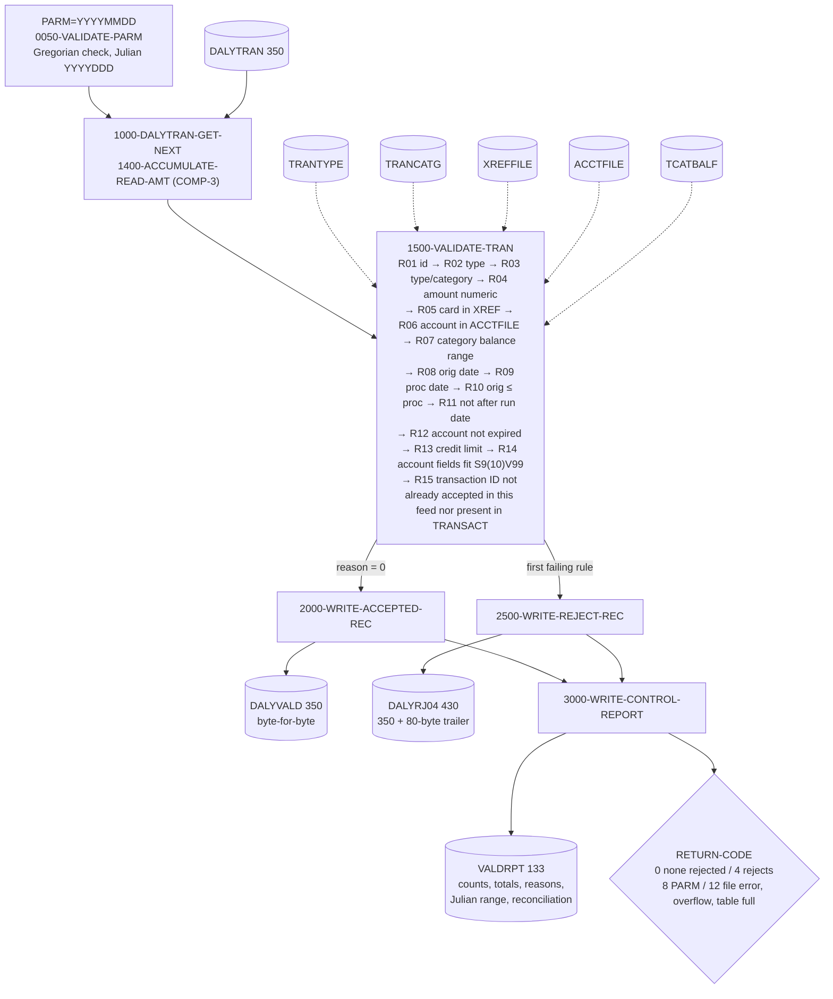

# Change request: pre-posting validation of the daily transaction feed (CBTRN04C)

## 1. Tasking (restated)

The daily transaction feed (`DALYTRAN`, layout `app/cpy/CVTRA06Y.cpy`, 350 bytes)
is posted by `CBTRN02C` (`app/cbl/CBTRN02C.cbl`, job `app/jcl/POSTTRAN.jcl`).
Malformed records are only discovered when posting fails or rejects them, after
the master files have started to change. The change adds a validation step that
runs before `CBTRN02C` in the same job and produces:

- a clean feed (`DALYVALD`) containing the accepted records byte-for-byte unchanged;
- a reject file (`DALYRJ04`) holding each rejected record (350 bytes) plus an
  80-byte trailer with a 4-digit reason code and 76-byte reason text;
- a control-total report (`VALDRPT`) with records read / accepted / rejected,
  rejects by reason code, accepted and rejected amount totals, the Julian run
  date and Julian range of accepted transactions, and reconciliation lines;
- return code 0 (nothing rejected), 4 (some records rejected), 8 (PARM invalid)
  or 12 (file error) so the posting step can be conditioned on it.

Nothing under `app/` that already existed is modified. `POSTTRAN.jcl` and
`CBTRN02C.cbl` are untouched; whether to swap the posting job is a system-owner
decision (see `government-decisions.md`).

## 2. Design

`CBTRN04C` is a plain sequential batch program modelled on `CBTRN02C`: same
file-status blocks, `APPL-RESULT` open/close paragraphs, `9910-DISPLAY-IO-STATUS`
and `9999-ABEND-PROGRAM` conventions, and the same 350 + 80 byte reject record
(`REJECT-TRAN-DATA` / `VALIDATION-TRAILER`). It reads `DALYTRAN` once. For every
record it accumulates the amount into packed-decimal (`COMP-3`) totals, then runs
the rules of section 4 in a fixed order through `1500-VALIDATE-TRAN`; the first
failing rule sets the reason and the rest are skipped, exactly as the sequential
`IF WS-VALIDATION-FAIL-REASON = 0` chain in `CBTRN02C` does. Accepted records are
written from the input buffer to `DALYVALD`; rejected records go to `DALYRJ04`
with the trailer. Reference data (`TRANTYPE`, `TRANCATG`, `XREFFILE`, `ACCTFILE`,
`TCATBALF`, `TRANFILE`) is read with random keyed reads using the production
copybooks; the transaction target is opened `INPUT` only, never written. The
three account checks `CBTRN02C` makes at posting time (`1500-B-LOOKUP-ACCT`:
account exists, credit limit, account expiration) are repeated here with the same
reason codes 0101-0103, so a feed that passes validation posts without account
rejects. Two balance checks work from projections, not from the files alone,
because `CBTRN02C` rewrites `TRAN-CAT-BAL`, `ACCT-CURR-BAL`,
`ACCT-CURR-CYC-CREDIT` and `ACCT-CURR-CYC-DEBIT` after every posting: the first record for an
account/type/category key starts from the `TCATBALF` balance and the first record
for an account starts from the account master's current balance and cycle
credit and debit; every
accepted record advances the in-storage projection for its key
(`1950-UPDATE-BAL-PROJECTION`, `1960-UPDATE-ACCT-PROJECTION`) so later records in
the same feed are checked against the balance the posting step will actually
have by then; rejected records leave both projections untouched because posting
never sees them. Each projection table holds 20,000 keys and a larger feed ends
with RC 12 rather than validating against a stale balance. The same account
projection feeds R14, which rejects a record whose posting arithmetic would leave
the picture of `WS-TEMP-BAL` (`S9(09)V99`) or of the three `S9(10)V99` account
fields, none of which `CBTRN02C` guards with `ON SIZE ERROR`. Transaction-ID uniqueness (R15) is checked last: an ID already in the
transaction target or already accepted earlier in the feed is rejected with
0211, because `CBTRN02C` rewrites the category and account masters before its
keyed `WRITE` would fail on the duplicate. Only a record actually written to
`DALYVALD` reserves its ID (`1970-UPDATE-ID-TABLE`), so a rejected first
occurrence leaves the ID free for a later valid record. The expiration and
credit-limit checks run after the date rules so that both operands of the
expiration compare are known-valid `YYYY-MM-DD` strings (a character compare of
two such strings is chronological in any collating sequence; `CBTRN02C` compares
the raw field). Dates are the
first ten bytes (`YYYY-MM-DD`) of the 26-byte timestamps; a COBOL paragraph
(`5000-VALIDATE-GREGORIAN-DATE`) validates month/day/leap year and converts each
valid date to Julian `YYYYDDD`, so the program has no runtime dependency on
`CEEDAYS`. The run date arrives as `PARM='YYYYMMDD'` and is retrieved with the
Language Environment service `CEE3PRM`. Every amount accumulator and projection
is `COMP-3` with `ON SIZE ERROR`; an overflow ends the run with RC 12 instead of
a wrapped total. At end of file every input, reference and
output file is closed first and only then is the control-total report written and
closed, so the return code printed on the report is the one the step ends with
(a close failure sets RC 12 before the report line is produced). The report
file itself is closed last; if that close fails the program writes
`VALDRPT RETURN CODE LINE n IS SUPERSEDED, STEP ENDS WITH 12` to SYSOUT and
ends with RC 12, so the step return code in the job log, not the report line,
is authoritative in that one case. The report
includes the hexadecimal image of the packed accepted-amount field so the packed
representation can be inspected on the report.

Job flow (`app/jcl/POSTTRN2.jcl`): `STEP10 CBTRN04C` writes `DALYVALD(+1)`,
`DALYRJ04(+1)`; `STEP12 IEFBR14` has `COND=(4,GE,STEP10)` and so runs only when
the validation step ended above 4, deleting the two generations `STEP10`
cataloged so a failed validation leaves nothing behind; `STEP15 CBTRN02C` reads
`DALYVALD(+1)` as its `DALYTRAN` and has `COND=(4,LT,STEP10)`, so posting is
bypassed when the validation step ends above 4. Both steps read the same
`ACCTDATA`, `TCATBALF` and `TRANSACT` clusters (`DISP=SHR`, as in `POSTTRAN.jcl`),
and the balances `STEP10` projects are only valid if nothing else updates those
files between `STEP10` and `STEP15`; the JCL states this and the exclusivity
control (scheduler resource, `DISP=OLD`, or run-window) is a system-owner
decision (`government-decisions.md`). `app/jcl/VALDTRAN.jcl` runs the
validation alone with the same cleanup step; `app/jcl/DALYRJ04.jcl` defines the
two GDG bases in the same shape as `DALYREJS.jcl`.

## 3. Numbers

Headline: **16 validation rules implemented, each traced to a source line and each
proven by at least one named test case; 61 test cases; control totals reconcile.**

The table below is checked against the source, the test fixtures and the other
documents by `tests/cbtrn04c/tools/check_docs_sync.py`, which `run_tests.sh` runs.

<!-- numbers:begin -->
| Measure | Value |
|---------|-------|
| Validation rules implemented | 16 |
| Source citations (distinct `path:line`) | 80 |
| Test cases | 61 |
| Rules confirmed by repository source | 6 |
| Rules inferred (need owner confirmation) | 10 |
| Government decisions listed | 15 |
| Sample-data records read | 300 |
| Sample-data records accepted | 262 |
| Sample-data records rejected | 38 |
| Sample-data accepted amount total | 77,954.70 |
| Sample-data rejected amount total | 26,846.84 |
| Sample-data run date (Julian) | 2022199 |
| Sample-data accepted origination range (Julian) | 2022161 - 2022161 |
| Sample-data return code | 4 |
<!-- numbers:end -->

## 4. Validation rules

Reason codes `0201`–`0211` are new. `0100`–`0103` are the codes `CBTRN02C`
already assigns to an unknown card (`app/cbl/CBTRN02C.cbl:385`), a missing account
(`:397`), an over-limit transaction (`:410`) and an expired account (`:417`); they
are reused unchanged with the same text so both programs agree, and the new codes
start at `0201` to stay clear of that range. "Confirmed" means the repository
source justifies the rule as stated; "Inferred" means the conservative check was
implemented and the owner must confirm it (`open-questions.md`). Test case names
are directories under `tests/cbtrn04c/cases/`. The rules are listed in the order
they run; the report lists reason codes grouped by code.

<!-- rules:begin -->
| # | Rule | Reason code | Source citation (`path:line`) | Confirmed / Inferred | Test case that proves it |
|---|------|-------------|-------------------------------|----------------------|--------------------------|
| R01 | `DALYTRAN-ID` present: not all spaces and not all LOW-VALUES | 0201 | `app/cpy/CVTRA06Y.cpy:5`; `app/cbl/CBTRN04C.cbl:947` | Inferred — needs owner confirmation | `rule01_id_spaces`, `rule01_id_low_values` |
| R02 | `DALYTRAN-TYPE-CD` exists as `TRAN-TYPE` in `TRANTYPE` | 0202 | `app/cpy/CVTRA06Y.cpy:6`; `app/cpy/CVTRA03Y.cpy:5`; `app/cbl/CBTRN04C.cbl:956` | Inferred — needs owner confirmation | `rule02_type_unknown` |
| R03 | `DALYTRAN-TYPE-CD` + `DALYTRAN-CAT-CD` exists as `TRAN-CAT-KEY` in `TRANCATG` (the category is only meaningful with its type: the file key is the pair, and posting keys the balance record on the same pair) | 0203 | `app/cpy/CVTRA06Y.cpy:7`; `app/cpy/CVTRA04Y.cpy:5`; `app/cpy/CVTRA04Y.cpy:6`; `app/cpy/CVTRA04Y.cpy:7`; `app/cbl/CBTRN02C.cbl:506`; `app/cbl/CBTRN04C.cbl:979` | Inferred — needs owner confirmation | `rule03_category_unknown` |
| R04 | `DALYTRAN-AMT` passes the NUMERIC class test for `PIC S9(09)V99` (digits with a valid overpunched sign); the value is carried in a `COMP-3` field | 0204 | `app/cpy/CVTRA06Y.cpy:10`; `app/cbl/CBTRN04C.cbl:883`; `app/cbl/CBTRN04C.cbl:1003` | Confirmed | `rule04_amount_alpha`, `rule04_amount_invalid_sign`, `rule04_amount_spaces` |
| R05 | `DALYTRAN-CARD-NUM` exists as `XREF-CARD-NUM` in `XREFFILE`; same lookup and same reason code as `CBTRN02C` | 0100 | `app/cbl/CBTRN02C.cbl:380`; `app/cbl/CBTRN02C.cbl:385`; `app/cpy/CVACT03Y.cpy:5`; `app/cpy/CVTRA06Y.cpy:15`; `app/cbl/CBTRN04C.cbl:1016` | Confirmed | `rule05_card_unknown` |
| R06 | The account the card cross-reference points to (`XREF-ACCT-ID`) exists in `ACCTFILE`; same keyed read and same reason code as `CBTRN02C` | 0101 | `app/cbl/CBTRN02C.cbl:394`; `app/cbl/CBTRN02C.cbl:395`; `app/cbl/CBTRN02C.cbl:397`; `app/cpy/CVACT03Y.cpy:7`; `app/cpy/CVACT01Y.cpy:5`; `app/cbl/CBTRN04C.cbl:1045`; `app/cbl/CBTRN04C.cbl:1049` | Confirmed | `rule06_acct_missing` |
| R07 | Amount fits downstream: projected `TRAN-CAT-BAL` + amount must stay within `S9(09)V99` (the narrowest target; `CBTRN02C` adds to it with no `SIZE ERROR` and rewrites it after every posting, so the projection carries every earlier accepted amount for the same account/type/category key). `TRAN-AMT` is also `S9(09)V99`, so a lone amount always fits it; `ACCT-CURR-BAL` is `S9(10)V99`, wider than the feed; the account fields are projected separately under R14 | 0205 | `app/cpy/CVTRA01Y.cpy:9`; `app/cpy/CVTRA05Y.cpy:10`; `app/cpy/CVACT01Y.cpy:7`; `app/cbl/CBTRN02C.cbl:508`; `app/cbl/CBTRN02C.cbl:527`; `app/cbl/CBTRN02C.cbl:547`; `app/cbl/CBTRN04C.cbl:1098`; `app/cbl/CBTRN04C.cbl:1337` | Inferred — needs owner confirmation | `rule07_amount_max_downstream`, `rule07_amount_one_cent_over`, `rule07_amount_negative_max`, `rule07_amount_negative_floor`, `rule07_batch_second_record_overflows`, `rule07_batch_reject_not_projected` |
| R08 | `DALYTRAN-ORIG-TS` bytes 1-10 are a valid Gregorian `YYYY-MM-DD` (real month and day, leap years by the 4/100/400 rule); converted to Julian `YYYYDDD` | 0206 | `app/cpy/CVTRA06Y.cpy:16`; `app/cbl/CBTRN02C.cbl:414`; `app/cbl/CBTRN04C.cbl:1146`; `app/cbl/CBTRN04C.cbl:1625`; `app/cbl/CBTRN04C.cbl:1675` | Inferred — needs owner confirmation | `rule08_orig_feb30`, `rule08_orig_leap_day_valid`, `rule08_orig_leap_day_nonleap`, `rule08_orig_century_leap`, `rule08_orig_century_nonleap`, `rule08_orig_month_13`, `rule08_orig_not_numeric` |
| R09 | `DALYTRAN-PROC-TS`, when present, has a valid Gregorian date in bytes 1-10; a blank value is accepted because `CBTRN02C` overwrites `TRAN-PROC-TS` with the posting timestamp | 0207 | `app/cpy/CVTRA06Y.cpy:17`; `app/cbl/CBTRN02C.cbl:438`; `app/cbl/CBTRN04C.cbl:1164` | Inferred — needs owner confirmation | `rule09_proc_apr31`, `rule09_proc_blank_accepted` |
| R10 | Origination date is not after the processing date (when a processing timestamp is present); dates only, the time of day is not compared | 0208 | `app/cbl/CBTRN02C.cbl:436`; `app/cbl/CBTRN04C.cbl:1178` | Inferred — needs owner confirmation | `rule10_orig_after_proc` |
| R11 | Neither date is after the run date passed as `PARM='YYYYMMDD'` (the `INTCALC.jcl` / `CBACT04C` way of passing a date) | 0209 | `app/jcl/INTCALC.jcl:22`; `app/cbl/CBACT04C.cbl:178`; `app/cbl/CBTRN04C.cbl:630`; `app/cbl/CBTRN04C.cbl:1190` | Inferred — needs owner confirmation | `rule11_orig_future`, `rule11_proc_future`, `rule11_dates_equal_run_date` |
| R12 | `ACCT-EXPIRAION-DATE >= DALYTRAN-ORIG-TS (1:10)`, the same character compare as `CBTRN02C`, evaluated once the origination date is known valid (R08) so the compare is chronological in any collating sequence | 0103 | `app/cbl/CBTRN02C.cbl:414`; `app/cbl/CBTRN02C.cbl:417`; `app/cpy/CVACT01Y.cpy:11`; `app/cbl/CBTRN04C.cbl:1214`; `app/cbl/CBTRN04C.cbl:1215` | Confirmed | `rule12_acct_expired`, `rule12_acct_expiry_boundary` |
| R13 | `ACCT-CREDIT-LIMIT >= ACCT-CURR-CYC-CREDIT - ACCT-CURR-CYC-DEBIT + amount`, the `CBTRN02C` credit-limit test, evaluated against a per-account projection: the first record for an account starts from the master values and every accepted record advances the projection the way `2800-UPDATE-ACCOUNT-REC` will (credit for amounts >= 0, debit otherwise); rejected records do not advance it. Runs after R12 because `CBTRN02C` evaluates both and the later 103 overwrites 102 when both fail | 0102 | `app/cbl/CBTRN02C.cbl:403`; `app/cbl/CBTRN02C.cbl:407`; `app/cbl/CBTRN02C.cbl:410`; `app/cbl/CBTRN02C.cbl:549`; `app/cbl/CBTRN02C.cbl:551`; `app/cpy/CVACT01Y.cpy:8`; `app/cpy/CVACT01Y.cpy:13`; `app/cpy/CVACT01Y.cpy:14`; `app/cbl/CBTRN04C.cbl:1067`; `app/cbl/CBTRN04C.cbl:1226`; `app/cbl/CBTRN04C.cbl:1361` | Confirmed | `rule13_credit_limit_at`, `rule13_credit_limit_over`, `rule13_credit_projection`, `rule13_acct_reject_not_projected` |
| R14 | Posting arithmetic fits the account master: `CBTRN02C` computes the limit test into `WS-TEMP-BAL` `S9(09)V99` and `2800-UPDATE-ACCOUNT-REC` adds the amount to `ACCT-CURR-BAL` and to `ACCT-CURR-CYC-CREDIT` (amount >= 0) or `ACCT-CURR-CYC-DEBIT`, all `S9(10)V99`, none with `ON SIZE ERROR`. The projected limit-test value must stay within `S9(09)V99` and each projected account field within `S9(10)V99`; the projection is per account and carries `ACCT-CURR-BAL` and both cycle fields forward from every earlier accepted record (rejected records do not advance it). Runs last so 0102/0103 stay what `CBTRN02C` would report when they also fail | 0210 | `app/cbl/CBTRN02C.cbl:187`; `app/cbl/CBTRN02C.cbl:403`; `app/cbl/CBTRN02C.cbl:547`; `app/cbl/CBTRN02C.cbl:549`; `app/cbl/CBTRN02C.cbl:551`; `app/cpy/CVACT01Y.cpy:7`; `app/cpy/CVACT01Y.cpy:13`; `app/cpy/CVACT01Y.cpy:14`; `app/cbl/CBTRN04C.cbl:1247`; `app/cbl/CBTRN04C.cbl:1083` | Inferred — needs owner confirmation | `rule14_curr_bal_at_max`, `rule14_curr_bal_one_cent_over`, `rule14_curr_bal_below_min`, `rule14_curr_bal_projection`, `rule14_cyc_credit_over`, `rule14_cyc_debit_over`, `rule14_limit_test_over_s9_09`, `rule14_limit_test_at_s9_09` |
| R15 | `DALYTRAN-ID` is unique: not already accepted earlier in this feed and not already a key of the transaction target (`TRANFILE`, `RECORD KEY FD-TRANS-ID` = `TRAN-ID PIC X(16)`, `KEYS(16 0)`). `CBTRN02C` updates `TCATBALF` and `ACCTDATA` (`2700-`, `2800-`) before the keyed `WRITE` in `2900-WRITE-TRANSACTION-FILE`, so a duplicate ID would leave the masters changed and then abend on the write; the check is made after every other rule so a record that would be rejected anyway does not reserve its ID, and only records written to `DALYVALD` are added to the in-storage ID table (`1970-UPDATE-ID-TABLE`, 20,000 entries, RC 12 when full). Inferred because `CBTRN02C` opens the target `OUTPUT`; whether the site's cluster is emptied or accumulates across cycles is not shown by the repository | 0211 | `app/cbl/CBTRN02C.cbl:37`; `app/cbl/CBTRN02C.cbl:256`; `app/cbl/CBTRN02C.cbl:440`; `app/cbl/CBTRN02C.cbl:441`; `app/cbl/CBTRN02C.cbl:442`; `app/cbl/CBTRN02C.cbl:564`; `app/cpy/CVTRA05Y.cpy:5`; `app/jcl/TRANFILE.jcl:53`; `app/cbl/CBTRN04C.cbl:76`; `app/cbl/CBTRN04C.cbl:1289`; `app/cbl/CBTRN04C.cbl:1409` | Inferred — needs owner confirmation | `rule15_dup_id_in_feed`, `rule15_dup_id_on_transact`, `rule15_dup_id_reject_not_reserved`, `rule15_dup_id_projection` |
| R16 | A record failing several rules is rejected once with the first failing rule's code, in the order R01…R15 (the sequential `IF WS-VALIDATION-FAIL-REASON = 0` chain of `CBTRN02C`) | — | `app/cbl/CBTRN02C.cbl:208`; `app/cbl/CBTRN02C.cbl:372`; `app/cbl/CBTRN04C.cbl:903` | Confirmed | `precedence_type_and_card`, `precedence_id_and_amount`, `precedence_amount_and_date`, `precedence_expired_and_overlimit`, `precedence_overlimit_and_dup` |
<!-- rules:end -->

Cases not tied to one rule: `clean_record` (all rules pass), `empty_input`,
`all_rejects`, `mixed_feed` (totals, reconciliation and Julian range),
`parm_missing`, `parm_invalid_date`, `parm_wrong_length` (PARM handling, RC 8),
`file_error_missing_input`, `file_error_missing_tranfile` (OPEN failure, RC 12)
and `sample_data` (the repository's own feed). The generated list is
`tests/cbtrn04c/cases/INDEX.md`.

## 5. Conventions carried over from CBTRN02C (with citations)

| Convention | `CBTRN02C` | `CBTRN04C` |
|------------|------------|------------|
| Reject record = 350-byte record + 80-byte trailer (`PIC 9(04)` code + `PIC X(76)` text) | `app/cbl/CBTRN02C.cbl:83`, `app/cbl/CBTRN02C.cbl:180`, `app/cbl/CBTRN02C.cbl:446` | `app/cbl/CBTRN04C.cbl:1460` |
| Return code 4 when anything was rejected | `app/cbl/CBTRN02C.cbl:229` | `app/cbl/CBTRN04C.cbl:600` |
| File errors stop the program (`CBTRN02C` abends with `CEE3ABD` 999; `CBTRN04C` sets RC 12 and ends, which JCL `COND` can test) | `app/cbl/CBTRN02C.cbl:707` | `app/cbl/CBTRN04C.cbl:1906` |
| Reset reason, validate, then post or reject | `app/cbl/CBTRN02C.cbl:208` | `app/cbl/CBTRN04C.cbl:587` |
| File Section records are key-plus-filler skeletons sized to the data set; every production layout is brought in with `COPY` in Working-Storage and filled with `READ ... INTO` (no copybook layout is retyped) | `app/cbl/CBTRN02C.cbl:66`, `app/cbl/CBTRN02C.cbl:91`, `app/cbl/CBTRN02C.cbl:102` | `app/cbl/CBTRN04C.cbl:100`, `app/cbl/CBTRN04C.cbl:127`, `app/cbl/CBTRN04C.cbl:154` |
| Close all data files, then report the final return code | `CBTRN02C` has no report; `DISPLAY` totals follow the closes (`app/cbl/CBTRN02C.cbl:229`) | `app/cbl/CBTRN04C.cbl:613` |
| GDG reject output `DALYREJS(+1)`, `LRECL=430` | `app/jcl/POSTTRAN.jcl:36`, `app/jcl/POSTTRAN.jcl:38` | `app/jcl/VALDTRAN.jcl`, `app/jcl/POSTTRN2.jcl` |
| Account master read by `XREF-ACCT-ID` (`ACCTFILE`, `DISP=SHR`) | `app/cbl/CBTRN02C.cbl:394`, `app/jcl/POSTTRAN.jcl` | `app/cbl/CBTRN04C.cbl:64`, `app/jcl/VALDTRAN.jcl`, `app/jcl/POSTTRN2.jcl` |
| Transaction target keyed by `FD-TRANS-ID` (`TRANFILE`); `CBTRN02C` writes it, `CBTRN04C` only reads it | `app/cbl/CBTRN02C.cbl:37`, `app/jcl/POSTTRAN.jcl:27` | `app/cbl/CBTRN04C.cbl:76`, `app/jcl/VALDTRAN.jcl:57`, `app/jcl/POSTTRN2.jcl:72` |
| Conditional cleanup of a failed step's GDG generations | — (new) | `app/jcl/POSTTRN2.jcl:93`, `app/jcl/VALDTRAN.jcl:78` (`IEFBR14`, `COND=(4,GE,STEP10)`, `DISP=(MOD,DELETE,DELETE)`) |
| Date passed as EXEC `PARM` | `app/jcl/INTCALC.jcl:22` | `app/jcl/VALDTRAN.jcl` (`PARM='&RUNDATE'`) |
| GDG base with `LIMIT(5)` | `app/jcl/DALYREJS.jcl:26` | `app/jcl/DALYRJ04.jcl` |

## 6. Packed-decimal money handling

All money in `CBTRN04C` working storage is `COMP-3`: the per-record amount
(`WS-TRAN-AMT-P PIC S9(09)V99 COMP-3`), the projected category balance
(`S9(11)V99 COMP-3`), the projected account balance and cycle credit/debit
(`S9(13)V99 COMP-3`) and the accepted / rejected / total accumulators (`S9(16)V99 COMP-3`,
enough for 10^7 records at the feed maximum). Every `ADD`/`COMPUTE` into these
fields carries `ON SIZE ERROR`, which ends the run with RC 12
(`9980-TOTAL-OVERFLOW`) rather than a silently wrapped total. The report prints
the 10-byte hexadecimal image of the accepted-amount accumulator
(`8000-PACKED-TO-HEX`); for the sample data it is `0000000000007795470C`, i.e.
`+7795470` cents = 77,954.70 with the positive sign nibble `C`, and for the
negative maximum case (`rule07_amount_negative_max`) it is `0000000099999999999D`
(sign nibble `D`).
Reconciliation of total = accepted + rejected is computed in packed arithmetic and
reported as `OK` or `MISMATCH`. Records whose amount fails R04 cannot be summed;
they are counted separately on the report ("REJECTED WITH NON-NUMERIC AMOUNT")
and excluded from all three amount totals so the reconciliation stays exact.

## 7. Gregorian to Julian

`5000-VALIDATE-GREGORIAN-DATE` checks separators and digits, month 1-12, day
1..days-in-month with February 29 allowed only when the year is divisible by 4 and
not by 100 unless also by 400 (`5100-SET-LEAP-YEAR`), then computes
`DDD = days-before-month(MM) + DD (+1 after February in a leap year)`. The run
date and every accepted origination date are converted; the report shows the Julian
run date and the Julian min/max of accepted origination dates. `CSUTLDTC.cbl` /
`CEEDAYS` was reviewed (`app/cbl/CSUTLDTC.cbl:88`) but not called: `CEEDAYS` is an
IBM Language Environment service that GnuCOBOL does not provide, and the
repository's date utility only tells valid from invalid, whereas the Julian day
number is needed here. The test-stub pattern from the open test-foundation branch
was adopted for `CEE3PRM` instead (`tests/cbtrn04c/stubs/CEE3PRM.cbl`).
