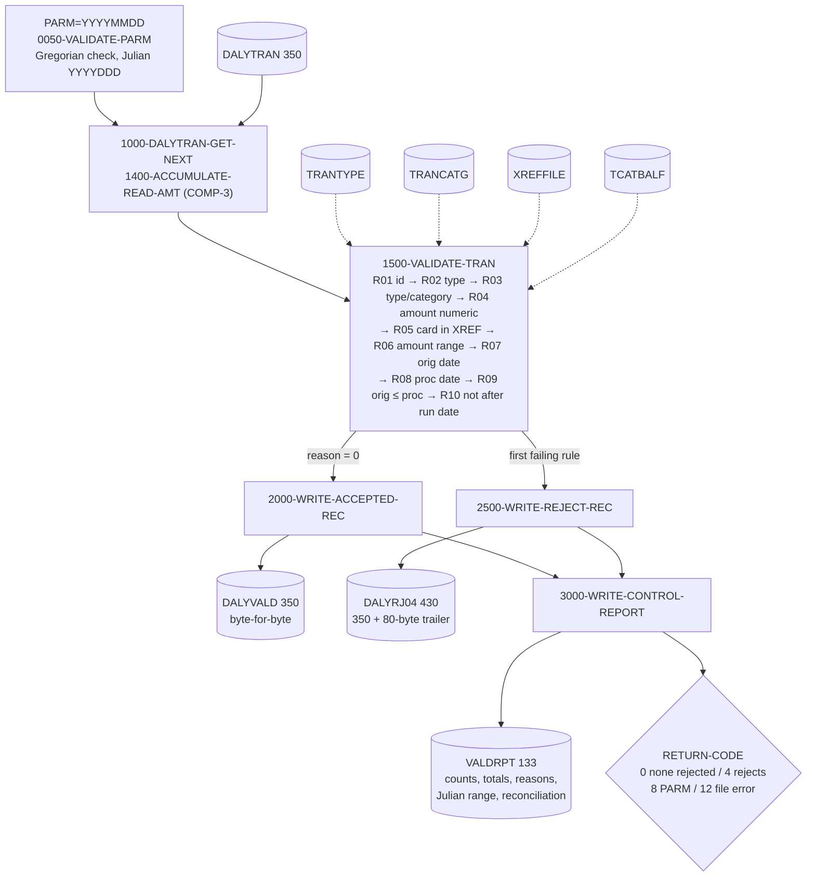

# Change request: pre-posting validation of the daily transaction feed (CBTRN04C)

## 1. Tasking (restated)

The daily transaction feed (`DALYTRAN`, layout `app/cpy/CVTRA06Y.cpy`, 350 bytes)
is posted by `CBTRN02C` (`app/cbl/CBTRN02C.cbl`, job `app/jcl/POSTTRAN.jcl`).
Malformed records are only discovered when posting fails or rejects them, after
the master files have started to change. The change adds a validation step that
runs before `CBTRN02C` in the same job and produces:

- a clean feed (`DALYVALD`) containing the accepted records byte-for-byte unchanged;
- a reject file (`DALYRJ04`) holding each rejected record (350 bytes) plus an
  80-byte trailer with a 4-digit reason code and 76-byte reason text;
- a control-total report (`VALDRPT`) with records read / accepted / rejected,
  rejects by reason code, accepted and rejected amount totals, the Julian run
  date and Julian range of accepted transactions, and reconciliation lines;
- return code 0 (nothing rejected), 4 (some records rejected), 8 (PARM invalid)
  or 12 (file error) so the posting step can be conditioned on it.

Nothing under `app/` that already existed is modified. `POSTTRAN.jcl` and
`CBTRN02C.cbl` are untouched; whether to swap the posting job is a system-owner
decision (see `government-decisions.md`).

## 2. Design

`CBTRN04C` is a plain sequential batch program modelled on `CBTRN02C`: same
file-status blocks, `APPL-RESULT` open/close paragraphs, `9910-DISPLAY-IO-STATUS`
and `9999-ABEND-PROGRAM` conventions, and the same 350 + 80 byte reject record
(`REJECT-TRAN-DATA` / `VALIDATION-TRAILER`). It reads `DALYTRAN` once. For every
record it accumulates the amount into packed-decimal (`COMP-3`) totals, then runs
the rules of section 4 in a fixed order through `1500-VALIDATE-TRAN`; the first
failing rule sets the reason and the rest are skipped, exactly as the sequential
`IF WS-VALIDATION-FAIL-REASON = 0` chain in `CBTRN02C` does. Accepted records are
written from the input buffer to `DALYVALD`; rejected records go to `DALYRJ04`
with the trailer. Reference data (`TRANTYPE`, `TRANCATG`, `XREFFILE`, `TCATBALF`)
is read with random keyed reads using the production copybooks. The category
balance check works from a projection, not from the file alone: the first record
for an account/type/category key starts from the `TCATBALF` balance, and every
accepted record advances an in-storage projection for its key
(`1950-UPDATE-BAL-PROJECTION`) so that later records in the same feed are checked
against the balance `CBTRN02C` will actually have rewritten by then; rejected
records leave the projection untouched because posting never sees them. Dates are the
first ten bytes (`YYYY-MM-DD`) of the 26-byte timestamps; a COBOL paragraph
(`5000-VALIDATE-GREGORIAN-DATE`) validates month/day/leap year and converts each
valid date to Julian `YYYYDDD`, so the program has no runtime dependency on
`CEEDAYS`. The run date arrives as `PARM='YYYYMMDD'` and is retrieved with the
Language Environment service `CEE3PRM`. At end of file every input, reference and
output file is closed first and only then is the control-total report written and
closed, so the return code printed on the report is the one the step ends with
(a close failure sets RC 12 before the report line is produced). The report
includes the hexadecimal image of the packed accepted-amount field so the packed
representation can be inspected on the report.

Job flow (`app/jcl/POSTTRN2.jcl`): `STEP10 CBTRN04C` writes `DALYVALD(+1)`,
`DALYRJ04(+1)`; `STEP15 CBTRN02C` reads `DALYVALD(+1)` as its `DALYTRAN` and has
`COND=(4,LT,STEP10)`, so posting is bypassed when the validation step ends above 4.
`app/jcl/VALDTRAN.jcl` runs the validation alone; `app/jcl/DALYRJ04.jcl` defines
the two GDG bases in the same shape as `DALYREJS.jcl`.

## 3. Numbers

Headline: **11 validation rules implemented, each traced to a source line and each
proven by at least one named test case; 39 test cases; control totals reconcile.**

The table below is checked against the source, the test fixtures and the other
documents by `tests/cbtrn04c/tools/check_docs_sync.py`, which `run_tests.sh` runs.

<!-- numbers:begin -->
| Measure | Value |
|---------|-------|
| Validation rules implemented | 11 |
| Source citations (distinct `path:line`) | 43 |
| Test cases | 39 |
| Rules confirmed by repository source | 3 |
| Rules inferred (need owner confirmation) | 8 |
| Government decisions listed | 9 |
| Sample-data records read | 300 |
| Sample-data records accepted | 300 |
| Sample-data records rejected | 0 |
| Sample-data accepted amount total | 104,801.54 |
| Sample-data rejected amount total | 0.00 |
| Sample-data run date (Julian) | 2022199 |
| Sample-data accepted origination range (Julian) | 2022161 - 2022161 |
| Sample-data return code | 0 |
<!-- numbers:end -->

## 4. Validation rules

Reason codes `0201`–`0209` are new. `0100` is the code `CBTRN02C` already assigns
to an unknown card (`app/cbl/CBTRN02C.cbl:385`) and is reused unchanged so both
programs agree; the new codes start at `0201` to stay clear of the `0100`–`0103`
range `CBTRN02C` uses for posting-time rejects. "Confirmed" means the repository
source justifies the rule as stated; "Inferred" means the conservative check was
implemented and the owner must confirm it (`open-questions.md`). Test case names
are directories under `tests/cbtrn04c/cases/`.

<!-- rules:begin -->
| # | Rule | Reason code | Source citation (`path:line`) | Confirmed / Inferred | Test case that proves it |
|---|------|-------------|-------------------------------|----------------------|--------------------------|
| R01 | `DALYTRAN-ID` present: not all spaces and not all LOW-VALUES | 0201 | `app/cpy/CVTRA06Y.cpy:5`; `app/cbl/CBTRN04C.cbl:768` | Inferred — needs owner confirmation | `rule01_id_spaces`, `rule01_id_low_values` |
| R02 | `DALYTRAN-TYPE-CD` exists as `TRAN-TYPE` in `TRANTYPE` | 0202 | `app/cpy/CVTRA06Y.cpy:6`; `app/cpy/CVTRA03Y.cpy:5`; `app/cbl/CBTRN04C.cbl:777` | Inferred — needs owner confirmation | `rule02_type_unknown` |
| R03 | `DALYTRAN-TYPE-CD` + `DALYTRAN-CAT-CD` exists as `TRAN-CAT-KEY` in `TRANCATG` (the category is only meaningful with its type: the file key is the pair, and posting keys the balance record on the same pair) | 0203 | `app/cpy/CVTRA06Y.cpy:7`; `app/cpy/CVTRA04Y.cpy:5`; `app/cpy/CVTRA04Y.cpy:6`; `app/cpy/CVTRA04Y.cpy:7`; `app/cbl/CBTRN02C.cbl:506`; `app/cbl/CBTRN04C.cbl:800` | Inferred — needs owner confirmation | `rule03_category_unknown` |
| R04 | `DALYTRAN-AMT` passes the NUMERIC class test for `PIC S9(09)V99` (digits with a valid overpunched sign); the value is carried in a `COMP-3` field | 0204 | `app/cpy/CVTRA06Y.cpy:10`; `app/cbl/CBTRN04C.cbl:722`; `app/cbl/CBTRN04C.cbl:824` | Confirmed | `rule04_amount_alpha`, `rule04_amount_invalid_sign`, `rule04_amount_spaces` |
| R05 | `DALYTRAN-CARD-NUM` exists as `XREF-CARD-NUM` in `XREFFILE`; same lookup and same reason code as `CBTRN02C` | 0100 | `app/cbl/CBTRN02C.cbl:380`; `app/cbl/CBTRN02C.cbl:385`; `app/cpy/CVACT03Y.cpy:5`; `app/cpy/CVTRA06Y.cpy:15`; `app/cbl/CBTRN04C.cbl:837` | Confirmed | `rule05_card_unknown` |
| R06 | Amount fits downstream: projected `TRAN-CAT-BAL` + amount must stay within `S9(09)V99` (the narrowest target; `CBTRN02C` adds to it with no `SIZE ERROR` and rewrites it after every posting, so the projection carries every earlier accepted amount for the same account/type/category key). `TRAN-AMT` is also `S9(09)V99`, so a lone amount always fits it; `ACCT-CURR-BAL` is `S9(10)V99`, wider than the feed | 0205 | `app/cpy/CVTRA01Y.cpy:9`; `app/cpy/CVTRA05Y.cpy:10`; `app/cpy/CVACT01Y.cpy:7`; `app/cbl/CBTRN02C.cbl:508`; `app/cbl/CBTRN02C.cbl:527`; `app/cbl/CBTRN02C.cbl:547`; `app/cbl/CBTRN04C.cbl:865` | Inferred — needs owner confirmation | `rule06_amount_max_downstream`, `rule06_amount_one_cent_over`, `rule06_amount_negative_max`, `rule06_amount_negative_floor`, `rule06_batch_second_record_overflows`, `rule06_batch_reject_not_projected` |
| R07 | `DALYTRAN-ORIG-TS` bytes 1-10 are a valid Gregorian `YYYY-MM-DD` (real month and day, leap years by the 4/100/400 rule); converted to Julian `YYYYDDD` | 0206 | `app/cpy/CVTRA06Y.cpy:16`; `app/cbl/CBTRN02C.cbl:414`; `app/cbl/CBTRN04C.cbl:913`; `app/cbl/CBTRN04C.cbl:1198`; `app/cbl/CBTRN04C.cbl:1248` | Inferred — needs owner confirmation | `rule07_orig_feb30`, `rule07_orig_leap_day_valid`, `rule07_orig_leap_day_nonleap`, `rule07_orig_century_leap`, `rule07_orig_century_nonleap`, `rule07_orig_month_13`, `rule07_orig_not_numeric` |
| R08 | `DALYTRAN-PROC-TS`, when present, has a valid Gregorian date in bytes 1-10; a blank value is accepted because `CBTRN02C` overwrites `TRAN-PROC-TS` with the posting timestamp | 0207 | `app/cpy/CVTRA06Y.cpy:17`; `app/cbl/CBTRN02C.cbl:438`; `app/cbl/CBTRN04C.cbl:931` | Inferred — needs owner confirmation | `rule08_proc_apr31`, `rule08_proc_blank_accepted` |
| R09 | Origination date is not after the processing date (when a processing timestamp is present) | 0208 | `app/cbl/CBTRN02C.cbl:436`; `app/cbl/CBTRN04C.cbl:945` | Inferred — needs owner confirmation | `rule09_orig_after_proc` |
| R10 | Neither date is after the run date passed as `PARM='YYYYMMDD'` (the `INTCALC.jcl` / `CBACT04C` way of passing a date) | 0209 | `app/jcl/INTCALC.jcl:22`; `app/cbl/CBACT04C.cbl:178`; `app/cbl/CBTRN04C.cbl:505`; `app/cbl/CBTRN04C.cbl:957` | Inferred — needs owner confirmation | `rule10_orig_future`, `rule10_proc_future`, `rule10_dates_equal_run_date` |
| R11 | A record failing several rules is rejected once with the first failing rule's code, in the order R01…R10 (the sequential `IF WS-VALIDATION-FAIL-REASON = 0` chain of `CBTRN02C`) | — | `app/cbl/CBTRN02C.cbl:208`; `app/cbl/CBTRN02C.cbl:372`; `app/cbl/CBTRN04C.cbl:739` | Confirmed | `precedence_type_and_card`, `precedence_id_and_amount`, `precedence_amount_and_date` |
<!-- rules:end -->

Cases not tied to one rule: `clean_record` (all rules pass), `empty_input`,
`all_rejects`, `mixed_feed` (totals, reconciliation and Julian range),
`parm_missing`, `parm_invalid_date`, `parm_wrong_length` (PARM handling, RC 8),
`file_error_missing_input` (OPEN failure, RC 12) and `sample_data` (the
repository's own feed). The generated list is
`tests/cbtrn04c/cases/INDEX.md`.

## 5. Conventions carried over from CBTRN02C (with citations)

| Convention | `CBTRN02C` | `CBTRN04C` |
|------------|------------|------------|
| Reject record = 350-byte record + 80-byte trailer (`PIC 9(04)` code + `PIC X(76)` text) | `app/cbl/CBTRN02C.cbl:83`, `app/cbl/CBTRN02C.cbl:180`, `app/cbl/CBTRN02C.cbl:446` | `app/cbl/CBTRN04C.cbl:1039` |
| Return code 4 when anything was rejected | `app/cbl/CBTRN02C.cbl:229` | `app/cbl/CBTRN04C.cbl:479` |
| File errors stop the program (`CBTRN02C` abends with `CEE3ABD` 999; `CBTRN04C` sets RC 12 and ends, which JCL `COND` can test) | `app/cbl/CBTRN02C.cbl:707` | `app/cbl/CBTRN04C.cbl:1441` |
| Reset reason, validate, then post or reject | `app/cbl/CBTRN02C.cbl:208` | `app/cbl/CBTRN04C.cbl:466` |
| File Section records are key-plus-filler skeletons sized to the data set; every production layout is brought in with `COPY` in Working-Storage and filled with `READ ... INTO` (no copybook layout is retyped) | `app/cbl/CBTRN02C.cbl:66`, `app/cbl/CBTRN02C.cbl:91`, `app/cbl/CBTRN02C.cbl:102` | `app/cbl/CBTRN04C.cbl:73`, `app/cbl/CBTRN04C.cbl:95`, `app/cbl/CBTRN04C.cbl:117` |
| Close all data files, then report the final return code | `CBTRN02C` has no report; `DISPLAY` totals follow the closes (`app/cbl/CBTRN02C.cbl:229`) | `app/cbl/CBTRN04C.cbl:490` |
| GDG reject output `DALYREJS(+1)`, `LRECL=430` | `app/jcl/POSTTRAN.jcl:36`, `app/jcl/POSTTRAN.jcl:38` | `app/jcl/VALDTRAN.jcl`, `app/jcl/POSTTRN2.jcl` |
| Date passed as EXEC `PARM` | `app/jcl/INTCALC.jcl:22` | `app/jcl/VALDTRAN.jcl` (`PARM='&RUNDATE'`) |
| GDG base with `LIMIT(5)` | `app/jcl/DALYREJS.jcl:26` | `app/jcl/DALYRJ04.jcl` |

## 6. Packed-decimal money handling

All money in `CBTRN04C` working storage is `COMP-3`: the per-record amount
(`WS-TRAN-AMT-P PIC S9(09)V99 COMP-3`), the projected category balance
(`S9(11)V99 COMP-3`) and the accepted / rejected / total accumulators
(`S9(13)V99 COMP-3`). The report prints the 8-byte hexadecimal image of the
accepted-amount accumulator (`8000-PACKED-TO-HEX`); for the sample data it is
`000000010480154C`, i.e. `+10480154` cents = 104,801.54 with the positive sign
nibble `C`, and for the negative maximum case `000099999999999D` (sign nibble `D`).
Reconciliation of total = accepted + rejected is computed in packed arithmetic and
reported as `OK` or `MISMATCH`. Records whose amount fails R04 cannot be summed;
they are counted separately on the report ("REJECTED WITH NON-NUMERIC AMOUNT")
and excluded from all three amount totals so the reconciliation stays exact.

## 7. Gregorian to Julian

`5000-VALIDATE-GREGORIAN-DATE` checks separators and digits, month 1-12, day
1..days-in-month with February 29 allowed only when the year is divisible by 4 and
not by 100 unless also by 400 (`5100-SET-LEAP-YEAR`), then computes
`DDD = days-before-month(MM) + DD (+1 after February in a leap year)`. The run
date and every accepted origination date are converted; the report shows the Julian
run date and the Julian min/max of accepted origination dates. `CSUTLDTC.cbl` /
`CEEDAYS` was reviewed (`app/cbl/CSUTLDTC.cbl:88`) but not called: `CEEDAYS` is an
IBM Language Environment service that GnuCOBOL does not provide, and the
repository's date utility only tells valid from invalid, whereas the Julian day
number is needed here. The test-stub pattern from the open test-foundation branch
was adopted for `CEE3PRM` instead (`tests/cbtrn04c/stubs/CEE3PRM.cbl`).
